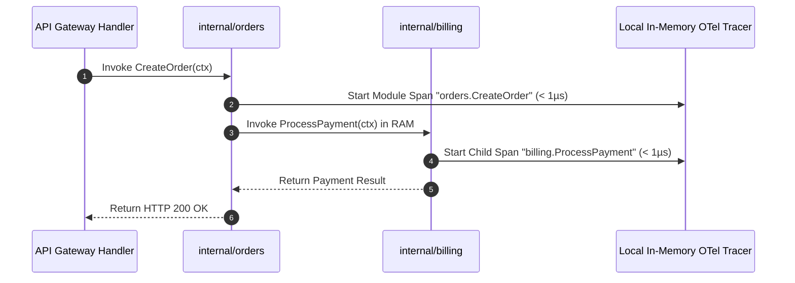

> **Answer-First:** Observability in modular monoliths leverages in-process OpenTelemetry span propagation across module boundaries without network serialization overhead. Combining in-memory context tracking with structured logging reduces telemetry ingestion costs while retaining microservice-level latency visibility.

> **Pillar Architecture Guide:** This article is part of the **[Architecting 21-Service E-commerce with Golang & DDD](/posts/architecting-21-service-ecommerce-golang-ddd/)** series and **[Composable E-Commerce Migration](/posts/ecommerce-architecture-composable-migration/)** guide. Please refer to the original article for an architectural overview of the architecture.

> **Prerequisite:** Before reading this part, please review [Part 4: CI/CD Simplified](/series/modular-monolith-architecture/part-4-cicd-simplified/).

## Part 5: Observability in Memory – When Everything Shares a Single Call Stack

**What You'll Learn That AI Won't Tell You:**
- **In-Memory Trace Propagation:** How Go context propagation handles tracing across package lines without network calls (~15ns vs 1.2µs).
- **Cardinality Reduction:** Techniques to strip connection attributes from logs, saving thousands in observability SaaS bills.
- **Sampling & eBPF Profiling:** How Pyroscope/Parca eBPF engines continuously profile Go runtimes under 1% overhead compared to heavy APM agents.

When operating a production system, observability determines whether an engineer resolves an outage within minutes or spends hours troubleshooting distributed failure modes. Microservices architectures make telemetry expensive and complex through distributed network span propagation.

Conversely, the modular monolith brings debugging back to process memory: monitoring the system through a single call stack. The following sequence diagram illustrates how in-memory OpenTelemetry spans flow across internal module interfaces without network serialization overhead.


```mermaid
sequenceDiagram
    autonumber
    participant Gateway as API Gateway Handler
    participant Orders as internal/orders
    participant Billing as internal/billing
    participant OTel as Local In-Memory OTel Tracer
    
    Gateway->>Orders: Invoke CreateOrder(ctx)
    Orders->>OTel: Start Module Span "orders.CreateOrder" (< 1µs)
    Orders->>Billing: Invoke ProcessPayment(ctx) in RAM
    Billing->>OTel: Start Child Span "billing.ProcessPayment" (< 1µs)
    Billing-->>Orders: Return Payment Result
    Orders-->>Gateway: Return HTTP 200 OK
```

---

## 1. The Pain of Distributed Tracing in Microservices

In a microservices architecture, a single user request triggers a chain of network calls across multiple microservices. Understanding latency bottlenecks or request drops requires deploying distributed tracing frameworks like Jaeger, Zipkin, or commercial APMs like Datadog.

This process relies on complex Network Trace Propagation:
1. **Header Injection:** Service A receives an API call, generates a 128-bit W3C `traceparent` header, and creates a local span.
2. **Network Transport:** When calling Service B over HTTP/gRPC, Service A serializes the trace context into network headers.
3. **Deserialization & Extraction:** Service B reads the incoming HTTP header, parses the hex-encoded string, and initializes a child span.
4. **Out-of-Band Emission:** Every service continuously emits trace spans over UDP or HTTP to local OpenTelemetry collectors.

### The True Costs of Distributed Telemetry
- **Latency & CPU Penalties:** Header serialization, string allocations, and network socket writes add 2ms to 10ms of overhead per API hop.
- **High-Cardinality APM Bills:** Ingesting millions of span events per second leads to high monthly bills from SaaS observability providers due to high key-value tag cardinality.
- **Span Fragmentation & Broken Traces:** If an intermediate proxy fails to forward tracing headers or a service pod crashes mid-request, the trace breaks, rendering the telemetry useless.

---

## 2. In-Process Context Propagation & Profiling Benchmarks

In a modular monolith, all communication between domain modules occurs in RAM via direct Go function calls. Observability achieves maximum efficiency with zero network degradation.

### A. Micro-Benchmark: In-Memory `context.Context` vs W3C Network Propagation

Passing tracing context in-process requires passing a pointer in Go's `context.Context` across function calls, contrasting sharply with HTTP trace context serialization.

| Tracing Propagation Strategy | Latency / Hop | CPU Memory Allocations | Transport Mechanism |
| :--- | :--- | :--- | :--- |
| **Modular Monolith (`context.Context`)** | **~15 ns** | **0 allocs/op** | CPU Register / RAM Pointer |
| **Microservices (W3C `traceparent` Header)** | **~1,200 ns** | **12-18 allocs/op** | HTTP/1.1 or gRPC Metadata Wire |

### B. In-Process OpenTelemetry Tracing

The following Go code snippet demonstrates initiating an in-memory OpenTelemetry trace span directly using Go `context.Context` without serializing HTTP headers.

```go
// Direct in-memory span initiation without network serialization
ctx, span := otel.Tracer("internal/orders").Start(ctx, "CreateOrder")
defer span.End()
```

Because span creation involves updating internal pointer structures in local RAM rather than serializing network headers over a TCP socket, span initialization overhead drops from microseconds to sub-nanoseconds.

### C. Single Call Stack & Pristine Crash Analysis

When a runtime panic occurs inside a microservice architecture, the stack trace terminates at the network boundary of that container. In a modular monolith, a single runtime panic generates an un-fragmented call stack.

The following console output illustrates how a Go runtime panic preserves the exact call stack across module boundaries from API handler down to database interaction.

```text
goroutine 42 [running]:
main.processOrder(0xc0000a2000)
    /app/internal/orders/service.go:84 +0x1a4
main.deductStock(0xc0000a2000)
    /app/internal/inventory/service.go:112 +0x24b
main.executeSQLTx(...)
    /app/internal/storage/db.go:45 +0x88
```

### D. eBPF Continuous Profiling vs APM Agent Overhead

Continuous profiling in 2026 relies on eBPF (Extended Berkeley Packet Filter) tools like Pyroscope and Parca, avoiding the CPU and memory footprint associated with traditional APM agent instrumentation.

| Profiling Technology | CPU Overhead | Memory Overhead | Code Modification Required |
| :--- | :--- | :--- | :--- |
| **eBPF Profiling (Pyroscope / Parca)** | **< 1.0%** | **< 10 MB** | **None (Kernel-level unwinding)** |
| **Traditional APM Agents (Datadog / NewRelic)** | **5.0% - 15.0%** | **128 - 512 MB** | **SDK Injection / Heavy Wrappers** |

### E. Local Ring-Buffer Sampling & Cardinality Control

Distributed microservices emit every HTTP span across the wire, generating network congestion. In a modular monolith, trace spans remain inside process memory, enabling in-process tail-based sampling using circular ring buffers (`sync.Map` or atomic slices):

1. **In-Memory Trace Buffering:** As a request traverses internal modules (`internal/orders` -> `internal/billing`), trace spans accumulate inside local RAM buffers associated with the request `trace_id`.
2. **Decision Engine at Endpoint Completion:** When the top-level HTTP handler returns, an in-process sampler evaluates the request outcome. If the handler returned an HTTP `5xx` error or latency exceeded a P99 threshold (e.g., 200ms), the full trace buffer flushes to the OpenTelemetry collector.
3. **99% Low-Latency Drop:** Successful, low-latency requests drop 99% of internal module spans while keeping aggregate counters in local memory, reducing telemetry ingestion fees significantly.

For rate limiting and gateway observability, see our [Distributed Rate Limiting with Redis & GCRA](/series/high-concurrency-systems/distributed-rate-limiting-redis-gcra/) guide.

---

## 3. Go In-Memory Span Tracking & Log Correlation

To maintain complete correlation between logs, metrics, and traces without external collector dependencies, Go services inject trace identifiers directly into structured loggers such as `slog` or `zap`.

### A. Domain Metric Tagging with OpenTelemetry

The Go code below illustrates how to register custom OpenTelemetry domain metrics with module-specific tags like `module=billing` or `module=inventory`.

```go
package metrics

import (
	"context"

	"go.opentelemetry.io/otel"
	"go.opentelemetry.io/otel/attribute"
	"go.opentelemetry.io/otel/metric"
)

type ModuleMetrics struct {
	orderCounter metric.Int64Counter
}

func NewModuleMetrics() (*ModuleMetrics, error) {
	meter := otel.GetMeterProvider().Meter("modular-monolith")
	counter, err := meter.Int64Counter(
		"domain_orders_processed_total",
		metric.WithDescription("Total number of processed domain orders"),
	)
	if err != nil {
		return nil, err
	}
	return &ModuleMetrics{orderCounter: counter}, nil
}

func (m *ModuleMetrics) RecordOrder(ctx context.Context, moduleName string, status string) {
	m.orderCounter.Add(ctx, 1, metric.WithAttributes(
		attribute.String("module", moduleName),
		attribute.String("status", status),
	))
}
```

### B. Zap & Slog Trace Correlation

The Go example below shows how structured logging with `log/slog` automatically extracts `trace_id` and `span_id` from `context.Context` to correlate log output with active OpenTelemetry spans.

```go
package logger

import (
	"context"
	"log/slog"
	"os"

	"go.opentelemetry.io/otel/trace"
)

type TraceHandler struct {
	slog.Handler
}

func NewTraceLogger() *slog.Logger {
	jsonHandler := slog.NewJSONHandler(os.Stdout, &slog.HandlerOptions{Level: slog.LevelInfo})
	return slog.New(&TraceHandler{Handler: jsonHandler})
}

func (h *TraceHandler) Handle(ctx context.Context, r slog.Record) error {
	spanCtx := trace.SpanContextFromContext(ctx)
	if spanCtx.IsValid() {
		r.AddAttrs(
			slog.String("trace_id", spanCtx.TraceID().String()),
			slog.String("span_id", spanCtx.SpanID().String()),
		)
	}
	return h.Handler.Handle(ctx, r)
}
```

### C. In-Memory Span Tracker Implementation

The following Go code snippet provides a lightweight, zero-dependency in-memory span tracking pattern for internal domain packages before forwarding to OTLP collectors.

```go
package main

import (
	"context"
	"fmt"
	"sync"
	"time"
)

type contextKey string

const traceKey contextKey = "trace_id"

func StartModuleSpan(ctx context.Context, moduleName string) (context.Context, func()) {
	traceID, ok := ctx.Value(traceKey).(string)
	if !ok {
		traceID = fmt.Sprintf("tr-%d", time.Now().UnixNano())
		ctx = context.WithValue(ctx, traceKey, traceID)
	}
	start := time.Now()
	fmt.Printf("[TRACE STARTED] ID: %s | Module: %s\n", traceID, moduleName)

	return ctx, func() {
		fmt.Printf("[TRACE FINISHED] ID: %s | Module: %s | Duration: %v\n", traceID, moduleName, time.Since(start))
	}
}

func main() {
	var wg sync.WaitGroup
	ctx := context.Background()

	wg.Add(1)
	go func() {
		defer wg.Done()
		mCtx, end1 := StartModuleSpan(ctx, "Billing")

		_, end2 := StartModuleSpan(mCtx, "Notification")
		end2()

		end1()
	}()

	wg.Wait()
	fmt.Println("In-memory trace span completed deterministically!")
}
```

---

## 4. Production OpenTelemetry Go SDK & Alert Configuration

Configuring OpenTelemetry in production requires exporting internal module metrics and traces via OTLP gRPC collectors while setting target alert rules in Prometheus.

### A. Production OpenTelemetry Go SDK Setup

The Go code below configures the official OpenTelemetry Go SDK to batch trace spans and export them asynchronously over gRPC.

```go
package telemetry

import (
	"context"
	"fmt"

	"go.opentelemetry.io/otel"
	"go.opentelemetry.io/otel/exporters/otlp/otlptrace/otlptracegrpc"
	"go.opentelemetry.io/otel/sdk/resource"
	sdktrace "go.opentelemetry.io/otel/sdk/trace"
	semconv "go.opentelemetry.io/otel/semconv/v1.17.0"
	"go.opentelemetry.io/otel/trace"
	"google.golang.org/grpc/credentials"
)

type TracerConfig struct {
	ServiceName  string
	CollectorURL string
	TLSCreds     credentials.TransportCredentials
}

func InitTracer(ctx context.Context, cfg TracerConfig) (*sdktrace.TracerProvider, error) {
	opts := []otlptracegrpc.Option{
		otlptracegrpc.WithEndpoint(cfg.CollectorURL),
	}
	if cfg.TLSCreds != nil {
		opts = append(opts, otlptracegrpc.WithTLSCredentials(cfg.TLSCreds))
	}

	exporter, err := otlptracegrpc.New(ctx, opts...)
	if err != nil {
		return nil, fmt.Errorf("failed to create OTLP trace exporter: %w", err)
	}

	res, err := resource.New(ctx,
		resource.WithAttributes(
			semconv.ServiceNameKey.String(cfg.ServiceName),
		),
	)
	if err != nil {
		return nil, fmt.Errorf("failed to create telemetry resource: %w", err)
	}

	tp := sdktrace.NewTracerProvider(
		sdktrace.WithBatcher(exporter),
		sdktrace.WithResource(res),
	)
	otel.SetTracerProvider(tp)
	return tp, nil
}

func StartSpan(ctx context.Context, moduleName, operationName string) (context.Context, trace.Span) {
	tr := otel.Tracer(moduleName)
	return tr.Start(ctx, operationName)
}
```

### B. Prometheus Module Alert Rules Configuration

The Prometheus alert rule YAML configuration below detects high latency or elevated error rates scoped directly by the `module` label.

```yaml
groups:
  - name: modular_monolith_alerts
    rules:
      - alert: ModularMonolithHighModuleLatency
        expr: histogram_quantile(0.99, sum(rate(http_request_duration_seconds_bucket{job="modular-monolith"}[5m])) by (le, module)) > 0.35
        for: 2m
        labels:
          severity: warning
        annotations:
          summary: "High latency detected in module {{ $labels.module }}"
          description: "Module {{ $labels.module }} P99 latency exceeded 350ms for over 2 minutes."

      - alert: ModularMonolithModuleErrorRate
        expr: sum(rate(domain_orders_processed_total{status="error"}[5m])) by (module) / sum(rate(domain_orders_processed_total[5m])) by (module) > 0.05
        for: 1m
        labels:
          severity: critical
        annotations:
          summary: "Elevated error rate in module {{ $labels.module }}"
          description: "Module {{ $labels.module }} error rate exceeds 5% over 1 minute."
```

Learn how to consolidate legacy microservices step-by-step in [Part 6: Migration Playbook](/series/modular-monolith-architecture/part-6-migration-playbook/).

---

## Frequently Asked Questions (FAQ)


In-process OpenTelemetry passes trace context through Go pointers in nanoseconds (~15ns), eliminating HTTP header string parsing and network serialization over TCP sockets. This in-memory execution produces zero garbage collector allocation overhead compared to microservice network trace propagation.



When a panic occurs, a monolithic stack trace captures the exact execution hierarchy across all domain packages from gateway middleware down to the storage layer in a single log output. Engineers can inspect the exact function parameters and line numbers across bounded contexts without querying multiple microservice logs.



Local tail-based ring-buffer sampling works best by buffering spans in memory during request execution. The decision engine flushes 100% of error or high-latency traces while dropping 99% of successful sub-millisecond requests, reducing observability storage costs by over 80%.



Initialize an OTLP trace provider with a local batch exporter, wrapping domain module calls in spans tagged with module labels like `module=billing`. The aggregated metrics and traces are then pushed asynchronously to an OTel collector over a single background gRPC connection.


---

## Navigation & Next Steps

- **Previous Part:** [Part 4: CI/CD Simplified](/series/modular-monolith-architecture/part-4-cicd-simplified/)
- **Next Part:** Continue to [Part 6: Migration Playbook](/series/modular-monolith-architecture/part-6-migration-playbook/)
- **Related Guides:** [Modular Monolith Architecture](/series/modular-monolith-architecture/) and [C10M High-Concurrency Architecture](/posts/shopee-flash-sale-architecture/)

Need help setting up low-overhead OpenTelemetry tracing for your monolith? [Get in touch](/hire/) or [hire our observability experts](/hire/) for an architectural review.
