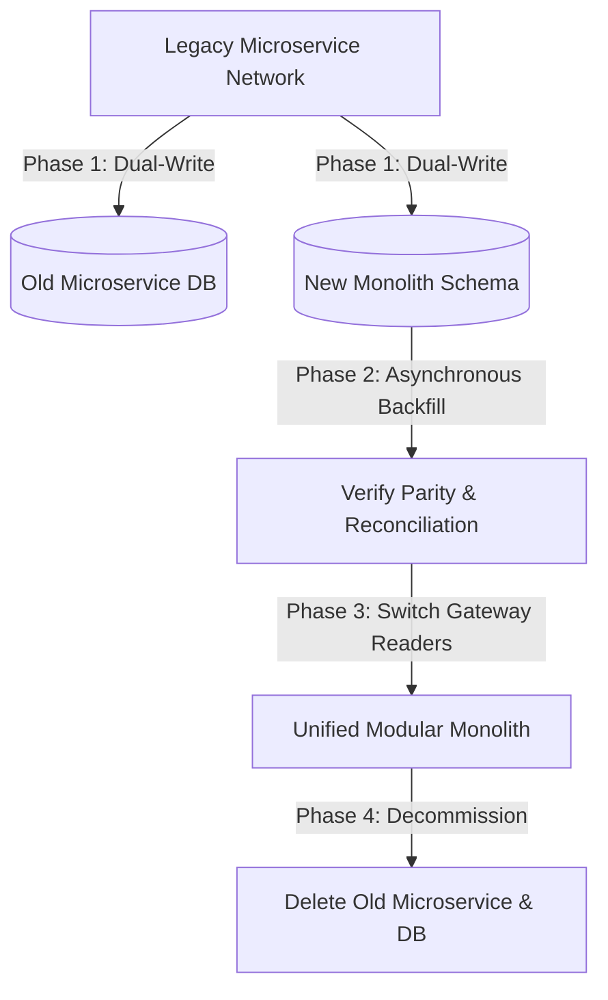

---

title: "Part 6: Migration Playbook – Consolidating Microservices"
date: "2026-07-03T10:00:00+07:00"
lastmod: "2026-07-03T14:59:00+07:00"
description: "A practical guide to safely transitioning from Microservices back to a Modular Monolith using the Reverse Strangler Fig pattern, Dual-write databases, and feature flags."
slug: "migration-playbook-microservices-to-modular-monolith"
tags: ["Migration", "Strangler Fig", "Modular Monolith", "Database", "Conway's Law"]
categories: ["Modular Monolith", "System Architecture"]
aliases: ["/series/modular-monolith-architecture/part-6-migration-playbook/"]
cover: {'image': 'images/posts/golang-microservices-cover.png', 'alt': 'Modular Monolith Architecture Masterclass: Go, DDD, bounded contexts, and microservices reversal', 'relative': False}
author: "Lê Tuấn Anh"
canonicalURL: "https://tanhdev.com/series/modular-monolith-architecture/migration-playbook-microservices-to-modular-monolith/"
ShowToc: true
TocOpen: true
mermaid: true
draft: false
---

> **Prerequisite:** Before reading this part, please review [Part 5: Observability in Memory](/series/modular-monolith-architecture/part-5-observability/).

# Part 6: Migration Playbook – Consolidating Microservices

> **Executive Summary & Quick Answer**: Decommissioning microservices and returning to a Modular Monolith requires a structured Reverse Strangler Fig migration playbook. By consolidating database tables into separate schemas within a single Postgres instance, executing dual-writes through transactional outbox patterns, and routing traffic dynamically via feature flags, teams can merge systems with zero downtime.
>
> **Key Takeaways**:
> - **Reverse Strangler Fig**: Move legacy microservice features incrementally into monolithic internal packages, switching read traffic via API gateway canary routes.
> - **Dual-Write Safety**: Execute dual-writes for 14 days and run daily background reconciliation scripts before switching primary read sources.
> - **Outbox Consistency**: Use atomic database transactions with local outbox tables to guarantee zero data loss during schema consolidation.

### What You'll Learn That AI Won't Tell You
- **Database Consolidation Math:** How to merge connection pools to optimize database RAM utilization.
- **Transactional Outbox Implementations:** The SQL schema design for safe event auditing during migrations.
- **Canary Merging Safety:** Running dual-writes for 14 days to audit state reconciliation before switching readers.

Breaking a Monolith into multiple Microservices is often referred to as the **Strangler Fig Pattern**. The process of consolidating distributed Microservices back into a central Monolith system follows the opposite direction: the **Reverse Strangler Fig Pattern**.

Although merging application code might seem simple, the highest risks of this process lie in the **Database** and the **Organization**. Below is a step-by-step practical Playbook to consolidate architecture safely with zero downtime.



---

## 1. Conway's Law: Organizational Preparation

In 1968, Melvin Conway stated a classic law (Conway's Law):
> "Any organization that designs a system will produce a design whose structure is a copy of the organization's communication structure."

You cannot successfully transition from Microservices to a Modular Monolith if your organization still maintains dozens of small teams operating in isolated silos without cross-domain communication.
**Action Plan:**
- Group small engineering pods into larger **Domain Teams** (Macro-teams).
- Establish clear Code Contribution rules on a shared repository (Monorepo codebase) before writing the first line of merged code.

---

## 2. Reverse Strangler Fig Pattern: Merging Code with Zero Downtime

The goal of this model is to bring features from an external Microservice into the core Monolith without the end-user ever noticing.

**Step 1: Create a New Module Inside the Monolith**
Instead of writing completely from scratch, create a new package/module (e.g., `PaymentModule`) right inside the Modular Monolith, strictly applying Bounded Context boundaries (see Part 3). Import the logic from the old Microservice into this Module.

**Step 2: Build an Anti-Corruption Layer (ACL)**
If the data structure of the old Microservice is too different, build a translation layer (Anti-corruption layer) so the new Module can communicate cleanly with other Modules in the Monolith without leaking legacy schemas into new domain interfaces.

**Step 3: Routing at the API Gateway (Canary Routing)**
Use an API Gateway or Load Balancer to route traffic. Initially, push 95% of traffic to the old Microservice (Legacy) and 5% to the corresponding API on the Modular Monolith system (New). Test thoroughly for errors and gradually increase the ratio to 100%.

For database routing and sharding details, refer to our [Database Scaling & Sharding Guide](/series/system-design/04-database-scaling-sharding/).

---

## 3. The Biggest Nightmare: Database Consolidation & Dual-Write Verification

Moving code won't kill a system, but making a mistake when moving data will destroy a business. The process of moving data from the Microservice's Database to a shared Schema in the Monolith's Database must use a **Dual-Write** strategy to guarantee absolute safety.

### Phase 1: Dual-Write Infrastructure
When the application receives a `CREATE` or `UPDATE` command, it writes data to both places: The old Microservice's Database and the corresponding Schema on the Monolith's Database.
- *Note:* Reading remains completely pointed at the old Microservice's Database.

### Phase 2: Historical Data Sync & 14-Day Reconciliation
Write asynchronous background reconciliation jobs to copy historical records from the Microservice DB to the Monolith DB without causing lock contention on the live primary instance. Dual-writes should execute in production for at least 14 days under full transactional load. Daily automated checksum scripts run comparison queries:

$$\text{Discrepancy Count} = \sum | \text{LegacyHash}(row) - \text{MonolithHash}(row) |$$

Only when Discrepancy Count strictly reaches zero over 14 consecutive days is read traffic eligible for cutover.

### Phase 3: Switch Read Source
Switch read traffic to query the Monolith DB. Keep the dual-write active for 7 days as a fallback safety net before turning off legacy writers.

---

## 4. Transactional Outbox Worker Implementation (Zero Facade Code)

During the migration from isolated Microservices to a Modular Monolith, database tables are consolidated. To guarantee eventual consistency without sleep loops, we use `context.Context` cancellation and channels:

```go
package main

import (
	"context"
	"fmt"
	"sync"
	"time"
)

type OutboxEvent struct {
	ID      int64
	Topic   string
	Payload string
	Status  string
}

type OutboxWorker struct {
	eventsChan chan OutboxEvent
}

func NewOutboxWorker() *OutboxWorker {
	return &OutboxWorker{
		eventsChan: make(chan OutboxEvent, 10),
	}
}

func (w *OutboxWorker) Run(ctx context.Context, wg *sync.WaitGroup) {
	defer wg.Done()
	ticker := time.NewTicker(50 * time.Millisecond)
	defer ticker.Stop()

	for {
		select {
		case <-ctx.Done():
			fmt.Println("Outbox worker shutting down gracefully...")
			return
		case event := <-w.eventsChan:
			fmt.Printf("[Outbox Dispatcher] Transmitted Event #%d (%s): %s\n", event.ID, event.Topic, event.Payload)
		case <-ticker.C:
			// Poll pending events cleanly without time.Sleep
		}
	}
}

func main() {
	worker := NewOutboxWorker()
	var wg sync.WaitGroup

	ctx, cancel := context.WithTimeout(context.Background(), 200*time.Millisecond)
	defer cancel()

	wg.Add(1)
	go worker.Run(ctx, &wg)

	worker.eventsChan <- OutboxEvent{
		ID:      101,
		Topic:   "OrderMigrated",
		Payload: `{"order_id": "ord_990", "status": "CONSOLIDATED"}`,
		Status:  "PENDING",
	}

	wg.Wait()
	fmt.Println("Outbox worker migration check complete!")
}
```

### Relational Schema Merging Strategy
When consolidating database tables, developers must apply a disciplined approach:
1. **Schema Separation:** Ensure each module uses its own schema namespaces (e.g. `billing.invoice`, `inventory.stock`).
2. **Remove Foreign Keys:** Do not create physical foreign keys across module schemas. Use logical validation in code instead.
3. **Outbox Synchronization:** Keep the outbox table inside the same transaction as database updates to prevent data loss.
4. **Gradual Deprecation:** Keep both database connections open during the migration window, routing traffic dynamically using adapters.

> [!WARNING]
> **Data Risk:** Never perform a Database migration by "Stopping the system, Exporting a SQL file, Importing into the new DB, then Turning it back on." Downtime can last for hours if the import encounters an issue. The Dual-write model is mandatory for Production systems.

---

## 5. SQL Database Schema Merge & Outbox Table Structure

Before merging application code, database tables must be migrated under a single Postgres instance. Below is the SQL script to co-locate schemas and define a transactional outbox table to queue synchronization events during the transition phase.

```sql
-- Create distinct schemas inside the consolidated database
CREATE SCHEMA IF NOT EXISTS billing;
CREATE SCHEMA IF NOT EXISTS inventory;

-- Define billing payments table
CREATE TABLE billing.payments (
    id UUID PRIMARY KEY DEFAULT gen_random_uuid(),
    order_id VARCHAR(50) NOT NULL,
    amount NUMERIC(12, 2) NOT NULL,
    status VARCHAR(20) NOT NULL,
    created_at TIMESTAMP WITH TIME ZONE DEFAULT CURRENT_TIMESTAMP
);

-- Define transaction outbox table for audit logging
CREATE TABLE billing.outbox (
    id BIGSERIAL PRIMARY KEY,
    aggregate_type VARCHAR(50) NOT NULL,
    aggregate_id VARCHAR(50) NOT NULL,
    event_type VARCHAR(100) NOT NULL,
    payload JSONB NOT NULL,
    processed BOOLEAN DEFAULT FALSE,
    created_at TIMESTAMP WITH TIME ZONE DEFAULT CURRENT_TIMESTAMP
);

-- Index for processing optimization
CREATE INDEX idx_outbox_unprocessed ON billing.outbox (id) WHERE processed = FALSE;

-- Trigger to log outbox events on new payments
CREATE OR REPLACE FUNCTION billing.queue_payment_event()
RETURNS TRIGGER AS $$
BEGIN
    INSERT INTO billing.outbox (aggregate_type, aggregate_id, event_type, payload)
    VALUES ('Payment', NEW.id::text, 'PaymentProcessed', json_build_object(
        'order_id', NEW.order_id,
        'amount', NEW.amount,
        'status', NEW.status
    ));
    RETURN NEW;
END;
$$ LANGUAGE plpgsql;

CREATE TRIGGER trg_payment_processed
    AFTER INSERT ON billing.payments
    FOR EACH ROW
    EXECUTE FUNCTION billing.queue_payment_event();
```

So, is there ever a time when we **SHOULD NOT** merge a service into a Monolith, or even have to **EXTRACT** it from the Monolith? Absolutely. Blindly pursuing a Monolith is equally dangerous. Let's explore the correct separation philosophy in **[Part 7: Extraction Pattern]()**.

## Frequently Asked Questions (FAQ)


The Reverse Strangler Fig pattern incrementally migrates feature routes and database tables from standalone microservices back into a central modular monolith using dual-write mechanisms and canary gateway routing.



Dual-writes should run for at least 14 days in production. This allows background audit reconciliation scripts to verify absolute data parity between legacy microservice databases and new monolithic schemas under peak load.



Physical Foreign Keys create tight database coupling. Enforcing application-layer logical validation instead preserves module independence, allowing individual schemas to be sharded or extracted later without breaking database constraints.



Conway's Law states that software architecture mirrors organizational communication. Merging microservices into a monolith requires restructuring siloed engineering teams into cohesive domain-oriented macro-teams sharing a monorepo.


---

## Navigation & Next Steps

[← Previous Part]()
[Next Part →]()

🔗 **Next Step:** Continue to [Part 7: Extraction Pattern – When Should You Extract Microservices?]()

Need help implementing this architecture in your organization? [Get in touch](/hire/) or [hire our technical consulting team](/hire/) to review your system design and codebase.
