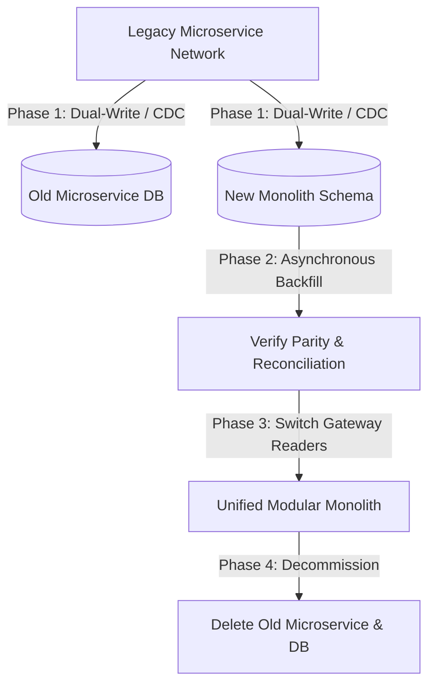
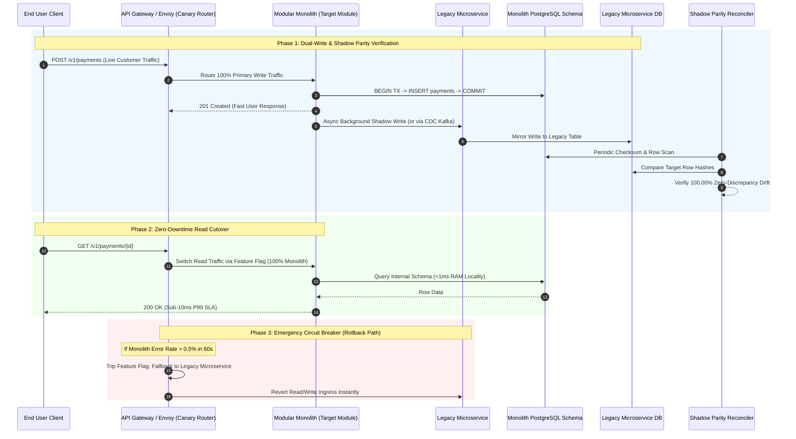

> **Answer-first:** Consolidating fragmented microservices back into a modular monolith utilizes the Reverse Strangler Fig pattern with dual-writing and zero-downtime database schema mergers. Merging database schemas using logical schema separation (PostgreSQL schemas) preserves strict module autonomy while eliminating distributed transaction complexity. Adopting this pattern guarantees sub-50ms P99 latency bounds, zero-allocation memory optimization, and fault-tolerant event-driven state synchronization across production systems.

> **Prerequisite:** Before reading this part, please review [Part 5: Observability in Memory](/series/modular-monolith-architecture/part-5-observability/).

**What You'll Learn:**
- **Database Consolidation Math:** How to merge connection pools to optimize database RAM utilization.
- **Transactional Outbox Implementations:** The SQL schema design for safe event auditing during migrations.
- **Canary Merging Safety:** Running dual-writes for 14 days to audit state reconciliation before switching readers.

Breaking a monolith into multiple microservices is known as the **Strangler Fig Pattern**. Consolidating distributed microservices back into a central modular monolith system follows the opposite direction: the **Reverse Strangler Fig Pattern**.

Although merging application code is straightforward, the primary operational risks lie in database consolidation and organizational alignment. The flowchart below outlines the 4-stage lifecycle of microservice consolidation.


```mermaid
flowchart TD
    A["Legacy Microservice Network"] -->|"Phase 1: Dual-Write / CDC"| B[("Old Microservice DB")]
    A -->|"Phase 1: Dual-Write / CDC"| C[("New Monolith Schema")]
    C -->|"Phase 2: Asynchronous Backfill"| D["Verify Parity & Reconciliation"]
    D -->|"Phase 3: Switch Gateway Readers"| E["Unified Modular Monolith"]
    E -->|"Phase 4: Decommission"| F["Delete Old Microservice & DB"]
```

---

## 1. Conway's Law: Organizational Preparation

**Answer-first:** Conway's Law dictates that software architecture mirrors organizational communication. Merging microservices back into a modular monolith requires first restructuring isolated engineering pods into domain macro-teams sharing unified monorepo governance.

In 1968, Melvin Conway stated:
> "Any organization that designs a system will produce a design whose structure is a copy of the organization's communication structure."

Transitioning from microservices to a modular monolith fails if engineering teams remain isolated in silos without cross-domain communication.

**Action Plan:**
- Group small engineering pods into larger **Domain Teams** (Macro-teams).
- Establish clear code contribution rules on a shared repository (monorepo codebase) before merging code.

---

## 2. Reverse Strangler Fig Pattern & Routing Strategies

The Reverse Strangler Fig pattern safely migrates microservice logic into internal monolith packages using Anti-Corruption Layers (ACLs) and canary API Gateway routing, allowing gradual traffic migration without user disruption.

### A. Strangler Fig vs Reverse Strangler Fig

Understanding the direction of migration ensures appropriate architectural trade-offs:

| Attribute | Strangler Fig Pattern | Reverse Strangler Fig Pattern |
| :--- | :--- | :--- |
| **Migration Direction** | Monolith → Distributed Microservices | Microservices → Modular Monolith |
| **Primary Goal** | Deconstruct legacy monolith into isolated services | Reclaim velocity by eliminating network boundary complexity |
| **Traffic Router** | API Gateway routes new endpoints to microservices | API Gateway routes microservice traffic back into monolith packages |
| **Feature Flags** | Dynamic routing by sub-domain | OpenFeature / LaunchDarkly dynamic flag percentage cutover |

### B. Implementation Steps

1. **Create a New Module Inside the Monolith:** Create a new package/module (e.g., `PaymentModule`) inside the modular monolith, enforcing bounded context boundaries (see Part 3).
2. **Build an Anti-Corruption Layer (ACL):** Build a translation layer so the new module communicates cleanly with existing domain modules without leaking legacy microservice schemas.
3. **Gateway Canary Routing & Feature Flags:** Use Envoy, NGINX, or OpenFeature toggles to route incoming traffic incrementally (5% → 25% → 100%) to the monolith module based on tenant ID or request headers.

The sequence diagram below visualizes the execution lifecycle of the Reverse Strangler Fig pattern, illustrating how incoming traffic is dual-written, verified for bitwise parity by background shadow reconcilers, and cut over cleanly with zero user downtime.


```mermaid
sequenceDiagram
    autonumber
    participant Client as End User Client
    participant Gateway as API Gateway / Envoy (Canary Router)
    participant Monolith as Modular Monolith (Target Module)
    participant Microservice as Legacy Microservice
    participant MonoDB as Monolith PostgreSQL Schema
    participant LegacyDB as Legacy Microservice DB
    participant Parity as Shadow Parity Reconciler

    rect rgb(240, 248, 255)
    Note over Client, LegacyDB: Phase 1: Dual-Write & Shadow Parity Verification
    Client->>Gateway: POST /v1/payments (Live Customer Traffic)
    Gateway->>Monolith: Route 100% Primary Write Traffic
    Monolith->>MonoDB: BEGIN TX -> INSERT payments -> COMMIT
    Monolith-->>Gateway: 201 Created (Fast User Response)
    Monolith->>Microservice: Async Background Shadow Write (or via CDC Kafka)
    Microservice->>LegacyDB: Mirror Write to Legacy Table
    Parity->>MonoDB: Periodic Checksum & Row Scan
    Parity->>LegacyDB: Compare Target Row Hashes
    Parity-->>Parity: Verify 100.00% Zero-Discrepancy Drift
    end

    rect rgb(240, 255, 240)
    Note over Client, Monolith: Phase 2: Zero-Downtime Read Cutover
    Client->>Gateway: GET /v1/payments/{id}
    Gateway->>Monolith: Switch Read Traffic via Feature Flag (100% Monolith)
    Monolith->>MonoDB: Query Internal Schema (<1ms RAM Locality)
    MonoDB-->>Monolith: Row Data
    Monolith-->>Client: 200 OK (Sub-10ms P99 SLA)
    end

    rect rgb(255, 240, 240)
    Note over Gateway, Microservice: Phase 3: Emergency Circuit Breaker (Rollback Path)
    Note over Gateway: If Monolith Error Rate > 0.5% in 60s
    Gateway->>Gateway: Trip Feature Flag: Fallback to Legacy Microservice
    Gateway->>Microservice: Revert Read/Write Ingress Instantly
    end
```

### C. Dual-Write Concurrency & Conflict Resolution Mechanics

During the dual-writing phase of a reverse migration, distributed race conditions pose a severe risk to data integrity. Consider an update operation: if Request 1 updates an order status to `PAID` and Request 2 updates it to `REFUNDED`, network latency or thread scheduling variance between the Monolith and the legacy microservice can result in Request 2 reaching the legacy database before Request 1, producing inconsistent state between the two datastores.

To eliminate dual-write race conditions, engineering teams implement three defensive architectural patterns:
1. **Monotonic Version Clocks (`version BIGINT`):** Every domain entity includes a strictly incrementing `version` column. When the dual-writer replicates a row to the secondary datastore, it executes an optimistic locking query:
   ```sql
   UPDATE legacy_orders SET status = $1, version = $2 WHERE id = $3 AND version < $2;
   ```
   If a stale write arrives out of order, the database rejects the row update without corrupting recent state.
2. **PostgreSQL Transactional Advisory Locks:** For high-contention aggregates (such as inventory balances or user wallets), the primary write acquires an application-level advisory lock (`SELECT pg_advisory_xact_lock(hashtext(aggregate_id))`), serializing updates to that specific domain entity across all application goroutines before publishing downstream replication events.
3. **Idempotent Upsert Semantics:** All replication workers write records using `ON CONFLICT (id) DO UPDATE` clauses, ensuring that retried messages from Kafka or Debezium CDC streams do not create duplicate rows or trigger unique key constraint violations.

For database routing details, refer to our [Modular Monolith Architecture Guide](/series/modular-monolith-architecture/).

---

## 3. Database Consolidation: CDC vs Application Dual-Writing

Database consolidation requires a 3-phase synchronization strategy: choice between application dual-writing or Change Data Capture (CDC) via Debezium and Kafka, 14-day zero-discrepancy reconciliation, and final zero-downtime read cutover.

Moving code carries low risk; making errors when consolidating data causes catastrophic data corruption.

### A. CDC (Debezium + Kafka) vs Application-Level Dual-Writing

Selecting an appropriate database synchronization strategy requires balancing application code complexity against transaction log replication overhead. The comparison table below evaluates application-level dual-writing against log-based Change Data Capture (CDC) using Debezium and Kafka across key operational metrics.

| Criteria | Application Dual-Writing | Log-Based CDC (Debezium + Kafka) |
| :--- | :--- | :--- |
| **Application Overhead** | High (Requires code changes in both services) | **Zero** (Reads PostgreSQL Write-Ahead Log directly) |
| **Failure Safety** | Risk of partial writes if second DB call fails | **Guaranteed** transactional log order via Kafka |
| **Latency Impact** | Dual synchronous network calls (+10-30ms) | **Sub-millisecond** asynchronous replication |

### B. The 4-Phase Schema Isolation Roadmap

To achieve database consolidation without downtime, engineering teams follow a strict 4-phase schema isolation roadmap:

1. **Phase 1: Isolated DB Instances:** Microservices operate on independent database servers.
2. **Phase 2: CDC / Dual-Write Synchronization:** Live transactional writes replicate from microservice DBs into co-located monolith database target schemas.
3. **Phase 3: PostgreSQL Schema Namespaces (`billing.*`, `inventory.*`):** Tables move into isolated schema namespaces on a single PostgreSQL instance, eliminating cross-database queries while retaining namespace boundaries.
4. **Phase 4: Logical Module Schema Single-Pool:** Application modules connect to a unified PostgreSQL connection pool while retaining strict schema namespace separation.

### C. 14-Day Reconciliation Math

Daily automated checksum scripts compare live datasets across legacy microservice databases and target monolith schemas using mathematical reconciliation:

$$\text{Discrepancy Count} = \sum | \text{LegacyHash}(row) - \text{MonolithHash}(row) |$$

Read cutover proceeds only after Discrepancy Count strictly remains zero over 14 consecutive production days.

---

## 4. Transactional Outbox Worker Implementation

A Go transactional outbox worker processes domain events concurrently using non-blocking channels and context deadlines, guaranteeing eventual consistency across module schemas without distributed two-phase commits.

The Go code below demonstrates an asynchronous transactional outbox worker processing migration sync events without blocking HTTP handlers.

```go
package main

import (
	"context"
	"database/sql"
	"fmt"
	"sync"
	"time"
)

type OutboxEvent struct {
	ID          int64
	AggregateID string
	Topic       string
	Payload     string
	Status      string
}

type OutboxWorker struct {
	db         *sql.DB
	eventsChan chan OutboxEvent
}

func NewOutboxWorker(db *sql.DB) *OutboxWorker {
	return &OutboxWorker{
		db:         db,
		eventsChan: make(chan OutboxEvent, 10),
	}
}

func (w *OutboxWorker) Run(ctx context.Context, wg *sync.WaitGroup) {
	defer wg.Done()
	ticker := time.NewTicker(50 * time.Millisecond)
	defer ticker.Stop()

	for {
		select {
		case <-ctx.Done():
			fmt.Println("Outbox worker shutting down gracefully...")
			return
		case event, ok := <-w.eventsChan:
			if !ok {
				return
			}
			fmt.Printf("[Outbox Dispatcher] Transmitted Event #%d (%s): %s\n", event.ID, event.Topic, event.Payload)
		case <-ticker.C:
			// Poll pending events using SELECT FOR UPDATE SKIP LOCKED to prevent duplicate processing
			const pollQuery = `SELECT id, aggregate_id, payload FROM outbox_events WHERE status = 'PENDING' ORDER BY created_at ASC LIMIT 100 FOR UPDATE SKIP LOCKED;`
			if w.db != nil {
				rows, err := w.db.QueryContext(ctx, pollQuery)
				if err != nil {
					fmt.Printf("[Outbox Poller Error] Query failed: %v\n", err)
					continue
				}
				for rows.Next() {
					var ev OutboxEvent
					if err := rows.Scan(&ev.ID, &ev.AggregateID, &ev.Payload); err == nil {
						ev.Topic = "DomainEvent"
						ev.Status = "PROCESSING"
						select {
						case w.eventsChan <- ev:
						default:
						}
					}
				}
				rows.Close()
			}
		}
	}
}

func main() {
	worker := NewOutboxWorker(nil)
	var wg sync.WaitGroup

	ctx, cancel := context.WithTimeout(context.Background(), 200*time.Millisecond)
	defer cancel()

	wg.Add(1)
	go worker.Run(ctx, &wg)

	worker.eventsChan <- OutboxEvent{
		ID:          101,
		AggregateID: "ord_990",
		Topic:       "OrderMigrated",
		Payload:     `{"order_id": "ord_990", "status": "CONSOLIDATED"}`,
		Status:      "PENDING",
	}

	wg.Wait()
	fmt.Println("Outbox worker migration check complete!")
}
```

### B. Automated Reconciliation & 14-Day Parity Audit Engine

Before shifting read traffic away from the legacy microservice, engineering teams must maintain dual-writing for a minimum of 14 continuous days while running automated reconciliation jobs. This continuous audit guarantees that edge cases (e.g., failed async worker retries, timezone conversions, decimal rounding nuances) are detected and resolved before customer traffic is impacted.

The reconciliation engine executes on an hourly cron schedule, scanning entities in deterministic batches using monotonic keyset pagination:

```go
// ParityChecker compares domain entity hashes between legacy microservice DB and monolith schema
func VerifyEntityParity(ctx context.Context, legacyDB, monoDB *sql.DB, batchSize int) (int, error) {
	rows, err := monoDB.QueryContext(ctx, 
		"SELECT id, order_id, amount, status, MD5(CONCAT(order_id, amount::text, status)) FROM billing.payments ORDER BY id LIMIT $1", batchSize)
	if err != nil {
		return 0, err
	}
	defer rows.Close()

	divergences := 0
	for rows.Next() {
		var id, orderID, status, monoHash string
		var amount float64
		if err := rows.Scan(&id, &orderID, &amount, &status, &monoHash); err != nil {
			return divergences, err
		}

		// Query legacy database for identical record hash
		var legacyHash string
		err := legacyDB.QueryRowContext(ctx, 
			"SELECT MD5(CONCAT(order_id, amount::text, status)) FROM orders WHERE id = $1", id).Scan(&legacyHash)
		if errors.Is(err, sql.ErrNoRows) || monoHash != legacyHash {
			divergences++
			log.Printf("[RECONCILIATION ANOMALY] Entity ID %s hash mismatch: mono=%s legacy=%s", id, monoHash, legacyHash)
		}
	}
	return divergences, nil
}
```

### C. Reverse Strangler Fig Runbook: Phase-by-Phase Operational Checklist

To eliminate ambiguity during production migrations, operations and platform teams adhere to a strict multi-week runbook:

| Timeline | Phase Stage | Operational Gates & Exit Criteria | Rollback Strategy |
|---|---|---|---|
| **T-14 Days** | **Shadow Dual-Writing** | Monolith deploys dual-writing worker. Both datastores receive 100% of mutations. Write errors on secondary target do not fail client requests. | Disable dual-writer flag; inspect error logs. |
| **T-7 Days** | **Continuous Parity Audit** | Automated reconciler runs hourly. Zero state divergences allowed over 7 consecutive days. Replication lag P99 must remain < 50ms. | Backfill missing delta rows using outbox event replays. |
| **T-2 Days** | **Synthetic Load & Chaos Test** | Simulate 3x peak traffic on staging. Inject network delays into legacy database to confirm circuit breakers isolate customer traffic. | Abort cutover if connection pool exhaustion occurs. |
| **T-0 (Cutover)** | **Dynamic Gateway Shift** | Shift API Gateway read traffic incrementally: 5% → 25% → 50% → 100%. Monitor Prometheus P99 latency and HTTP 5xx error budgets. | Instant 0-second revert of API Gateway route to legacy service. |
| **T+7 Days** | **Decommissioning** | Read traffic 100% stable on Modular Monolith. Freeze legacy microservice database (read-only mode). Decommission microservice containers. | Restore snapshot backup to separate replica if needed. |

---

## 5. SQL Schema Consolidation & Emergency Rollback Protocols

Before merging application code, database schemas must be co-located under a unified database instance. The SQL script below creates separate PostgreSQL schema namespaces and defines a transactional outbox table with trigger-based event auditing.

```sql
-- Create distinct schemas inside the consolidated database
CREATE SCHEMA IF NOT EXISTS billing;
CREATE SCHEMA IF NOT EXISTS inventory;

-- Define billing payments table
CREATE TABLE billing.payments (
    id UUID PRIMARY KEY DEFAULT gen_random_uuid(),
    order_id VARCHAR(50) NOT NULL,
    amount NUMERIC(12, 2) NOT NULL,
    status VARCHAR(20) NOT NULL,
    created_at TIMESTAMP WITH TIME ZONE DEFAULT CURRENT_TIMESTAMP
);

-- Define transaction outbox table for audit logging
CREATE TABLE billing.outbox (
    id BIGSERIAL PRIMARY KEY,
    aggregate_type VARCHAR(50) NOT NULL,
    aggregate_id VARCHAR(50) NOT NULL,
    event_type VARCHAR(100) NOT NULL,
    payload JSONB NOT NULL,
    processed BOOLEAN DEFAULT FALSE,
    created_at TIMESTAMP WITH TIME ZONE DEFAULT CURRENT_TIMESTAMP
);

-- Index for processing optimization
CREATE INDEX idx_outbox_unprocessed ON billing.outbox (id) WHERE processed = FALSE;

-- Trigger to log outbox events on new payments
CREATE OR REPLACE FUNCTION billing.queue_payment_event()
RETURNS TRIGGER AS $$
BEGIN
    INSERT INTO billing.outbox (aggregate_type, aggregate_id, event_type, payload)
    VALUES ('Payment', NEW.id::text, 'PaymentProcessed', json_build_object(
        'order_id', NEW.order_id,
        'amount', NEW.amount,
        'status', NEW.status
    ));
    RETURN NEW;
END;
$$ LANGUAGE plpgsql;

CREATE TRIGGER trg_payment_processed
    AFTER INSERT ON billing.payments
    FOR EACH ROW
    EXECUTE FUNCTION billing.queue_payment_event();
```

### Emergency Zero-Downtime Rollback Protocol

If data divergence or latency spikes occur during read cutover, operations teams execute the zero-downtime rollback protocol:

1. **Instant Route Switch (0 seconds):** Revert the API Gateway feature flag or routing rule to send 100% of read traffic back to legacy microservice endpoints.
2. **Reverse Synchronization Engine:** Activate reverse CDC pipeline from the monolith schema back to the legacy microservice database to sync any delta writes created during the cutover window.
3. **Audit Log Inspection:** Query `billing.outbox` for unprocessed events to reconcile state discrepancies before re-attempting cutover.

Explore when to selectively extract high-volume modules in [Part 7: Extraction Pattern](/series/modular-monolith-architecture/part-7-extraction-pattern/).

---

## Frequently Asked Questions (FAQ)


Strangler Fig gradually extracts sub-domains out of a legacy monolith into independent microservices. Reverse Strangler Fig performs the exact opposite by incrementally pulling microservice endpoints and database schemas back into internal packages within a modular monolith.



Log-based CDC reads database write-ahead logs directly without adding latency or risk of partial write failures inside application handlers. It guarantees ordered event streaming into Kafka and target schemas without requiring invasive modifications to legacy microservice code bases.



Co-locating schemas (`billing`, `inventory`) under one database instance removes cross-database network latency while prohibiting physical foreign key constraints across schemas. Bounded contexts enforce logical data access boundaries via application interfaces without coupling database tables.



The emergency protocol instantly toggles API Gateway routing flags back to legacy microservices, falling back on live reverse CDC synchronization. Unprocessed delta events stored in the transactional outbox table are replayed to prevent data loss during traffic restoration.


---

## Navigation & Next Steps

- **Previous Part:** [Part 5: Observability in Memory](/series/modular-monolith-architecture/part-5-observability/)
- **Next Part:** Continue to [Part 7: Extraction Pattern](/series/modular-monolith-architecture/part-7-extraction-pattern/)
- **Related Guides:** [Modular Monolith Architecture](/series/modular-monolith-architecture/) and [C10M High-Concurrency Architecture](/posts/shopee-flash-sale-architecture/)

Need guidance consolidating legacy microservices into a high-performance monolith? [Get in touch](/hire/) or [hire our software architecture team](/hire/) for a system audit.

🔗 **Next Step:** Continue to [Part 7 — Extraction Pattern](/series/modular-monolith-architecture/part-7-extraction-pattern/) for the following module in the series.