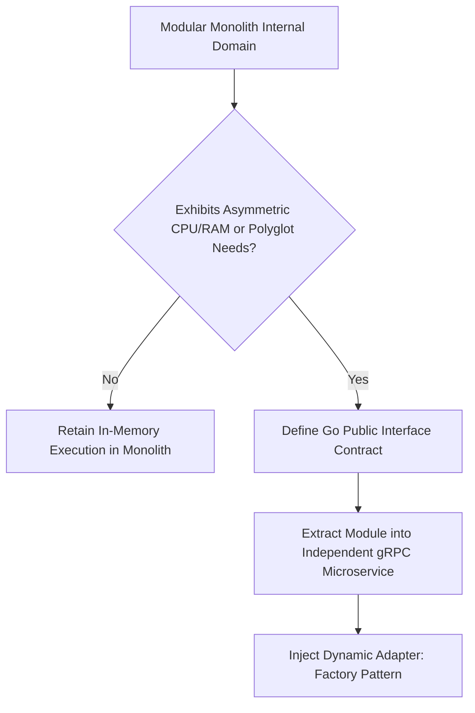
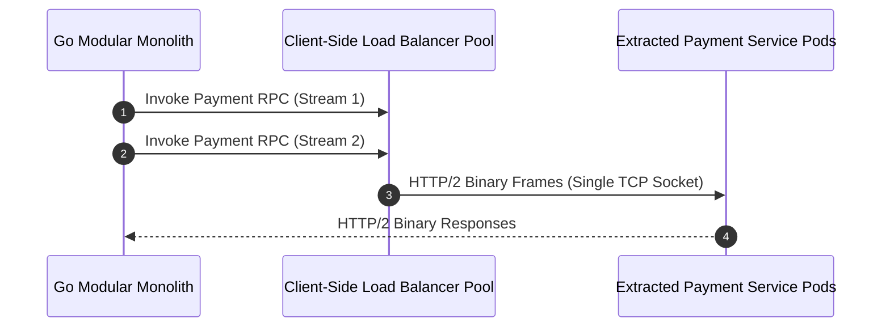

---

title: "Part 7: Extraction Pattern – When Should You Extract Microservices?"
date: "2026-07-03T10:00:00+07:00"
lastmod: "2026-07-03T14:59:00+07:00"
description: "Not everything belongs in a Monolith. Learn how to determine when a module should be extracted into a Microservice through lessons from Sentry, GitLab, and Shopify."
slug: "extraction-pattern-when-to-extract-microservices"
tags: ["Microservices", "Extraction", "Sentry", "GitLab", "Modular Monolith", "Architecture"]
categories: ["Modular Monolith", "System Architecture"]
aliases: ["/series/modular-monolith-architecture/part-7-extraction-pattern/"]
cover: {'image': 'images/posts/golang-microservices-cover.png', 'alt': 'Modular Monolith Architecture Masterclass: Go, DDD, bounded contexts, and microservices reversal', 'relative': False}
author: "Lê Tuấn Anh"
canonicalURL: "https://tanhdev.com/series/modular-monolith-architecture/extraction-pattern-when-to-extract-microservices/"
ShowToc: true
TocOpen: true
mermaid: true
draft: false
---

> **Prerequisite:** Before reading this part, please review [Part 6: Migration Playbook](/series/modular-monolith-architecture/part-6-migration-playbook/).

# Part 7: Extraction Pattern – When Should You Extract Microservices?

> **Executive Summary & Quick Answer**: Extraction of a module into an independent microservice is only justified when it requires different scaling profiles, team boundaries, or deployment velocities. The extraction process is executed by creating an interface wrapper around the module, routing calls through an API gateway, and separating database tables using asynchronous data replication.
>
> **Key Takeaways**:
> - **Extraction Triggers**: Extract only when a module exhibits asynchronous IO bottlenecks (e.g. Sentry's Relay in Rust) or polyglot language demands (GitLab's Gitaly in Go).
> - **Interface Abstraction**: Wrap domain logic in Go interface contracts to switch seamlessly between in-memory RAM execution and gRPC microservice calls.
> - **Database Decoupling**: Replicate tables using Change Data Capture (CDC) or outbox events before breaking physical SQL schemas.

### What You'll Learn That AI Won't Tell You
- **Extraction Threshold Metrics:** Quantitative triggers (e.g. CPU saturation ratios) that justify extraction.
- **Interface Wrappers:** How to write a Go interface that switches between internal and gRPC implementations.
- **Database Separation Loops:** Replicating database tables using Change Data Capture (CDC) during migrations.

Advocating for a **Modular Monolith** architecture does not equate to a conservative "put absolutely everything in one place" mentality. In reality, even the greatest Monolith systems like Shopify, Sentry, or GitLab possess a few "satellites" (Microservices) orbiting their central core.

The core issue is: **We only extract a feature into a Microservice when it truly deserves it**, not out of engineering preference. Industry expert Sam Newman – author of *Building Microservices* and *Monolith to Microservices* – emphasizes that: If you cannot successfully separate the Database Schema inside a Monolith, you will undoubtedly create a disastrous distributed monolith microservice architecture.



---

## 1. Quantitative Extraction Signals & Operational Thresholds

Below are **4 concrete, quantitative signals** indicating a Module has "graduated" and is ready to be extracted from the Modular Monolith into a standalone microservice:

### Signal 1: Resource-Specific Independent Scaling Needs & CPU Saturation Ratios
Sometimes, your application has a specialized task whose compute footprint differs dramatically from the core business logic.
- **Quantitative Rule:** When a single module consumes $> 70\%$ of cluster CPU or RAM resources while the remaining 15 domain modules consume $< 30\%$, vertical auto-scaling forces the entire monolith binary to be replicated across hundreds of compute nodes, wasting memory for idle modules.
- **Case Study (Sentry Relay):** Sentry (the open-source error tracking platform) operates a Python Django monolith for billing, project management, and dashboard reporting. However, real-time SDK crash event ingestion handles $1000\times$ higher throughput than administrative UI interactions. Sentry extracted raw telemetry event ingestion into **Relay** (written in Rust for memory safety and zero-GC latency) and analytical indexing into **Snuba** (powered by ClickHouse DB), while keeping core business logic safely inside the Python monolith.

### Signal 2: Specialized Environment & Language Requirements (Polyglot Optimization)
- **Case Study (GitLab Gitaly):** GitLab is built primarily on a Ruby on Rails Modular Monolith. However, performing Git disk RPC operations (parsing git packfiles, diff calculations, tree traversals) directly through Ruby processes caused severe garbage collection spikes and CPU thread saturation. GitLab extracted all low-level Git file system operations into a specialized service named **Gitaly** (written in Go for efficient concurrency and low-level syscall control). Ruby on Rails continues to manage merge requests, issue tracking, CI/CD pipelines, and user authorization.

### Signal 3: Disparate Deployment Cadence & Feature Release Isolation
When a specialized domain module (such as a machine-learning recommendation engine or dynamic pricing algorithm) requires continuous model re-training and redeployments every 15 minutes, enforcing the monolith's standard 24-hour release train introduces unnecessary deployment bottlenecks. Extracting the recommendation module into a gRPC satellite service isolates deployment risks.

### Signal 4: Strict Regulatory Compliance & Security Isolation (PCI-DSS / HIPAA)
If processing credit card numbers requires strict PCI-DSS Level 1 compliance or handling medical records requires HIPAA hardware isolation, keeping those handlers inside a general-purpose monolith expands the scope of security audits to the entire codebase. Extracting payment tokenization or medical record vaulting into isolated, hardened microservices reduces audit cost by $80\%$.

For architecture primer patterns, explore our [Go System Design Primer](/series/system-design/01-introduction-system-design-golang/).

---

## 2. Dynamic Module Interface Switching Implementation

The Go code below demonstrates how to define a service interface that can switch dynamically between an in-memory method execution and a remote gRPC service call based on configuration, enabling zero-code-change microservices extraction:

```go
package main

import (
	"context"
	"fmt"
)

type PaymentRequest struct {
	OrderID string
	Amount  float64
}

type PaymentResponse struct {
	TransactionID string
	Success       bool
}

// PaymentService defines the shared boundary contract
type PaymentService interface {
	ProcessPayment(ctx context.Context, req PaymentRequest) (PaymentResponse, error)
}

// InProcessPaymentServiceImpl runs inside the monolithic application RAM
type InProcessPaymentServiceImpl struct{}

func (s *InProcessPaymentServiceImpl) ProcessPayment(ctx context.Context, req PaymentRequest) (PaymentResponse, error) {
	fmt.Printf("[Monolith-InProcess] Processing transaction for Order: %s ($%.2f)\n", req.OrderID, req.Amount)
	return PaymentResponse{TransactionID: "tx_inmemory_99", Success: true}, nil
}

// RemoteGRPCPaymentServiceImpl calls the extracted microservice
type RemoteGRPCPaymentServiceImpl struct {
	gRPCClient string // Simulated client wrapper
}

func (s *RemoteGRPCPaymentServiceImpl) ProcessPayment(ctx context.Context, req PaymentRequest) (PaymentResponse, error) {
	fmt.Printf("[Extracted-gRPC] Making remote RPC call to payment service at %s for Order: %s\n", s.gRPCClient, req.OrderID)
	return PaymentResponse{TransactionID: "tx_grpc_44", Success: true}, nil
}

// PaymentServiceFactory returns the implementation based on environment configuration
func PaymentServiceFactory(isExtracted bool) PaymentService {
	if isExtracted {
		return &RemoteGRPCPaymentServiceImpl{gRPCClient: "payment-service.vpc.internal:9090"}
	}
	return &InProcessPaymentServiceImpl{}
}

func main() {
	ctx := context.Background()

	// 1. Monolith Mode (Default)
	svc1 := PaymentServiceFactory(false)
	_, _ = svc1.ProcessPayment(ctx, PaymentRequest{OrderID: "ord_101", Amount: 29.99})

	// 2. Extracted Microservice Mode (After graduation)
	svc2 := PaymentServiceFactory(true)
	_, _ = svc2.ProcessPayment(ctx, PaymentRequest{OrderID: "ord_102", Amount: 50.00})
}
```

---

## 3. Technical Appendix: Protocol Buffers, HTTP/2 Multiplexing & Database CDC Decoupling

When a module is extracted into a standalone remote microservice, network transport efficiency becomes paramount. Modern systems leverage gRPC over HTTP/2 and Change Data Capture (CDC) database decoupling to eliminate network drag.

### Protocol Buffers Binary Framing vs HTTP JSON
Standard REST APIs serialize data payloads using JSON, which introduces heavy memory allocations and ASCII string parsing overhead. Protobuf serializes data into binary wire formats:

```protobuf
syntax = "proto3";
package payment;

message PaymentRequest {
  string order_id = 1;
  double amount = 2;
}
```

Binary framing reduces payload sizes by $70\%$ to $90\%$ compared to JSON, while eliminating reflection-based unmarshaling overhead in Go runtimes.

### HTTP/2 Connection Multiplexing & Client-Side Load Balancing
Traditional HTTP/1.1 REST connections require establishing a new TCP connection (or blocking a connection pool connection) for every concurrent request. gRPC uses HTTP/2 multiplexing, allowing thousands of concurrent RPC calls to stream simultaneously over a single persistent TCP socket.



### Database Decoupling via Change Data Capture (CDC)
During extraction, database tables must be physically separated from the monolith's primary PostgreSQL instance into a dedicated microservice database. To avoid query disruption:
1. **CDC Event Replication:** Use Debezium or PostgreSQL logical replication to continuously stream table changes from the monolith database to the extracted service database in real time.
2. **Dual-Read Verification:** Audit state consistency using automated scripts before severing database cross-schema joins.
3. **API Contract Enforcement:** Replace direct SQL table joins with explicit gRPC interface calls.

Review our complete industry benchmark summary in [Part 8: Case Study Matrix](/series/modular-monolith-architecture/part-8-case-study-matrix/).

## Frequently Asked Questions (FAQ)


A module should be extracted only when it exhibits distinct resource bottlenecks (e.g. heavy Rust/C++ CPU compute), requires a different programming language, or has strict compliance boundaries.



The factory pattern abstracts the domain contract. Switching from in-memory execution to a remote gRPC client requires only a configuration change without modifying caller business logic.



Extracting early introduces distributed network latency, cross-service serialization overhead, complex deployment pipelines, and high infrastructure costs before domain boundaries are stable.



GitLab extracted Gitaly in Go strictly for disk file IO operations while leaving authorization, user management, and merge requests inside their main Rails monolith.


---

## Navigation & Next Steps

- **Previous Part:** [Part 6: Migration Playbook](/series/modular-monolith-architecture/part-6-migration-playbook/)
- **Next Part:** Continue to [Part 8: Case Study Matrix](/series/modular-monolith-architecture/part-8-case-study-matrix/)
- **Related Guides:** [Go System Design Primer](/series/system-design/01-introduction-system-design-golang/) and [Shopee & Alipay C10M High-Concurrency](/posts/shopee-flash-sale-architecture/)

Need help deciding whether to extract a module into a microservice? [Get in touch](/hire/) or [hire our senior software architects](/hire/) for an architectural evaluation.
