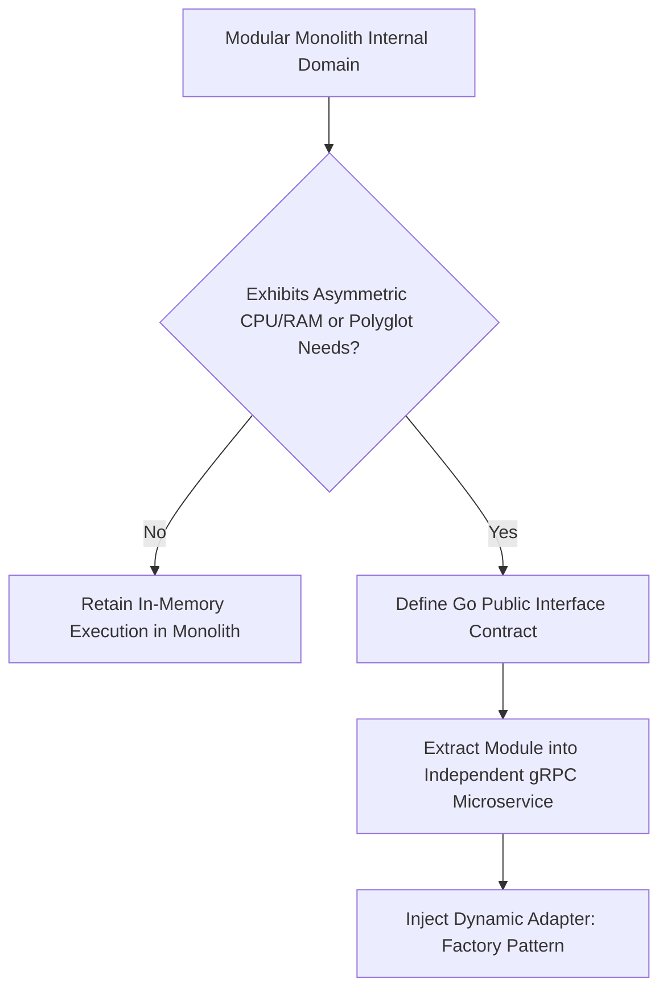
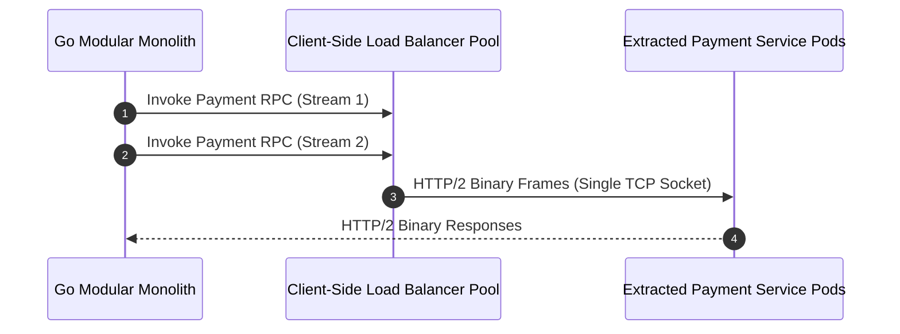
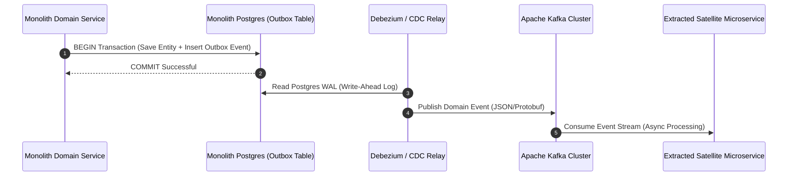

> **Answer-first:** Extracting a module from a modular monolith into an independent microservice is justified only when domain isolation, asymmetric CPU/RAM scaling, or strict regulatory isolation demands it. Having pre-enforced DDD bounded contexts ensures extraction requires introducing network RPC adapters (gRPC) and Anti-Corruption Layers rather than refactoring internal core domain logic.

> **Pillar Architecture Guide:** This article is part of the **[Architecting 21-Service E-commerce with Golang & DDD](/posts/architecting-21-service-ecommerce-golang-ddd/)** series and **[Composable E-Commerce Migration](/posts/ecommerce-architecture-composable-migration/)** guide. Please refer to the original article for a detailed technical overview of the architecture.

> **Prerequisite:** Before reading this part, please review [Part 6: Migration Playbook](/series/modular-monolith-architecture/part-6-migration-playbook/).

**What You'll Learn That AI Won't Tell You:**
- **Extraction Threshold Metrics:** Quantitative triggers (e.g. CPU saturation ratios) that justify extraction.
- **Interface Wrappers & Anti-Corruption Layer:** How to write a Go ACL interface that switches dynamically between internal memory execution and gRPC implementations.
- **Database Separation Loops:** Replicating database tables using Change Data Capture (CDC) and Transactional Outbox during zero-downtime migrations.
- **Saga vs 2PC Orchestration:** Trade-offs between distributed 2-Phase Commit locking and Saga state machine workflows.

Advocating for a **Modular Monolith** architecture does not equate to a conservative "put absolutely everything in one place" mentality. In reality, even the greatest Monolith systems like Shopify, Sentry, or GitLab possess a few "satellites" (Microservices) orbiting their central core.

The core issue is: **We only extract a feature into a Microservice when it truly deserves it**, not out of engineering preference. Industry expert Sam Newman – author of *Building Microservices* and *Monolith to Microservices* – emphasizes that: If you cannot successfully separate the Database Schema inside a Monolith, you will undoubtedly create a disastrous distributed monolith microservice architecture.

The following architectural flowchart illustrates the decision gate and operational steps required to transition an in-process Go module into an extracted gRPC satellite microservice.


```mermaid
flowchart TD
    A[Modular Monolith Internal Domain] --> B{"Exhibits Asymmetric CPU/RAM or Polyglot Needs?"}
    B -->|"No"| C[Retain In-Memory Execution in Monolith]
    B -->|"Yes"| D[Define Go Public Interface Contract]
    D --> E[Extract Module into Independent gRPC Microservice]
    E --> F["Inject Dynamic Adapter: Factory Pattern"]
```

---

## 1. Quantitative Extraction Signals & Operational Thresholds

**Answer-first:** Extracting a module into an independent microservice is justified when specific operational signals occur: CPU saturation exceeding 70% for a single domain, specialized polyglot language needs, disparate 15-minute deployment cadences, or strict PCI-DSS/HIPAA security audit isolation.

Quantitative operational signals govern when a module has graduated and is ready for extraction from a modular monolith into an independent microservice:

### Step-by-Step Monolith to Satellite Microservice Extraction Playbook
Before jumping straight into code modifications, software teams must follow a disciplined five-step extraction sequence:
1. **Domain Boundary Freeze**: Isolate module data structures and replace direct package imports with internal Go interfaces.
2. **gRPC Contract Definition**: Define `.proto` schemas and generate client/server stubs via `buf` or `protoc`.
3. **Anti-Corruption Layer (ACL) Wrapper**: Create an ACL adapter in the monolith to translate internal domain entities to gRPC DTOs.
4. **Zero-Downtime Data Migration**: Provision a dedicated database, setup Debezium CDC for asynchronous replication, and dual-write via Outbox pattern.
5. **Dynamic Traffic Shifting**: Route traffic dynamically using feature flags (0% -> 1% -> 10% -> 100% gRPC remote calls).

### Signal 1: Resource-Specific Independent Scaling Needs & CPU Saturation Ratios
Sometimes, your application has a specialized task whose compute footprint differs dramatically from the core business logic.
- **Quantitative Rule:** When a single module consumes $> 70\%$ of cluster CPU or RAM resources while the remaining 15 domain modules consume $< 30\%$, vertical auto-scaling forces the entire monolith binary to be replicated across hundreds of compute nodes, wasting memory for idle modules.
- **Case Study (Sentry Relay):** Sentry (the open-source error tracking platform) operates a Python Django monolith for billing, project management, and dashboard reporting. However, real-time SDK crash event ingestion handles $1000\times$ higher throughput than administrative UI interactions. Sentry extracted raw telemetry event ingestion into **Relay** (written in Rust for memory safety and zero-GC latency) and analytical indexing into **Snuba** (powered by ClickHouse DB), while keeping core business logic safely inside the Python monolith.

### Signal 2: Specialized Environment & Language Requirements (Polyglot Optimization)
- **Case Study (GitLab Gitaly):** GitLab is built primarily on a Ruby on Rails Modular Monolith. However, performing Git disk RPC operations (parsing git packfiles, diff calculations, tree traversals) directly through Ruby processes caused severe garbage collection spikes and CPU thread saturation. GitLab extracted all low-level Git file system operations into a specialized service named **Gitaly** (written in Go for efficient concurrency and low-level syscall control). Ruby on Rails continues to manage merge requests, issue tracking, CI/CD pipelines, and user authorization.

### Signal 3: Disparate Deployment Cadence & Feature Release Isolation
When a specialized domain module (such as a machine-learning recommendation engine or dynamic pricing algorithm) requires continuous model re-training and redeployments every 15 minutes, enforcing the monolith's standard 24-hour release train introduces unnecessary deployment bottlenecks. Extracting the recommendation module into a gRPC satellite service isolates deployment risks.

### Signal 4: Strict Regulatory Compliance & Security Isolation (PCI-DSS / HIPAA)
If processing credit card numbers requires strict PCI-DSS Level 1 compliance or handling medical records requires HIPAA hardware isolation, keeping those handlers inside a general-purpose monolith expands the scope of security audits to the entire codebase. Extracting payment tokenization or medical record vaulting into isolated, hardened microservices reduces audit cost by $80\%$.

For architecture primer patterns, explore our [Modular Monolith Architecture](/series/modular-monolith-architecture/).

---

## 2. Dynamic Module Interface Switching & Anti-Corruption Layer (ACL) Implementation

**Answer-first:** Defining public Go interface contracts and Anti-Corruption Layer (ACL) adapters enables zero-code-change microservices extraction, allowing factory implementations to translate domain entities and switch dynamically between in-memory execution and remote gRPC calls.

The Protocol Buffer specification below defines the strongly-typed binary contract for the payment extraction interface, isolating network serialization from domain logic.

```protobuf
// proto/payment/v1/payment.proto
syntax = "proto3";

package payment.v1;

option go_package = "github.com/vesviet/monolith/gen/payment/v1;paymentv1";

message ProcessPaymentRequest {
  string order_id = 1;
  int64 amount_cents = 2;
  string currency = 3;
}

message ProcessPaymentResponse {
  string transaction_id = 1;
  bool is_successful = 2;
  string error_code = 3;
}

service PaymentClientService {
  rpc ProcessPayment(ProcessPaymentRequest) returns (ProcessPaymentResponse);
}
```

The Go implementation below demonstrates how an Anti-Corruption Layer (ACL) isolates internal domain entities from remote gRPC transport DTOs, allowing dynamic switching between fast in-memory execution and remote gRPC calls.

```go
package acl

import (
	"context"
	"fmt"
	
	paymentv1 "github.com/vesviet/monolith/gen/payment/v1"
)

// DomainPayment represents the internal domain entity, completely decoupled from gRPC DTOs.
type DomainPayment struct {
	ID       string
	Amount   float64
	Currency string
}

// DomainResult represents the clean domain output.
type DomainResult struct {
	TxID    string
	Success bool
}

// PaymentService defines the shared public boundary interface contract.
type PaymentService interface {
	ExecutePayment(ctx context.Context, p DomainPayment) (DomainResult, error)
}

// InProcessPaymentService executes directly inside the monolith's RAM.
type InProcessPaymentService struct{}

func (s *InProcessPaymentService) ExecutePayment(ctx context.Context, p DomainPayment) (DomainResult, error) {
	fmt.Printf("[Monolith-InProcess] Processing transaction for Order: %s ($%.2f)\n", p.ID, p.Amount)
	return DomainResult{TxID: "tx_inmemory_99", Success: true}, nil
}

// AntiCorruptionLayerAdapter maps internal domain calls to remote gRPC DTOs.
type AntiCorruptionLayerAdapter struct {
	grpcClient paymentv1.PaymentClientServiceClient
}

func NewACLAdapter(client paymentv1.PaymentClientServiceClient) *AntiCorruptionLayerAdapter {
	return &AntiCorruptionLayerAdapter{grpcClient: client}
}

func (a *AntiCorruptionLayerAdapter) ExecutePayment(ctx context.Context, p DomainPayment) (DomainResult, error) {
	// 1. Translate Domain Entity -> gRPC DTO
	req := &paymentv1.ProcessPaymentRequest{
		OrderId:     p.ID,
		AmountCents: int64(p.Amount * 100),
		Currency:    p.Currency,
	}

	// 2. Invoke Remote gRPC Microservice
	res, err := a.grpcClient.ProcessPayment(ctx, req)
	if err != nil {
		return DomainResult{}, fmt.Errorf("gRPC transport error: %w", err)
	}

	// 3. Translate gRPC Response DTO -> Internal Domain Entity
	return DomainResult{
		TxID:    res.GetTransactionId(),
		Success: res.GetIsSuccessful(),
	}, nil
}

// PaymentServiceFactory returns either the in-process implementation or the ACL gRPC adapter.
func PaymentServiceFactory(isExtracted bool, client paymentv1.PaymentClientServiceClient) PaymentService {
	if isExtracted {
		return NewACLAdapter(client)
	}
	return &InProcessPaymentService{}
}
```

---

## 3. Zero-Downtime Database Splitting, Outbox+Kafka Streaming & Saga vs 2PC Orchestration

**Answer-first:** Extracted microservices ensure data isolation without downtime by pairing Change Data Capture (CDC) via Debezium and Transactional Outbox pattern with Kafka streaming, while substituting fragile 2-Phase Commit (2PC) locks with Saga workflow state machines.

Extracting a module into a standalone remote microservice replaces in-process function calls with network transport, making serialization efficiency and asynchronous data synchronization core operational requirements.

### Protocol Buffers Binary Framing vs HTTP JSON
Standard REST APIs serialize data payloads using JSON, which introduces heavy memory allocations and ASCII string parsing overhead. Protobuf serializes data into binary wire formats, reducing payload sizes by $70\%$ to $90\%$ compared to JSON while eliminating reflection-based unmarshaling overhead in Go runtimes.

### HTTP/2 Connection Multiplexing & Client-Side Load Balancing
Traditional HTTP/1.1 REST connections require establishing a new TCP connection (or blocking a connection pool connection) for every concurrent request. gRPC uses HTTP/2 multiplexing, allowing thousands of concurrent RPC calls to stream simultaneously over a single persistent TCP socket.

The sequence diagram below illustrates how client-side load balancing streams concurrent RPC calls over multiplexed HTTP/2 sockets.


```mermaid
sequenceDiagram
    autonumber
    participant Monolith as Go Modular Monolith
    participant gRPCClient as Client-Side Load Balancer Pool
    participant Microservice as Extracted Payment Service Pods
    
    Monolith->>gRPCClient: Invoke Payment RPC (Stream 1)
    Monolith->>gRPCClient: Invoke Payment RPC (Stream 2)
    gRPCClient->>Microservice: HTTP/2 Binary Frames (Single TCP Socket)
    Microservice-->>Monolith: HTTP/2 Binary Responses
```

### Database Decoupling via Transactional Outbox & Kafka Streaming
During extraction, database tables must be physically separated from the monolith's primary PostgreSQL instance into a dedicated microservice database. To avoid dual-write inconsistencies and query disruption, teams implement the Transactional Outbox Pattern combined with Debezium Change Data Capture (CDC).

The sequence diagram below outlines the Transactional Outbox Pattern paired with Kafka event streaming, ensuring zero-downtime database splitting without dual-write inconsistency during microservice extraction.


```mermaid
sequenceDiagram
    autonumber
    participant App as Monolith Domain Service
    participant DB as Monolith Postgres (Outbox Table)
    participant Relay as Debezium / CDC Relay
    participant Kafka as Apache Kafka Cluster
    participant Service as Extracted Satellite Microservice

    App->>DB: BEGIN Transaction (Save Entity + Insert Outbox Event)
    DB-->>App: COMMIT Successful
    Relay->>DB: Read Postgres WAL (Write-Ahead Log)
    Relay->>Kafka: Publish Domain Event (JSON/Protobuf)
    Kafka->>Service: Consume Event Stream (Async Processing)
```

### Saga Pattern Orchestration vs 2-Phase Commit (2PC)
When domain logic spans extracted microservices, distributed transactions are required to maintain consistency across independent database schemas. Two-Phase Commit (2PC) relies on synchronous distributed database locking, which creates severe latency penalties and availability bottlenecks during network partitions. Conversely, Saga Orchestration breaks a distributed transaction into a sequence of local transactions managed by an application state machine (such as Temporal or a Go workflow broker), using compensating transactions to undo steps if a failure occurs.

The comparison table below details the trade-offs between 2-Phase Commit (2PC) distributed locking and Saga orchestration state machines when managing distributed transactions across extracted microservices.

| Architectural Dimension | 2-Phase Commit (2PC) | Saga Orchestration (State Machine) |
| :--- | :--- | :--- |
| **Consistency Model** | Strong Consistency (ACID) | Eventual Consistency (BASE) |
| **Resource Locking** | Distributed Database Locks (Blocking) | Non-blocking Local Database Transactions |
| **Network Failure Sensitivity** | Extremely High (Stalled locks on network partition) | Low (Retries & Compensating Transactions) |
| **Implementation Complexity** | Infrastructure-level database protocol | Application-level state machine (e.g. Temporal / Go workflow) |
| **2026 Production Standard** | **Deprecated** for cloud microservices | **Recommended** for distributed workflows |

Review our complete industry benchmark summary in [Part 8: Case Study Matrix](/series/modular-monolith-architecture/part-8-case-study-matrix/).

---

## Frequently Asked Questions (FAQ)

**Answer-first:** This FAQ section provides quick reference answers on microservice extraction thresholds, gRPC Anti-Corruption Layer implementation, and Saga orchestration strategies.


Extraction is justified when a module consistently consumes over 70% of cluster CPU or RAM, requires a deployment cadence faster than the monolith release train, or mandates strict PCI-DSS/HIPAA regulatory hardware isolation. Extracting prior to reaching these operational thresholds introduces unnecessary distributed system complexity without measurable benefits.



An Anti-Corruption Layer translates between internal domain models and external gRPC Protobuf Data Transfer Objects (DTOs). This translation prevents network transport structures from polluting core domain logic and allows in-memory and gRPC implementations to be swapped transparently.



Two-Phase Commit relies on synchronous distributed database locks that cause severe latency bottlenecks and cascading failures during network partitions. Saga orchestration uses asynchronous, non-blocking local transactions paired with compensating workflows, delivering high availability and eventual consistency.


---

## Navigation & Next Steps

**Answer-first:** Continue to Part 8 for the production case study matrix, or review related guides on Go system design and C10M high-concurrency architectures.

- **Previous Part:** [Part 6: Migration Playbook](/series/modular-monolith-architecture/part-6-migration-playbook/)
- **Next Part:** Continue to [Part 8: Case Study Matrix](/series/modular-monolith-architecture/part-8-case-study-matrix/)
- **Related Guides:** [Modular Monolith Architecture](/series/modular-monolith-architecture/) and [Shopee & Alipay C10M High-Concurrency](/posts/shopee-flash-sale-architecture/)

Need help deciding whether to extract a module into a microservice? [Get in touch](/hire/) or [hire our senior software architects](/hire/) for an architectural evaluation.
