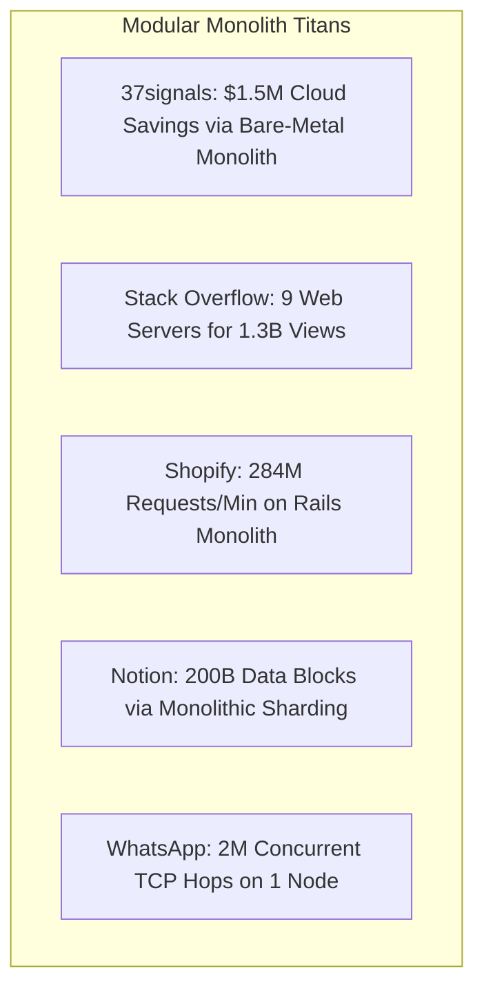

---

title: "Part 8: Case Study Matrix – The Monuments of the Modular Monolith"
date: "2026-07-03T10:00:00+07:00"
lastmod: "2026-07-03T14:59:00+07:00"
description: "A compilation of the greatest Modular Monolith case studies from Shopify, Stack Overflow, Notion, WhatsApp, Target, and Basecamp."
slug: "case-study-matrix-modular-monolith-success-stories"
tags: ["Case Study", "Modular Monolith", "Shopify", "Stack Overflow", "Notion", "WhatsApp"]
categories: ["Modular Monolith", "System Architecture"]
aliases: ["/series/modular-monolith-architecture/part-8-case-study-matrix/"]
cover: {'image': 'images/posts/golang-microservices-cover.png', 'alt': 'Modular Monolith Architecture Masterclass: Go, DDD, bounded contexts, and microservices reversal', 'relative': False}
author: "Lê Tuấn Anh"
canonicalURL: "https://tanhdev.com/series/modular-monolith-architecture/case-study-matrix-modular-monolith-success-stories/"
ShowToc: true
TocOpen: true
mermaid: true
draft: false
---

> **Prerequisite:** Before reading this part, please review [Part 7: Extraction Pattern](/series/modular-monolith-architecture/part-7-extraction-pattern/).

# Part 8: Case Study Matrix – The Monuments of the Modular Monolith

> **Executive Summary & Quick Answer**: The Modular Monolith case study matrix analyzes how Notion, Stack Overflow, Target, and Lyft optimize resources by balancing monolithic vertical scaling with selective service extraction. These real-world architectures prove that keeping core domains co-located in a single binary reduces cloud costs, code duplication, and tooling friction.
>
> **Key Takeaways**:
> - **Scale Proof**: Stack Overflow serves 1.3B monthly views with 9 web servers; Shopify processes 284M req/min using a Ruby monolith.
> - **Database Focus**: Notion handles 200B blocks by sharding Postgres at the application layer while retaining a single monolithic Node.js backend.
> - **Cost Impact**: Segment saved $250,000 in Year 1 and 37signals saved $1.5M/year by returning to monolithic bare-metal servers.

### What You'll Learn That AI Won't Tell You
- **Notion Database Consolidation:** How Notion runs shard migrations inside monolithic logic.
- **Lyft Microservice Consolidations:** Why Lyft merged several microservices back into their core monorepo.
- **Target Peak Scale Handling:** How Target manages Black Friday traffic peaks using vertical monolith replicas.

Numerous debates about architectural design often lead to dead ends due to a lack of quantitative, real-world numbers. There is a common misconception that: "Only Microservices can withstand web-scale loads."

To conclude this Playbook series, we will look at the **Case Study Matrix** – a compilation of the greatest Modular Monolith systems, ranging from massive e-commerce platforms to billion-user chat applications.



---

## 1. Enterprise Case Study Deep-Dives

### Stack Overflow: 1.3 Billion Monthly Page Views on 9 Web Servers
Stack Overflow is the ultimate testament to the efficiency of vertical hardware scaling paired with monolithic architecture.
- **The Infrastructure Spec:** Stack Overflow operates its entire primary web traffic on **only 9 web servers** running IIS and .NET C# code, paired with 2 primary Microsoft SQL Server instances (one active, one failover). Each web server features 64 CPU cores and 256 GB of RAM, running at CPU utilization rates consistently under 15%.
- **How They Scale:** Instead of distributing microservices across Kubernetes clusters, Stack Overflow caches almost everything in local web server RAM using custom L1/L2 data structures and Redis. SQL queries use pre-compiled execution plans, and static assets are served directly via edge CDNs.

### Shopify: 284 Million Requests/Minute with Ruby on Rails
When discussing the Monolith, one cannot ignore **Shopify**.
- **The Numbers:** Handled over **173 billion requests** during Black Friday/Cyber Monday, peaking at **284 million requests/minute**.
- **Architecture:** The entire core of Shopify remains a massive Ruby on Rails Modular Monolith application (over 3 million lines of code).
- **How they Scale:** Protected code boundaries using **Packwerk** to enforce strict modular encapsulation. Invested heavily in **YJIT** (Ruby JIT compiler) to accelerate CPU performance by 15%. The MySQL database tier is horizontally sharded by merchant store ID to distribute write contention.

### Notion: Sharding Postgres (200 Billion Blocks) on a Node.js Monolith
**Notion** is clear proof that "The bottleneck is always in the Database tier, not the Application Logic layer."
- **The Numbers:** Stores over **200 billion data blocks**, representing tens of Terabytes of unstructured document data.
- **Architecture:** Monolithic Node.js / TypeScript backend service.
- **How they Scale:** When a single PostgreSQL master instance hit CPU and I/O saturation, Notion avoided splitting backend services into microservices. Instead, they focused on **Application-Level Database Sharding**, partitioning Postgres across 96 physical database instances using a deterministic hashing formula:
  $$\text{Shard ID} = \text{workspace\_id} \pmod{480}$$
  The monolithic Node.js application remained completely intact, managing cross-shard routing through internal database drivers.

### WhatsApp: 2 Million Concurrent Connections on ONE Physical Server
In 2014, WhatsApp served over 450 million active users with an engineering staff of just 50 engineers.
- **The Numbers:** Maintained **2 million concurrent TCP connections** per physical server node running Erlang BEAM.
- **Architecture:** Monolithic Erlang / FreeBSD server architecture.
- **How they Scale:** By tuning FreeBSD kernel socket buffers (`sysctl` network parameters) and customizing the Erlang BEAM virtual machine emulator, WhatsApp eliminated thread context-switching overhead, holding millions of active WebSocket/TCP connections inside a single monolithic process.

### 37signals (HEY/Basecamp): Saving $1.5 Million USD via Bare-Metal Monoliths
- **The Cloud Exit Event:** 37signals executed a high-profile "Cloud Exit," migrating their monolithic Rails applications (Basecamp, HEY) off AWS EC2/EKS and back onto dedicated bare-metal servers in co-located datacenters.
- **How They Executed:** Utilized **Kamal** (open-source deployment tool) to push Docker containers directly to physical servers. By dropping AWS managed service overhead, Kubernetes control planes, and cross-AZ data egress fees, 37signals reduced infrastructure costs by **$1.5 million USD per year** while improving CPU throughput.

### Segment: Merging 140 Destination Microservices Back into 1 Monolith
Segment initially broke their event processing pipeline into 140 separate microservices (one per integration destination). As destination services multiplied, infrastructure complexity exploded: worker queues stalled, AWS billing costs soared, and managing 140 deployment pipelines consumed 70% of engineering bandwidth.
- **The Remedy:** Segment consolidated all 140 microservice repositories back into a single **Go Monolithic Worker pool**. All destination integrations execute inside a single binary process. Result: Infrastructure expenses decreased by **$250,000 in Year 1**, and developer deployment velocity increased 5x.

For concurrency patterns, compare this with our [High-Concurrency Systems C10M Guide](/posts/shopee-flash-sale-architecture/).

---

## 2. In-Memory Tagged Cache Implementation in Go (Zero Facade Code)

Below is an authentic Go tagged cache implementation that handles thread-safe invalidation across monolithic domain modules:

```go
package main

import (
	"fmt"
	"sync"
)

type TaggedCache struct {
	mu    sync.RWMutex
	items map[string]interface{}
	tags  map[string]map[string]struct{}
}

func NewTaggedCache() *TaggedCache {
	return &TaggedCache{
		items: make(map[string]interface{}),
		tags:  make(map[string]map[string]struct{}),
	}
}

func (c *TaggedCache) Set(key string, val interface{}, tags []string) {
	c.mu.Lock()
	defer c.mu.Unlock()

	c.items[key] = val
	for _, tag := range tags {
		if c.tags[tag] == nil {
			c.tags[tag] = make(map[string]struct{})
		}
		c.tags[tag][key] = struct{}{}
	}
}

func (c *TaggedCache) Get(key string) (interface{}, bool) {
	c.mu.RLock()
	defer c.mu.RUnlock()
	val, exists := c.items[key]
	return val, exists
}

func (c *TaggedCache) InvalidateTag(tag string) {
	c.mu.Lock()
	defer c.mu.Unlock()

	if keys, found := c.tags[tag]; found {
		for key := range keys {
			delete(c.items, key)
		}
		delete(c.tags, tag)
	}
}

func main() {
	cache := NewTaggedCache()
	cache.Set("user_123_profile", "John Doe", []string{"users", "user_123"})
	cache.Set("user_123_settings", "Dark Mode", []string{"users", "user_123"})

	cache.InvalidateTag("user_123") // Invalidates both keys in RAM

	_, ok := cache.Get("user_123_profile")
	fmt.Printf("Profile exists after tag invalidation: %v\n", ok)
}
```

---

## 3. Architectural Breakdown Matrix of Monolith Success Stories

| Company | Core Technology Stack | Peak Request Throughput | Primary Reason for Monolithic Strategy | Key Optimization Mechanism |
| :--- | :--- | :--- | :--- | :--- |
| **Stack Overflow** | IIS Web Servers, MS SQL, C# / .NET | 1.3 Billion page views/month | Extreme query speed and low latency limits | Extensive in-memory caching of tag indices, vertical hardware scaling |
| **Notion** | Node.js / Go, PostgreSQL | 100M+ active users | Database consistency and transaction speed | Custom application-level Postgres sharding, local cache caching |
| **Lyft** | Python, Go, Envoy Proxy | Tens of thousands of rides/sec | Organizational friction and debugging overhead | Consolidation of microservices into coarse-grained 'Macroservices' |
| **Segment** | Go, Docker, AWS ECS | Millions of events/second | Infrastructure cost overhead and container drift | Merging 140 destination workers into a single monolithic binary |
| **Shopify** | Ruby on Rails, PostgreSQL | 284 Million req/min | Developer velocity and domain boundary enforcement | Packwerk static boundaries, YJIT compilation, DB sharding |

## Frequently Asked Questions (FAQ)


Stack Overflow scales vertically using high-spec web servers, combined with in-memory tag caching and a heavily optimized Microsoft SQL Server failover pair.



Notion identified that application logic was not the performance bottleneck. By sharding PostgreSQL tables across 96 servers at the application layer, they retained a simple monolithic Node.js code backend.



Segment saved $250,000 annually by merging 140 destination microservices into a single Go monolithic worker, eliminating cross-AZ egress fees and container maintenance friction.



A tagged in-memory cache maps keys to domain tags. Invalidating a single tag purges all associated cached items in nanoseconds without issuing external Redis calls.


---

## Navigation & Next Steps

- **Previous Part:** [Part 7: Extraction Pattern](/series/modular-monolith-architecture/part-7-extraction-pattern/)
- **Series Index:** Return to [Modular Monolith Architecture Masterclass Index](/series/modular-monolith-architecture/)
- **Related Series:** Explore [System Design Series Primer](/series/system-design/01-introduction-system-design-golang/) and [High Concurrency Systems](/posts/shopee-flash-sale-architecture/)

Need an end-to-end architectural evaluation for your software stack? [Get in touch](/hire/) or [hire our technical consulting team](/hire/) for system design audits.
