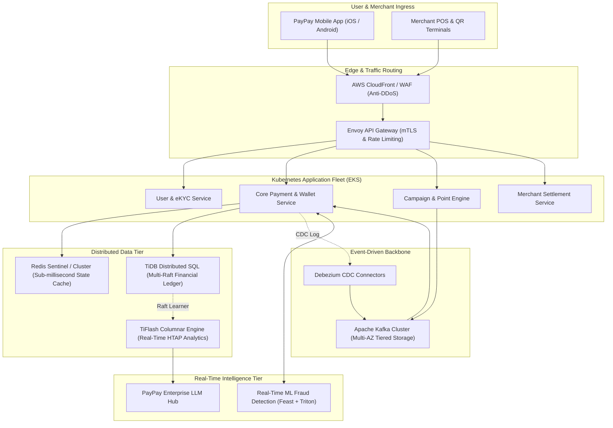
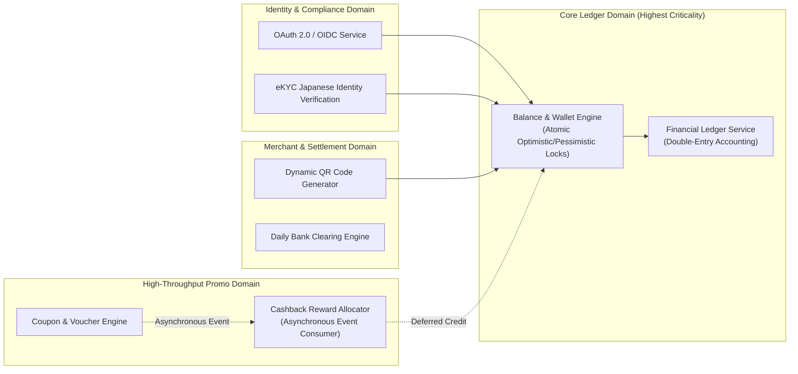

> **Multi-Language Edition:** This series is also available in Vietnamese at [Tổng Quan Kiến Trúc PayPay: Mở Rộng Cho Các Chiến Dịch Siêu Quy Mô (learn.tanhdev.com)](https://learn.tanhdev.com/series/paypay-architecture/).

---

> **Answer-First:** PayPay is Japan's dominant mobile payment service, supporting over 70 million registered users, 7.8 billion annual transactions, and peak promotional surges exceeding 1,250 TPS. To deliver 99.999% availability with zero double-spending guarantees, PayPay evolved from monolithic roots to a cloud-native architecture powered by five pillars: **Domain-Driven Microservices with ArgoCD GitOps**, **Event-Driven decoupling via Apache Kafka**, **Distributed SQL horizontal scale with TiDB Multi-Raft**, **Proactive resilience via Chaos Mesh**, and **Sub-10ms real-time ML fraud detection**.

---

## 1. Executive Summary: The PayPay Hyper-Growth Trajectory

Launched in October 2018 as a joint venture between SoftBank, Yahoo! JAPAN, and Paytm, PayPay revolutionized the Japanese cash-dominated retail landscape. Aggressive national campaigns—such as the historic *"10-Billion Yen Giveaway"*—sparked exponential traffic spikes that overwhelmed traditional synchronous infrastructure.

```
Key Scale Indicators (Production Standard):
┌──────────────────────────────┬──────────────────────────────┐
│ Metric                       │ Production Value             │
├──────────────────────────────┼──────────────────────────────┤
│ Registered Users             │ 70,000,000+                  │
│ Annual Transaction Volume    │ 7.8+ Billion                 │
│ Peak Transaction Throughput  │ 1,250+ TPS                   │
│ Overall Service Availability │ 99.999%                      │
│ Production Fraud Rate        │ ~0.0015% (Industry Leading)  │
└──────────────────────────────┴──────────────────────────────┘
```

The core architectural dilemma in digital payments is strict consistency under astronomical concurrency: you cannot compromise the double-entry accounting ledger to gain speed, nor can you allow promotional campaign logic to exhaust database connection pools and block ordinary convenience store payments.

---

## 2. High-Level System Architecture

PayPay organizes its technology stack into loosely coupled, highly autonomous layers that isolate write-heavy promotional traffic from mission-critical financial ledger mutations:



---

## 3. Domain-Driven Decomposition & Bounded Contexts

To enable hundreds of engineers across international teams to release code independently without deployment deadlocks, PayPay decomposed its monolith into **Domain-Driven Bounded Contexts**:



1. **User & Identity Domain:** Handles biometric authentication, session revocation, and Japanese FSA-compliant eKYC verification.
2. **Wallet & Core Ledger Domain:** The unshakeable financial nucleus. Implements immutable double-entry bookkeeping where money cannot be created or destroyed, only transferred across accounts.
3. **Campaign & Promotion Domain:** The primary shock absorber for marketing campaigns. Calculates reward eligibility asynchronously without holding open locks on wallet balance tables.
4. **Merchant & Settlement Domain:** Manages dynamic and static merchant QR generation, dispute arbitration, and daily interbank clearing via Zengin-net.

---

## 4. Complete Series Roadmap

Explore each architectural dimension in depth through our structured six-part technical series:

- [**Part 1 — The Foundation: Microservices & GitOps**](/series/paypay-architecture/part-1-microservices-gitops/)  
  *How PayPay divides 100+ services using Domain-Driven Design, gRPC/Protobuf contracts, and automates progressive canary deployments via ArgoCD and Argo Rollouts.*

- [**Part 2 — Handling the Surge: Event-Driven & Kafka at Scale**](/series/paypay-architecture/part-2-event-driven-kafka/)  
  *Decoupling transaction submission from database persistence, mastering the Transactional Outbox pattern, exactly-once idempotency keys, and dead-letter queue governance.*

- [**Part 3 — The Data Layer: Migrating from Aurora to TiDB Multi-Raft**](/series/paypay-architecture/part-3-data-layer-tidb/)  
  *Overcoming MySQL connection and write bottlenecks, zero-downtime data migration with TiDB DM, and harnessing distributed Multi-Raft storage for ACID ledgers.*

- [**Part 4 — Operations: SRE & Chaos Engineering**](/series/paypay-architecture/part-4-sre-chaos-engineering/)  
  *Injecting controlled production failures with Chaos Mesh, validating multi-cluster Kubernetes failover, and establishing automated circuit-breaker meshes.*

- [**Part 5 — Surviving the Billion-Yen Campaign: Scaling for Extreme Traffic**](/series/paypay-architecture/part-5-campaign-architecture/)  
  *Architecting virtual waiting rooms, distributed token bucket rate limiting in Redis, asynchronous reward grants, and end-of-day financial reconciliation.*

- [**Part 6 — PayPay Goes AI-Native: Real-Time Fraud & LLM Hub**](/series/paypay-architecture/part-6-ai-integration-2025/)  
  *Sub-10ms real-time ML risk scoring pipelines, Feast feature stores, enterprise LLM Hub integration, and eBPF continuous profiling.*

---

## Frequently Asked Questions


PayPay enforces zero double-spending through a multi-tier defense:
1. <strong>Client Idempotency Keys:</strong> Every payment request generates a unique UUIDv7 embedded in HTTP headers, checked against Redis with sub-millisecond locks before processing.
2. <strong>Asynchronous Promotional Decoupling:</strong> Campaign cashback rewards are processed in a secondary event stream rather than within the synchronous payment authorization transaction.
3. <strong>Strict Double-Entry Ledger:</strong> All balance updates in TiDB require matching debit and credit entries with pessimistic row locks and snapshot isolation, guaranteeing mathematical balance invariance.



While AWS Aurora provided robust vertical scaling, PayPay encountered critical limitations during mega-campaign surges:
- Aurora MySQL single-writer architecture created write lock contention on merchant and promotion ledger tables.
- Cross-region read replica lag spiked under intense write loads, risking inconsistent user balance reads.
- TiDB NewSQL provided horizontal multi-master write scalability, autonomous Multi-Raft Region auto-splitting, and native HTAP analytics through TiFlash without impacting OLTP payment traffic.



Availability is maintained through proactive isolation and graceful degradation:
- <strong>Virtual Waiting Rooms:</strong> High-traffic campaign entrypoints route through an edge virtual queue, throttling admissions to match downstream service capacity.
- <strong>Adaptive Load Shedding:</strong> Non-essential features (e.g., promotional banner personalization, loyalty animations) are automatically disabled via Sentinel circuit breakers when CPU crosses 80%.
- <strong>Kafka Peak Shaving:</strong> Transaction confirmation is acknowledged asynchronously, flattening sharp ingestion spikes into steady, predictable database write streams.


---

[Next Chapter: Part 1 — Microservices & GitOps Blueprint](/series/paypay-architecture/part-1-microservices-gitops/)
