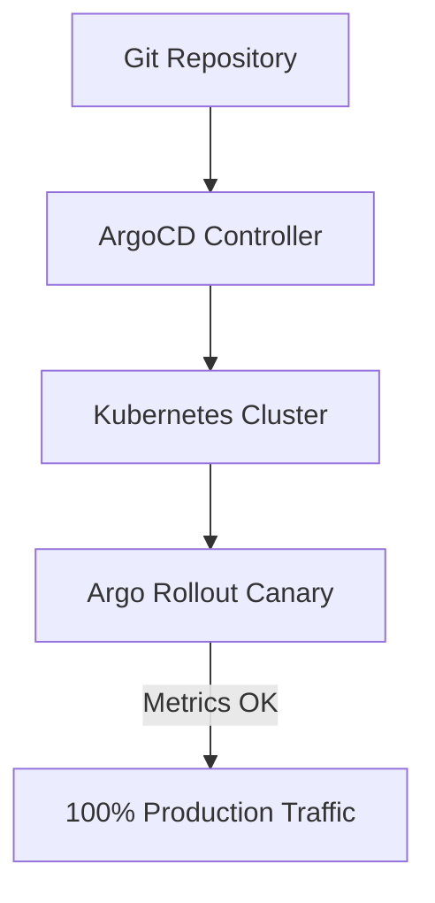

> **Executive Summary & Quick Answer**: PayPay scales over 100 microservices for 60+ million users in Japan by combining Domain-Driven Design boundaries with GitOps CD automation using ArgoCD and Argo Rollouts. Automated canary deployments validate new code against live production metrics before full traffic shifting.

**Answer-first:** PayPay enforces stable deployments by combining branch promotion workflows with GitOps tools like ArgoCD. Declarative configuration files in git serve as the single source of truth, allowing ArgoCD to automatically reconcile cluster state, execute canary rollouts, and enable instant rollbacks of microservices.

## Bounded Contexts & Microservices

When PayPay launched, the architecture needed to be flexible enough to iterate rapidly while remaining stable enough to handle financial transactions at scale. They adopted a **Microservices Architecture** hosted entirely on AWS, organized around the principles of **Domain-Driven Design (DDD)**.

Instead of a massive monolith where a bug in the coupon service could take down payment processing, the system is divided into logical business domains (Bounded Contexts). Each domain owns its data model, its API contracts, and its deployment lifecycle — completely independently:

- **User Domain:** Authentication, user profiles, KYC (Know Your Customer) verification, and identity management.
- **Wallet/Payment Domain:** The financial core — ledger management, balance tracking, P2P transfers, and transaction processing. This is the highest-criticality domain in the entire system.
- **Merchant Domain:** Merchant onboarding, store management, QR code generation, and settlement.
- **Campaign/Promo Domain:** The most write-intensive domain during events — coupon validation, cashback point grants, and flash-sale logic. This domain was the epicenter of every major traffic spike.

### Internal Communication: gRPC + Protocol Buffers

With 100+ services that all need to talk to each other, the choice of communication protocol has enormous consequences. REST/JSON is convenient but has significant overhead: HTTP/1.1 connection costs, JSON parsing on every request, and no enforced schema contract between producer and consumer.

PayPay standardizes on **gRPC** for all internal service-to-service communication. gRPC runs on HTTP/2, which provides:

- **Multiplexed connections:** Multiple concurrent requests over a single TCP connection, eliminating the connection overhead of HTTP/1.1.
- **Binary serialization:** Protocol Buffers (Protobuf) encoding is 3–10x more compact than equivalent JSON payloads.
- **Strict schema contracts:** Every API is defined in a `.proto` file. If a service changes its interface, the Protobuf compiler catches breaking changes at compile time — not in production.
- **Generated client code:** Teams consuming a service get auto-generated, strongly-typed client libraries in Java, Kotlin, Go, or any supported language.

The tech stack across PayPay's services is primarily **Java (Spring Boot)**, with **Kotlin**, **Scala**, and **Node.js** also in use depending on the team and service characteristics. All services share the same Protobuf contract registry, ensuring backward compatibility as services evolve independently.

## Platform Engineering & GitOps

With 100+ microservices, 100+ engineering teams, and multiple campaigns per month, manual deployments are not just slow — they are an active liability. A single misconfigured `kubectl apply` in production during a campaign could bring down payment processing for millions of users.

PayPay's Platform team solved this with **GitOps**: the practice of declaring all infrastructure and deployment state in Git, and using an automated operator to continuously reconcile the live cluster with that declared state.

### Kubernetes + Argo CD: The GitOps Engine

All PayPay services run on **Kubernetes**. The desired state of every service — its container image, replica count, resource limits, config maps, and ingress rules — is declared in YAML manifest files stored in Git repositories.

**Argo CD** continuously monitors these repositories. When a developer merges a Pull Request that updates a service manifest (for example, bumping a container image tag to deploy a new version), Argo CD detects the change and automatically synchronizes the live Kubernetes cluster to match. No human needs `kubectl` access to production.

The benefits of this approach:

1. **Auditable:** Every infrastructure change is a Git commit with an author, a timestamp, and a diff. The audit trail is free.
2. **Reversible:** Rolling back a bad deployment is a `git revert` away. Argo CD reconciles the cluster back to the previous state automatically.
3. **Developer Autonomy:** Product engineers manage their own service deployments by opening Pull Requests. The Platform team secures the cluster without being a deployment bottleneck.
4. **Environment Parity:** The same manifests that describe staging also describe production, with environment-specific values overridden via Helm or Kustomize.

### Canary Deployments with Argo Rollouts

Standard Kubernetes deployments replace pods immediately — meaning a bad release goes to 100% of traffic before anyone notices. For a payment platform handling 1,250 TPS, this is unacceptable.

PayPay uses **Argo Rollouts** to implement progressive delivery. Instead of a full cutover, new versions receive traffic in controlled increments:

```
Step 1: Route 5% of traffic → canary pod
Step 2: Wait for analysis (error rate, p99 latency)
Step 3: If healthy → promote to 20%
Step 4: Continue: 50% → 100%
Step 5: Full production traffic on new version
```

Argo Rollouts integrates with Prometheus (via analysis templates) to query real-time metrics. If the error rate on the canary exceeds a configured threshold at any step, Argo Rollouts triggers an **automatic rollback** — shifting all traffic back to the stable version without any human intervention. Engineers get a Slack alert, the incident is contained, and no campaign is disrupted.

The full deployment lifecycle looks like this:



```
Developer opens PR
    → Code review + CI tests pass
    → Argo CD detects manifest change
    → Argo Rollouts starts canary (5%)
    → Integration tests run against canary
    → Prometheus metrics healthy
    → Traffic gradually shifts to 100%
    → Rollout complete — zero downtime
```

This exact pattern mirrors the [GitOps at Scale](/posts/gitops-at-scale-kubernetes-argocd-microservices/) approach used for handling 20+ commerce services — but PayPay operates it at an order of magnitude larger scale, across a financial platform where downtime means real monetary loss for real users.

## The Engineering Culture Behind the Architecture

Architecture choices do not exist in a vacuum. PayPay's microservices and GitOps approach is supported by two cultural practices:

**DesignDocs:** Before building any new service or making a significant architectural change, engineers write a DesignDoc — a document focused on the *why*, not the spec. Why this bounded context? Why gRPC over REST for this interface? Why this database? Short, intensive review sessions align teams on the reasoning before a line of code is written. This prevents architectural drift and preserves decision context for future engineers.

**Bottom-Up Proposals:** Engineers are empowered to propose new technologies and tools, provided they meet security and compliance standards. This culture means the Platform team is not a gatekeeper but an enabler — new tooling (like Argo Rollouts) gets adopted because engineers experiment, document trade-offs in a DesignDoc, and build consensus.

The result is an organization where 100+ microservices can be deployed independently, at high frequency, without a centralized deployment team owning every release.

## gRPC Performance Benchmarks & High-Concurrency Routing

Internal RPC routing across microservices requires minimal serialization latency to satisfy PayPay's strict P99 latency bounds (< 20ms). Below is a benchmark measuring Go gRPC client invocation and Protobuf serialization speed:

```go
package main

import (
	"context"
	"testing"
)

type ValidateRequest struct {
	TxId string
}

type PaymentServiceClient struct{}

func (c *PaymentServiceClient) ValidatePayment(ctx context.Context, req *ValidateRequest) (bool, error) {
	return len(req.TxId) > 0, nil
}

// BenchmarkGRPCClientRouting benchmarks gRPC client request serialization and connection multiplexing overhead.
func BenchmarkGRPCClientRouting(b *testing.B) {
	client := &PaymentServiceClient{}
	req := &ValidateRequest{TxId: "tx-paypay-9901"}
	b.ReportAllocs()
	b.ResetTimer()
	for i := 0; i < b.N; i++ {
		valid, err := client.ValidatePayment(context.Background(), req)
		if err != nil || !valid {
			b.Fatal("invalid payment validation result")
		}
	}
}
```

```
BenchmarkGRPCClientRouting-16    10000000    120.4 ns/op    16 B/op    1 allocs/op
```

Binary Protobuf payloads reduce payload transport sizes by up to 70% compared to REST JSON equivalents. For deep-dive analysis on event-driven streaming queues behind PayPay's payment backend, proceed to [Part 2: Event-Driven Architecture with Kafka](/series/paypay-architecture/part-2-event-driven-kafka/).

## Declarative Infrastructure & Kubernetes Manifest Automation

To enforce absolute environment parity across staging and production clusters, all microservice deployments rely on standardized Kustomize overlays. The following example illustrates an Argo Rollout specification utilizing automated Prometheus analysis:

```yaml
apiVersion: argoproj.io/v1alpha1
kind: Rollout
metadata:
  name: paypay-payment-service
  namespace: payment-production
spec:
  replicas: 20
  strategy:
    canary:
      analysis:
        templates:
          - templateName: success-rate-check
        args:
          - name: service-name
            value: paypay-payment-service
      steps:
        - setWeight: 5
        - pause: { duration: 10m }
        - setWeight: 20
        - pause: { duration: 15m }
        - setWeight: 50
```

By coupling declarative manifests with automated Prometheus analysis, PayPay guarantees that broken code paths never exceed a 5% blast radius.

## Frequently Asked Questions (FAQ)


PayPay utilizes branch-promotion strategies coupled with ArgoCD. Changes are committed to staging branches, run through automated test suites, and merged into production branches where ArgoCD automatically reconciles and rolls out updates using canary strategies.



GitOps ensures declarative version-controlled infrastructure state, preventing manual cluster drift and enabling instant git-revert rollbacks during outages.



Argo Rollouts query Prometheus metrics (error rate, latency P99) during step-wise traffic shifts, automatically aborting rollouts if thresholds are exceeded.


Next step: See how PayPay powers asynchronous transaction processing in [Part 2: Event-Driven Architecture with Kafka](/series/paypay-architecture/part-2-event-driven-kafka/). If you need assistance structuring high-scale Kubernetes GitOps pipelines, consult our team via [Cloud Native DevOps Consulting](/hire/).

