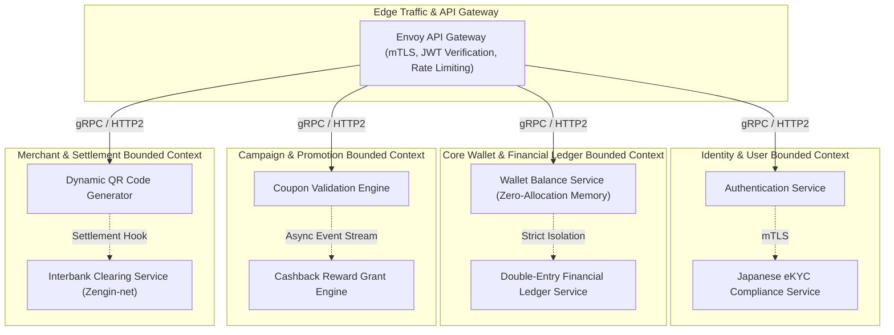
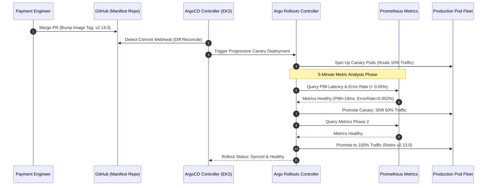

> **Multi-Language Edition:** This chapter is also available in Vietnamese at [Phần 1: Nền Tảng Microservices & Tự Động Hóa GitOps (learn.tanhdev.com)](https://learn.tanhdev.com/series/paypay-architecture/part-1-microservices-gitops/).

[Series Hub](/series/paypay-architecture/) | [Next Chapter: Part 2 — Event-Driven Architecture & Kafka at Scale](/series/paypay-architecture/part-2-event-driven-kafka/)

---

> **Answer-First:** PayPay manages over 100 microservices across hundreds of engineers by enforcing strict **Domain-Driven Design (DDD) bounded contexts** communicated via **gRPC and Protocol Buffers**, completely bypassing the high serialization latency of REST/JSON. To eliminate human error in production deployments, PayPay implemented a zero-trust **GitOps workflow using ArgoCD** coupled with **Argo Rollouts**. Progressive canary deployments automatically evaluate live production telemetry (Prometheus P99 latency and error rates) at 10% traffic shifts, triggering instantaneous rollbacks without human intervention if regressions occur.

---

## 1. Decomposing the Payment Monolith via Domain-Driven Design

In PayPay's hyper-growth phase, running a monolithic codebase created critical engineering bottlenecks: a defect in a marketing campaign banner could inadvertently crash the payment ledger. To decouple team release velocities and isolate failure domains, PayPay partitioned its backend into four core **Bounded Contexts**:


```mermaid
flowchart TD
    subgraph GatewayTier["Edge Traffic & API Gateway"]
        APIGW["Envoy API Gateway (mTLS, JWT Verification, Rate Limiting)"]
    end

    subgraph UserDomain["Identity & User Bounded Context"]
        SVC_AUTH["Authentication Service"]
        SVC_KYC["Japanese eKYC Compliance Service"]
    end

    subgraph WalletDomain["Core Wallet & Financial Ledger Bounded Context"]
        SVC_WALLET["Wallet Balance Service (Zero-Allocation Memory)"]
        SVC_LEDGER["Double-Entry Financial Ledger Service"]
    end

    subgraph CampaignDomain["Campaign & Promotion Bounded Context"]
        SVC_COUPON["Coupon Validation Engine"]
        SVC_REWARD["Cashback Reward Grant Engine"]
    end

    subgraph MerchantDomain["Merchant & Settlement Bounded Context"]
        SVC_QR["Dynamic QR Code Generator"]
        SVC_SETTLE["Interbank Clearing Service (Zengin-net)"]
    end

    APIGW -->|gRPC / HTTP2| SVC_AUTH
    APIGW -->|gRPC / HTTP2| SVC_WALLET
    APIGW -->|gRPC / HTTP2| SVC_COUPON
    APIGW -->|gRPC / HTTP2| SVC_QR

    SVC_AUTH -. mTLS .-> SVC_KYC
    SVC_WALLET -. Strict Isolation .-> SVC_LEDGER
    SVC_COUPON -. Async Event Stream .-> SVC_REWARD
    SVC_QR -. Settlement Hook .-> SVC_SETTLE
```

### Bounded Context Responsibilities

1. **User & Identity Domain:** Owns user credentials, biometric sessions, device fingerprinting, and Japanese Financial Services Agency (FSA) eKYC identity records.
2. **Wallet & Financial Ledger Domain:** The highest criticality tier ($99.999\%$ uptime SLA). Enforces strict double-entry ledger invariance where every credit transaction is mirrored by a balancing debit.
3. **Campaign & Promotion Domain:** Experiences $10\times$ write surges during promotional campaigns. Isolated from the core ledger via asynchronous queues to prevent marketing load from impacting baseline checkout operations.
4. **Merchant & Settlement Domain:** Manages merchant profiles, terminal bindings, dynamic QR code state, and end-of-day bank settlement files.

---

## 2. High-Throughput Inter-Service Communication: gRPC & Protobuf

Internal microservices communicate exclusively via **gRPC over HTTP/2**, delivering distinct advantages over legacy JSON-over-HTTP/1.1:

- **Multiplexed Persistent Connections:** Hundreds of concurrent requests stream through a single TCP connection, eliminating TCP three-way handshake and slow-start overhead.
- **Compact Binary Encoding:** Protocol Buffers (Protobuf) serialize messages into dense binary payloads that are 3x to 8x smaller than JSON, drastically decreasing network bandwidth and garbage collection (GC) pauses.
- **Contract Enforcement:** All API contracts are checked in as `.proto` definitions in a centralized Git schema repository. The Protobuf compiler (`protoc`) rejects backward-incompatible schema mutations at build time.

```go
// Package interceptor provides production-grade gRPC telemetry and tracing interceptors.
package interceptor

import (
	"context"
	"time"

	"github.com/prometheus/client_golang/prometheus"
	"google.golang.org/grpc"
	"google.golang.org/grpc/codes"
	"google.golang.org/grpc/status"
)

var (
	grpcRequestDuration = prometheus.NewHistogramVec(
		prometheus.HistogramOpts{
			Name:    "grpc_server_handling_seconds",
			Help:    "Histogram of response latency for gRPC requests in seconds.",
			Buckets: []float64{.005, .01, .025, .05, .1, .25, .5, 1, 2.5},
		},
		[]string{"grpc_service", "grpc_method", "grpc_code"},
	)
)

func init() {
	prometheus.MustRegister(grpcRequestDuration)
}

// UnaryServerMetricsInterceptor captures execution latency and status codes for canary analysis.
func UnaryServerMetricsInterceptor() grpc.UnaryServerInterceptor {
	return func(
		ctx context.Context,
		req interface{},
		info *grpc.UnaryServerInfo,
		handler grpc.UnaryHandler,
	) (interface{}, error) {
		start := time.Now()
		resp, err := handler(ctx, req)
		duration := time.Since(start).Seconds()

		statusCode := codes.OK
		if err != nil {
			statusCode = status.Code(err)
		}

		grpcRequestDuration.WithLabelValues(
			info.FullMethod,
			statusCode.String(),
		).Observe(duration)

		return resp, err
	}
}
```

---

## 3. Platform Engineering: GitOps with ArgoCD & Kubernetes

With over 100 development teams making continuous updates, manual deployments via `kubectl apply` are strictly prohibited. PayPay enforces a **GitOps workflow powered by ArgoCD**:


```mermaid
sequenceDiagram
    autonumber
    participant Dev as Payment Engineer
    participant Git as GitHub (Manifest Repo)
    participant ArgoCD as ArgoCD Controller (EKS)
    participant Rollout as Argo Rollouts Controller
    participant Prom as Prometheus Metrics
    participant Prod as Production Pod Fleet

    Dev->>Git: Merge PR (Bump Image Tag: v2.14.0)
    ArgoCD->>Git: Detect Commit Webhook (Diff Reconcile)
    ArgoCD->>Rollout: Trigger Progressive Canary Deployment
    Rollout->>Prod: Spin Up Canary Pods (Route 10% Traffic)

    Note over Rollout, Prom: 5-Minute Metric Analysis Phase
    Rollout->>Prom: Query P99 Latency & Error Rate (< 0.05%)
    Prom-->>Rollout: Metrics Healthy (P99=18ms, ErrorRate=0.002%)

    Rollout->>Prod: Promote Canary: Shift 50% Traffic
    Rollout->>Prom: Query Metrics Phase 2
    Prom-->>Rollout: Metrics Healthy

    Rollout->>Prod: Promote to 100% Traffic (Retire v2.13.0)
    Rollout-->>ArgoCD: Rollout Status: Synced & Healthy
```

### GitOps Core Tenets at PayPay

1. **Declarative State as Code:** The entire cluster topology—including Helm charts, Kustomize overlays, resource quotas, and network policies—is versioned in Git.
2. **Automated Drift Detection:** ArgoCD scans cluster state every 30 seconds. If an unauthorized manual change occurs in the Kubernetes cluster, ArgoCD automatically overrides it back to the Git source of truth.
3. **Zero Human Access:** Engineers lack production cluster credentials, drastically reducing insider threat surfaces and compliance audit overhead under PCI-DSS Level 1.

---

## 4. Automated Canary Deployments with Argo Rollouts

Rather than deploying new versions using standard Kubernetes rolling updates (which replace pods blindly regardless of application-level errors), PayPay deploys services using **Argo Rollouts** with automated `AnalysisTemplate` checks:

```yaml
apiVersion: argoproj.io/v1alpha1
kind: Rollout
metadata:
  name: payment-core-service
  namespace: payment-system
spec:
  replicas: 50
  strategy:
    canary:
      analysis:
        templates:
          - templateName: success-rate-and-latency
        args:
          - name: service-name
            value: payment-core-service
      steps:
        - setWeight: 10
        - pause: { duration: 5m } # Collect canary metrics for 5 minutes
        - setWeight: 50
        - pause: { duration: 10m }
        - setWeight: 100
---
apiVersion: argoproj.io/v1alpha1
kind: AnalysisTemplate
metadata:
  name: success-rate-and-latency
  namespace: payment-system
spec:
  metrics:
    # Check 1: HTTP/gRPC Error Rate must remain below 0.05%
    - name: success-rate
      interval: 1m
      successCondition: result[0] <= 0.0005
      failureLimit: 2
      provider:
        prometheus:
          address: http://prometheus-k8s.monitoring.svc:9090
          query: |
            sum(rate(grpc_server_handling_seconds_count{grpc_service="payment.PaymentService",grpc_code!="OK"}[2m]))
            /
            sum(rate(grpc_server_handling_seconds_count{grpc_service="payment.PaymentService"}[2m]))

    # Check 2: P99 Latency must remain below 45ms
    - name: p99-latency
      interval: 1m
      successCondition: result[0] <= 0.045
      failureLimit: 2
      provider:
        prometheus:
          address: http://prometheus-k8s.monitoring.svc:9090
          query: |
            histogram_quantile(0.99, sum(rate(grpc_server_handling_seconds_bucket{grpc_service="payment.PaymentService"}[2m])) by (le))
```

If the canary version triggers unexpected database deadlocks or latency degradation, Prometheus alerts the `AnalysisTemplate`, which marks the rollout as `Failed` and executes an instantaneous traffic cutback to the previous stable release.

---

## Frequently Asked Questions


PayPay strictly enforces schema governance through a centralized Protocol Buffer registry and CI linters:
1. <strong>Strict Protobuf Backward Compatibility:</strong> Fields cannot be renamed or renumbered. Deprecated fields are marked with `reserved` tags.
2. <strong>CI Breaking-Change Detection:</strong> Every pull request runs `buf breaking --against .git#branch=main`. If an engineer removes a field or alters a type, the CI pipeline fails immediately.
3. <strong>Dual-Read / Dual-Write Deprecation:</strong> New functionality introduces new optional fields. Consumer services are updated to read both legacy and new fields before the producer phases out old payload patterns.



If canary metrics violate defined thresholds (e.g., error rate exceeds 0.05% or P99 latency spikes above 45ms):
- The `AnalysisTemplate` records a failure condition and aborts the rollout within 60 seconds.
- The Argo Rollouts controller instantly resets the service routing weight to 0% canary and 100% stable version.
- Canary pods are scaled down gracefully, preventing user-facing impact, and PagerDuty alerts the service on-call engineer with exact Prometheus regression timestamps.



Zero-access engineering is maintained through comprehensive observability tooling:
- <strong>Ephemeral Debugging Containers:</strong> Automated security workflows grant short-lived, just-in-time read-only debug sessions using Teleport with full audit logging.
- <strong>Centralized Telemetry:</strong> All container logs stream via Vector to ClickHouse, metrics are queried via Grafana and VictoriaMetrics, and distributed traces are inspected in Jaeger without requiring direct cluster access.


---

[Series Hub](/series/paypay-architecture/) | [Next Chapter: Part 2 — Event-Driven Architecture & Kafka at Scale](/series/paypay-architecture/part-2-event-driven-kafka/)
