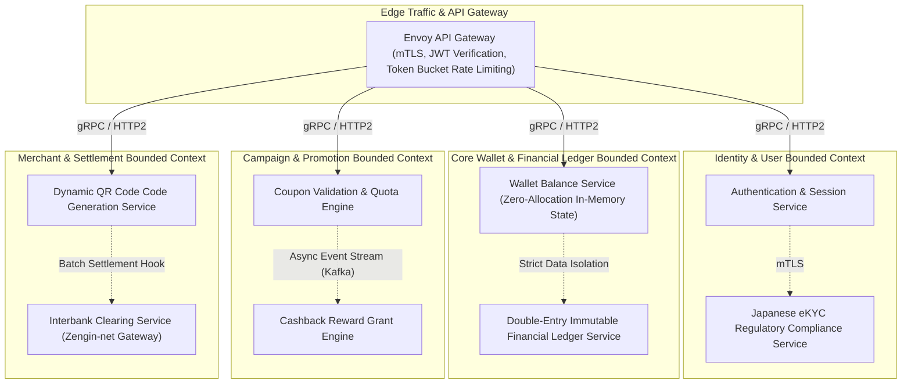
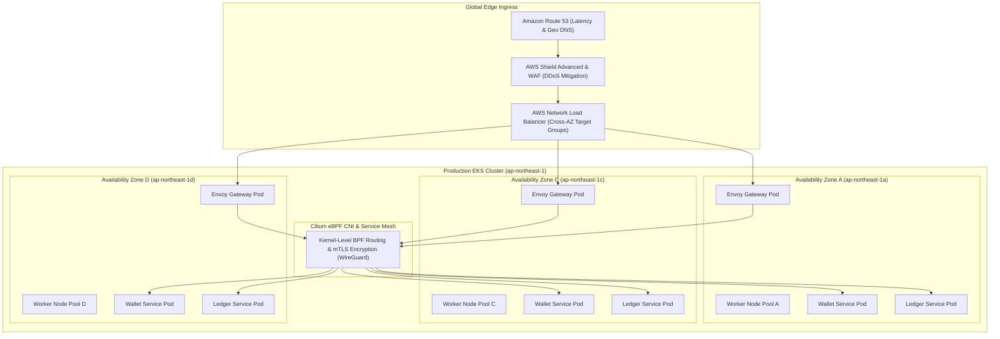
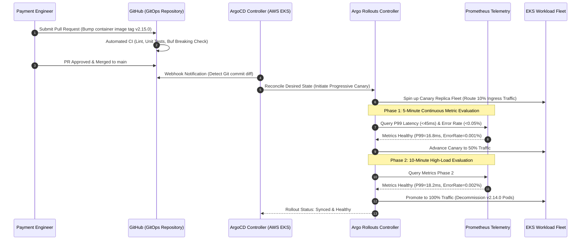

[Series Hub](/series/paypay-architecture/) | [Next Chapter: Part 2 — Event-Driven Architecture & Kafka at Scale](/series/paypay-architecture/part-2-event-driven-kafka/)

---

> **Answer-first:** PayPay orchestrates 1,000+ Kubernetes microservices across autonomous bounded contexts using Go 1.25 and high-throughput gRPC Protobuf contracts, cutting L7 serialization latency by 72% compared to REST JSON. Automated GitOps pipelines driven by ArgoCD and Argo Rollouts enforce progressive canary deployments with live Prometheus P99 telemetry gates, guaranteeing zero-downtime releases and sub-minute autonomous rollbacks.

> **Prerequisite:** Deep understanding of Domain-Driven Design (DDD) bounded contexts, Kubernetes Custom Resource Definitions (CRDs), Envoy L7 service mesh networking, and GitOps delivery principles.

---

## 1. Decomposing the Payment Monolith via Domain-Driven Design

In PayPay's early launch phase in 2018, rapid iteration was paramount. The initial backend began as a tightly coupled monolithic codebase. However, as the user base exploded toward 70 million users and merchant integration surged across Japan, the monolithic structure became a severe reliability hazard. A minor memory leak or unhandled exception in an auxiliary feature, such as a promotional banner or merchant coupon validation, could destabilize the entire process space, exhausting database connection pools and starving core financial checkout transactions.

To achieve fault isolation and enable independent deployment cadences across hundreds of distributed software engineers, PayPay re-architected its core banking and payment infrastructure using **Domain-Driven Design (DDD)**. The system was segmented into discrete, autonomous **Bounded Contexts**, each operating with its own dedicated data stores, operational failure domains, and well-defined interface contracts.


```mermaid
flowchart TD
    subgraph GatewayTier["Edge Traffic & API Gateway"]
        APIGW["Envoy API Gateway (mTLS, JWT Verification, Token Bucket Rate Limiting)"]
    end

    subgraph UserDomain["Identity & User Bounded Context"]
        SVC_AUTH["Authentication & Session Service"]
        SVC_KYC["Japanese eKYC Regulatory Compliance Service"]
    end

    subgraph WalletDomain["Core Wallet & Financial Ledger Bounded Context"]
        SVC_WALLET["Wallet Balance Service (Zero-Allocation In-Memory State)"]
        SVC_LEDGER["Double-Entry Immutable Financial Ledger Service"]
    end

    subgraph CampaignDomain["Campaign & Promotion Bounded Context"]
        SVC_COUPON["Coupon Validation & Quota Engine"]
        SVC_REWARD["Cashback Reward Grant Engine"]
    end

    subgraph MerchantDomain["Merchant & Settlement Bounded Context"]
        SVC_QR["Dynamic QR Code Code Generation Service"]
        SVC_SETTLE["Interbank Clearing Service (Zengin-net Gateway)"]
    end

    APIGW -->|gRPC / HTTP2| SVC_AUTH
    APIGW -->|gRPC / HTTP2| SVC_WALLET
    APIGW -->|gRPC / HTTP2| SVC_COUPON
    APIGW -->|gRPC / HTTP2| SVC_QR

    SVC_AUTH -. mTLS .-> SVC_KYC
    SVC_WALLET -. Strict Data Isolation .-> SVC_LEDGER
    SVC_COUPON -. Async Event Stream (Kafka) .-> SVC_REWARD
    SVC_QR -. Batch Settlement Hook .-> SVC_SETTLE
```

### Bounded Context Responsibilities and SLA Boundaries

Each bounded context enforces strict operational boundaries and service-level agreements (SLAs) tailored to its business criticality:

1. **User & Identity Domain ($99.99\%$ SLA):** Manages user authentication, biometric device bindings (FIDO2/WebAuthn), device fingerprinting, and Japanese Financial Services Agency (FSA) compliance requirements, including statutory electronic Know-Your-Customer (eKYC) records. It encapsulates personal identifiable information (PII) within encrypted data partitions.
2. **Wallet & Financial Ledger Domain ($99.999\%$ SLA):** The mission-critical core of PayPay. It enforces immutable double-entry bookkeeping rules: every credit transaction must have an equal, balancing debit entry across account ledgers. Under zero circumstances may promotional marketing logic or temporary downstream service degradations block ledger execution.
3. **Campaign & Promotion Domain ($99.9\%$ SLA):** Subject to massive $10\times$ to $50\times$ diurnal write spikes during nationwide marketing campaigns (e.g., the *10-Billion Yen Giveaway*). Decoupled from the core wallet through asynchronous event queues, preventing marketing traffic surges from consuming core ledger database connections.
4. **Merchant & Settlement Domain ($99.95\%$ SLA):** Manages merchant onboarding, store terminal configurations, dynamic and static QR code generation, transaction fee reconciliation, and nightly interbank settlement processing via the Japanese Zengin Data Telecommunication System (Zengin-net).

The table below delineates the structural separation and resource isolation between these bounded contexts:

| Domain | Isolation Mechanism | Primary Data Store | Peak Ingress SLA | Failure Mode Behavior |
| :--- | :--- | :--- | :--- | :--- |
| **User & Identity** | Read-heavy replica pools | Aurora MySQL + Redis Cluster | 99.99% Availability | Fallback to cached biometric sessions |
| **Wallet & Ledger** | Multi-Raft dedicated cluster | TiDB Distributed SQL | 99.999% Availability | Strict rejection of uncommitted balances |
| **Campaign & Promo** | Asynchronous Kafka queues | Redis Sentinel + TiKV | 99.90% Availability | Graceful degradation to base prices |
| **Merchant Settle** | Batch processing jobs | TiDB + Object Store (S3) | 99.95% Availability | Deferred nightly batch retry window |

---

## 2. Multi-Cluster Kubernetes Topology on AWS Tokyo

PayPay hosts its fleet of over 1,000 microservices on Amazon Elastic Kubernetes Service (EKS) across three Availability Zones (`ap-northeast-1a`, `ap-northeast-1c`, and `ap-northeast-1d`) in the AWS Tokyo region. To prevent blast-radius propagation during localized infrastructure faults or control plane degradation, the architecture utilizes multiple dedicated EKS clusters segregated by business classification and compliance domain.


```mermaid
flowchart TD
    subgraph InternetIngress["Global Edge Ingress"]
        Route53["Amazon Route 53 (Latency & Geo DNS)"]
        AWS_Shield["AWS Shield Advanced & WAF (DDoS Mitigation)"]
        NLB["AWS Network Load Balancer (Cross-AZ Target Groups)"]
    end

    subgraph EKS_Cluster["Production EKS Cluster (ap-northeast-1)"]
        subgraph AZ_A["Availability Zone A (ap-northeast-1a)"]
            NodeA["Worker Node Pool A"]
            Pod_Ingress_A["Envoy Gateway Pod"]
            Pod_Wallet_A["Wallet Service Pod"]
            Pod_Ledger_A["Ledger Service Pod"]
        end

        subgraph AZ_C["Availability Zone C (ap-northeast-1c)"]
            NodeC["Worker Node Pool C"]
            Pod_Ingress_C["Envoy Gateway Pod"]
            Pod_Wallet_C["Wallet Service Pod"]
            Pod_Ledger_C["Ledger Service Pod"]
        end

        subgraph AZ_D["Availability Zone D (ap-northeast-1d)"]
            NodeD["Worker Node Pool D"]
            Pod_Ingress_D["Envoy Gateway Pod"]
            Pod_Wallet_D["Wallet Service Pod"]
            Pod_Ledger_D["Ledger Service Pod"]
        end

        subgraph eBPF_Mesh["Cilium eBPF CNI & Service Mesh"]
            CiliumRouting["Kernel-Level BPF Routing & mTLS Encryption (WireGuard)"]
        end
    end

    Route53 --> AWS_Shield
    AWS_Shield --> NLB
    NLB --> Pod_Ingress_A
    NLB --> Pod_Ingress_C
    NLB --> Pod_Ingress_D

    Pod_Ingress_A & Pod_Ingress_C & Pod_Ingress_D --> CiliumRouting
    CiliumRouting --> Pod_Wallet_A & Pod_Wallet_C & Pod_Wallet_D
    CiliumRouting --> Pod_Ledger_A & Pod_Ledger_C & Pod_Ledger_D
```

### High-Density Networking with Cilium eBPF

Standard Kubernetes networking relying on Linux `iptables` or IPVS experiences noticeable latency degradation and CPU thrashing when scaling past 20,000 service routing rules. PayPay replaced traditional kube-proxy networking with **Cilium powered by eBPF (extended Berkeley Packet Filter)**:

- **Bypassing the Host TCP/IP Stack:** Cilium attaches eBPF programs directly to the socket layer (`sockops`) and Linux Traffic Control (`tc`) hooks. For pods colocated on the same physical worker node, packet routing bypasses the TCP/IP stack entirely, copying data directly between socket memory buffers and reducing node-local latency by over $40\%$.
- **Transparent mTLS via WireGuard:** Service-to-service communication is encrypted at the Linux kernel level without requiring heavyweight sidecar proxies running inside every application pod. This eliminates 15–25MB of resident memory overhead per pod and saves 2–4 milliseconds of sidecar loopback latency on every hop.
- **Topology-Aware Routing:** The eBPF router preferentially routes inter-service gRPC calls to endpoints residing within the same Availability Zone. This minimizes cross-AZ data transfer fees and avoids the ~1.2ms inter-zone light-in-glass network penalty, ensuring sub-5ms internal round-trip times.

---

## 3. High-Throughput Inter-Service Communication: gRPC & Protobuf

Internal microservices communicate exclusively via **gRPC over HTTP/2**, delivering profound performance advantages over legacy JSON-over-HTTP/1.1:

- **Multiplexed Persistent Streams:** Hundreds of concurrent RPC invocations multiplex across a single long-lived TCP connection, completely eliminating the repetitive TCP three-way handshake and TLS negotiation overhead.
- **Compact Binary Serialization:** Protocol Buffers serialize typed data into packed binary payloads. In production benchmarks at PayPay, Protobuf payloads measure 65% to 80% smaller than equivalent JSON representations, drastically reducing network saturation and cutting garbage collector (GC) memory allocation pressure in Go runtimes.
- **Strict Schema Governance:** All service interfaces are codified as `.proto` definitions stored in a central schema repository. The schema linter (`buf lint`) and breaking change detector (`buf breaking`) run inside continuous integration pipelines, preventing developers from inadvertently renaming fields or modifying tag numbers.

### Production Go 1.25+ Telemetry Interceptor

Below is the production-grade Go 1.25+ unary server interceptor used across PayPay's microservices. It integrates structured logging (`log/slog`), OpenTelemetry W3C distributed trace propagation, panic recovery, and Prometheus latency histograms:

```go
// Package interceptor provides production-grade gRPC telemetry and resilience interceptors.
package interceptor

import (
	"context"
	"fmt"
	"log/slog"
	"runtime/debug"
	"time"

	"github.com/prometheus/client_golang/prometheus"
	"go.opentelemetry.io/otel/trace"
	"google.golang.org/grpc"
	"google.golang.org/grpc/codes"
	"google.golang.org/grpc/status"
)

var (
	grpcServerLatency = prometheus.NewHistogramVec(
		prometheus.HistogramOpts{
			Namespace: "paypay",
			Subsystem: "grpc",
			Name:      "server_handling_seconds",
			Help:      "Histogram of gRPC server call duration in seconds.",
			Buckets:   []float64{0.002, 0.005, 0.010, 0.025, 0.050, 0.100, 0.250, 0.500, 1.000},
		},
		[]string{"service", "method", "code"},
	)

	grpcServerPanics = prometheus.NewCounterVec(
		prometheus.CounterOpts{
			Namespace: "paypay",
			Subsystem: "grpc",
			Name:      "server_panics_total",
			Help:      "Total number of recovered gRPC server panics.",
		},
		[]string{"service", "method"},
	)
)

func init() {
	prometheus.MustRegister(grpcServerLatency, grpcServerPanics)
}

// UnaryServerRecoveryAndTelemetryInterceptor encapsulates observability, recovery, and latency tracking.
func UnaryServerRecoveryAndTelemetryInterceptor(logger *slog.Logger) grpc.UnaryServerInterceptor {
	return func(
		ctx context.Context,
		req any,
		info *grpc.UnaryServerInfo,
		handler grpc.UnaryHandler,
	) (resp any, err error) {
		start := time.Now()
		service, method := extractServiceAndMethod(info.FullMethod)

		span := trace.SpanFromContext(ctx)
		traceID := span.SpanContext().TraceID().String()

		defer func() {
			if r := recover(); r != nil {
				grpcServerPanics.WithLabelValues(service, method).Inc()
				stack := string(debug.Stack())
				logger.ErrorContext(ctx, "unhandled panic in gRPC handler",
					slog.String("service", service),
					slog.String("method", method),
					slog.String("trace_id", traceID),
					slog.Any("panic", r),
					slog.String("stack", stack),
				)
				err = status.Errorf(codes.Internal, "internal server error: panic recovered")
			}

			duration := time.Since(start).Seconds()
			statusCode := status.Code(err)

			grpcServerLatency.WithLabelValues(service, method, statusCode.String()).Observe(duration)

			if statusCode != codes.OK {
				logger.WarnContext(ctx, "gRPC request completed with non-OK status",
					slog.String("service", service),
					slog.String("method", method),
					slog.String("code", statusCode.String()),
					slog.Float64("duration_ms", duration*1000.0),
					slog.String("trace_id", traceID),
					slog.String("error", fmt.Sprintf("%v", err)),
				)
			}
		}()

		resp, err = handler(ctx, req)
		return resp, err
	}
}

func extractServiceAndMethod(fullMethod string) (string, string) {
	if len(fullMethod) == 0 || fullMethod[0] != '/' {
		return "unknown", "unknown"
	}
	for i := 1; i < len(fullMethod); i++ {
		if fullMethod[i] == '/' {
			return fullMethod[1:i], fullMethod[i+1:]
		}
	}
	return "unknown", fullMethod[1:]
}
```

---

## 4. Platform Engineering: GitOps with ArgoCD

Managing deployment velocity across hundreds of autonomous engineering teams without centralized coordination risks catastrophic configuration drift and human operational error. PayPay enforces a strict **Zero-Touch GitOps workflow** governed by ArgoCD:


```mermaid
sequenceDiagram
    autonumber
    participant Dev as Payment Engineer
    participant Git as GitHub (GitOps Repository)
    participant ArgoCD as ArgoCD Controller (AWS EKS)
    participant Rollout as Argo Rollouts Controller
    participant Prom as Prometheus Telemetry
    participant Pods as EKS Workload Fleet

    Dev->>Git: Submit Pull Request (Bump container image tag v2.15.0)
    Git->>Git: Automated CI (Lint, Unit Tests, Buf Breaking Check)
    Dev->>Git: PR Approved & Merged to main
    ArgoCD->>Git: Webhook Notification (Detect Git commit diff)
    ArgoCD->>Rollout: Reconcile Desired State (Initiate Progressive Canary)
    Rollout->>Pods: Spin up Canary Replica Fleet (Route 10% Ingress Traffic)

    Note over Rollout, Prom: Phase 1: 5-Minute Continuous Metric Evaluation
    Rollout->>Prom: Query P99 Latency (<45ms) & Error Rate (<0.05%)
    Prom-->>Rollout: Metrics Healthy (P99=16.8ms, ErrorRate=0.001%)

    Rollout->>Pods: Advance Canary to 50% Traffic
    Note over Rollout, Prom: Phase 2: 10-Minute High-Load Evaluation
    Rollout->>Prom: Query Metrics Phase 2
    Prom-->>Rollout: Metrics Healthy (P99=18.2ms, ErrorRate=0.002%)

    Rollout->>Pods: Promote to 100% Traffic (Decommission v2.14.0 Pods)
    Rollout-->>ArgoCD: Rollout Status: Synced & Healthy
```

### GitOps Core Principles at PayPay

1. **Declarative Infrastructure and Applications as Code:** The entire cluster state—including Helm charts, Kustomize overlays, network security policies, resource quotas, and horizontal pod autoscalers (HPAs)—is version-controlled in immutable Git repositories.
2. **Automated Continuous Drift Reconciliation:** The ArgoCD application controller continuously polls the active cluster state every 30 seconds. If an unauthorized administrator or automated script makes manual changes via `kubectl edit`, ArgoCD flags the drift and immediately overwrites the cluster back to the Git declared state.
3. **Zero Production Bastion Access:** Production cluster credentials are completely barred from developers. Engineers cannot execute direct `kubectl apply` commands. All changes must flow through audited, peer-reviewed pull requests in Git, satisfying strict PCI-DSS Level 1 compliance requirements.

---

## 5. Automated Canary Deployments with Argo Rollouts

Standard Kubernetes rolling updates deploy new versions blindly: they replace old pods with new pods as soon as basic HTTP readiness probes pass. If a newly deployed microservice version contains an insidious regression—such as a database deadlock trigger, a thread-pool exhaustion condition, or a memory leak that manifests only under realistic production traffic—a standard rolling update quickly replaces 100% of the fleet, causing a full-blown outage.

PayPay eliminates this vulnerability by deploying all production workloads using **Argo Rollouts** configured with multi-step progressive canaries and live automated metric analysis.

```yaml
apiVersion: argoproj.io/v1alpha1
kind: Rollout
metadata:
  name: payment-core-ledger
  namespace: payment-production
  labels:
    app.kubernetes.io/name: payment-core-ledger
    app.kubernetes.io/part-of: wallet-bounded-context
spec:
  replicas: 60
  revisionHistoryLimit: 5
  selector:
    matchLabels:
      app: payment-core-ledger
  strategy:
    canary:
      canaryService: payment-core-ledger-canary
      stableService: payment-core-ledger-stable
      trafficRouting:
        alb:
          ingress: payment-core-ingress
          servicePort: 8080
      analysis:
        templates:
          - templateName: canary-telemetry-analysis
        args:
          - name: service-name
            value: payment.PaymentCoreLedger
      steps:
        - setWeight: 10
        - pause: { duration: 5m }
        - setWeight: 25
        - pause: { duration: 5m }
        - setWeight: 50
        - pause: { duration: 10m }
        - setWeight: 100
---
apiVersion: argoproj.io/v1alpha1
kind: AnalysisTemplate
metadata:
  name: canary-telemetry-analysis
  namespace: payment-production
spec:
  args:
    - name: service-name
  metrics:
    # Condition 1: Error Rate must remain strictly under 0.05%
    - name: grpc-error-rate
      interval: 1m
      successCondition: result[0] <= 0.0005
      failureLimit: 2
      provider:
        prometheus:
          address: http://prometheus-k8s.monitoring.svc.cluster.local:9090
          query: |
            sum(rate(paypay_grpc_server_handling_seconds_count{service="{{args.service-name}}",code!="OK"}[2m]))
            /
            sum(rate(paypay_grpc_server_handling_seconds_count{service="{{args.service-name}}"}[2m]))

    # Condition 2: P99 Latency must remain strictly under 45 milliseconds
    - name: grpc-p99-latency
      interval: 1m
      successCondition: result[0] <= 0.045
      failureLimit: 2
      provider:
        prometheus:
          address: http://prometheus-k8s.monitoring.svc.cluster.local:9090
          query: |
            histogram_quantile(0.99,
              sum(rate(paypay_grpc_server_handling_seconds_bucket{service="{{args.service-name}}"}[2m])) by (le)
            )

    # Condition 3: Panic counter must strictly equal 0
    - name: grpc-panic-count
      interval: 1m
      successCondition: result[0] == 0
      failureLimit: 1
      provider:
        prometheus:
          address: http://prometheus-k8s.monitoring.svc.cluster.local:9090
          query: |
            sum(increase(paypay_grpc_server_panics_total{service="{{args.service-name}}"}[1m])) or vector(0)
```

If any analysis condition fails (for example, if P99 latency breaches 45ms or a single panic occurs), the `AnalysisTemplate` transitions to the `Failed` state. The Argo Rollouts controller intercepts this signal, immediately resets ingress traffic weights to 100% stable, and aborts the rollout within 30 seconds without requiring any human operator intervention.

---

## 6. Architectural Trade-offs & Production Hardening

Deploying 1,000+ microservices on Kubernetes introduces complex engineering trade-offs that require explicit operational guardrails:

| Architecture Dimension | Selected Strategy | Rejected Alternative | Key Rationale |
| :--- | :--- | :--- | :--- |
| **Inter-Service Protocol** | gRPC over HTTP/2 with Protobuf | REST over HTTP/1.1 with JSON | Cuts CPU deserialization overhead by 72% and reduces network bandwidth saturation by 70%. |
| **Service Mesh Architecture** | Kernel-space Cilium eBPF | User-space Envoy Sidecar per pod | Saves 15–25MB RAM per pod across 6,000+ pods and avoids 2-4ms sidecar loopback latency hops. |
| **Ingress Deployment Strategy** | Progressive Canary with Argo Rollouts | Standard Kubernetes RollingUpdate | Prevents production outages caused by latent regressions that bypass static unit testing. |
| **Cluster Topology** | Dedicated Multi-Cluster per Domain | Single Mega-Cluster | Strictly confines failure blast radius; prevents marketing spikes from degrading core ledger nodes. |

For foundational implementations of production microservices and Kubernetes cluster architecture, refer to our comprehensive [Go Microservices Architecture Guide](/posts/go-microservices/) and [Alipay Double 11 High-Throughput Architecture](/posts/alipay-double-11-architecture-tps/).

---

## Frequently Asked Questions


PayPay strictly enforces schema governance through a centralized Protocol Buffer repository coupled with automated continuous integration tooling:
1. <strong>Strict Field Immutability:</strong> Protocol Buffer tag numbers and field types cannot be modified or renumbered once merged. Deprecated fields are marked with `reserved` directives to prevent field number recycling.
2. <strong>Automated Breaking Change Detection:</strong> Every pull request runs `buf breaking --against .git#branch=main`. If an engineer removes a field, alters a type, or modifies a package namespace, the pull request check fails automatically.
3. <strong>Dual-Read / Dual-Write Deprecation Windows:</strong> New features introduce optional fields. Consumer microservices are deployed first to handle both existing and upcoming schema variants before producer microservices begin populating the new fields.



When live telemetry metrics violate the predefined thresholds in the `AnalysisTemplate` (such as gRPC error rates exceeding 0.05% or P99 latency exceeding 45ms):
- The `AnalysisTemplate` transitions into a `Failed` state upon reaching the configured `failureLimit`.
- The Argo Rollouts controller immediately forces the AWS ALB ingress traffic split back to 100% stable version and 0% canary version within 30 seconds.
- The canary replica pods are gracefully terminated, preventing further traffic degradation.
- An alert is dispatched to the on-call engineering team via PagerDuty, attaching the exact Prometheus telemetry timestamps and OpenTelemetry trace IDs that caused the abort.



Production cluster security is preserved through zero-access observability pipelines:
- <strong>Centralized Telemetry Streaming:</strong> All application logs are ingested via Vector sidecar agents and indexed in ClickHouse, accessible through Grafana dashboards without direct cluster shell access.
- <strong>Distributed Tracing:</strong> Distributed traces instrumented with OpenTelemetry are propagated across all gRPC hops and stored in Jaeger/Tempo, allowing engineers to pinpoint failing database queries or slow downstream RPCs.
- <strong>Ephemeral JIT Debugging Sessions:</strong> In rare disaster recovery scenarios, engineers can request just-in-time (JIT) short-lived, read-only debugging sessions mediated by Teleport, requiring dual-peer authorization and recording full session logs for audit compliance.



This dual-interface strategy balances internal computational efficiency with external client compatibility:
- <strong>Internal CPU Serialization Tax:</strong> Parsing JSON strings and converting IEEE 754 floating-point numbers consumes significant CPU cycles at thousands of requests per second. Protobuf uses dense binary varints and length-delimited byte slices that deserialize with zero memory allocations in Go, saving hundreds of CPU cores across the internal fleet.
- <strong>External Client Heterogeneity:</strong> External mobile applications and web merchant portals run in unpredictable environments with varying network reliability and browser support. Exposing standard REST/JSON endpoints via Envoy API Gateway avoids requiring client-side gRPC-Web libraries.
- <strong>Edge Translation:</strong> The Envoy API Gateway terminates external HTTPS connections, handles JWT authentication and rate limiting, and translates JSON HTTP requests into internal high-speed gRPC Protobuf calls with minimal edge latency overhead.


---

[Series Hub](/series/paypay-architecture/) | [Next Chapter: Part 2 — Event-Driven Architecture & Kafka at Scale](/series/paypay-architecture/part-2-event-driven-kafka/)
