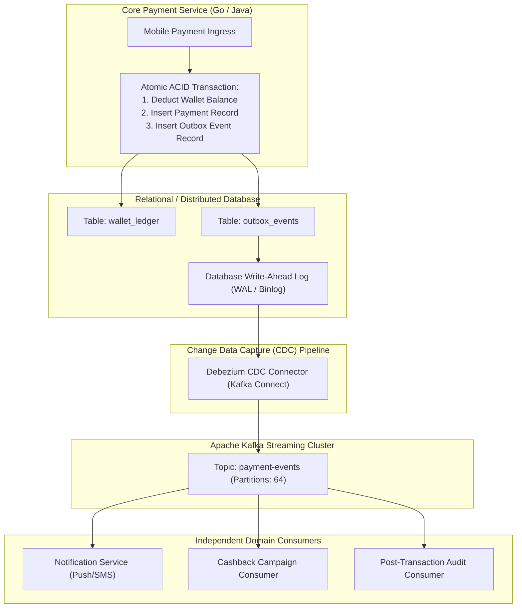
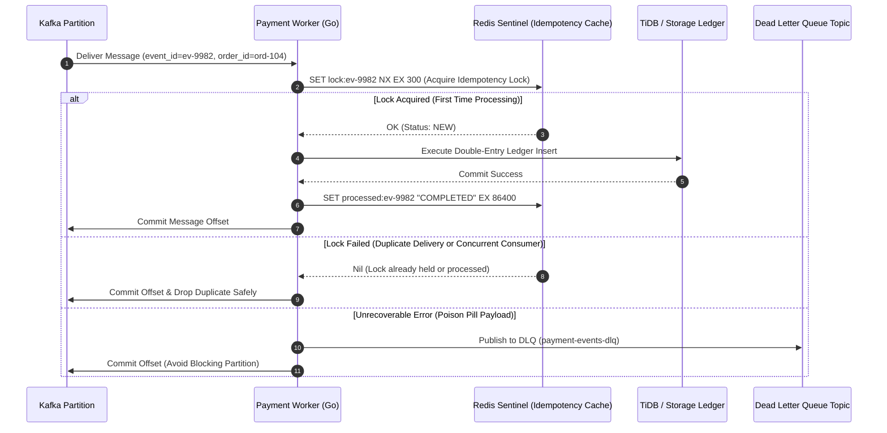

> **Multi-Language Edition:** This chapter is also available in Vietnamese at [Phần 2: Kiến Trúc Hướng Sự Kiện — Quản Trị Kafka Siêu Quy Mô, Transactional Outbox & Idempotency (learn.tanhdev.com)](https://learn.tanhdev.com/series/paypay-architecture/part-2-event-driven-kafka/).

[Previous Chapter: Part 1 — Microservices & GitOps Blueprint](/series/paypay-architecture/part-1-microservices-gitops/) | [Series Hub](/series/paypay-architecture/) | [Next Chapter: Part 3 — Data Infrastructure: From Aurora to TiDB](/series/paypay-architecture/part-3-data-layer-tidb/)

---

> **Answer-First:** Handling sudden promotional payment spikes of thousands of TPS requires complete decoupling of synchronous ingress requests from asynchronous ledger persistence. PayPay implements an **Event-Driven Architecture centered on Apache Kafka**. To guarantee zero financial discrepancies between the database and event streams, PayPay utilizes the **Transactional Outbox Pattern with Debezium CDC**, avoiding dual-write race conditions. Downstream consumer microservices enforce **strict idempotency via Redis distributed locks and UUIDv7 idempotency keys**, paired with isolated **Dead Letter Queues (DLQ)** to prevent poisoned payloads from blocking partition processing.

---

## 1. The Dual-Write Hazard in High-Concurrency Payments

A naive payment microservice implementation frequently suffers from the classic **Dual-Write Hazard**:

```
The Distributed Dual-Write Dilemma:
Step 1: DB.Begin() ──► UPDATE balance ──► INSERT payment ──► DB.Commit() (SUCCESS)
Step 2: kafkaProducer.Send(PaymentCompletedEvent) ──► NETWORK TIMEOUT / CRASH (FAILED!)
Result: Customer money is deducted, but notification and cashback events are lost forever!
```

If you reverse the order (publishing to Kafka before committing to the database), a database rollback causes the event to be published for a transaction that never officially occurred, triggering catastrophic financial over-crediting.

---

## 2. The Transactional Outbox Pattern with Debezium CDC

To guarantee atomicity between local database state changes and message broker publishing, PayPay employs the **Transactional Outbox Pattern**:



### Architectural Mechanics:
1. **Local Atomic Commit:** When a payment request succeeds, the service commits both the balance deduction and an event payload into an `outbox_events` table within the **same local database transaction**.
2. **Log-Based CDC Ingestion:** A cluster of Debezium Kafka Connect workers tail the database Write-Ahead Log (WAL) or binlog stream. Whenever a new outbox entry is committed, Debezium immediately translates it into a Kafka message without impacting database write performance.
3. **Partition Key Routing:** Events are keyed by `user_id` or `merchant_id`. Kafka guarantees strictly ordered event delivery for all operations targeting that specific user.

---

## 3. Distributed Idempotency & Zero Double-Spending

In any distributed messaging architecture, network partitions and consumer restarts result in **at-least-once message delivery**. Downstream consumers must guarantee that processing the exact same payment event multiple times yields the exact same state without double deductions.



### Production Go Implementation: Idempotent Event Consumer

```go
// Package consumer provides high-throughput idempotent event processing for payment events.
package consumer

import (
	"context"
	"encoding/json"
	"errors"
	"fmt"
	"time"

	"github.com/go-redis/redis/v8"
)

type PaymentCompletedEvent struct {
	EventID   string    `json:"event_id"`
	PaymentID string    `json:"payment_id"`
	UserID    int64     `json:"user_id"`
	Amount    float64   `json:"amount"`
	Timestamp time.Time `json:"timestamp"`
}

type IdempotentProcessor struct {
	redisClient *redis.Client
}

// ProcessPaymentEvent ensures exactly-once execution invariants via Redis distributed locks.
func (p *IdempotentProcessor) ProcessPaymentEvent(ctx context.Context, msgPayload []byte) error {
	var event PaymentCompletedEvent
	if err := json.Unmarshal(msgPayload, &event); err != nil {
		return fmt.Errorf("poison pill detected, unmarshal failed: %w", err)
	}

	lockKey := fmt.Sprintf("lock:idempotency:%s", event.EventID)
	processedKey := fmt.Sprintf("processed:event:%s", event.EventID)

	// 1. Check if event was already processed previously (24-hour retention)
	alreadyProcessed, err := p.redisClient.Exists(ctx, processedKey).Result()
	if err != nil {
		return fmt.Errorf("redis check failed: %w", err)
	}
	if alreadyProcessed > 0 {
		// Safely acknowledge: event already successfully committed
		return nil
	}

	// 2. Acquire non-blocking distributed lock (5-minute TTL)
	acquired, err := p.redisClient.SetNX(ctx, lockKey, "IN_FLIGHT", 5*time.Minute).Result()
	if err != nil {
		return fmt.Errorf("lock acquisition error: %w", err)
	}
	if !acquired {
		return errors.New("concurrent execution in progress: retry later")
	}
	defer p.redisClient.Del(ctx, lockKey)

	// 3. Execute business ledger mutation (e.g. credit cashback or send push)
	if err := executeLedgerMutation(ctx, event); err != nil {
		return fmt.Errorf("business execution failed: %w", err)
	}

	// 4. Mark permanently processed
	if err := p.redisClient.Set(ctx, processedKey, "COMPLETED", 24*time.Hour).Err(); err != nil {
		return fmt.Errorf("failed to record idempotency completion: %w", err)
	}

	return nil
}

func executeLedgerMutation(ctx context.Context, event PaymentCompletedEvent) error {
	// Simulated ledger persistence logic
	return nil
}
```

---

## 4. Consumer Group Rebalancing & Dead Letter Queue (DLQ) Governance

Under massive campaign spikes, autoscaling consumer pods can trigger **Consumer Group Rebalance Storms**. During a standard eager rebalance, all consumers stop processing for several seconds, leading to a catastrophic backlog surge.

PayPay mitigates this with two production configurations:

1. **Cooperative Sticky Assignor:**  
   By configuring `partition.assignment.strategy = org.apache.kafka.clients.consumer.CooperativeStickyAssignor`, Kafka migrates only the specific partitions being moved to new pods without interrupting the remaining consumers.
2. **Dead Letter Queue (DLQ) Isolation:**  
   If a consumer encounters a malformed payload (poison pill) or unrecoverable business failure, it attempts up to 3 retries with exponential backoff. If it still fails, the event is routed to `payment-events-dlq` along with error stack metadata, and the partition offset is committed. This ensures a single corrupted event never halts payment processing for thousands of legitimate users.

---

## Frequently Asked Questions


Because outbox records are inserted into the local database within the payment transaction, business transactions continue seamlessly even if Kafka suffers a multi-broker outage. The messages remain safely persisted in the database outbox table. As soon as the Kafka cluster recovers, the Debezium CDC workers resume reading from the database binlog offset, streaming all buffered transactions to Kafka without data loss.



PayPay implements a two-stage TTL model:
1. <strong>In-Flight Lock TTL (5 minutes):</strong> Prevents orphaned locks if a consumer pod crashes mid-execution, allowing another consumer to retry after timeout.
2. <strong>Completed State TTL (24 to 72 hours):</strong> Payment events typically retry within minutes; retaining completed keys for 24 hours covers 99.999% of replay attempts. Long-term idempotency (>3 days) is delegated to primary key unique constraints on the relational database ledger.



In the default `RangeAssignor` or `RoundRobinAssignor`, adding or removing a consumer pod forces every single consumer in the group to revoke all partition assignments, halting consumption globally for several seconds. Under high traffic, this pause causes incoming messages to pile up, triggering further lag alerts and autoscaling loops. The `CooperativeStickyAssignor` performs incremental rebalancing: healthy pods continue processing uninterrupted while only reassigned partitions undergo handoff.


---

[Previous Chapter: Part 1 — Microservices & GitOps Blueprint](/series/paypay-architecture/part-1-microservices-gitops/) | [Series Hub](/series/paypay-architecture/) | [Next Chapter: Part 3 — Data Infrastructure: From Aurora to TiDB](/series/paypay-architecture/part-3-data-layer-tidb/)
