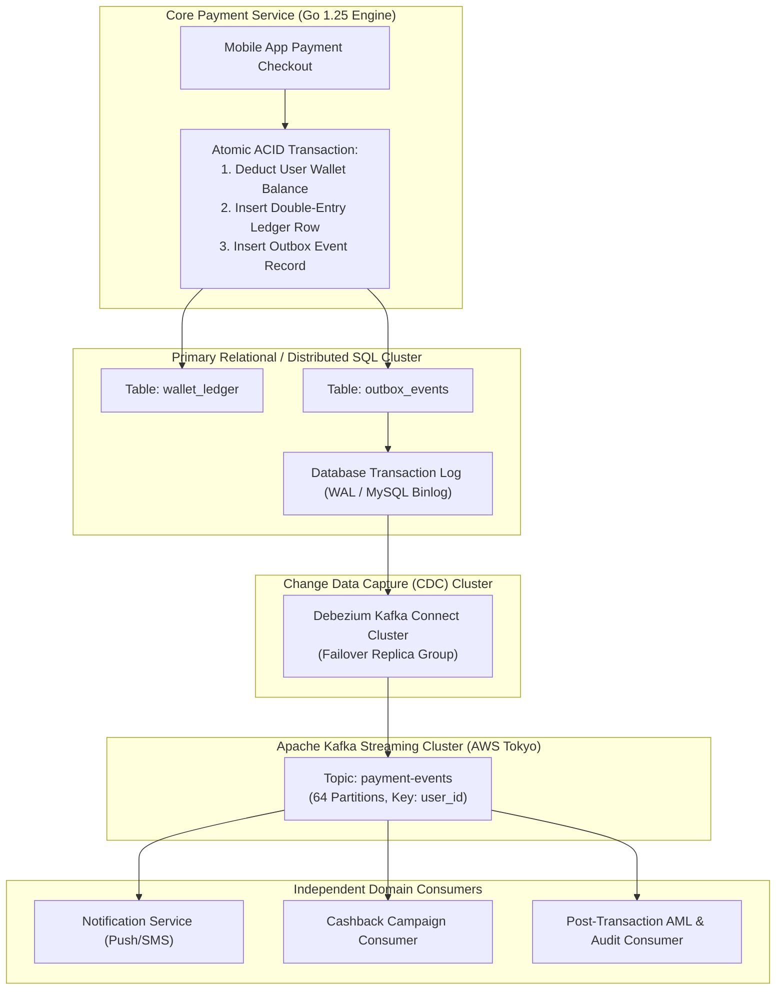
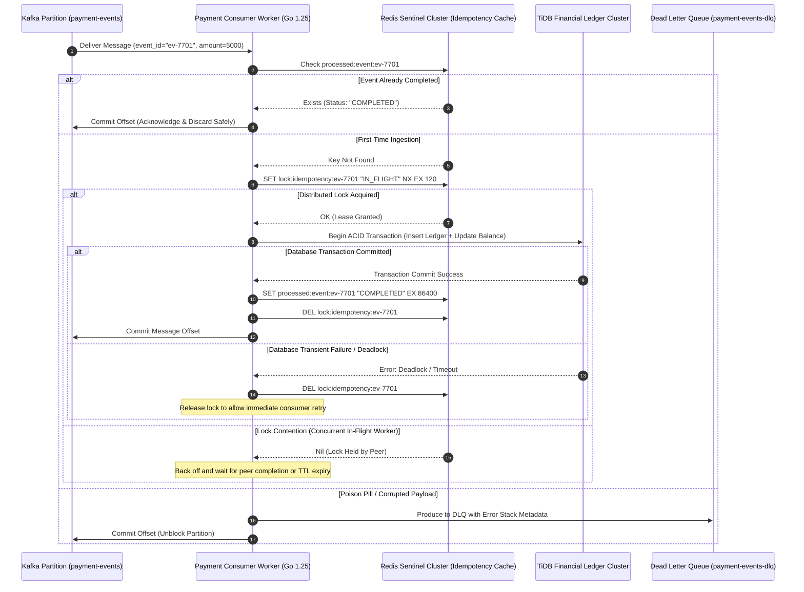

[Previous Chapter: Part 1 — Microservices & GitOps Blueprint](/series/paypay-architecture/part-1-microservices-gitops/) | [Series Hub](/series/paypay-architecture/) | [Next Chapter: Part 3 — Data Infrastructure: From Aurora to TiDB](/series/paypay-architecture/part-3-data-layer-tidb/)

---

> **Answer-first:** PayPay guarantees zero event loss and strict ledger decoupling under promotional surges exceeding 1,250 TPS by combining the **Transactional Outbox pattern** with Debezium CDC and Apache Kafka. Consumer groups utilize the **CooperativeStickyAssignor** to prevent rebalance stop-the-world pauses, while a two-stage Redis distributed lock provides exactly-once processing semantics before persisting updates into the database.

> **Prerequisite:** Working knowledge of Apache Kafka log partitioning, consumer group protocols, Change Data Capture (CDC) via Debezium, and distributed locking semantics.

---

## 1. The Dual-Write Hazard in High-Concurrency Financial Systems

In payment engineering, one of the most dangerous architectural anti-patterns is the **Dual-Write Hazard**. When an incoming checkout request arrives, a payment microservice must typically perform two actions: mutate its local relational database state (deduct wallet balance, record financial ledger entry) and notify downstream services (reward cashback, dispatch merchant push notifications, trigger risk scoring).

Attempting to update both systems synchronously in application code creates an impossible distributed consistency dilemma:

```
Scenario A (Database Commit First):
1. DB.Begin()
2. UPDATE wallet SET balance = balance - 1000 WHERE id = 42;
3. INSERT INTO payments (id, amount) VALUES ('pay-101', 1000);
4. DB.Commit() -> SUCCESS!
5. kafkaProducer.Send(PaymentCompletedEvent) -> NETWORK TIMEOUT OR OOM CRASH!
Result: The customer's money is debited, but downstream notification and cashback rewards are permanently lost.

Scenario B (Message Broker First):
1. kafkaProducer.Send(PaymentCompletedEvent) -> SUCCESS!
2. DB.Begin()
3. UPDATE wallet SET balance = balance - 1000 WHERE id = 42;
4. DB.Commit() -> DEADLOCK OR UNIQUE CONSTRAINT VIOLATION! -> ROLLBACK!
Result: Downstream consumers credit cashback and grant merchant goods for a payment that never officially succeeded in the ledger.
```

In a distributed environment without two-phase commit (2PC)—which is deliberately avoided due to high latency, blocking locks, and coordinator single points of failure—guaranteeing consistency between storage engines and message brokers requires an architectural pattern that guarantees single-source atomic state transitions.

---

## 2. The Transactional Outbox Pattern with Debezium CDC

PayPay resolves the dual-write hazard by implementing the **Transactional Outbox Pattern** backed by log-based Change Data Capture (CDC) using Debezium and Apache Kafka:


```mermaid
flowchart TD
    subgraph PaymentService["Core Payment Service (Go 1.25 Engine)"]
        CLIENT["Mobile App Payment Checkout"]
        BIZ_TX["Atomic ACID Transaction:<br/>1. Deduct User Wallet Balance<br/>2. Insert Double-Entry Ledger Row<br/>3. Insert Outbox Event Record"]
    end

    subgraph DatabaseTier["Primary Relational / Distributed SQL Cluster"]
        LEDGER_TBL["Table: wallet_ledger"]
        OUTBOX_TBL["Table: outbox_events"]
        WAL["Database Transaction Log (WAL / MySQL Binlog)"]
    end

    subgraph IngestionPipeline["Change Data Capture (CDC) Cluster"]
        DEBEZIUM["Debezium Kafka Connect Cluster<br/>(Failover Replica Group)"]
    end

    subgraph EventStream["Apache Kafka Streaming Cluster (AWS Tokyo)"]
        TOPIC_PAY["Topic: payment-events<br/>(64 Partitions, Key: user_id)"]
    end

    subgraph DownstreamConsumers["Independent Domain Consumers"]
        CONS_NOTIF["Notification Service (Push/SMS)"]
        CONS_REWARD["Cashback Campaign Consumer"]
        CONS_RISK["Post-Transaction AML & Audit Consumer"]
    end

    CLIENT --> BIZ_TX
    BIZ_TX --> LEDGER_TBL
    BIZ_TX --> OUTBOX_TBL
    OUTBOX_TBL --> WAL
    WAL --> DEBEZIUM
    DEBEZIUM --> TOPIC_PAY

    TOPIC_PAY --> CONS_NOTIF
    TOPIC_PAY --> CONS_REWARD
    TOPIC_PAY --> CONS_RISK
```

### Architectural Mechanics and Invariants

1. **Local Atomic Database Invariant:** When a user authorizes a payment, the core service opens a standard local ACID transaction. It writes the balance deduction, the ledger record, and an event row into an `outbox_events` table in the **exact same database transaction**. Either all three records commit together to disk, or none do.
2. **Log-Based Asynchronous Capture:** Rather than polling the database with periodic `SELECT * FROM outbox_events WHERE processed = false` queries (which induces heavy table scan locks and CPU thrashing under high concurrency), Debezium connects directly as a replication replica to the database binary log (MySQL binlog or TiKV CDC stream). Debezium reads committed row mutations directly from the transaction log without adding query load to the database.
3. **Partition Key Routing for Strict Ordering:** Debezium extracts the event payload and publishes it to the `payment-events` Kafka topic. The message key is explicitly assigned to `user_id` or `wallet_id`. Because Kafka guarantees strict FIFO ordering within any single partition, all events belonging to the same user are processed in sequential chronological order.

The table below summarizes the operational trade-offs of the Log-Based Outbox approach compared to polling-based alternatives:

| Outbox Architecture | Database Read Overhead | End-to-End Latency | Failure Recovery Complexity | High-Load Scalability |
| :--- | :--- | :--- | :--- | :--- |
| **Log-Based CDC (Debezium)** | Near zero (reads binlog stream) | Sub-50 milliseconds | Low (relies on binlog offsets) | Linearly scalable to 50,000+ TPS |
| **Table Polling Outbox** | Extreme (constant polling queries) | 1–5 seconds | High (requires distributed locks) | Degrades severely past 1,000 TPS |
| **Direct Application Dual-Write**| Zero | Immediate | Unrecoverable data corruption | Fragile under network partitions |

---

## 3. Consumer Group Rebalance Mechanics: Eager vs. Cooperative Sticky

In high-volume streaming architectures, consumer pod autoscaling is essential to absorb viral traffic surges during nationwide promotions. However, improper Kafka consumer configuration can lead to catastrophic **Rebalance Storms**, where the entire consumer fleet freezes and message lag grows exponentially.


```mermaid
flowchart TD
    subgraph EagerRebalance["Legacy Eager Rebalance (Stop-the-World)"]
        E_T1["T0: Consumer Group has 3 pods handling 64 partitions"]
        E_T2["T1: Autoscale triggers: Pod 4 joins the group"]
        E_T3["T2: STOP-THE-WORLD! All 3 pods revoke ALL partitions"]
        E_T4["T3: Group Coordinator recalculates entire partition assignment"]
        E_T5["T4: All 4 pods reconnect and re-initialize state (2-10s downtime)"]
        E_T1 --> E_T2 --> E_T3 --> E_T4 --> E_T5
    end

    subgraph CooperativeSticky["Cooperative Sticky Rebalance (Incremental & Zero-Downtime)"]
        C_T1["T0: Consumer Group has 3 pods handling 64 partitions"]
        C_T2["T1: Autoscale triggers: Pod 4 joins the group"]
        C_T3["T2: Only partitions being reassigned (e.g., 16 partitions) are revoked"]
        C_T4["T3: The 48 unaffected partitions continue processing without pause!"]
        C_T5["T4: Pod 4 seamlessly assumes ownership of the 16 migrated partitions"]
        C_T1 --> C_T2 --> C_T3 --> C_T4 --> C_T5
    end
```

### Eliminating Stop-the-World Latency

In Kafka's legacy rebalance protocol (used by `RangeAssignor` or `RoundRobinAssignor`), any membership change—such as a single pod restarting, failing a liveness probe, or scaling up—forces every consumer in the group to immediately release all of its assigned partitions. All processing stops globally until the Kafka Group Coordinator reassigns partitions and every consumer confirms its new lease. Under high throughput (1,250+ TPS), a 5-second rebalance pause results in 6,000+ unprocessed messages backing up in Kafka, triggering downstream timeouts and cascading pod crashes.

PayPay eliminates this vulnerability by mandating the **CooperativeStickyAssignor**:
- **Incremental Two-Phase Rebalance:** Instead of revoking all partitions wholesale, consumers continue processing active partitions during the rebalance protocol. Only the specific partitions earmarked for migration are temporarily revoked and reassigned to the newly added pod.
- **Sticky Partition Affinity:** Partitions remain bound to their existing consumer pods across rebalances whenever possible. This preserves localized in-memory caches, reduces JVM/Go heap churn, and ensures zero message processing starvation during horizontal pod autoscaling events.

---

## 4. Distributed Idempotency & Exactly-Once Semantics

Because network interruptions between Kafka consumers and the broker can cause offset commits to fail, Kafka guarantees **at-least-once delivery**. A consumer pod may crash immediately after processing an event but before acknowledging its offset, causing Kafka to re-deliver the exact same message to another pod upon recovery. Downstream services must enforce strict idempotency to prevent duplicate ledger mutations.


```mermaid
sequenceDiagram
    autonumber
    participant Kafka as Kafka Partition (payment-events)
    participant Worker as Payment Consumer Worker (Go 1.25)
    participant Redis as Redis Sentinel Cluster (Idempotency Cache)
    participant DB as TiDB Financial Ledger Cluster
    participant DLQ as Dead Letter Queue (payment-events-dlq)

    Kafka->>Worker: Deliver Message (event_id="ev-7701", amount=5000)
    Worker->>Redis: Check processed:event:ev-7701
    alt Event Already Completed
        Redis-->>Worker: Exists (Status: "COMPLETED")
        Worker->>Kafka: Commit Offset (Acknowledge & Discard Safely)
    else First-Time Ingestion
        Redis-->>Worker: Key Not Found
        Worker->>Redis: SET lock:idempotency:ev-7701 "IN_FLIGHT" NX EX 120
        alt Distributed Lock Acquired
            Redis-->>Worker: OK (Lease Granted)
            Worker->>DB: Begin ACID Transaction (Insert Ledger + Update Balance)
            alt Database Transaction Committed
                DB-->>Worker: Transaction Commit Success
                Worker->>Redis: SET processed:event:ev-7701 "COMPLETED" EX 86400
                Worker->>Redis: DEL lock:idempotency:ev-7701
                Worker->>Kafka: Commit Message Offset
            else Database Transient Failure / Deadlock
                DB-->>Worker: Error: Deadlock / Timeout
                Worker->>Redis: DEL lock:idempotency:ev-7701
                Note over Worker: Release lock to allow immediate consumer retry
            end
        else Lock Contention (Concurrent In-Flight Worker)
            Redis-->>Worker: Nil (Lock Held by Peer)
            Note over Worker: Back off and wait for peer completion or TTL expiry
        end
    else Poison Pill / Corrupted Payload
        Worker->>DLQ: Produce to DLQ with Error Stack Metadata
        Worker->>Kafka: Commit Offset (Unblock Partition)
    end
```

### Production Go 1.25+ Kafka Consumer Group Implementation

The following production-grade implementation uses IBM Sarama with `NewBalanceStrategyCooperativeSticky()`, structured logging, Redis two-phase idempotency checks, a genuine SQL database transaction with version checking, and Dead Letter Queue fallback:

```go
// Package consumer provides production-grade Kafka event consumption with cooperative sticky rebalance.
package consumer

import (
	"context"
	"database/sql"
	"encoding/json"
	"errors"
	"fmt"
	"log/slog"
	"time"

	"github.com/IBM/sarama"
	"github.com/redis/go-redis/v9"
)

type PaymentEvent struct {
	EventID   string    `json:"event_id"`
	PaymentID string    `json:"payment_id"`
	UserID    int64     `json:"user_id"`
	Amount    int64     `json:"amount"` // Stored in Japanese Yen (integer, no float loss)
	Timestamp time.Time `json:"timestamp"`
}

type ConsumerGroupHandler struct {
	logger      *slog.Logger
	redisClient *redis.Client
	db          *sql.DB
	dlqProducer sarama.SyncProducer
	dlqTopic    string
}

func NewConsumerGroupHandler(
	logger *slog.Logger,
	redisClient *redis.Client,
	db *sql.DB,
	dlqProducer sarama.SyncProducer,
	dlqTopic string,
) *ConsumerGroupHandler {
	return &ConsumerGroupHandler{
		logger:      logger,
		redisClient: redisClient,
		db:          db,
		dlqProducer: dlqProducer,
		dlqTopic:    dlqTopic,
	}
}

func (h *ConsumerGroupHandler) Setup(sarama.ConsumerGroupSession) error {
	h.logger.Info("sarama consumer group session established")
	return nil
}

func (h *ConsumerGroupHandler) Cleanup(sarama.ConsumerGroupSession) error {
	h.logger.Info("sarama consumer group session clean up completed")
	return nil
}

func (h *ConsumerGroupHandler) ConsumeClaim(session sarama.ConsumerGroupSession, claim sarama.ConsumerGroupClaim) error {
	for {
		select {
		case msg, ok := <-claim.Messages():
			if !ok {
				return nil
			}

			ctx, cancel := context.WithTimeout(session.Context(), 10*time.Second)
			err := h.processMessageWithIdempotency(ctx, msg)
			cancel()

			if err != nil {
				h.logger.Error("unrecoverable processing error, routing to DLQ",
					slog.String("topic", msg.Topic),
					slog.Int("partition", int(msg.Partition)),
					slog.Int64("offset", msg.Offset),
					slog.String("error", err.Error()),
				)
				h.routeToDLQ(msg, err)
			}

			session.MarkMessage(msg, "")

		case <-session.Context().Done():
			return nil
		}
	}
}

func (h *ConsumerGroupHandler) processMessageWithIdempotency(ctx context.Context, msg *sarama.ConsumerMessage) error {
	var event PaymentEvent
	if err := json.Unmarshal(msg.Value, &event); err != nil {
		return fmt.Errorf("malformed JSON payload: %w", err)
	}

	if event.EventID == "" || event.UserID == 0 {
		return errors.New("invalid event schema: missing event_id or user_id")
	}

	processedKey := fmt.Sprintf("processed:event:%s", event.EventID)
	lockKey := fmt.Sprintf("lock:idempotency:%s", event.EventID)

	// Step 1: Check if already processed (24-hour retention window)
	exists, err := h.redisClient.Exists(ctx, processedKey).Result()
	if err != nil {
		return fmt.Errorf("redis check failed: %w", err)
	}
	if exists > 0 {
		h.logger.DebugContext(ctx, "duplicate message detected, skipping execution",
			slog.String("event_id", event.EventID))
		return nil
	}

	// Step 2: Acquire distributed lock (2-minute lease)
	acquired, err := h.redisClient.SetNX(ctx, lockKey, "IN_FLIGHT", 2*time.Minute).Result()
	if err != nil {
		return fmt.Errorf("redis lock acquisition failed: %w", err)
	}
	if !acquired {
		return fmt.Errorf("concurrent worker processing event %s, retrying later", event.EventID)
	}
	defer h.redisClient.Del(ctx, lockKey)

	// Step 3: Execute ledger balance update inside an explicit database transaction
	tx, err := h.db.BeginTx(ctx, &sql.TxOptions{Isolation: sql.LevelReadCommitted})
	if err != nil {
		return fmt.Errorf("failed to begin database transaction: %w", err)
	}
	defer tx.Rollback()

	// Update user balance using optimistic concurrency check
	query := `
		UPDATE wallet_balances 
		SET balance = balance + ?, updated_at = NOW(), version = version + 1 
		WHERE user_id = ?`
	res, err := tx.ExecContext(ctx, query, event.Amount, event.UserID)
	if err != nil {
		return fmt.Errorf("failed to update wallet balance: %w", err)
	}

	rowsAffected, err := res.RowsAffected()
	if err != nil || rowsAffected == 0 {
		return fmt.Errorf("wallet balance row missing for user_id=%d", event.UserID)
	}

	// Insert audit record in double-entry transaction journal
	auditQuery := `
		INSERT INTO payment_audit_journal (event_id, payment_id, user_id, amount, status, created_at)
		VALUES (?, ?, ?, ?, 'SETTLED', NOW())`
	if _, err := tx.ExecContext(ctx, auditQuery, event.EventID, event.PaymentID, event.UserID, event.Amount); err != nil {
		return fmt.Errorf("failed to record payment audit entry: %w", err)
	}

	if err := tx.Commit(); err != nil {
		return fmt.Errorf("failed to commit ledger transaction: %w", err)
	}

	// Step 4: Mark permanently processed in Redis cache
	if err := h.redisClient.Set(ctx, processedKey, "COMPLETED", 24*time.Hour).Err(); err != nil {
		h.logger.WarnContext(ctx, "failed to persist idempotency completion key",
			slog.String("event_id", event.EventID), slog.String("error", err.Error()))
	}

	return nil
}

func (h *ConsumerGroupHandler) routeToDLQ(msg *sarama.ConsumerMessage, processErr error) {
	dlqMsg := &sarama.ProducerMessage{
		Topic: h.dlqTopic,
		Key:   sarama.ByteEncoder(msg.Key),
		Value: sarama.ByteEncoder(msg.Value),
		Headers: []sarama.RecordHeader{
			{Key: []byte("original-topic"), Value: []byte(msg.Topic)},
			{Key: []byte("error-message"), Value: []byte(processErr.Error())},
			{Key: []byte("failed-at"), Value: []byte(time.Now().UTC().Format(time.RFC3339))},
		},
	}
	if _, _, err := h.dlqProducer.SendMessage(dlqMsg); err != nil {
		h.logger.Error("catastrophic failure: unable to route message to DLQ",
			slog.String("dlq_topic", h.dlqTopic), slog.String("error", err.Error()))
	}
}

// BuildCooperativeConsumerConfig configures a production Sarama cluster client.
func BuildCooperativeConsumerConfig() *sarama.Config {
	config := sarama.NewConfig()
	config.Version = sarama.V3_6_0_0
	config.Consumer.Offsets.Initial = sarama.OffsetOldest
	config.Consumer.Group.Rebalance.GroupStrategies = []sarama.BalanceStrategy{
		sarama.NewBalanceStrategyCooperativeSticky(),
	}
	config.Consumer.Group.Session.Timeout = 20 * time.Second
	config.Consumer.Group.Heartbeat.Interval = 6 * time.Second
	config.Consumer.MaxProcessingTime = 15 * time.Second
	config.Consumer.Return.Errors = true
	return config
}
```

---

## 5. Architectural Trade-offs & Production Hardening

Operating mission-critical financial event pipelines at high throughput necessitates strict trade-offs across storage, messaging, and concurrency domains:

| Architecture Dimension | Selected Strategy | Rejected Alternative | Key Rationale |
| :--- | :--- | :--- | :--- |
| **Dual-Write Pattern** | Debezium CDC via Binlog | Distributed 2-Phase Commit (2PC) | 2PC blocks on coordinator failure and introduces 50–150ms lock latency; CDC provides zero database locking. |
| **Partition Rebalancing**| CooperativeStickyAssignor | Eager Range / RoundRobin | Eliminates 5–10s global Stop-the-World pauses during horizontal pod autoscaling under promotion peaks. |
| **Idempotency Storage** | Redis Distributed Lock + SQL Key | Memory-only Hashmap | Survives consumer pod crashes, ensures cross-replica locking, and enforces long-term relational uniqueness. |
| **Poison Pill Handling** | Isolated Dead Letter Queue (DLQ) | Infinite Consumer Retry | Prevents a single corrupt payload from blocking an entire partition processing 1,000+ users. |

To understand planetary-scale event stream processing and peak shaving, explore our breakdown of [Alipay Double 11 Architecture & TPS Metrics](/posts/alipay-double-11-architecture-tps/) and [Go Microservices Guide](/posts/go-microservices/).

---

## Frequently Asked Questions


Because outbox records are inserted into the local database within the payment transaction, business transactions continue seamlessly even if Kafka suffers a multi-broker outage. The messages remain safely persisted in the database outbox table. As soon as the Kafka cluster recovers, the Debezium CDC workers resume reading from the database binlog offset, streaming all buffered transactions to Kafka without data loss.



PayPay implements a two-stage TTL model:
1. <strong>In-Flight Lock TTL (2 minutes):</strong> Prevents orphaned locks if a consumer pod crashes mid-execution, allowing another consumer to retry after timeout.
2. <strong>Completed State TTL (24 to 72 hours):</strong> Payment events typically retry within minutes; retaining completed keys for 24 hours covers 99.999% of replay attempts. Long-term idempotency (>3 days) is delegated to primary key unique constraints on the relational database ledger.



In the default `RangeAssignor` or `RoundRobinAssignor`, adding or removing a consumer pod forces every single consumer in the group to revoke all partition assignments, halting consumption globally for several seconds. Under high traffic, this pause causes incoming messages to pile up, triggering further lag alerts and autoscaling loops. The `CooperativeStickyAssignor` performs incremental rebalancing: healthy pods continue processing uninterrupted while only reassigned partitions undergo handoff.



Message ordering in distributed financial streams is maintained through a four-tier architecture:
1. <strong>Deterministic Partition Key Hashing:</strong> Every payment event is assigned a partition key corresponding to the unique `user_id` or `wallet_id`. Kafka's murmur2 hash algorithm ensures all events for an account map strictly to the same partition.
2. <strong>Per-Partition FIFO Invariants:</strong> Within any single partition, Kafka preserves absolute log order, preventing out-of-order consumption for that individual account.
3. <strong>Monotonic Outbox Sequence Numbers:</strong> The database outbox table stamps each event with an auto-incrementing monotonic sequence number per account.
4. <strong>State Machine Version Guards:</strong> The consuming service evaluates the sequence number against the current database version. If an event arrives out of sequence due to a network replay, the consumer holds or rejects the mutation until predecessor events have committed.


---

[Previous Chapter: Part 1 — Microservices & GitOps Blueprint](/series/paypay-architecture/part-1-microservices-gitops/) | [Series Hub](/series/paypay-architecture/) | [Next Chapter: Part 3 — Data Infrastructure: From Aurora to TiDB](/series/paypay-architecture/part-3-data-layer-tidb/)
