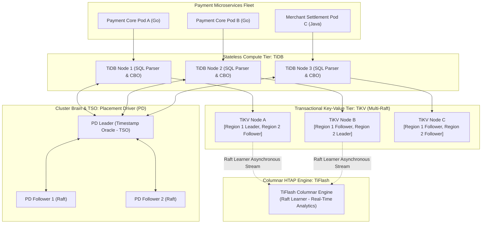
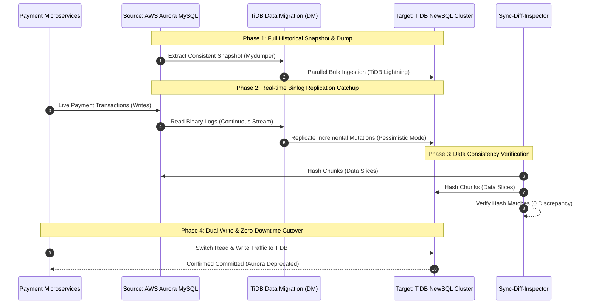

> **Multi-Language Edition:** This chapter is also available in Vietnamese at [Phần 3: Tầng Dữ Liệu — Chuyển Dịch Từ Aurora Sang TiDB Multi-Raft NewSQL (learn.tanhdev.com)](https://learn.tanhdev.com/series/paypay-architecture/part-3-data-layer-tidb/).

[Previous Chapter: Part 2 — Event-Driven Architecture & Kafka at Scale](/series/paypay-architecture/part-2-event-driven-kafka/) | [Series Hub](/series/paypay-architecture/) | [Next Chapter: Part 4 — SRE Practices & Chaos Engineering](/series/paypay-architecture/part-4-sre-chaos-engineering/)

---

> **Answer-First:** Operating a national mobile payment network generating billions of financial records pushed traditional Amazon Aurora MySQL past its physical write thresholds due to single-master bottlenecks, cross-replica replication lag, and connection exhaustion during marketing surges. PayPay executed a landmark **zero-downtime migration to TiDB and TiKV**, a cloud-native NewSQL distributed database. By decoupling stateless SQL compute from Multi-Raft storage engines across 96MB continuous Regions, TiDB provides horizontal write scalability, strictly linearizable ACID consistency, and real-time HTAP analytics through TiFlash without impacting high-frequency payment ledgers.

---

## 1. Why AWS Aurora MySQL Reached Its Physical Limits

During its early years, PayPay relied heavily on AWS Aurora MySQL. Aurora's shared-storage architecture provided seamless vertical read scaling through read replicas. However, as PayPay surpassed **30 million users and launched nationwide promotional campaigns**, three critical bottlenecks materialized:

```
Aurora MySQL Operational Bottlenecks:
┌──────────────────────────────────────────────┐
│ Single-Writer Ceiling:                       │
│ All ledger INSERTs & UPDATEs funneled into   │ ──► CPU at 95%, disk queue stalls
│ 1 Master Node (Cannot scale writes out)      │
├──────────────────────────────────────────────┤
│ Replica Lag Spikes:                          │
│ Under massive write surges, read replica     │ ──► User sees stale wallet balance
│ lag climbed past 5 seconds                   │     (Triggers false double-clicks)
├──────────────────────────────────────────────┤
│ Sharding Operational Penalty:                │
│ Sharding by user_id breaks merchant queries; │ ──► Distributed 2PC cross-shard
│ re-sharding requires maintenance downtime    │     queries suffer >300ms latency
└──────────────────────────────────────────────┘
```

When write traffic spiked during the *"10-Billion Yen Campaign"*, the primary database instance experienced severe lock contention on wallet balance rows. Vertical scaling to the largest AWS instances (`db.r5.24xlarge`) only deferred the inevitable: relational databases constrained to a single write master cannot scale indefinitely under planetary write concurrency.

---

## 2. The TiDB Distributed NewSQL Architecture

PayPay migrated its core financial and ledger storage to **TiDB (PingCAP)**, an open-source NewSQL database designed for massive horizontal scaling with native MySQL protocol compatibility.



### Architectural Separation of Responsibilities

1. **Stateless SQL Layer (TiDB):** Exposes standard MySQL 5.7/8.0 wire compatibility. Services connect using standard MySQL drivers (`go-sql-driver/mysql` in Go or HikariCP in Java). Compute nodes scale elastically behind HAProxy or Envoy without downtime.
2. **Cluster Coordinator & TSO (Placement Driver):** Allocates monotonically increasing timestamps via the Timestamp Oracle (TSO) for Percolator-based distributed snapshot isolation, orchestrating autonomous Region balancing across physical Kubernetes nodes.
3. **Distributed Transactional Storage (TiKV):** Data is organized into continuous, non-overlapping **96MB Regions**. Each Region is replicated across three or five nodes using the **Multi-Raft consensus protocol**, guaranteeing zero data loss ($RPO=0$) and automatic leader election in under 3 seconds ($RTO < 3s$).
4. **Real-Time Columnar Engine (TiFlash):** Receives Raft log streams as an asynchronous **Raft Learner**. TiFlash stores data in columnar format, enabling complex merchant reconciliation and fraud analytical queries without locking OLTP payment rows.

---

## 3. Zero-Downtime Live Migration Pipeline: Aurora to TiDB

Migrating billions of live financial ledger records without a single millisecond of service downtime or transaction discrepancy requires a battle-tested four-phase pipeline:



### Key Migration Safeguards:
- **TiDB Lightning in Local Backend Mode:** Ingests terabytes of historical snapshots at over 300GB/hour by transforming data directly into RocksDB SST files and loading them straight into TiKV nodes, bypassing the SQL layer entirely.
- **Incremental Binlog Catchup:** TiDB Data Migration (DM) subscribes to Aurora MySQL GTID binlogs, replaying live mutations until replication latency hits sub-100 milliseconds.
- **Automated Verification:** The `sync-diff-inspector` tool computes cryptographic hashes of data slices across Aurora and TiDB in parallel, validating 100% data consistency before initiating the final traffic cutover.

---

## 4. Production DDL & Go Transaction Patterns

To prevent sequential write hotspots during mega-promotional events, primary keys must avoid monotonic auto-increment sequences:

```sql
-- Production DDL for PayPay Wallet Ledger Table
CREATE TABLE wallet_ledger (
    ledger_id BIGINT AUTO_RANDOM(5) PRIMARY KEY,
    transaction_sn VARCHAR(64) NOT NULL UNIQUE,
    user_id BIGINT NOT NULL,
    counterparty_id BIGINT NOT NULL,
    amount DECIMAL(14, 4) NOT NULL,
    currency VARCHAR(8) DEFAULT 'JPY',
    entry_type ENUM('DEBIT', 'CREDIT') NOT NULL,
    balance_after DECIMAL(14, 4) NOT NULL,
    status TINYINT NOT NULL DEFAULT 1,
    created_at TIMESTAMP NOT NULL DEFAULT CURRENT_TIMESTAMP,
    INDEX idx_user_created (user_id, created_at),
    INDEX idx_tx_sn (transaction_sn)
)
SHARD_ROW_ID_BITS = 4
PRE_SPLIT_REGIONS = 4;
```

### Go Implementation: Pessimistic Transaction with Snapshot Isolation

```go
// Package ledger provides production-grade financial ledger operations on TiDB.
package ledger

import (
	"context"
	"database/sql"
	"fmt"
	"time"

	_ "github.com/go-sql-driver/mysql"
)

type LedgerEntry struct {
	TxSN           string
	UserID         int64
	CounterpartyID int64
	Amount         float64
	EntryType      string
}

// ExecuteDoubleEntryTransfer executes balanced debit/credit rows within an atomic TiDB transaction.
func ExecuteDoubleEntryTransfer(ctx context.Context, db *sql.DB, debit LedgerEntry, credit LedgerEntry) error {
	ctx, cancel := context.WithTimeout(ctx, 3*time.Second)
	defer cancel()

	// Begin pessimistic transaction (TiDB default for financial workloads)
	tx, err := db.BeginTx(ctx, &sql.TxOptions{Isolation: sql.LevelReadCommitted})
	if err != nil {
		return fmt.Errorf("failed to begin transaction: %w", err)
	}
	defer tx.Rollback()

	// 1. Lock payer wallet row using SELECT ... FOR UPDATE
	var currentBalance float64
	queryLock := `SELECT balance FROM user_wallets WHERE user_id = ? FOR UPDATE;`
	if err := tx.QueryRowContext(ctx, queryLock, debit.UserID).Scan(&currentBalance); err != nil {
		return fmt.Errorf("failed to acquire row lock on wallet %d: %w", debit.UserID, err)
	}

	if currentBalance < debit.Amount {
		return fmt.Errorf("insufficient funds: available %.2f, required %.2f", currentBalance, debit.Amount)
	}

	// 2. Deduct payer balance
	updateDebit := `UPDATE user_wallets SET balance = balance - ?, updated_at = NOW() WHERE user_id = ?;`
	if _, err := tx.ExecContext(ctx, updateDebit, debit.Amount, debit.UserID); err != nil {
		return fmt.Errorf("failed to update debit wallet: %w", err)
	}

	// 3. Credit payee balance
	updateCredit := `UPDATE user_wallets SET balance = balance + ?, updated_at = NOW() WHERE user_id = ?;`
	if _, err := tx.ExecContext(ctx, updateCredit, credit.Amount, credit.UserID); err != nil {
		return fmt.Errorf("failed to update credit wallet: %w", err)
	}

	// 4. Record double-entry ledger rows
	insertLedger := `
		INSERT INTO wallet_ledger (transaction_sn, user_id, counterparty_id, amount, entry_type, balance_after)
		VALUES (?, ?, ?, ?, ?, ?);
	`
	if _, err := tx.ExecContext(ctx, insertLedger, debit.TxSN, debit.UserID, debit.CounterpartyID, debit.Amount, "DEBIT", currentBalance-debit.Amount); err != nil {
		return fmt.Errorf("failed to insert debit ledger: %w", err)
	}
	if _, err := tx.ExecContext(ctx, insertLedger, credit.TxSN, credit.UserID, credit.CounterpartyID, credit.Amount, "CREDIT", 0); err != nil {
		return fmt.Errorf("failed to insert credit ledger: %w", err)
	}

	// 5. Commit via Percolator 2-Phase Commit
	if err := tx.Commit(); err != nil {
		return fmt.Errorf("distributed 2PC commit failed: %w", err)
	}

	return nil
}
```

---

## Frequently Asked Questions


TiDB incorporates an autonomous distributed deadlock detector running inside the Placement Driver (PD) and TiKV leaders:
- In pessimistic locking mode, TiDB constructs a dynamic Wait-For Graph of transactions waiting for locks.
- If a circular dependency is detected across different TiKV nodes (e.g., Tx 1 locks Account A waiting for B, while Tx 2 locks Account B waiting for A), the deadlock detector identifies the transaction with the smallest cost footprint and terminates it with a retryable error (`ErrDeadlock`), allowing the higher-priority payment transaction to proceed immediately.



PayPay utilized the `sync-diff-inspector` utility alongside shadow traffic testing:
1. <strong>Segmented Chunk Hashing:</strong> The database was divided into millions of deterministic primary key chunks. Hashes were computed across both Aurora and TiDB concurrently; identical hashes confirmed bit-for-bit parity.
2. <strong>Shadow Traffic Replay:</strong> Real-time production payment reads and writes were duplicated asynchronously to TiDB in shadow mode for two weeks to validate query execution plans, cache hit rates, and latency profiles under live traffic before switching production DNS.



TiFlash isolates analytical workloads through Raft Learner mechanics and physical resource separation:
- TiFlash nodes participate in Raft consensus as **Learners**, meaning they receive log replication asynchronously but do not participate in quorum elections or write acknowledgments. A slow analytical query on TiFlash never delays write commits on TiKV.
- Dedicated hardware: TiFlash instances run on dedicated Kubernetes worker nodes with separate NVMe storage, isolating memory and CPU usage from the transaction processing tier.


---

[Previous Chapter: Part 2 — Event-Driven Architecture & Kafka at Scale](/series/paypay-architecture/part-2-event-driven-kafka/) | [Series Hub](/series/paypay-architecture/) | [Next Chapter: Part 4 — SRE Practices & Chaos Engineering](/series/paypay-architecture/part-4-sre-chaos-engineering/)
