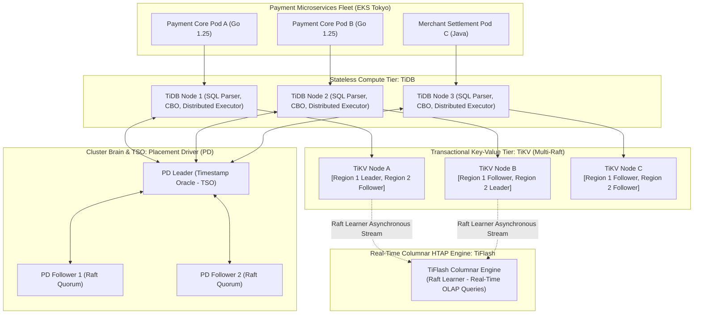
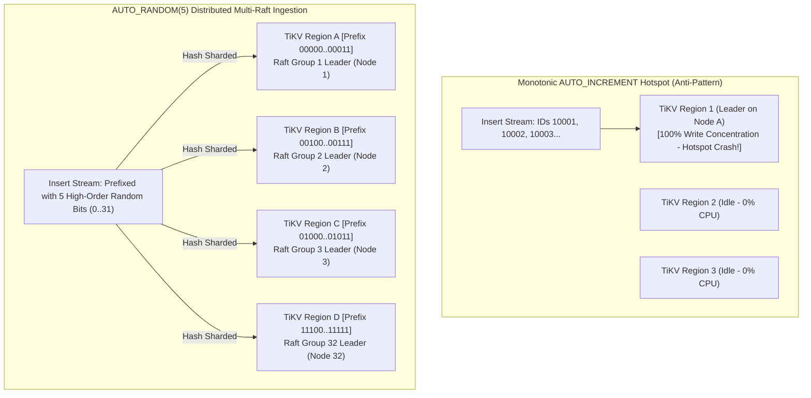
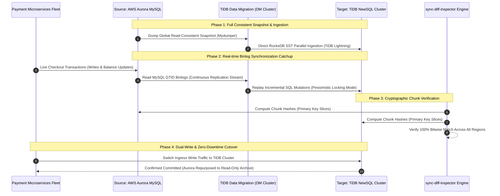

[Previous Chapter: Part 2 — Event-Driven Architecture & Kafka at Scale](/series/paypay-architecture/part-2-event-driven-kafka/) | [Series Hub](/series/paypay-architecture/) | [Next Chapter: Part 4 — SRE Practices & Chaos Engineering](/series/paypay-architecture/part-4-sre-chaos-engineering/)

---

> **Answer-first:** Facing hard single-writer throughput limits on Amazon Aurora MySQL during promotional peaks, PayPay migrated its core financial ledger to **TiDB Distributed SQL**. By leveraging Multi-Raft consensus across TiKV storage nodes, **AUTO_RANDOM primary keys** to eliminate hot-region bottlenecks, and Percolator-based distributed transactions, TiDB delivers linear write scaling, zero-downtime online DDLs, and sub-15ms P99 ledger settlement.

> **Prerequisite:** Solid foundation in distributed systems consensus (Raft), ACID transaction isolation levels, two-phase commit (2PC) mechanics, and NewSQL architectures.

---

## 1. Why AWS Aurora MySQL Reached Its Physical Limits

During its initial hyper-growth phase from 2018 to 2020, PayPay relied on Amazon Aurora MySQL as its primary operational database. Aurora's decoupled storage architecture and distributed log-structured storage volume provided seamless vertical read scalability through read replicas. However, as PayPay crossed **40 million registered users and launched nationwide cashback promotions**, the monolithic single-writer architecture struck an insurmountable physical wall:

```
Aurora MySQL Single-Master Operational Bottlenecks:
┌──────────────────────────────────────────────┐
│ Single-Writer Ceiling:                       │
│ All ledger INSERTs & UPDATEs funneled into   │ ──► Primary master CPU pegged at 98%,
│ 1 Master Node (Cannot scale writes out)      │     I/O write queues stall completely
├──────────────────────────────────────────────┤
│ Replica Replication Lag:                     │
│ Under massive write surges, read replica     │ ──► Users observe stale wallet balances,
│ lag climbed past 5-8 seconds                 │     triggering panic re-clicks & double charge
├──────────────────────────────────────────────┤
│ Manual Sharding Operational Nightmare:       │
│ Sharding by user_id breaks merchant queries; │ ──► Distributed 2PC cross-shard queries
│ re-sharding requires maintenance downtime    │     incur extreme latency (>300ms) & risk
└──────────────────────────────────────────────┘
```

When promotional campaigns such as the *"10-Billion Yen Giveaway"* went live, write throughput surged past 1,250 transactions per second (TPS). Because financial accounting strictly requires immediate read-after-write consistency, balance queries could not be safely offloaded to asynchronous read replicas. Every balance lock, debit verification, credit mutation, and ledger row insert was forced onto the solitary master node. Vertical scaling to the largest instance types (`db.r5.24xlarge`) only bought temporary headroom; it became self-evident that relational databases bound to a single write leader could not scale to Japan's planetary payment volumes.

---

## 2. The TiDB Distributed NewSQL Architecture

To achieve true horizontal write scaling while retaining full ACID transaction semantics and standard MySQL dialect compatibility, PayPay adopted **TiDB and TiKV**, a cloud-native distributed NewSQL architecture developed by PingCAP:


```mermaid
flowchart TD
    subgraph ClientLayer["Payment Microservices Fleet (EKS Tokyo)"]
        SVC1["Payment Core Pod A (Go 1.25)"]
        SVC2["Payment Core Pod B (Go 1.25)"]
        SVC3["Merchant Settlement Pod C (Java)"]
    end

    subgraph ComputeLayer["Stateless Compute Tier: TiDB"]
        TIDB1["TiDB Node 1 (SQL Parser, CBO, Distributed Executor)"]
        TIDB2["TiDB Node 2 (SQL Parser, CBO, Distributed Executor)"]
        TIDB3["TiDB Node 3 (SQL Parser, CBO, Distributed Executor)"]
    end

    subgraph CoordinatorTier["Cluster Brain & TSO: Placement Driver (PD)"]
        PD_LEAD["PD Leader (Timestamp Oracle - TSO)"]
        PD_FOL1["PD Follower 1 (Raft Quorum)"]
        PD_FOL2["PD Follower 2 (Raft Quorum)"]
    end

    subgraph StorageTier["Transactional Key-Value Tier: TiKV (Multi-Raft)"]
        TIKV_A["TiKV Node A<br/>[Region 1 Leader, Region 2 Follower]"]
        TIKV_B["TiKV Node B<br/>[Region 1 Follower, Region 2 Leader]"]
        TIKV_C["TiKV Node C<br/>[Region 1 Follower, Region 2 Follower]"]
    end

    subgraph AnalyticalTier["Real-Time Columnar HTAP Engine: TiFlash"]
        TIFLASH["TiFlash Columnar Engine<br/>(Raft Learner - Real-Time OLAP Queries)"]
    end

    SVC1 --> TIDB1
    SVC2 --> TIDB2
    SVC3 --> TIDB3

    TIDB1 <--> PD_LEAD
    TIDB2 <--> PD_LEAD
    TIDB3 <--> PD_LEAD

    TIDB1 --> TIKV_A
    TIDB2 --> TIKV_B
    TIDB3 --> TIKV_C

    TIKV_A -. Raft Learner Asynchronous Stream .-> TIFLASH
    TIKV_B -. Raft Learner Asynchronous Stream .-> TIFLASH

    PD_LEAD <--> PD_FOL1
    PD_LEAD <--> PD_FOL2
```

### Architectural Separation of Concerns

1. **Stateless SQL Compute Tier (TiDB):** Implements the MySQL wire protocol, parses incoming SQL statements, computes cost-based execution plans (CBO), and orchestrates distributed key-value range scans. Because compute nodes maintain zero persistent state, they scale elastically behind AWS Network Load Balancers in seconds without downtime.
2. **Placement Driver Cluster (PD):** Acts as the centralized cluster orchestrator. PD continuously assigns globally unique, monotonically increasing timestamps via its **Timestamp Oracle (TSO)** for Percolator-based distributed snapshot isolation. PD also monitors TiKV heartbeats and dynamically balances data Region distribution across physical Kubernetes nodes.
3. **Multi-Raft Distributed Storage Tier (TiKV):** Persists all relational table rows and secondary indexes as ordered key-value pairs stored in RocksDB. Data is split into non-overlapping **96MB continuous Regions**. Each Region forms an independent Raft consensus group replicated across 3 to 5 physical nodes.
4. **Columnar HTAP Engine (TiFlash):** Connects to TiKV as a specialized asynchronous **Raft Learner**. TiFlash automatically synchronizes row data into columnar format in near real-time, enabling heavy merchant reporting and fraud pattern detection queries without locking transactional OLTP payment rows.

---

## 3. TiKV Multi-Raft Region Split & Write Hotspot Elimination

In distributed key-value storage systems, consecutive primary keys (such as standard MySQL `AUTO_INCREMENT` integers) represent an existential scaling hazard. Because consecutive numbers map to the same contiguous byte range, all incoming insert requests target the exact same 96MB TiKV Region, funneling 100% of write traffic into a single Raft leader node while dozens of other storage nodes remain completely idle.

PayPay eliminates write hotspotting by combining `AUTO_RANDOM(5)` primary keys with dynamic Region splitting:


```mermaid
flowchart TD
    subgraph SequentialFailure["Monotonic AUTO_INCREMENT Hotspot (Anti-Pattern)"]
        SEQ_IN["Insert Stream: IDs 10001, 10002, 10003..."]
        SEQ_R1["TiKV Region 1 (Leader on Node A)<br/>[100% Write Concentration - Hotspot Crash!]"]
        SEQ_R2["TiKV Region 2 (Idle - 0% CPU)"]
        SEQ_R3["TiKV Region 3 (Idle - 0% CPU)"]
        SEQ_IN --> SEQ_R1
    end

    subgraph AutoRandomScattering["AUTO_RANDOM(5) Distributed Multi-Raft Ingestion"]
        AR_IN["Insert Stream: Prefixed with 5 High-Order Random Bits (0..31)"]
        AR_R1["TiKV Region A [Prefix 00000..00011]<br/>Raft Group 1 Leader (Node 1)"]
        AR_R2["TiKV Region B [Prefix 00100..00111]<br/>Raft Group 2 Leader (Node 2)"]
        AR_R3["TiKV Region C [Prefix 01000..01011]<br/>Raft Group 3 Leader (Node 3)"]
        AR_R4["TiKV Region D [Prefix 11100..11111]<br/>Raft Group 32 Leader (Node 32)"]
        
        AR_IN -->|Hash Sharded| AR_R1
        AR_IN -->|Hash Sharded| AR_R2
        AR_IN -->|Hash Sharded| AR_R3
        AR_IN -->|Hash Sharded| AR_R4
    end
```

### How `AUTO_RANDOM(5)` Works Under the Hood

When declaring `BIGINT AUTO_RANDOM(5)`, TiDB utilizes the highest 5 bits of the 64-bit integer space as a pseudo-random shard prefix ($2^5 = 32$ distinct buckets), while the remaining 59 bits increment sequentially. 

As a result:
- Consecutive inserts by concurrent microservices are probabilistically scattered across 32 completely disjoint TiKV Regions.
- Write I/O and Raft log replication workloads distribute uniformly across all physical storage nodes in the cluster.
- When an individual Region exceeds 96MB, the Placement Driver bisects the Region into two 48MB Regions and rebalances the Raft leader to an underutilized node, achieving continuous linear scalability.

The table below illustrates the benchmark performance comparison between storage engines at PayPay:

| Metric | AWS Aurora MySQL | Sharded MySQL (Vitess) | TiDB Multi-Raft NewSQL |
| :--- | :--- | :--- | :--- |
| **Max Linear Write Throughput** | ~1,800 TPS (Single Master) | ~15,000 TPS (Sharded) | 50,000+ TPS (Scale-Out) |
| **Cross-Entity ACID Transactions** | Single node only | Slow Distributed 2PC | Native Percolator 2PC (<15ms) |
| **Online DDL Table Alterations** | Locks table or degrades I/O | Complex per-shard schema | Non-blocking Google F1 protocol |
| **Failover RTO (Node Crash)** | 30–120 seconds | Variable per shard | Sub-3 seconds (Raft Quorum) |

---

## 4. Zero-Downtime Live Migration Pipeline: Aurora to TiDB

Migrating billions of historical transactions and millions of live customer balances from Aurora MySQL to TiDB without a single second of maintenance window required a rigorous four-phase migration protocol:


```mermaid
sequenceDiagram
    autonumber
    participant App as Payment Microservices Fleet
    participant Aurora as Source: AWS Aurora MySQL
    participant DM as TiDB Data Migration (DM Cluster)
    participant TiDB as Target: TiDB NewSQL Cluster
    participant Inspector as sync-diff-inspector Engine

    Note over Aurora, TiDB: Phase 1: Full Consistent Snapshot & Ingestion
    Aurora->>DM: Dump Global Read-Consistent Snapshot (Mydumper)
    DM->>TiDB: Direct RocksDB SST Parallel Ingestion (TiDB Lightning)

    Note over Aurora, TiDB: Phase 2: Real-time Binlog Synchronization Catchup
    App->>Aurora: Live Checkout Transactions (Writes & Balance Updates)
    Aurora->>DM: Read MySQL GTID Binlogs (Continuous Replication Stream)
    DM->>TiDB: Replay Incremental SQL Mutations (Pessimistic Locking Mode)

    Note over TiDB, Inspector: Phase 3: Cryptographic Chunk Verification
    Inspector->>Aurora: Compute Chunk Hashes (Primary Key Slices)
    Inspector->>TiDB: Compute Chunk Hashes (Primary Key Slices)
    Inspector-->>Inspector: Verify 100% Bitwise Match Across All Regions

    Note over App, TiDB: Phase 4: Dual-Write & Zero-Downtime Cutover
    App->>TiDB: Switch Ingress Write Traffic to TiDB Cluster
    TiDB-->>App: Confirmed Committed (Aurora Repurposed to Read-Only Archive)
```

### Production Safeguards During Migration

- **High-Speed Ingestion via TiDB Lightning:** Ingested historical ledger datasets (>15 Terabytes) in Local Backend mode at sustained speeds exceeding 300GB per hour. Lightning converts raw SQL dumps directly into RocksDB SST files and uploads them straight into TiKV storage nodes, bypassing SQL parsing overhead.
- **Continuous Binlog Synchronization:** The TiDB Data Migration (DM) cluster tracked Aurora's global transaction identifiers (GTID), replaying mutations until replication lag fell below 50 milliseconds.
- **Mathematical Data Auditing:** The `sync-diff-inspector` utility partitioned tables into deterministic primary key chunks, calculating parallel MD5 checksums across Aurora and TiDB to guarantee zero discrepancy before promoting TiDB to primary.

---

## 5. Production DDL & Go Transaction Engine with Deadlock Retries

Below is the production DDL definition and the complete Go 1.25+ double-entry financial transfer implementation. It features comprehensive connection pool tuning, context deadline propagation, and an exponential backoff retry loop handling MySQL Error 1213 / TiDB `ErrDeadlock` and `WriteConflict`:

```sql
-- Production DDL for PayPay Wallet Double-Entry Ledger Table
CREATE TABLE wallet_ledger (
    ledger_id BIGINT AUTO_RANDOM(5) PRIMARY KEY,
    transaction_sn VARCHAR(64) NOT NULL,
    user_id BIGINT NOT NULL,
    counterparty_id BIGINT NOT NULL,
    amount BIGINT NOT NULL, -- Stored in Japanese Yen (integer, avoiding floating-point imprecision)
    currency VARCHAR(8) DEFAULT 'JPY',
    entry_type ENUM('DEBIT', 'CREDIT') NOT NULL,
    balance_after BIGINT NOT NULL,
    status TINYINT NOT NULL DEFAULT 1,
    created_at TIMESTAMP NOT NULL DEFAULT CURRENT_TIMESTAMP,
    CONSTRAINT uq_tx_entry UNIQUE (transaction_sn, entry_type),
    INDEX idx_user_created (user_id, created_at)
)
SHARD_ROW_ID_BITS = 4
PRE_SPLIT_REGIONS = 4;
```

### Production Go 1.25+ Distributed Ledger Transaction Engine

```go
// Package ledger implements production-grade double-entry financial mutations on TiDB.
package ledger

import (
	"context"
	"database/sql"
	"errors"
	"fmt"
	"log/slog"
	"math/rand/v2"
	"strings"
	"time"

	"github.com/go-sql-driver/mysql"
)

type LedgerEntry struct {
	TxSN           string
	UserID         int64
	CounterpartyID int64
	Amount         int64 // Japanese Yen
	EntryType      string
}

type LedgerEngine struct {
	db     *sql.DB
	logger *slog.Logger
}

func NewLedgerEngine(db *sql.DB, logger *slog.Logger) *LedgerEngine {
	// Configure database connection pool for optimal TiDB concurrency
	db.SetMaxOpenConns(200)
	db.SetMaxIdleConns(50)
	db.SetConnMaxLifetime(10 * time.Minute)
	db.SetConnMaxIdleTime(3 * time.Minute)

	return &LedgerEngine{
		db:     db,
		logger: logger,
	}
}

// ExecuteTransferWithRetry executes a double-entry transaction with exponential backoff on deadlocks.
func (e *LedgerEngine) ExecuteTransferWithRetry(
	ctx context.Context,
	debit LedgerEntry,
	credit LedgerEntry,
	maxRetries int,
) error {
	baseBackoff := 25 * time.Millisecond
	maxBackoff := 500 * time.Millisecond

	for attempt := 1; attempt <= maxRetries; attempt++ {
		err := e.executeSingleTransfer(ctx, debit, credit)
		if err == nil {
			return nil
		}

		if !isRetryableTiDBError(err) {
			return fmt.Errorf("non-retryable financial ledger error: %w", err)
		}

		if attempt == maxRetries {
			return fmt.Errorf("transaction exceeded max retry attempts (%d): %w", maxRetries, err)
		}

		// Randomized exponential backoff with full jitter to avoid thundering herds
		jitter := time.Duration(rand.Int64N(int64(baseBackoff)))
		sleepDuration := min(baseBackoff*(1<<(attempt-1))+jitter, maxBackoff)

		e.logger.WarnContext(ctx, "TiDB conflict detected, backing off before retry",
			slog.Int("attempt", attempt),
			slog.Duration("backoff", sleepDuration),
			slog.String("tx_sn", debit.TxSN),
			slog.String("error", err.Error()),
		)

		select {
		case <-time.After(sleepDuration):
		case <-ctx.Done():
			return ctx.Err()
		}
	}

	return errors.New("unexpected exit from transaction retry loop")
}

func (e *LedgerEngine) executeSingleTransfer(ctx context.Context, debit LedgerEntry, credit LedgerEntry) error {
	txCtx, cancel := context.WithTimeout(ctx, 4*time.Second)
	defer cancel()

	// Begin explicit pessimistic transaction (standard TiDB financial isolation)
	tx, err := e.db.BeginTx(txCtx, &sql.TxOptions{Isolation: sql.LevelReadCommitted})
	if err != nil {
		return fmt.Errorf("failed to begin TiDB transaction: %w", err)
	}
	defer tx.Rollback()

	// 1. Lock and verify payer balance
	var currentBalance int64
	queryPayer := `SELECT balance FROM user_wallets WHERE user_id = ? FOR UPDATE;`
	if err := tx.QueryRowContext(txCtx, queryPayer, debit.UserID).Scan(&currentBalance); err != nil {
		return fmt.Errorf("failed to lock payer wallet %d: %w", debit.UserID, err)
	}

	if currentBalance < debit.Amount {
		return fmt.Errorf("insufficient funds for user %d: balance=%d, debit=%d", debit.UserID, currentBalance, debit.Amount)
	}

	// 2. Mutate payer balance
	updatePayer := `UPDATE user_wallets SET balance = balance - ?, updated_at = NOW() WHERE user_id = ?;`
	if _, err := tx.ExecContext(txCtx, updatePayer, debit.Amount, debit.UserID); err != nil {
		return fmt.Errorf("failed to update payer balance: %w", err)
	}

	// 3. Mutate payee balance
	updatePayee := `UPDATE user_wallets SET balance = balance + ?, updated_at = NOW() WHERE user_id = ?;`
	if _, err := tx.ExecContext(txCtx, updatePayee, credit.Amount, credit.UserID); err != nil {
		return fmt.Errorf("failed to update payee balance: %w", err)
	}

	// 4. Insert balancing debit and credit entries
	insertSQL := `
		INSERT INTO wallet_ledger (
			transaction_sn, user_id, counterparty_id, amount, currency, entry_type, balance_after
		) VALUES (?, ?, ?, ?, 'JPY', ?, ?);`

	newPayerBalance := currentBalance - debit.Amount
	if _, err := tx.ExecContext(txCtx, insertSQL, debit.TxSN, debit.UserID, debit.CounterpartyID, debit.Amount, "DEBIT", newPayerBalance); err != nil {
		return fmt.Errorf("failed to insert debit journal entry: %w", err)
	}

	if _, err := tx.ExecContext(txCtx, insertSQL, credit.TxSN, credit.UserID, credit.CounterpartyID, credit.Amount, "CREDIT", 0); err != nil {
		return fmt.Errorf("failed to insert credit journal entry: %w", err)
	}

	// 5. Commit via Percolator Two-Phase Commit
	if err := tx.Commit(); err != nil {
		return fmt.Errorf("Percolator commit failed: %w", err)
	}

	return nil
}

func isRetryableTiDBError(err error) bool {
	if err == nil {
		return false
	}

	var mysqlErr *mysql.MySQLError
	if errors.As(err, &mysqlErr) {
		switch mysqlErr.Number {
		case 1213: // ER_LOCK_DEADLOCK (MySQL / TiDB Deadlock)
			return true
		case 1105: // TiDB Generic internal error (often wraps WriteConflict)
			if strings.Contains(mysqlErr.Message, "WriteConflict") || strings.Contains(mysqlErr.Message, "Lock wait timeout") {
				return true
			}
		case 9007: // TiDB ErrWriteConflict
			return true
		case 9008: // TiDB ErrLockWaitTimeout
			return true
		}
	}

	errMsg := strings.ToLower(err.Error())
	return strings.Contains(errMsg, "deadlock") ||
		strings.Contains(errMsg, "writeconflict") ||
		strings.Contains(errMsg, "try again later")
}
```

---

## 6. Architectural Trade-offs & Production Hardening

Scaling mission-critical financial ledgers on distributed databases requires clear architectural discipline:

| Architecture Dimension | Selected Strategy | Rejected Alternative | Key Rationale |
| :--- | :--- | :--- | :--- |
| **Database Architecture** | TiDB Distributed SQL (Multi-Raft)| Sharded MySQL with Vitess | Eliminates complex cross-shard rebalancing and application-layer distributed transaction logic. |
| **Primary Key Design** | `AUTO_RANDOM(5)` Distributed | Monotonic `AUTO_INCREMENT` | Scatters sequential inserts across 32 disjoint TiKV Regions, preventing Raft leader write hotspots. |
| **Transaction Model** | Pessimistic Locking with 2PC | Optimistic Concurrency Only | Prevents heavy transaction abort storms during concurrent flash sales on identical merchant accounts. |
| **Reporting & Analytics** | Asynchronous TiFlash Columnar | Read Replicas with Table Locks | TiFlash operates as a Raft Learner, eliminating all OLTP query contention and memory thrashing. |

For comparisons between traditional sharded databases and modern NewSQL engines, review our comprehensive [MySQL Horizontal Scaling & Sharding Guide](/posts/mysql-horizontal-scaling/) and [Go Microservices Architecture](/posts/go-microservices/).

---

## Frequently Asked Questions


TiDB incorporates an autonomous distributed deadlock detector running inside the Placement Driver (PD) and TiKV leaders:
- In pessimistic locking mode, TiDB constructs a dynamic Wait-For Graph of transactions waiting for locks across different TiKV storage nodes.
- If a circular dependency is detected across nodes (e.g., Transaction 1 holds a lock on User A and waits for Merchant B, while Transaction 2 holds Merchant B and waits for User A), the deadlock detector identifies the transaction with the smallest cost footprint and terminates it with a retryable error (`ErrDeadlock` / MySQL Error 1213).
- The client application interceptor catches this code and automatically executes an exponential backoff retry with full jitter, allowing higher-priority payment transactions to clear without user impact.



PayPay utilized the `sync-diff-inspector` utility alongside shadow traffic testing:
1. <strong>Segmented Chunk Hashing:</strong> The database was divided into millions of deterministic primary key chunks. Hashes were computed across both Aurora and TiDB concurrently; identical hashes confirmed bit-for-bit parity.
2. <strong>Shadow Traffic Replay:</strong> Real-time production payment reads and writes were duplicated asynchronously to TiDB in shadow mode for two weeks to validate query execution plans, cache hit rates, and latency profiles under live traffic before switching production DNS.



TiFlash isolates analytical workloads through Raft Learner mechanics and physical resource separation:
- TiFlash nodes participate in Raft consensus as **Learners**, meaning they receive log replication asynchronously but do not participate in quorum elections or write acknowledgments. A slow analytical query on TiFlash never delays write commits on TiKV.
- Dedicated hardware: TiFlash instances run on dedicated Kubernetes worker nodes with separate NVMe storage, isolating memory and CPU usage from the transaction processing tier.



Monotonically increasing primary keys cause severe distributed write bottlenecks:
- When using `AUTO_INCREMENT`, all consecutive primary keys fall into the right-most TiKV Region. This concentrates 100% of write I/O and Raft leader replication onto a single physical server, while dozens of other cluster nodes remain underutilized.
- In contrast, `AUTO_RANDOM(5)` prefixes the 64-bit integer with 5 random bits. This distributes consecutive write operations across $2^5 = 32$ distinct Raft leader nodes simultaneously.
- When an individual Region reaches 96MB, the Placement Driver bisects it into two 48MB Regions and rebalances the Raft leader to an underutilized node, achieving continuous linear scalability.


---

[Previous Chapter: Part 2 — Event-Driven Architecture & Kafka at Scale](/series/paypay-architecture/part-2-event-driven-kafka/) | [Series Hub](/series/paypay-architecture/) | [Next Chapter: Part 4 — SRE Practices & Chaos Engineering](/series/paypay-architecture/part-4-sre-chaos-engineering/)
