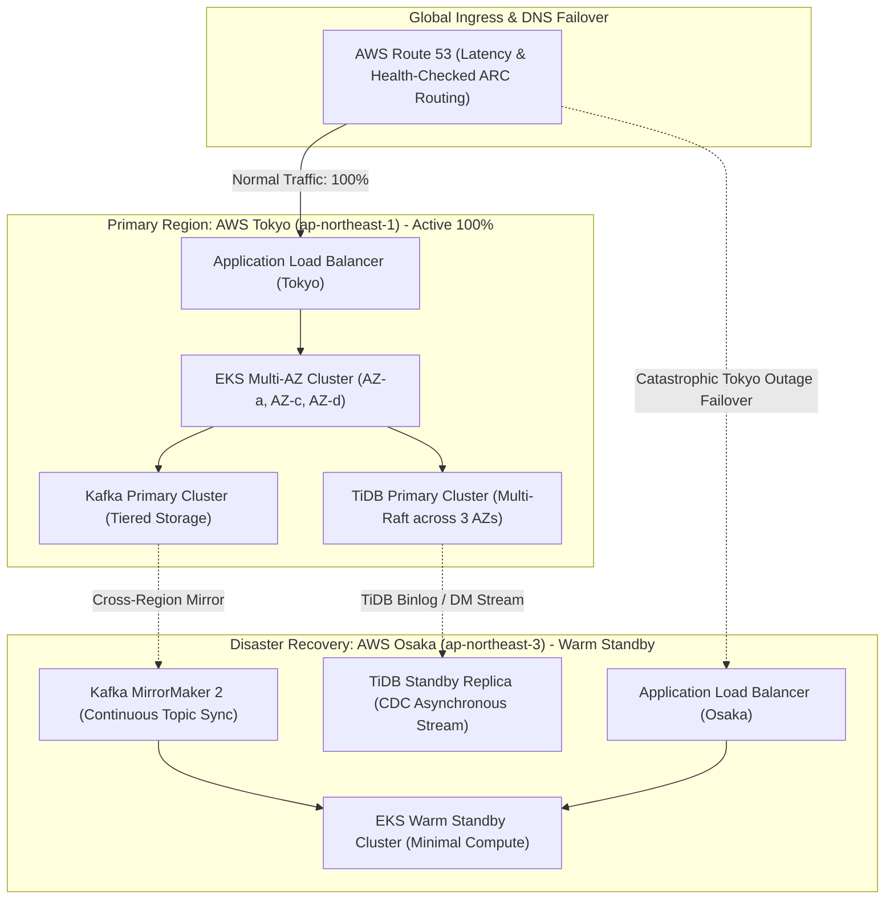

> **Multi-Language Edition:** This chapter is also available in Vietnamese at [Phần 4: Thực Tiễn SRE — Kỹ Thuật Hỗn Loạn Chaos Mesh & Khả Năng Chống Chịu Sự Cố Đa Vùng (learn.tanhdev.com)](https://learn.tanhdev.com/series/paypay-architecture/part-4-sre-chaos-engineering/).

[Previous Chapter: Part 3 — Data Infrastructure: From Aurora to TiDB](/series/paypay-architecture/part-3-data-layer-tidb/) | [Series Hub](/series/paypay-architecture/) | [Next Chapter: Part 5 — Campaign Architecture: Surviving the 10-Billion Yen Surge](/series/paypay-architecture/part-5-campaign-architecture/)

---

> **Answer-First:** Delivering five-nines (99.999%) availability for national payment infrastructure requires shifting from reactive disaster recovery to **continuous, automated Chaos Engineering in production**. PayPay integrates **Chaos Mesh into Kubernetes EKS clusters**, deliberately injecting pod evictions, network latency, and cross-AZ partitions during normal business hours to validate self-healing invariants. To prevent cascading failures under heavy load, PayPay enforces **distributed circuit breaking with Sentinel**, **client-side exponential backoff with full jitter**, and **strict gRPC deadline propagation**, ensuring localized microservice brownouts never degrade core payment authorization.

---

## 1. The SRE Mandate: 99.999% Availability in Mission-Critical Payments

In Japan's mobile payment ecosystem, downtime is not an engineering inconvenience—it is a regulatory violation. The Japanese Financial Services Agency (FSA) mandates strict operational resilience. An outage preventing users from buying food at convenience stores or boarding public transit generates immediate regulatory scrutiny.

To achieve an annual downtime budget of **under 5 minutes and 15 seconds** (99.999% SLA), PayPay's Site Reliability Engineering (SRE) team adopted a foundational doctrine: **Systems must be subjected to real-world chaos to prove their survival.**

```
PayPay Reliability Invariants:
┌──────────────────────────────────────┬──────────────────────────────┐
│ Reliability Metric                   │ Production Target            │
├──────────────────────────────────────┼──────────────────────────────┤
│ Core Payment Availability            │ 99.999%                      │
│ Recovery Point Objective (RPO)       │ 0 seconds (Zero data loss)   │
│ Recovery Time Objective (RTO)        │ < 3 seconds (Zone failover)  │
│ Blast Radius of Chaos Experiments    │ Strictly < 1% of live pods   │
└──────────────────────────────────────┴──────────────────────────────┘
```

---

## 2. Production Chaos Engineering with Chaos Mesh

PayPay utilizes **Chaos Mesh**, a cloud-native chaos engineering platform running natively inside Kubernetes, to execute scheduled, programmatic failure injections:

```mermaid
flowchart TD
    subgraph ControlPlane["Chaos Engineering Control Plane"]
        CRON["Chaos CronScheduler (Weekly Business Hours)"]
        MESH_CRD["Chaos Mesh Controller (Custom Resource Definitions)"]
        GUARD["Automated Safety Guardrail (Prometheus Health Monitor)"]
    end

    subgraph ExperimentScope["Targeted Blast Radius (1% Pod Fleet)"]
        POD_KILL["PodChaos: Random Ejection of Payment Workers"]
        NET_DELAY["NetworkChaos: 150ms Latency Injection on gRPC Ports"]
        PARTITION["NetworkChaos: Cross-AZ Network Partitioning"]
    end

    subgraph ProductionCluster["Production Kubernetes Fleet (AWS Tokyo - 3 AZs)"]
        AZ1["Availability Zone ap-northeast-1a (Active)"]
        AZ2["Availability Zone ap-northeast-1c (Active)"]
        AZ3["Availability Zone ap-northeast-1d (Active)"]
    end

    subgraph SelfHealingValidation["Resilience Verifications"]
        RETRY["Client-Side Retries with Jitter Succeeded"]
        ELECTION["Raft Leader Re-elected in Sub-3s"]
        CIRCUIT["Circuit Breaker Tripped Gracefully (No 500 Spike)"]
    end

    CRON --> MESH_CRD
    GUARD -. Emergency Halt (Error > 0.01%) .-> MESH_CRD
    MESH_CRD --> POD_KILL
    MESH_CRD --> NET_DELAY
    MESH_CRD --> PARTITION

    POD_KILL --> AZ1
    NET_DELAY --> AZ2
    PARTITION --> AZ3

    AZ1 --> RETRY
    AZ2 --> CIRCUIT
    AZ3 --> ELECTION
```

### Chaos Mesh Production Manifest: Network Delay Injection

```yaml
apiVersion: chaos-mesh.org/v1alpha1
kind: NetworkChaos
metadata:
  name: payment-grpc-latency-injection
  namespace: payment-system
spec:
  action: delay
  mode: fixed-percent
  value: "5" # Affect exactly 5% of target payment pods
  selector:
    namespaces:
      - payment-system
    labelSelectors:
      "app.kubernetes.io/name": "payment-core-service"
  delay:
    latency: "150ms"
    jitter: "25ms"
    correlation: "50"
  direction: to
  target:
    selector:
      namespaces:
        - payment-system
      labelSelectors:
        "app.kubernetes.io/name": "wallet-balance-service"
    mode: all
  duration: "5m"
  scheduler:
    cron: "0 14 * * 2" # Every Tuesday at 2:00 PM JST
```

### Key Safety Guardrails:
1. **Automated Dead-Man Switch:** The Chaos Controller constantly polls Prometheus. If overall payment failure rates exceed **0.01%**, the chaos experiment is aborted within 500 milliseconds.
2. **Fixed-Percentage Blast Radius:** Experiments never target more than 5% of a service's replica set simultaneously, ensuring redundant pods handle diverted load comfortably.
3. **No Nighttime Chaos:** Experiments run strictly during daytime peak hours when the full engineering team is on-duty to observe and remediate unexpected findings.

---

## 3. Multi-Region Resilience & Disaster Recovery Architecture

PayPay deploys its active infrastructure across three distinct AWS Availability Zones in the **Tokyo Region (`ap-northeast-1`)**, backed by a warm standby disaster recovery deployment in the **Osaka Region (`ap-northeast-3`)**:



- **Zero Data Loss ($RPO=0$) across AZs:** Within Tokyo, TiKV replicas span three AZs. A complete loss of any single data center never drops committed financial records because the remaining two AZs retain quorum consensus.
- **Sub-Minute Cross-Region Failover ($RTO < 60s$):** If an unprecedented natural disaster impacts the entire Tokyo metro area, AWS Route 53 Application Recovery Controller (ARC) shifts DNS traffic to Osaka, where standby pods scale out immediately via KEDA.

---

## 4. Cascading Failure Prevention & gRPC Deadline Propagation

Under extreme load spikes, slow downstream dependencies can cause threads and connections to back up, triggering a catastrophic cascading failure across the entire service call graph. PayPay enforces **strict gRPC Context Deadline Propagation**:

```go
// Package client provides production-resilient gRPC outbound invocation wrappers.
package client

import (
	"context"
	"fmt"
	"math/rand"
	"time"

	"google.golang.org/grpc"
	"google.golang.org/grpc/codes"
	"google.golang.org/grpc/status"
)

// InvokeWithDeadlineAndRetry executes a gRPC call with strict deadline propagation and jittered retry.
func InvokeWithDeadlineAndRetry(
	parentCtx context.Context,
	maxTimeout time.Duration,
	maxAttempts int,
	fn func(ctx context.Context) error,
) error {
	// Enforce strict bounded execution deadline
	ctx, cancel := context.WithTimeout(parentCtx, maxTimeout)
	defer cancel()

	var lastErr error
	baseBackoff := 50 * time.Millisecond

	for attempt := 1; attempt <= maxAttempts; attempt++ {
		err := fn(ctx)
		if err == nil {
			return nil
		}

		lastErr = err
		code := status.Code(err)

		// Only retry on transient connection or resource exhaustion codes
		if code != codes.Unavailable && code != codes.ResourceExhausted {
			return fmt.Errorf("non-retryable gRPC error (%s): %w", code, err)
		}

		// Calculate exponential backoff with full jitter to avoid thundering herds
		jitter := time.Duration(rand.Int63n(int64(baseBackoff)))
		sleepDuration := baseBackoff + jitter

		select {
		case <-ctx.Done():
			return fmt.Errorf("context deadline exceeded during retry loop: %w", ctx.Err())
		case <-time.After(sleepDuration):
			baseBackoff *= 2
		}
	}

	return fmt.Errorf("exhausted %d retry attempts: %w", maxAttempts, lastErr)
}
```

If a downstream service exceeds its allocated time budget, the gRPC context expires immediately, canceling in-flight database locks and freeing compute threads upstream.

---

## Frequently Asked Questions


PayPay confines chaos experiments using multi-tier safety controls:
1. <strong>Blast Radius Limits:</strong> Experiments are restricted to no more than 5% of pods within a single non-payment or stateless domain.
2. <strong>Real-time Metric Circuit Breakers:</strong> Chaos Mesh is paired with an automated guardrail monitor. If P99 payment latency exceeds 50ms or HTTP 5xx errors breach 0.01%, the experiment is killed instantly.
3. <strong>Strict Business-Hours Schedule:</strong> All injections occur between 1:00 PM and 4:00 PM on weekdays when senior SRE and application owners are actively monitoring live Grafana dashboards.



The failover is completely transparent to the user:
- Within the EKS cluster, Kubernetes routes traffic away from unhealthy AZ nodes within seconds.
- At the storage layer, TiKV Region replicas in the two surviving AZs maintain majority quorum (2 out of 3 votes). Region leaders located in the failed AZ are autonomously re-elected on surviving nodes in under 3 seconds.
- Clients experience a brief 1-to-2 second retryable delay, with zero data loss ($RPO=0$).



In distributed microservices, if Service A calls Service B with a 2-second timeout, but Service B calls Service C without propagating the deadline, Service C might continue working for 30 seconds after Service A has already abandoned the request. This wastes CPU, memory, and database connection pool capacity on dead requests. Propagating the deadline via the HTTP/2 `grpc-timeout` header ensures that when Service A cancels its context, all downstream services cancel execution immediately, stopping thread starvation.


---

[Previous Chapter: Part 3 — Data Infrastructure: From Aurora to TiDB](/series/paypay-architecture/part-3-data-layer-tidb/) | [Series Hub](/series/paypay-architecture/) | [Next Chapter: Part 5 — Campaign Architecture: Surviving the 10-Billion Yen Surge](/series/paypay-architecture/part-5-campaign-architecture/)
