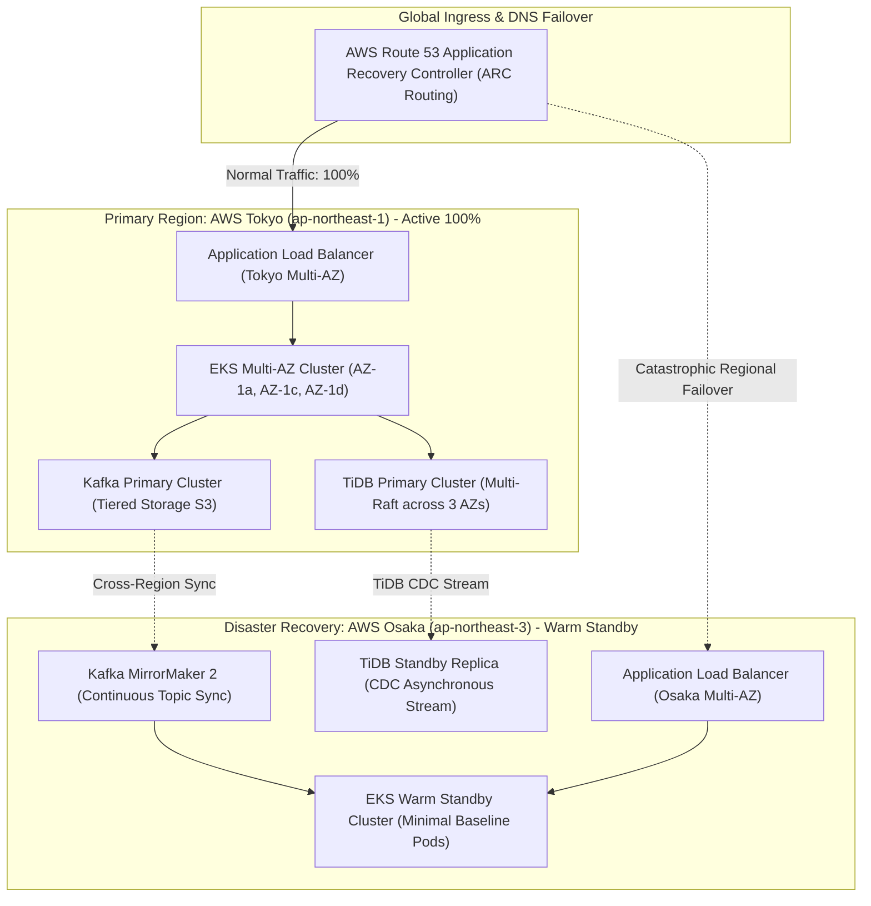
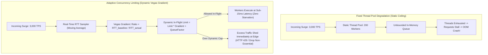

[Previous Chapter: Part 3 — Data Infrastructure: From Aurora to TiDB](/series/paypay-architecture/part-3-data-layer-tidb/) | [Series Hub](/series/paypay-architecture/) | [Next Chapter: Part 5 — Campaign Architecture: Surviving the 10-Billion Yen Surge](/series/paypay-architecture/part-5-campaign-architecture/)

---

> **Answer-first:** PayPay sustains 99.999% payment availability by embedding **Chaos Mesh fault injection** directly into production pipelines, proactively testing pod kills, network partitions, and clock skews without impacting consumers. Paired with strict SLO/SLI error budgets, gRPC deadline propagation, and adaptive concurrency limits, the infrastructure autonomously isolates degrading services and sheds load before cascading failures can propagate.

> **Prerequisite:** Practical familiarity with Site Reliability Engineering (SRE) principles, Prometheus SLO tracking, Linux cgroup/tc network fault injection, and gRPC deadline mechanics.

---

## 1. The SRE Mandate: Five-Nines (99.999%) in National Payments

In Japan's cashless payment ecosystem, payment system availability is a matter of national financial infrastructure governance. The Japanese Financial Services Agency (FSA) imposes stringent regulatory reporting requirements on fintech operators. A major payment failure that prevents millions of citizens from purchasing groceries at convenience stores, paying medical bills, or boarding train lines triggers mandatory public investigations and regulatory penalties.

Operating at **99.999% availability** permits an annual unplanned downtime budget of **strictly less than 5 minutes and 15 seconds** across the entire year:

```
PayPay Reliability Guardrails & SLA Envelopes:
┌──────────────────────────────────────┬──────────────────────────────┐
│ Reliability Metric                   │ Production Target            │
├──────────────────────────────────────┼──────────────────────────────┤
│ Core Payment Ingress Availability    │ 99.999% (Annual Downtime < 5m 15s) │
│ Recovery Point Objective (RPO)       │ 0 seconds (Strictly zero data loss)│
│ Recovery Time Objective (RTO)        │ < 3 seconds (Automated AZ failover)│
│ P99 Transaction Settlement Latency   │ < 45 milliseconds            │
│ Chaos Experiment Blast Radius        │ Strictly <= 2% of live pods  │
└──────────────────────────────────────┴──────────────────────────────┘
```

To meet this exacting standard, PayPay's Site Reliability Engineering (SRE) organization rejected reactive incident management in favor of a proactive discipline: **If an architecture has not been deliberately broken in production under controlled conditions, its fault tolerance is merely theoretical.**

---

## 2. Production Chaos Engineering with Chaos Mesh

PayPay embeds **Chaos Mesh**, a cloud-native Kubernetes chaos orchestration platform, directly into its production AWS Tokyo clusters. By defining chaos experiments as Kubernetes Custom Resource Definitions (CRDs), the SRE team programmatically injects synthetic network partitions, pod terminations, CPU throttling, and clock skew mutations during live business hours:

```mermaid
flowchart TD
    subgraph ControlPlane["Chaos Engineering Control Plane"]
        CRON["Chaos CronScheduler (Business Hours: 14:00-16:00 JST)"]
        MESH_CRD["Chaos Mesh Controller (CRD Reconciler)"]
        GUARD["Automated Safety Guardrail (Prometheus SLO Monitor)"]
    end

    subgraph ExperimentScope["Targeted Blast Radius (Strictly 2% Pod Fleet)"]
        POD_KILL["PodChaos: Random Ejection of Payment Workers"]
        NET_DELAY["NetworkChaos: 150ms Latency Injection on gRPC Ports"]
        PARTITION["NetworkChaos: Cross-AZ Inter-Pod Partitioning"]
    end

    subgraph ProductionCluster["Production Kubernetes Fleet (AWS Tokyo - 3 AZs)"]
        AZ1["Availability Zone ap-northeast-1a (Active)"]
        AZ2["Availability Zone ap-northeast-1c (Active)"]
        AZ3["Availability Zone ap-northeast-1d (Active)"]
    end

    subgraph SelfHealingValidation["Resilience Verifications"]
        RETRY["Client-Side Retries with Jitter Succeeded"]
        ELECTION["TiKV Raft Leader Re-elected in Sub-3s"]
        CIRCUIT["Circuit Breaker Tripped Gracefully (Zero 500 Spikes)"]
    end

    CRON --> MESH_CRD
    GUARD -. Emergency Abort (Error Rate > 0.01%) .-> MESH_CRD
    MESH_CRD --> POD_KILL
    MESH_CRD --> NET_DELAY
    MESH_CRD --> PARTITION

    POD_KILL --> AZ1
    NET_DELAY --> AZ2
    PARTITION --> AZ3

    AZ1 --> RETRY
    AZ2 --> CIRCUIT
    AZ3 --> ELECTION
```

### Chaos Mesh Manifest: Production Network Latency Injection

The manifest below demonstrates an active production experiment injecting 150ms of network delay on gRPC port 50051 between the payment gateway and the wallet balance service:

```yaml
apiVersion: chaos-mesh.org/v1alpha1
kind: NetworkChaos
metadata:
  name: payment-grpc-latency-injection
  namespace: payment-production
spec:
  action: delay
  mode: fixed-percent
  value: "2" # Target strictly 2% of the running pod replicas
  selector:
    namespaces:
      - payment-production
    labelSelectors:
      "app.kubernetes.io/name": "payment-gateway"
  delay:
    latency: "150ms"
    jitter: "20ms"
    correlation: "50"
  direction: to
  target:
    selector:
      namespaces:
        - payment-production
      labelSelectors:
        "app.kubernetes.io/name": "wallet-balance-service"
    mode: all
  duration: "5m"
  scheduler:
    cron: "0 14 * * 2" # Every Tuesday at 14:00 JST
---
apiVersion: chaos-mesh.org/v1alpha1
kind: PodChaos
metadata:
  name: payment-worker-pod-kill
  namespace: payment-production
spec:
  action: pod-kill
  mode: fixed-percent
  value: "5"
  selector:
    namespaces:
      - payment-production
    labelSelectors:
      "app.kubernetes.io/name": "payment-worker"
  scheduler:
    cron: "0 15 * * 4" # Every Thursday at 15:00 JST
```

### Key Safety Guardrails for Chaos in Production

1. **Automated Dead-Man Switch:** The Chaos Mesh controller is bound to an automated Prometheus health probe. If overall payment failure rates exceed **0.01%** or P99 response latency exceeds 50ms, the experiment is terminated within 500 milliseconds, rolling back all kernel-level `tc` rules immediately.
2. **Strict Blast Radius Caps:** Failure injection is constrained to a maximum of 2% of replicas in critical financial domains, ensuring redundant replicas absorb diverted traffic without queue starvation.
3. **No Off-Hours Chaos:** All failure experiments run exclusively on Tuesday and Thursday afternoons between 14:00 and 16:00 JST, when full operational teams and domain architects are on-site to inspect telemetry and respond to anomalous system behaviors.

---

## 3. Multi-Region Disaster Recovery & Global Traffic Steering

PayPay protects its payment platform against catastrophic regional disasters by operating active workloads across three distinct Availability Zones in **Tokyo (`ap-northeast-1`)**, synchronized with a warm-standby recovery fleet in **Osaka (`ap-northeast-3`)**:


```mermaid
flowchart TD
    subgraph Route53["Global Ingress & DNS Failover"]
        DNS["AWS Route 53 Application Recovery Controller (ARC Routing)"]
    end

    subgraph PrimaryRegion["Primary Region: AWS Tokyo (ap-northeast-1) - Active 100%"]
        ALB_TYO["Application Load Balancer (Tokyo Multi-AZ)"]
        K8S_TYO["EKS Multi-AZ Cluster (AZ-1a, AZ-1c, AZ-1d)"]
        TIDB_TYO["TiDB Primary Cluster (Multi-Raft across 3 AZs)"]
        KAFKA_TYO["Kafka Primary Cluster (Tiered Storage S3)"]
    end

    subgraph StandbyRegion["Disaster Recovery: AWS Osaka (ap-northeast-3) - Warm Standby"]
        ALB_OSA["Application Load Balancer (Osaka Multi-AZ)"]
        K8S_OSA["EKS Warm Standby Cluster (Minimal Baseline Pods)"]
        TIDB_OSA["TiDB Standby Replica (CDC Asynchronous Stream)"]
        MIRROR["Kafka MirrorMaker 2 (Continuous Topic Sync)"]
    end

    DNS -->|Normal Traffic: 100%| ALB_TYO
    DNS -. Catastrophic Regional Failover .-> ALB_OSA

    ALB_TYO --> K8S_TYO
    K8S_TYO --> TIDB_TYO
    K8S_TYO --> KAFKA_TYO

    TIDB_TYO -. TiDB CDC Stream .-> TIDB_OSA
    KAFKA_TYO -. Cross-Region Sync .-> MIRROR
    MIRROR --> K8S_OSA

    ALB_OSA --> K8S_OSA
```

### Regional Failover SLA & Invariants

- **Zero Data Loss ($RPO=0$) Within Region:** In the primary Tokyo region, all TiKV and Kafka partitions maintain Raft/ISR majorities across three AZs. If an entire AWS data center experiences a complete power failure, the remaining two zones sustain full consensus without losing a single financial transaction.
- **Sub-Minute Disaster Recovery ($RTO < 60s$):** If an earthquake or undersea cable sever cuts connectivity to the entire Tokyo metropolitan region, AWS Route 53 Application Recovery Controller activates DNS redirection to Osaka. The Osaka EKS cluster instantly scales out its pod fleet using KEDA (Kubernetes Event-driven Autoscaling) driven by Kafka consumer lag.

---

## 4. Adaptive Concurrency Limiting vs. Fixed Thread Pools

Traditional microservice architectures rely on static thread pools or fixed connection limits to guard against overloading. However, under promotional traffic surges or downstream degradation, static limits fail catastrophically: if the limit is set too high, downstream services run out of memory; if set too low, healthy requests are rejected prematurely.

PayPay implements **Adaptive Concurrency Limiting** based on the **TCP Vegas gradient algorithm** and **Little's Law** ($L = \lambda W$):


```mermaid
flowchart TD
    subgraph FixedThreadPool["Fixed Thread Pool Degradation (Static Ceiling)"]
        FX_REQ["Incoming Surge: 3,000 TPS"]
        FX_POOL["Static Thread Pool: 200 Workers"]
        FX_QUEUE["Unbounded In-Memory Queue"]
        FX_CRASH["Threads Exhausted -> Requests Stall -> OOM Crash!"]
        FX_REQ --> FX_POOL --> FX_QUEUE --> FX_CRASH
    end

    subgraph AdaptiveVegas["Adaptive Concurrency Limiting (Dynamic Vegas Gradient)"]
        AD_REQ["Incoming Surge: 3,000 TPS"]
        AD_MEASURE["Real-Time RTT Sampler (Moving Average)"]
        AD_GRADIENT["Vegas Gradient: Ratio = RTT_baseline / RTT_actual"]
        AD_LIMIT["Dynamic In-Flight Limit = Limit * Gradient + QueueFactor"]
        AD_SHED["Excess Traffic Shed Immediately at Edge (HTTP 429 / Drop Non-Essential)"]
        AD_WORKERS["Workers Execute at Sub-15ms Latency (Zero Starvation)"]
        
        AD_REQ --> AD_MEASURE
        AD_MEASURE --> AD_GRADIENT
        AD_GRADIENT --> AD_LIMIT
        AD_LIMIT -->|Allowed In-Flight| AD_WORKERS
        AD_LIMIT -->|Over Dynamic Cap| AD_SHED
    end
```

### The Mathematics of Adaptive Concurrency

The Vegas limiter measures the relationship between observed round-trip time ($RTT$) and the historical baseline round-trip time under zero load ($RTT_{\text{baseline}}$):

$$\text{Gradient} = \frac{RTT_{\text{baseline}}}{RTT_{\text{current}}}$$

$$\text{New Limit} = \text{Current Limit} \times \text{Gradient} + \beta$$

When downstream services begin to queue requests, $RTT_{\text{current}}$ increases, driving the gradient below $1.0$. The limiter immediately contracts the maximum allowed in-flight requests, shedding non-critical traffic before memory exhaustion occurs.

### Production Go 1.25+ Adaptive Concurrency Limiter Interceptor

```go
// Package resilience implements adaptive concurrency limiting using the TCP Vegas gradient.
package resilience

import (
	"context"
	"errors"
	"log/slog"
	"math"
	"sync"
	"sync/atomic"
	"time"

	"github.com/prometheus/client_golang/prometheus"
	"google.golang.org/grpc"
	"google.golang.org/grpc/codes"
	"google.golang.org/grpc/status"
)

var (
	ErrConcurrencyLimitExceeded = status.Errorf(codes.ResourceExhausted, "adaptive concurrency limit reached: shedding load")

	currentInFlight = prometheus.NewGaugeVec(
		prometheus.GaugeOpts{
			Namespace: "paypay",
			Subsystem: "resilience",
			Name:      "adaptive_limit_in_flight",
			Help:      "Current in-flight requests tracked by the adaptive concurrency limiter.",
		},
		[]string{"service", "method"},
	)

	calculatedLimitGauge = prometheus.NewGaugeVec(
		prometheus.GaugeOpts{
			Namespace: "paypay",
			Subsystem: "resilience",
			Name:      "adaptive_limit_ceiling",
			Help:      "Current dynamically computed in-flight request limit.",
		},
		[]string{"service", "method"},
	)
)

func init() {
	prometheus.MustRegister(currentInFlight, calculatedLimitGauge)
}

type VegasLimiter struct {
	mu           sync.RWMutex
	inFlight     atomic.Int64
	currentLimit float64
	minLimit     float64
	maxLimit     float64
	baselineRTT  time.Duration
	smoothing    float64
	beta         float64
	logger       *slog.Logger
}

func NewVegasLimiter(initialLimit, minLimit, maxLimit float64, logger *slog.Logger) *VegasLimiter {
	return &VegasLimiter{
		currentLimit: initialLimit,
		minLimit:     minLimit,
		maxLimit:     maxLimit,
		baselineRTT:  0,
		smoothing:    0.2, // Exponential moving average weight
		beta:         3.0, // Headroom allowance
		logger:       logger,
	}
}

func (l *VegasLimiter) Acquire() bool {
	limit := l.getLimit()
	current := l.inFlight.Add(1)
	if float64(current) > limit {
		l.inFlight.Add(-1)
		return false
	}
	return true
}

func (l *VegasLimiter) Release(duration time.Duration) {
	l.inFlight.Add(-1)
	l.updateLimit(duration)
}

func (l *VegasLimiter) getLimit() float64 {
	l.mu.RLock()
	defer l.mu.RUnlock()
	return l.currentLimit
}

func (l *VegasLimiter) updateLimit(rtt time.Duration) {
	l.mu.Lock()
	defer l.mu.Unlock()

	if l.baselineRTT == 0 || rtt < l.baselineRTT {
		l.baselineRTT = rtt
		return
	}

	// Calculate TCP Vegas gradient
	gradient := float64(l.baselineRTT) / float64(rtt)
	gradient = math.Max(0.5, math.Min(gradient, 1.5))

	newLimit := l.currentLimit*gradient + l.beta
	// Apply exponential smoothing
	l.currentLimit = l.currentLimit*(1-l.smoothing) + newLimit*l.smoothing
	l.currentLimit = math.Max(l.minLimit, math.Min(l.currentLimit, l.maxLimit))
}

// UnaryServerAdaptiveLimiterInterceptor wraps incoming gRPC calls with adaptive load shedding.
func UnaryServerAdaptiveLimiterInterceptor(limiter *VegasLimiter, service, method string) grpc.UnaryServerInterceptor {
	return func(
		ctx context.Context,
		req any,
		info *grpc.UnaryServerInfo,
		handler grpc.UnaryHandler,
	) (any, error) {
		if !limiter.Acquire() {
			return nil, ErrConcurrencyLimitExceeded
		}

		currentInFlight.WithLabelValues(service, method).Set(float64(limiter.inFlight.Load()))
		calculatedLimitGauge.WithLabelValues(service, method).Set(limiter.getLimit())

		start := time.Now()
		resp, err := handler(ctx, req)
		duration := time.Since(start)

		limiter.Release(duration)
		return resp, err
	}
}
```

---

## 5. Cascading Failure Prevention & gRPC Deadline Propagation

Under extreme load spikes, slow downstream dependencies can cause threads and connections to back up, triggering a catastrophic cascading failure across the entire service call graph. PayPay enforces **strict gRPC Context Deadline Propagation**:

```go
// Package client provides production-resilient gRPC outbound invocation wrappers.
package client

import (
	"context"
	"fmt"
	"math/rand/v2"
	"time"

	"google.golang.org/grpc"
	"google.golang.org/grpc/codes"
	"google.golang.org/grpc/status"
)

// InvokeWithDeadlineAndRetry executes a gRPC call with strict deadline propagation and jittered retry.
func InvokeWithDeadlineAndRetry(
	parentCtx context.Context,
	maxTimeout time.Duration,
	maxAttempts int,
	fn func(ctx context.Context) error,
) error {
	ctx, cancel := context.WithTimeout(parentCtx, maxTimeout)
	defer cancel()

	var lastErr error
	baseBackoff := 40 * time.Millisecond
	maxBackoff := 400 * time.Millisecond

	for attempt := 1; attempt <= maxAttempts; attempt++ {
		err := fn(ctx)
		if err == nil {
			return nil
		}

		lastErr = err
		code := status.Code(err)

		// Only retry on transient network or overload errors
		if code != codes.Unavailable && code != codes.ResourceExhausted {
			return fmt.Errorf("non-retryable gRPC error (%s): %w", code, err)
		}

		if attempt == maxAttempts {
			break
		}

		jitter := time.Duration(rand.Int64N(int64(baseBackoff)))
		sleepDuration := min(baseBackoff*(1<<(attempt-1))+jitter, maxBackoff)

		select {
		case <-ctx.Done():
			return fmt.Errorf("context deadline exceeded during retry loop: %w", ctx.Err())
		case <-time.After(sleepDuration):
		}
	}

	return fmt.Errorf("exhausted %d retry attempts: %w", maxAttempts, lastErr)
}
```

---

## 6. Architectural Trade-offs & Production Hardening

Maintaining 99.999% availability in a high-concurrency national payment system requires deliberate architectural compromises:

| Architecture Dimension | Selected Strategy | Rejected Alternative | Key Rationale |
| :--- | :--- | :--- | :--- |
| **Chaos Testing Cadence** | Weekly in Production (Business Hours)| Pre-Production Staging Only | Staging environments fail to replicate real customer traffic concurrency, multi-AZ cache patterns, and live binlog lag. |
| **Concurrency Limiting** | Dynamic Vegas Gradient Limiter | Static Thread Pool Caps | Dynamically sheds excess load when downstream latency degrades, preventing container OOM kills and cascading brownouts. |
| **Inter-Service Timeouts** | Propagated Context Deadlines | Independent Per-Service Timeouts | Cancels in-flight execution immediately when upstream calls abort, freeing precious database connections and worker threads. |
| **Disaster Recovery** | Cross-Region Warm Standby (Osaka) | Dual-Region Active-Active Multi-Master | Active-Active multi-region writes incur 20–30ms cross-country consensus latency; warm standby preserves sub-15ms local Tokyo latency. |

For advanced container orchestration and resilient cloud infrastructure patterns, refer to our [AWS EKS vs ECS Architecture Comparison](/posts/aws-eks-vs-ecs-comparison/) and [Go Microservices Guide](/posts/go-microservices/).

---

## Frequently Asked Questions


PayPay confines chaos experiments using multi-tier safety controls:
1. <strong>Blast Radius Limits:</strong> Experiments are restricted to no more than 2% of pods within any single bounded context.
2. <strong>Real-time Metric Circuit Breakers:</strong> Chaos Mesh is paired with an automated guardrail monitor. If P99 payment latency exceeds 50ms or HTTP 5xx errors breach 0.01%, the experiment is killed instantly within 500 milliseconds.
3. <strong>Strict Business-Hours Schedule:</strong> All injections occur between 14:00 and 16:00 JST on weekdays when senior SRE and application owners are actively monitoring live Grafana dashboards.



The failover is completely transparent to the user:
- Within the EKS cluster, Kubernetes routes traffic away from unhealthy AZ nodes within seconds via AWS NLB health checks.
- At the storage layer, TiKV Region replicas in the two surviving AZs maintain majority quorum (2 out of 3 votes). Region leaders located in the failed AZ are autonomously re-elected on surviving nodes in under 3 seconds.
- Clients experience a brief 1-to-2 second retryable delay handled by client-side backoff, with zero financial data loss ($RPO=0$).



In distributed microservices, if Service A calls Service B with a 2-second timeout, but Service B calls Service C without propagating the deadline, Service C might continue working for 30 seconds after Service A has already abandoned the request. This wastes CPU, memory, and database connection pool capacity on dead requests. Propagating the deadline via the HTTP/2 `grpc-timeout` header ensures that when Service A cancels its context, all downstream services cancel execution immediately, stopping thread starvation.



PayPay manages multi-service SLO governance through an integrated telemetry architecture:
1. <strong>Composite SLIs via OpenTelemetry:</strong> Every customer transaction trace carries a root span measuring user-perceived availability and latency. A composite Service Level Indicator (SLI) is evaluated at the ingress API gateway rather than summing individual microservice errors.
2. <strong>Multi-Window Multi-Burn-Rate Alerting:</strong> Implements the Google SRE standard monitoring two burn rate windows simultaneously: a 1-hour window at 14.4x burn rate (2% error budget consumed in 1 hour) triggering immediate PagerDuty alerts, and a 6-hour window at 6x burn rate (5% error budget consumed) triggering high-priority investigations.
3. <strong>Automated Deployment Freezes:</strong> If a bounded context's 30-day error budget falls below 20%, ArgoCD automatically locks production deployment pipelines for that domain, redirecting engineering capacity to reliability hardening until the error budget recovers.


---

[Previous Chapter: Part 3 — Data Infrastructure: From Aurora to TiDB](/series/paypay-architecture/part-3-data-layer-tidb/) | [Series Hub](/series/paypay-architecture/) | [Next Chapter: Part 5 — Campaign Architecture: Surviving the 10-Billion Yen Surge](/series/paypay-architecture/part-5-campaign-architecture/)
