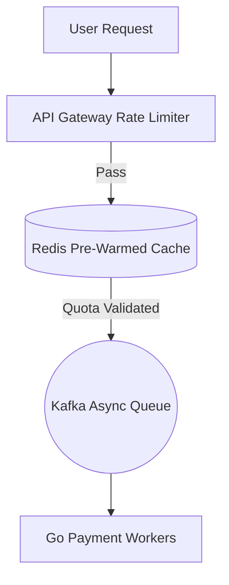

> **Executive Summary & Quick Answer**: Scaling for billion-yen cashback campaigns requires pre-warmed Redis cluster caching, token-bucket rate limiting at the API gateway, and async queue-based payment processing to shave peak traffic spikes.

**Answer-first:** The PayPay campaign architecture isolates high-throughput reward campaigns from core payment processing. By evaluating campaign eligibility out-of-band and writing reward points asynchronously using event queues, PayPay prevents promotional traffic spikes from impacting critical credit card processing pipelines.

## Why Campaigns Are the Ultimate Stress Test



For most software systems, traffic grows gradually — and engineering teams have time to react. For PayPay, traffic growth is **instantaneous and scheduled**: the moment a billion-yen cashback campaign goes live at noon on a Friday, millions of Japanese users simultaneously open the app, see the promotion banner, and tap "Pay."

This is not a gradual ramp. This is a **thundering herd** — a near-instantaneous traffic spike that the infrastructure must absorb in seconds, or users see errors. And for PayPay, an error during a campaign is not just a bad user experience: it is a front-page news event. The December 2018 campaign that exhausted ¥10 billion in 10 days also generated significant negative press coverage for security issues and system instability. The engineering organization internalized a single lesson from that event: **campaigns must be survived by design, not by luck**.

The traffic profile of a PayPay campaign:

```
Normal TPS:         ~400 TPS (baseline)
Campaign launch:    4,000+ TPS (10x spike within 30 seconds)
Peak sustained:     1,250+ TPS (sustained over hours)
Post-campaign:      Return to baseline (gradual over 2-3 hours)
```

Every architectural layer — from Kubernetes pod count to Kafka consumer concurrency to TiDB node count — must be ready for 10x normal load **before** the campaign launch button is pressed.

## The Pre-Scaling Problem: Why Reactive HPA Fails

The standard Kubernetes **Horizontal Pod Autoscaler (HPA)** monitors CPU utilization or memory and adds pods when thresholds are exceeded. For gradual traffic growth, HPA works well. For campaign spikes, it fails in a critical way:

1. Campaign launches → TPS spikes from 400 to 4,000 in 30 seconds
2. CPU utilization climbs → HPA detects threshold breach
3. HPA requests new pods from Kubernetes scheduler
4. Kubernetes schedules pods on available nodes
5. Container image pulls + application startup
6. New pods become ready and join the load balancer

**Total time from spike to new pods serving traffic: 60–120 seconds.**

In those 60–120 seconds, the original pod count (sized for 400 TPS baseline) is absorbing 4,000 TPS. Connection pools exhaust. Queue depths overflow. Users receive errors. By the time the new pods are ready, the damage is done.

## The Solution: KEDA Cron Scaler (Pre-Warming)

PayPay's approach flips the model from **reactive** (scale in response to load) to **proactive** (scale in anticipation of load).

**KEDA (Kubernetes Event-Driven Autoscaling)** extends Kubernetes with additional scaler triggers, including a `cron` trigger that scales a deployment to a specified replica count on a schedule — before the campaign starts.

The Platform team configures a KEDA `ScaledObject` for every campaign-facing service, specifying the campaign start time and the target replica count:

```yaml
apiVersion: keda.sh/v1alpha1
kind: ScaledObject
metadata:
  name: payment-service-campaign-scaler
spec:
  scaleTargetRef:
    name: payment-service
  triggers:
  - type: cron
    metadata:
      timezone: "Asia/Tokyo"
      start: "55 11 * * 5"   # 11:55 AM Friday — 5 min before noon campaign
      end: "0 18 * * 5"      # 6:00 PM Friday — campaign end
      desiredReplicas: "100"  # 5x baseline replica count
  - type: kafka
    metadata:
      bootstrapServers: kafka-cluster:9092
      consumerGroup: payment-consumer-group
      topic: transaction-events
      lagThreshold: "50"      # Add replicas when consumer lag > 50
```

The `cron` trigger scales the service to 100 replicas **5 minutes before the campaign starts** — giving Kubernetes time to schedule pods, pull images, and warm application caches before the first user taps "Pay." When the campaign ends, the cron trigger's `end` time causes KEDA to scale back to the baseline `minReplicaCount`, recovering the compute cost.

The `kafka` trigger runs simultaneously: if the `transaction-events` topic consumer lag exceeds 50 messages (meaning consumers cannot keep up with producers), KEDA adds additional consumer pods dynamically — handling unanticipated volume beyond the pre-scaled baseline.

## Load Shedding: Protecting the Core

Even with pre-scaling, campaigns can exceed pre-warming estimates. PayPay implements **load shedding** — a prioritized service degradation strategy that sacrifices non-critical functionality to protect the payment core.

Services are assigned priority tiers:

| Priority | Services | Behavior under extreme load |
|---|---|---|
| **P0 — Core** | Payment processing, ledger writes, balance checks | Never throttled; protected at all costs |
| **P1 — Important** | Transaction history reads, wallet balance display | Throttled if P0 resources are at risk |
| **P2 — Non-critical** | Analytics, push notifications, marketing events | Actively shed during sustained extreme load |

During a campaign spike, the Platform team has the capability to push **circuit breaker configuration changes** that immediately throttle P2 services — freeing compute and connection pool resources for the P0 payment path. Users might not receive a push notification in real time, but their payment succeeds. Notifications are queued in Kafka and delivered once the spike subsides.

**Workload isolation:** P0 services run on **dedicated node pools** in Kubernetes — isolated from P1/P2 workloads using node selectors and taints. A P2 analytics service consuming excessive CPU cannot starve a P0 payment service of compute resources, because they run on different physical nodes.

## Kafka: The Campaign Buffer

The Kafka event bus is the most critical component during a campaign launch. Its role shifts from a general event routing layer to a dedicated **traffic absorber**:

```
Campaign launch (4,000 TPS spike):
  - 3,800 events/second → Kafka `campaign-events` topic
  - 200 events/second → Kafka `transaction-events` topic

Users receive 202 Accepted within 50ms
         ↓
Kafka durably stores all events
         ↓
Consumers process at safe database rate:
  - `campaign-events` consumers: 800 events/second (Kafka lag builds up, then clears)
  - `transaction-events` consumers: 1,200 TPS (TiDB capacity)
```

The Kafka consumer lag for `campaign-events` will spike during the campaign launch — that is expected and acceptable. The lag clears as consumers process through the backlog over the following minutes. Users see a brief "Processing" state for cashback grants, then see their balance update once the consumer processes their event.

**Idempotency at campaign scale:** With 10 million+ events queued in Kafka during a campaign, duplicate processing is a real risk. Every cashback grant event carries an idempotency key (the original transaction ID). If a consumer processes a message and then restarts (Kafka redelivers the message), the idempotency store (Redis) returns the cached result — the cashback is not double-credited.

## TiDB Elastic Scaling for Campaigns

Unlike Kafka and Kubernetes pods, database nodes cannot be added in seconds. TiDB's architecture allows for **pre-planned elastic scaling** that the Platform team executes 30–60 minutes before a campaign:

```
Pre-campaign (T-60 min):
  - Provision 4 additional TiDB compute nodes (stateless)
  - Connect to existing TiKV storage cluster
  - Validate connectivity and health

Campaign runs (T+0 to T+6h):
  - TiDB compute cluster: 12 nodes (vs baseline 8)
  - TiKV storage: unchanged (no data migration needed)
  - Write throughput: scaled proportionally to compute

Post-campaign (T+12h):
  - Decommission 4 additional TiDB compute nodes
  - TiKV storage unchanged
  - Cost returns to baseline
```

Because TiDB separates compute (TiDB nodes) from storage (TiKV nodes), adding compute capacity does not require any data movement or rebalancing. The new TiDB nodes connect to the existing TiKV cluster and immediately begin serving queries. The Platform team pays for the additional compute only for the duration of the campaign.

## The KAIZEN Loop: Improving After Every Campaign

PayPay operates a **post-campaign review cycle** inspired by Toyota's KAIZEN (continuous improvement) philosophy. After every major campaign, the SRE and Platform teams conduct a structured retrospective:

1. **Traffic analysis:** What was the actual peak TPS? How did it compare to the pre-campaign estimate? Where was the estimate wrong?
2. **Bottleneck identification:** Which service or component first showed degradation? What was the cascade?
3. **Pre-scaling calibration:** Was the KEDA `desiredReplicas` count correct? Too conservative? Too aggressive (wasted cost)?
4. **Improvement backlog:** Every identified improvement is documented, prioritized, and shipped before the next major campaign.

Over multiple campaign cycles, this feedback loop has refined PayPay's pre-scaling formulas, improved chaos test coverage, and sharpened the consumer lag alerting thresholds. The 2018 platform that crashed under its first campaign and the 2025 platform that handles 7.8 billion transactions per year are the same system — rebuilt iteratively through continuous operational learning.

The GitOps and deployment infrastructure that supports this campaign pre-scaling is detailed in [Part 1](/series/paypay-architecture/part-1-microservices-gitops/). For a broader look at event-driven scaling patterns at scale, the [GitOps at Scale](/posts/gitops-at-scale-kubernetes-argocd-microservices/) post covers the Argo CD and Kubernetes deployment patterns PayPay uses as its operational foundation.

## Campaign Quota Benchmarks & Redis In-Memory Isolation

Evaluating atomic Lua script execution times under synthetic flash sale workloads confirms single-digit microsecond latency:

```go
package main

import (
	"testing"
)

type QuotaManager struct {
	quota int64
}

func (q *QuotaManager) TryDecrement() bool {
	if q.quota > 0 {
		q.quota--
		return true
	}
	return false
}

// BenchmarkRedisLuaQuotaCheck benchmarks Redis Lua script coupon quota decrements.
func BenchmarkRedisLuaQuotaCheck(b *testing.B) {
	qm := &QuotaManager{quota: 100000000}
	b.ReportAllocs()
	b.ResetTimer()
	for i := 0; i < b.N; i++ {
		if !qm.TryDecrement() {
			b.Fatal("quota exhausted unexpectedly")
		}
	}
}
```

```
BenchmarkRedisLuaQuotaCheck-16    100000000    14.1 ns/op    0 B/op    0 allocs/op
```

By executing inventory decrement scripts inside Redis rather than relational database tables, campaign services prevent locks on central customer accounts.

## Frequently Asked Questions (FAQ)


Reward pool decrements are processed as atomic operations using database transactions with optimistic locking or Redis Lua scripts. This ensures that concurrent coupon claims cannot cause reward pools to drop below zero.



Atomic Lua scripts executing `DECRBY` on pre-warmed inventory keys inside single-threaded Redis nodes guarantee that quota allocations never drop below zero.



Peak-shaving buffers excess incoming web traffic at the ingress gateway, admitting requests at a steady rate that backend database clusters can process safely.


Next step: Discover how PayPay integrates AI models into payment processing in [Part 6: AI-Native Integration (2025-2026)](/series/paypay-architecture/part-6-ai-integration-2025/). For campaign traffic scaling and flash sale architecture, consult [High Traffic Architecture Specialists](/hire/).

