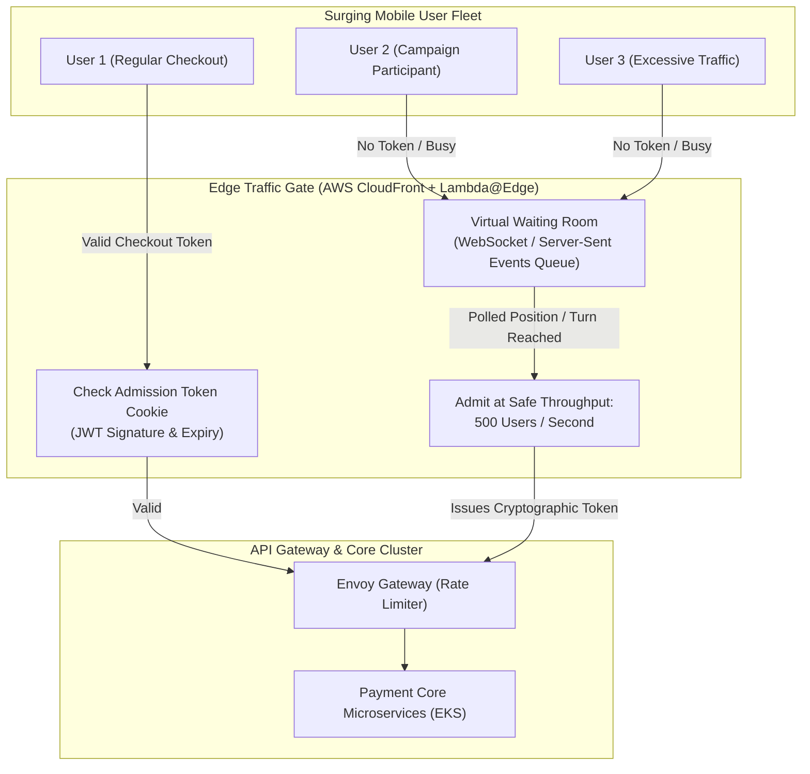
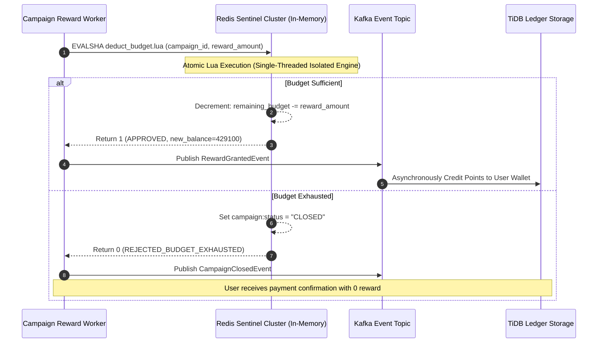

> **Multi-Language Edition:** This chapter is also available in Vietnamese at [Phần 5: Cỗ Máy Chiến Dịch — Sống Sót Qua Cơn Bão 10 Tỷ Yên & Phòng Chờ Ảo (learn.tanhdev.com)](https://learn.tanhdev.com/series/paypay-architecture/part-5-campaign-architecture/).

[Previous Chapter: Part 4 — SRE Practices & Chaos Engineering](/series/paypay-architecture/part-4-sre-chaos-engineering/) | [Series Hub](/series/paypay-architecture/) | [Next Chapter: Part 6 — AI Platform: Real-Time Fraud & LLM Hub](/series/paypay-architecture/part-6-ai-integration-2025/)

---

> **Answer-First:** Handling viral promotional spikes like the historic *"10-Billion Yen Campaign"* requires safeguarding core payment processing from promotional logic overload. PayPay achieves this through a multi-tier defense: **Edge Virtual Waiting Rooms** buffer traffic surges at CloudFront, admitting users only at backend processing capacity; **Atomic Redis Lua scripts** track finite campaign budgets in sub-millisecond memory to prevent budget overruns; and **Two-Phase Reward Decoupling** isolates the synchronous payment checkout from deferred cashback calculations via Kafka, verified by **automated end-of-day three-way reconciliation**.

---

## 1. The Anatomy of a Mega-Campaign Traffic Spike

In December 2018, PayPay announced its landmark promotion: a 20% cashback grant on every transaction until a cumulative **10 Billion Yen ($90M+ USD)** pool was depleted. The market response was volcanic:
- Traffic surged from an initial baseline of 150 TPS to **over 2,500 TPS within 30 seconds**.
- Millions of shoppers rushed electronics retailers simultaneously to buy laptops and cameras, triggering massive concurrent ledger updates.
- Traditional relational databases locking single customer balances and global campaign counter rows collapsed under lock contention.

To survive subsequent mega-campaigns, PayPay re-architected promotional logic around two strict non-negotiable rules:
1. **Core Payment Invariance:** The act of paying a merchant must never fail simply because the promotional reward system is overloaded.
2. **Zero Budget Overrun:** The campaign must terminate instantaneously the microsecond the allocated budget reaches zero.

---

## 2. Edge Virtual Waiting Room & Traffic Shaving

Rather than allowing millions of simultaneous HTTP connections to bombard backend Kubernetes pods, PayPay deploys an **Edge Virtual Waiting Room** at CloudFront and Envoy:


```mermaid
flowchart TD
    subgraph Users["Surging Mobile User Fleet"]
        U1["User 1 (Regular Checkout)"]
        U2["User 2 (Campaign Participant)"]
        U3["User 3 (Excessive Traffic)"]
    end

    subgraph EdgeLayer["Edge Traffic Gate (AWS CloudFront + Lambda@Edge)"]
        CHECK["Check Admission Token Cookie<br/>(JWT Signature & Expiry)"]
        QUEUE["Virtual Waiting Room<br/>(WebSocket / Server-Sent Events Queue)"]
        ADMIT["Admit at Safe Throughput:<br/>500 Users / Second"]
    end

    subgraph GatewayTier["API Gateway & Core Cluster"]
        GW["Envoy Gateway (Rate Limiter)"]
        PAY_CORE["Payment Core Microservices (EKS)"]
    end

    U1 -->|Valid Checkout Token| CHECK
    U2 -->|No Token / Busy| QUEUE
    U3 -->|No Token / Busy| QUEUE

    CHECK -->|Valid| GW
    QUEUE -->|Polled Position / Turn Reached| ADMIT
    ADMIT -->|Issues Cryptographic Token| GW

    GW --> PAY_CORE
```

### Waiting Room Mechanics:
1. **Cryptographic Admission Tokens:** When traffic exceeds cluster baseline thresholds, unauthenticated requests are redirected to a lightweight static CDN queue page.
2. **Deterministic Queue Ordering:** The user receives a cryptographically signed JWT containing their queue sequence number and estimated wait time.
3. **Controlled Admission Rate:** Backend orchestrators monitor TiDB CPU utilization and database write latencies. If downstream resources are healthy, the gate admits fixed user tranches (e.g., 500 requests/second) by issuing an admission cookie valid for 15 minutes.

---

## 3. Real-Time Budget Tracking & Over-Allocation Prevention

A lethal vulnerability in viral cashback campaigns is **concurrent race conditions leading to budget over-allocation**. If two transactions check the remaining balance concurrently (`balance > 0`), both might approve rewards that together exceed the 10-billion-yen ceiling.

PayPay eliminates this race condition by executing budget checks and deductions within an **atomic Redis Lua Script**:


```mermaid
sequenceDiagram
    autonumber
    participant App as Campaign Reward Worker
    participant Redis as Redis Sentinel Cluster (In-Memory)
    participant Kafka as Kafka Event Topic
    participant DB as TiDB Ledger Storage

    App->>Redis: EVALSHA deduct_budget.lua (campaign_id, reward_amount)
    Note over Redis: Atomic Lua Execution (Single-Threaded Isolated Engine)

    alt Budget Sufficient
        Redis-->>Redis: Decrement: remaining_budget -= reward_amount
        Redis-->>App: Return 1 (APPROVED, new_balance=429100)
        App->>Kafka: Publish RewardGrantedEvent
        Kafka->>DB: Asynchronously Credit Points to User Wallet
    else Budget Exhausted
        Redis-->>Redis: Set campaign:status = "CLOSED"
        Redis-->>App: Return 0 (REJECTED_BUDGET_EXHAUSTED)
        App->>Kafka: Publish CampaignClosedEvent
        Note over App, DB: User receives payment confirmation with 0 reward
    end
```

### Production Redis Lua Script: Atomic Budget Deduct

```lua
-- Atomic Campaign Budget Deduct Script
-- KEYS[1]: campaign:budget:{campaign_id}
-- KEYS[2]: campaign:status:{campaign_id}
-- ARGV[1]: requested_deduction_amount

local current_budget = redis.call('GET', KEYS[1])
local current_status = redis.call('GET', KEYS[2])

if current_status == 'CLOSED' or not current_budget then
    return 0 -- Campaign already closed
end

local budget_num = tonumber(current_budget)
local deduct_num = tonumber(ARGV[1])

if budget_num >= deduct_num then
    local remaining = redis.call('DECRBY', KEYS[1], deduct_num)
    if remaining <= 0 then
        redis.call('SET', KEYS[2], 'CLOSED')
        redis.call('PUBLISH', 'campaign:lifecycle:events', 'CAMPAIGN_EXHAUSTED')
    end
    return 1 -- Approved
else
    -- Insufficient remaining budget to satisfy full reward
    redis.call('SET', KEYS[2], 'CLOSED')
    redis.call('PUBLISH', 'campaign:lifecycle:events', 'CAMPAIGN_EXHAUSTED')
    return 0 -- Rejected
end
```

Because Redis executes Lua scripts as single-threaded atomic operations, no two concurrent requests can evaluate `budget_num` simultaneously, completely eliminating over-granting.

---

## 4. Two-Phase Reward Decoupling & Automated Reconciliation

To prevent marketing reward calculation delays from stalling payment execution, PayPay separates checkout into **Two Distinct Lifecycle Phases**:

```
Phase 1: Synchronous Payment Authorization (< 35ms)
┌───────────────────────────────────────────────────────────┐
│ App ──► API Gateway ──► Core Wallet Service ──► TiDB Lock │
│ Result: Payment Authorized, HTTP 200 returned immediately │
└───────────────────────────────────────────────────────────┘
                           │ (Emits PaymentCompletedEvent via Outbox)
                           ▼
Phase 2: Deferred Cashback Calculation (< 1500ms)
┌───────────────────────────────────────────────────────────┐
│ Kafka Consumer ──► Promo Engine ──► Deduct Budget Lua     │
│ Result: Points Credited Asynchronously to Rewards Account  │
└───────────────────────────────────────────────────────────┘
```

### End-of-Day Three-Way Financial Reconciliation

Every night at 02:00 JST, automated batch jobs execute **three-way cryptographic ledger reconciliation**:

1. **PayPay Internal Ledger:** All debit and credit rows recorded in TiDB.
2. **Merchant Terminal Clearing Files:** Aggregated settlement logs uploaded by physical store POS networks.
3. **Banking Network Logs (Zengin-net / Credit Card CAFIS):** External bank settlement statements.

A distributed MapReduce job running across Spark and TiFlash compares transaction IDs, gross amounts, and fees. Any discrepancy greater than 0.01 JPY is flagged and routed to the automated finance arbitration queue for manual SRE review.

---

## Frequently Asked Questions


PayPay prevents budget overruns by centralizing the campaign balance in Redis using an atomic Lua script (`EVALSHA`):
- Since Redis executes Lua scripts sequentially and atomically without interleaving, no two requests can read the same budget value simultaneously.
- When the remaining balance drops below the requested grant amount, the script sets the campaign status to `CLOSED` and broadcasts an event to edge caches, instantly terminating the promotion globally within 5 milliseconds.



The virtual queue system is resilient to disconnections:
- The user's queue position is stored both in an encrypted JWT cookie on the client device and as a lightweight timestamp in a distributed sorted set (ZSET) on the server.
- If the mobile app disconnects or the user refreshes their browser, the client re-presents the cryptographic token upon reconnection. The edge gate reads the original timestamp, seamlessly restoring the user to their exact place in line without penalty.



Discrepancies are resolved through automated three-way reconciliation:
- During nightly batch settlement, PayPay matches internal ledger rows with merchant POS journal dumps.
- If a terminal recorded a transaction that failed to receive a confirmation ACK from PayPay (e.g., due to mobile network timeout), the transaction is verified against external bank network logs. If the customer's account was debited, the transaction is recognized; otherwise, an automated reversal compensation workflow is initiated.


---

[Previous Chapter: Part 4 — SRE Practices & Chaos Engineering](/series/paypay-architecture/part-4-sre-chaos-engineering/) | [Series Hub](/series/paypay-architecture/) | [Next Chapter: Part 6 — AI Platform: Real-Time Fraud & LLM Hub](/series/paypay-architecture/part-6-ai-integration-2025/)
