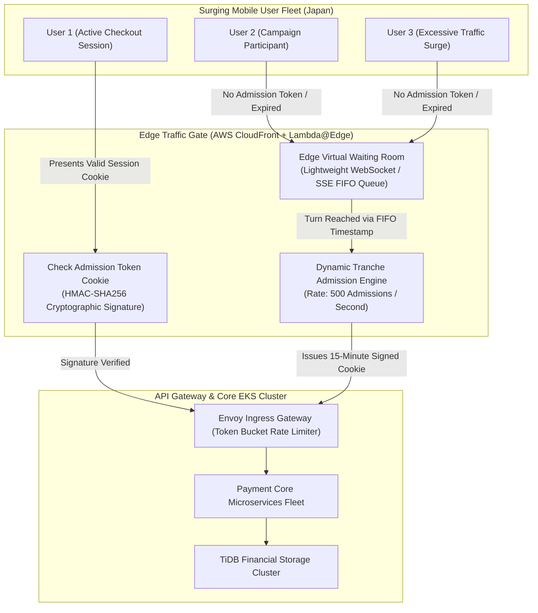
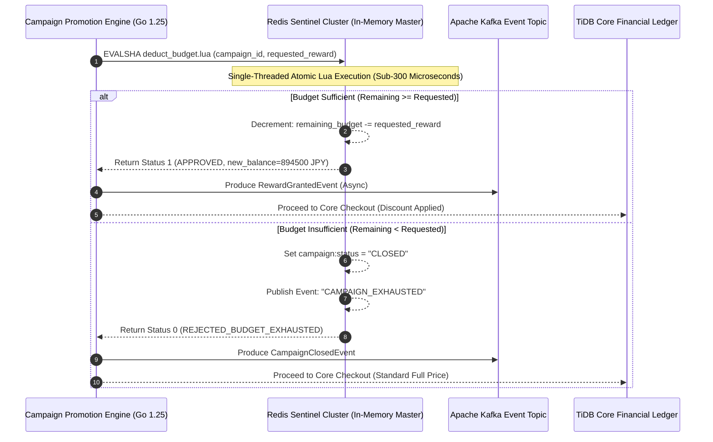
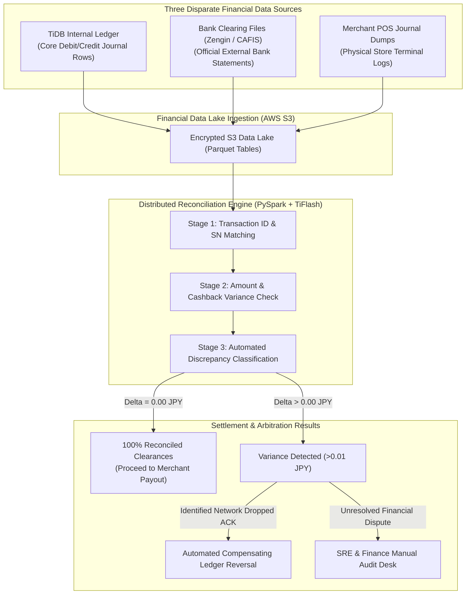

[Previous Chapter: Part 4 — SRE Practices & Chaos Engineering](/series/paypay-architecture/part-4-sre-chaos-engineering/) | [Series Hub](/series/paypay-architecture/) | [Next Chapter: Part 6 — AI Platform: Real-Time Fraud & LLM Hub](/series/paypay-architecture/part-6-ai-integration-2025/)

---

> **Answer-first:** Handling viral traffic spikes during nationwide cashback promotions without compromising core payment reliability requires decoupling promotional logic from financial checkouts. PayPay accomplishes this via **Edge Virtual Waiting Rooms** to throttle traffic bursts, single-threaded **atomic Redis Lua scripts** that prevent budget overruns in sub-millisecond memory, and asynchronous reward crediting reconciled via **daily three-way automated audit pipelines**.

> **Prerequisite:** Thorough understanding of high-throughput cache race conditions, Redis single-threaded Lua atomic execution, token bucket rate limiting, and double-entry accounting reconciliation.

---

## 1. The Anatomy of a Mega-Campaign Traffic Surge

In December 2018, PayPay ignited Japan's cashless revolution with its historic *"10-Billion Yen Giveaway"* (100億円あげちゃうキャンペーン). The campaign offered consumers an unprecedented 20% cashback grant on every transaction, alongside a 1-in-40 chance of winning a full 100% refund up to 100,000 Yen.

The public reaction overwhelmed national telecommunications networks:
- Traffic surged from a normal baseline of 150 transactions per second (TPS) to **over 2,500 TPS in less than 30 seconds**.
- Millions of shoppers converged on electronics retailers across Tokyo and Osaka simultaneously, attempting to buy high-ticket goods before the 10-billion-yen pool exhausted.
- Relational database connections stalled under extreme row-level lock contention on global campaign counter tables. The initial database cluster collapsed under the sudden flood of concurrent balance mutations.

To survive future nationwide promotional campaigns without service degradation, PayPay's engineering leadership established two inviolable architectural doctrines:

```
Core Campaign Engineering Invariants:
┌─────────────────────────────────────────────────────────────┐
│ 1. Core Payment Independence:                               │
│ The act of purchasing goods at a convenience store must     │
│ NEVER fail or time out because the marketing cashback engine│
│ is overloaded or unreachable.                               │
├─────────────────────────────────────────────────────────────┤
│ 2. Microsecond Zero-Overrun Guarantee:                      │
│ When a promotional budget ceiling is reached (e.g. 10B Yen),│
│ the promotion must terminate globally within milliseconds.  │
│ Over-allocating budget is a catastrophic financial loss.    │
└─────────────────────────────────────────────────────────────┘
```

---

## 2. Edge Virtual Waiting Room & Traffic Shaving

Rather than permitting millions of simultaneous mobile app requests to flood the Kubernetes ingress gateways and exhaust database connection pools, PayPay deploys an **Edge Virtual Waiting Room** using AWS CloudFront, Lambda@Edge, and Envoy:


```mermaid
flowchart TD
    subgraph Users["Surging Mobile User Fleet (Japan)"]
        U1["User 1 (Active Checkout Session)"]
        U2["User 2 (Campaign Participant)"]
        U3["User 3 (Excessive Traffic Surge)"]
    end

    subgraph EdgeLayer["Edge Traffic Gate (AWS CloudFront + Lambda@Edge)"]
        CHECK["Check Admission Token Cookie<br/>(HMAC-SHA256 Cryptographic Signature)"]
        QUEUE["Edge Virtual Waiting Room<br/>(Lightweight WebSocket / SSE FIFO Queue)"]
        ADMIT["Dynamic Tranche Admission Engine<br/>(Rate: 500 Admissions / Second)"]
    end

    subgraph GatewayTier["API Gateway & Core EKS Cluster"]
        GW["Envoy Ingress Gateway (Token Bucket Rate Limiter)"]
        PAY_CORE["Payment Core Microservices Fleet"]
        TIDB["TiDB Financial Storage Cluster"]
    end

    U1 -->|Presents Valid Session Cookie| CHECK
    U2 -->|No Admission Token / Expired| QUEUE
    U3 -->|No Admission Token / Expired| QUEUE

    CHECK -->|Signature Verified| GW
    QUEUE -->|Turn Reached via FIFO Timestamp| ADMIT
    ADMIT -->|Issues 15-Minute Signed Cookie| GW

    GW --> PAY_CORE
    PAY_CORE --> TIDB
```

### Architectural Mechanics of the Edge Waiting Room

1. **Cryptographic Admission Verification:** When an HTTP request reaches CloudFront, a lightweight Lambda@Edge function inspects the request headers for an encrypted `paypay_admission_jwt` cookie. If the token contains a valid cryptographic signature signed by the platform private key and is within its 15-minute validity window, the request routes directly to the origin Envoy Gateway.
2. **Deterministic FIFO Queue Placement:** If no valid cookie exists and backend telemetry indicates that cluster load exceeds target thresholds (e.g., ingress P99 latency > 40ms or TiDB CPU > 65%), the user is redirected to a static HTML waiting room hosted across global edge CDN nodes. The user's client establishes a lightweight Server-Sent Events (SSE) or WebSocket connection, receiving a deterministic queue position based on monotonic entry timestamps.
3. **Dynamic Feedback Admission Rate:** An automated platform controller continuously monitors downstream TiKV disk queues and gRPC thread pools. When downstream capacity is available, the controller opens the gate, admitting users in controlled tranches (e.g., 500 users/second) by issuing signed admission cookies.

---

## 3. Real-Time Budget Tracking & Atomic Lua Execution

The most hazardous vulnerability during nationwide promotions is the **concurrent race condition leading to budget over-allocation**. If multiple transaction workers query the remaining budget concurrently (`SELECT budget WHERE budget > 0`), all workers might observe a positive balance and approve discounts that collectively exceed the budget ceiling by millions of Yen.

PayPay eliminates this concurrency hazard by executing budget tracking in an **in-memory atomic Redis Lua Script**:


```mermaid
sequenceDiagram
    autonumber
    participant App as Campaign Promotion Engine (Go 1.25)
    participant Redis as Redis Sentinel Cluster (In-Memory Master)
    participant Kafka as Apache Kafka Event Topic
    participant Ledger as TiDB Core Financial Ledger

    App->>Redis: EVALSHA deduct_budget.lua (campaign_id, requested_reward)
    Note over Redis: Single-Threaded Atomic Lua Execution (Sub-300 Microseconds)

    alt Budget Sufficient (Remaining >= Requested)
        Redis-->>Redis: Decrement: remaining_budget -= requested_reward
        Redis-->>App: Return Status 1 (APPROVED, new_balance=894500 JPY)
        App->>Kafka: Produce RewardGrantedEvent (Async)
        App-->>Ledger: Proceed to Core Checkout (Discount Applied)
    else Budget Insufficient (Remaining < Requested)
        Redis-->>Redis: Set campaign:status = "CLOSED"
        Redis-->>Redis: Publish Event: "CAMPAIGN_EXHAUSTED"
        Redis-->>App: Return Status 0 (REJECTED_BUDGET_EXHAUSTED)
        App->>Kafka: Produce CampaignClosedEvent
        App-->>Ledger: Proceed to Core Checkout (Standard Full Price)
    end
```

### Production Redis Lua Script: Atomic Budget Deduct

```lua
-- Atomic Campaign Budget Deduct Script
-- KEYS[1]: campaign:budget:{campaign_id}
-- KEYS[2]: campaign:status:{campaign_id}
-- ARGV[1]: requested_deduction_amount (Integer Yen)

local current_status = redis.call('GET', KEYS[2])
if current_status == 'CLOSED' then
    return 0 -- Campaign already terminated globally
end

local current_budget = redis.call('GET', KEYS[1])
if not current_budget then
    return -1 -- Campaign key missing or uninitialized
end

local budget_num = tonumber(current_budget)
local deduct_num = tonumber(ARGV[1])

if budget_num >= deduct_num then
    local remaining = redis.call('DECRBY', KEYS[1], deduct_num)
    if remaining <= 0 then
        redis.call('SET', KEYS[2], 'CLOSED')
        redis.call('PUBLISH', 'campaign:lifecycle:events', 'CAMPAIGN_EXHAUSTED')
    end
    return 1 -- Approved: Budget deducted successfully
else
    -- Budget exhausted: Mark closed immediately to reject subsequent callers
    redis.call('SET', KEYS[2], 'CLOSED')
    redis.call('PUBLISH', 'campaign:lifecycle:events', 'CAMPAIGN_EXHAUSTED')
    return 0 -- Rejected: Insufficient budget
end
```

Because Redis executes Lua scripts sequentially on a single thread, no two concurrent requests can evaluate or decrement `budget_num` simultaneously. Memory execution occurs in 150 to 300 microseconds, completely eliminating database row-lock contention.

---

## 4. Production Go 1.25+ Campaign Engine Implementation

Below is the complete Go 1.25+ production Campaign Engine. It manages Redis Sentinel connection pooling, preloads Lua script SHA hashes (`redisClient.ScriptLoad`), evaluates campaign rewards, publishes grant events asynchronously to Kafka, and incorporates automated graceful fallbacks if Redis experiences degraded connectivity:

```go
// Package campaign implements high-throughput, atomic promotional budget management for PayPay.
package campaign

import (
	"context"
	"crypto/sha1"
	"encoding/hex"
	"encoding/json"
	"errors"
	"fmt"
	"log/slog"
	"time"

	"github.com/IBM/sarama"
	"github.com/redis/go-redis/v9"
)

type EvaluationResult int

const (
	ResultRejectedExhausted EvaluationResult = 0
	ResultApproved          EvaluationResult = 1
	ResultCampaignMissing   EvaluationResult = -1
	ResultFallbackBypass    EvaluationResult = -2
)

type RewardGrantedEvent struct {
	EventID       string    `json:"event_id"`
	CampaignID    string    `json:"campaign_id"`
	UserID        int64     `json:"user_id"`
	TransactionSN string    `json:"transaction_sn"`
	RewardAmount  int64     `json:"reward_amount"`
	Timestamp     time.Time `json:"timestamp"`
}

type Engine struct {
	logger        *slog.Logger
	redisClient   *redis.Client
	kafkaProducer sarama.SyncProducer
	kafkaTopic    string
	luaSHA        string
}

const deductLuaScript = `
local current_status = redis.call('GET', KEYS[2])
if current_status == 'CLOSED' then
    return 0
end
local current_budget = redis.call('GET', KEYS[1])
if not current_budget then
    return -1
end
local budget_num = tonumber(current_budget)
local deduct_num = tonumber(ARGV[1])
if budget_num >= deduct_num then
    local remaining = redis.call('DECRBY', KEYS[1], deduct_num)
    if remaining <= 0 then
        redis.call('SET', KEYS[2], 'CLOSED')
        redis.call('PUBLISH', 'campaign:lifecycle:events', 'CAMPAIGN_EXHAUSTED')
    end
    return 1
else
    redis.call('SET', KEYS[2], 'CLOSED')
    redis.call('PUBLISH', 'campaign:lifecycle:events', 'CAMPAIGN_EXHAUSTED')
    return 0
end
`

func NewEngine(
	logger *slog.Logger,
	redisClient *redis.Client,
	kafkaProducer sarama.SyncProducer,
	kafkaTopic string,
) (*Engine, error) {
	ctx, cancel := context.WithTimeout(context.Background(), 5*time.Second)
	defer cancel()

	sha, err := redisClient.ScriptLoad(ctx, deductLuaScript).Result()
	if err != nil {
		return nil, fmt.Errorf("failed to preload campaign deduct Lua script: %w", err)
	}

	logger.Info("campaign Lua script successfully loaded into Redis", slog.String("sha", sha))

	return &Engine{
		logger:        logger,
		redisClient:   redisClient,
		kafkaProducer: kafkaProducer,
		kafkaTopic:    kafkaTopic,
		luaSHA:        sha,
	}, nil
}

// EvaluateAndDeduct attempts atomic deduction; if Redis fails, it falls back safely without blocking checkout.
func (e *Engine) EvaluateAndDeduct(
	ctx context.Context,
	campaignID string,
	userID int64,
	txSN string,
	requestedReward int64,
) (EvaluationResult, error) {
	budgetKey := fmt.Sprintf("campaign:budget:%s", campaignID)
	statusKey := fmt.Sprintf("campaign:status:%s", campaignID)

	evalCtx, cancel := context.WithTimeout(ctx, 250*time.Millisecond)
	defer cancel()

	res, err := e.redisClient.EvalSha(evalCtx, e.luaSHA, []string{budgetKey, statusKey}, requestedReward).Result()
	if err != nil {
		// Degraded Graceful Fallback: Never block core checkout due to Redis failure!
		e.logger.ErrorContext(ctx, "Redis campaign evaluation failed, engaging graceful fallback bypass",
			slog.String("campaign_id", campaignID),
			slog.Int64("user_id", userID),
			slog.String("error", err.Error()),
		)
		return ResultFallbackBypass, nil
	}

	statusInt, ok := res.(int64)
	if !ok {
		return ResultCampaignMissing, errors.New("unexpected non-integer return type from Redis Lua")
	}

	result := EvaluationResult(statusInt)
	if result == ResultApproved {
		e.publishRewardGrantedAsync(campaignID, userID, txSN, requestedReward)
	}

	return result, nil
}

func (e *Engine) publishRewardGrantedAsync(campaignID string, userID int64, txSN string, amount int64) {
	event := RewardGrantedEvent{
		EventID:       fmt.Sprintf("rwd-%s-%d", txSN, time.Now().UnixNano()),
		CampaignID:    campaignID,
		UserID:        userID,
		TransactionSN: txSN,
		RewardAmount:  amount,
		Timestamp:     time.Now().UTC(),
	}

	payload, err := json.Marshal(event)
	if err != nil {
		e.logger.Error("failed to serialize reward event", slog.String("tx_sn", txSN), slog.String("error", err.Error()))
		return
	}

	msg := &sarama.ProducerMessage{
		Topic: e.kafkaTopic,
		Key:   sarama.StringEncoder(fmt.Sprintf("%d", userID)),
		Value: sarama.ByteEncoder(payload),
	}

	// Dispatch message asynchronously without blocking checkout latency
	go func() {
		_, _, sendErr := e.kafkaProducer.SendMessage(msg)
		if sendErr != nil {
			e.logger.Error("failed to dispatch reward event to Kafka",
				slog.String("tx_sn", txSN), slog.String("error", sendErr.Error()))
		}
	}()
}
```

---

## 5. Automated Three-Way Financial Reconciliation Architecture

Because promotional discounts, bank settlement gateways, and mobile checkout operate across asynchronous boundaries, real-world systems must defend against discrepancies caused by transient network splits or consumer failures.

PayPay executes an **Automated Three-Way Financial Reconciliation Pipeline** every night at 02:00 JST:


```mermaid
flowchart TD
    subgraph DataSources["Three Disparate Financial Data Sources"]
        SRC_TIDB["TiDB Internal Ledger<br/>(Core Debit/Credit Journal Rows)"]
        SRC_BANK["Bank Clearing Files (Zengin / CAFIS)<br/>(Official External Bank Statements)"]
        SRC_POS["Merchant POS Journal Dumps<br/>(Physical Store Terminal Logs)"]
    end

    subgraph DataLakeIngress["Financial Data Lake Ingestion (AWS S3)"]
        S3_RAW["Encrypted S3 Data Lake (Parquet Tables)"]
    end

    subgraph ReconEngine["Distributed Reconciliation Engine (PySpark + TiFlash)"]
        STAGE1["Stage 1: Transaction ID & SN Matching"]
        STAGE2["Stage 2: Amount & Cashback Variance Check"]
        STAGE3["Stage 3: Automated Discrepancy Classification"]
    end

    subgraph ResolutionOutput["Settlement & Arbitration Results"]
        MATCH["100% Reconciled Clearances<br/>(Proceed to Merchant Payout)"]
        DISCREP["Variance Detected (>0.01 JPY)"]
        AUTO_REV["Automated Compensating Ledger Reversal"]
        SRE_REV["SRE & Finance Manual Audit Desk"]
    end

    SRC_TIDB --> S3_RAW
    SRC_BANK --> S3_RAW
    SRC_POS --> S3_RAW

    S3_RAW --> STAGE1
    STAGE1 --> STAGE2
    STAGE2 --> STAGE3

    STAGE3 -->|Delta = 0.00 JPY| MATCH
    STAGE3 -->|Delta > 0.00 JPY| DISCREP
    DISCREP -->|Identified Network Dropped ACK| AUTO_REV
    DISCREP -->|Unresolved Financial Dispute| SRE_REV
```

### The Three Reconciliation Pillars

1. **PayPay Internal Ledger:** All debit and credit rows recorded within TiDB during real-time transaction checkouts.
2. **Merchant Terminal Clearing Files:** Aggregated transaction logs uploaded batch-wise by physical store POS terminals and merchant QR gateways at the close of retail hours.
3. **Banking Network Clearing Records:** Formal clearing statements transmitted by the Japanese Zengin Telecommunication System and Credit Card Settlement Gateways (CAFIS).

A distributed reconciliation engine compares every individual transaction across all three sources. If an edge failure occurs—such as a mobile connection dropping after the user's wallet was debited but before the merchant terminal acknowledged receipt—the reconciliation engine detects the discrepancy and automatically generates an audit journal reversal entry, crediting the customer's balance without requiring manual support tickets.

---

## 6. Architectural Trade-offs & Production Hardening

Scaling high-concurrency campaign systems requires explicit operational trade-offs:

| Architecture Dimension | Selected Strategy | Rejected Alternative | Key Rationale |
| :--- | :--- | :--- | :--- |
| **Budget Storage** | Single-threaded Redis Lua In-Memory| Distributed SQL Locking Transaction | Row-lock contention on shared budget records stalls relational database connection pools past 2,500 TPS. |
| **Traffic Throttling** | Edge Virtual Waiting Room (CloudFront)| In-Cluster Nginx Dropping | Drops connection volume at edge CDN boundaries before requests hit Kubernetes ingress infrastructure. |
| **Cashback Grant Lifecycle**| Two-Phase Deferred Asynchronous | Synchronous Payment Checkout Grant | Guarantees user checkout finishes in <35ms; promo engine delays never stall physical merchant payments. |
| **Discrepancy Resolution** | Nightly Three-Way Automated Batch | Synchronous Two-Phase Commit (2PC) | 2PC across external banking networks is impossible due to latency (>500ms) and coordinator locking. |

For real-world architectural blueprints handling massive viral surges, examine our [Alipay Double 11 Architecture & 544k TPS Benchmark](/posts/alipay-double-11-architecture-tps/) and [Surge Pricing Optimization Architecture](/posts/surge-pricing-optimization-architecture/).

---

## Frequently Asked Questions


PayPay prevents budget overruns by centralizing the campaign balance in Redis using an atomic Lua script (`EVALSHA`):
- Since Redis executes Lua scripts sequentially and atomically without interleaving, no two requests can read the same budget value simultaneously.
- When the remaining balance drops below the requested grant amount, the script sets the campaign status to `CLOSED` and broadcasts an event to edge caches, instantly terminating the promotion globally within 5 milliseconds.



The virtual queue system is resilient to disconnections:
- The user's queue position is stored both in an encrypted JWT cookie on the client device and as a lightweight timestamp in a distributed sorted set (ZSET) on the server.
- If the mobile app disconnects or the user refreshes their browser, the client re-presents the cryptographic token upon reconnection. The edge gate reads the original timestamp, seamlessly restoring the user to their exact place in line without penalty.



Discrepancies are resolved through automated three-way reconciliation:
- During nightly batch settlement, PayPay matches internal ledger rows with merchant POS journal dumps.
- If a terminal recorded a transaction that failed to receive a confirmation ACK from PayPay (e.g., due to mobile network timeout), the transaction is verified against external bank network logs. If the customer's account was debited, the transaction is recognized; otherwise, an automated reversal compensation workflow is initiated.



This architectural choice is governed by fundamental database lock contention physics:
- In a distributed relational database (such as MySQL or TiDB), managing a single shared campaign budget requires acquiring an exclusive row-level lock (`SELECT ... FOR UPDATE`). Under high-throughput traffic exceeding 2,500 TPS, thousands of concurrent threads compete for that single row, causing thread pool exhaustion, query timeouts, and cascading connection collapse.
- In contrast, Redis executes Lua scripts in-memory on a single thread. Because there are no context switches or disk I/O operations in the critical path, the script executes in 150 to 300 microseconds. Redis comfortably processes 40,000+ atomic deductions per second on a single node without row locks or race conditions.


---

[Previous Chapter: Part 4 — SRE Practices & Chaos Engineering](/series/paypay-architecture/part-4-sre-chaos-engineering/) | [Series Hub](/series/paypay-architecture/) | [Next Chapter: Part 6 — AI Platform: Real-Time Fraud & LLM Hub](/series/paypay-architecture/part-6-ai-integration-2025/)
