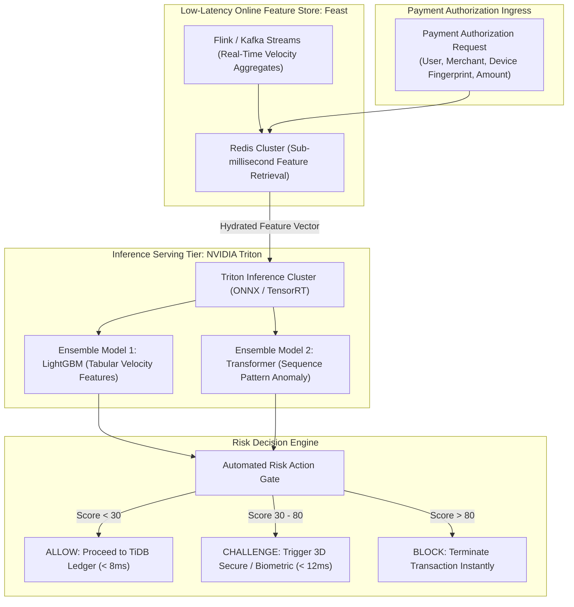
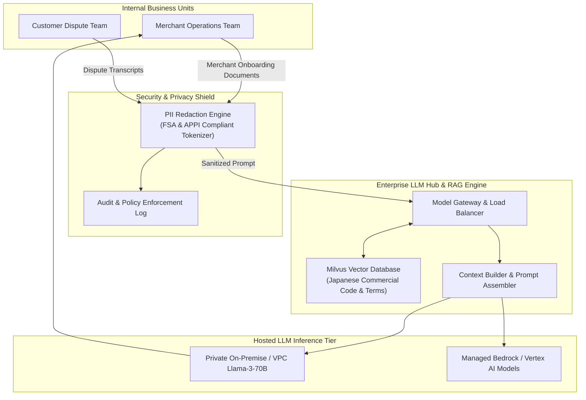

> **Multi-Language Edition:** This chapter is also available in Vietnamese at [Phần 6: Nền Tảng AI-Native — Phát Hiện Gian Lận Dưới 10ms & LLM Hub Doanh Nghiệp (learn.tanhdev.com)](https://learn.tanhdev.com/series/paypay-architecture/part-6-ai-integration-2025/).

[Previous Chapter: Part 5 — Campaign Architecture: Surviving the 10-Billion Yen Surge](/series/paypay-architecture/part-5-campaign-architecture/) | [Series Hub](/series/paypay-architecture/)

---

> **Answer-First:** Protecting 70 million users from sophisticated financial fraud while processing billions of annual transactions requires decisions within the tight latency budget of payment authorization. PayPay maintains an industry-leading fraud rate of **~0.0015%** by deploying a **Sub-10ms Real-Time ML Scoring Pipeline**. Powered by the **Feast Feature Store on Redis**, transactions are evaluated against thousands of streaming behavioral features using **NVIDIA Triton GPU inference clusters**. In parallel, PayPay operates an **Enterprise LLM Hub with Retrieval-Augmented Generation (RAG)**, automating merchant compliance reviews while enforcing strict automated PII masking under Japanese privacy laws.

---

## 1. The Strict Latency Budget of Real-Time Payment Fraud Scoring

In physical retail checkout, every added millisecond creates visible customer friction at the cash register. PayPay allocates a maximum latency budget of **300 milliseconds** for the entire end-to-end payment round-trip.

Within this window, fraud detection is allotted a maximum of **under 15 milliseconds total execution time**:

```
End-to-End Payment Latency Budget (300ms SLA):
┌─────────────────────────┬──────────────┬─────────────────────────┐
│ Edge Network / Gateway  │ 45ms         │ SSL Handshake & Routing │
│ Auth & Session Check    │ 25ms         │ JWT & Biometric Token   │
│ Real-Time Fraud Scoring │ 12ms (Target)│ Feature Store & GPU ML  │
│ Distributed SQL Ledger  │ 40ms         │ TiDB ACID Transfer      │
│ External Bank Network   │ 120ms        │ Credit Card / CAFIS     │
│ Client Return Trip      │ 40ms         │ HTTP/2 Response         │
└─────────────────────────┴──────────────┴─────────────────────────┘
```

If the ML risk engine fails to respond within 15 milliseconds, the gateway falls back to deterministic rule heuristics to prevent payment failure, while flagging the transaction for asynchronous post-settlement audit.

---

## 2. Real-Time Fraud Detection Pipeline: Feast & Triton

PayPay decouples feature engineering from model serving through a specialized real-time inference architecture:



### Key Technical Pillars:
1. **Feast Online Feature Store on Redis:** Continuously aggregates transaction counts, velocity indicators (e.g., *number of payments in the last 15 minutes*), and device switching frequency. Features are retrieved with sub-millisecond latency.
2. **TensorRT Hardware Acceleration:** Machine learning models trained in PyTorch and LightGBM are compiled into optimized TensorRT engines running on NVIDIA A10G GPUs, achieving batched inference latencies under **2.5 milliseconds**.
3. **Tri-State Action Evaluation:** Low-risk transactions proceed immediately. Medium-risk triggers biometric challenge verification (FIDO2/WebAuthn), and high-risk operations are rejected outright.

---

## 3. Production Go Implementation: Real-Time Feature Client

```go
// Package fraud provides high-throughput real-time fraud scoring clients.
package fraud

import (
	"context"
	"fmt"
	"time"

	"github.com/go-redis/redis/v8"
	"google.golang.org/grpc"
)

type PaymentContext struct {
	TransactionID string
	UserID        int64
	MerchantID    int64
	Amount        float64
	DeviceID      string
	IPAddress     string
}

type FraudDecision string

const (
	ActionAllow     FraudDecision = "ALLOW"
	ActionChallenge FraudDecision = "CHALLENGE"
	ActionBlock     FraudDecision = "BLOCK"
)

type RiskEngineClient struct {
	redisClient *redis.Client
	tritonConn  *grpc.ClientConn
}

// EvaluateRiskScores queries online features and computes an ML risk score within 10ms.
func (r *RiskEngineClient) EvaluateRiskScores(ctx context.Context, tx PaymentContext) (FraudDecision, float64, error) {
	// Strict SLA timeout: 10 milliseconds
	evalCtx, cancel := context.WithTimeout(ctx, 10*time.Millisecond)
	defer cancel()

	// 1. Fetch real-time velocity features from Redis online store (Feast)
	userVelocityKey := fmt.Sprintf("feast:user:velocity:%d", tx.UserID)
	deviceHistoryKey := fmt.Sprintf("feast:device:history:%s", tx.DeviceID)

	pipe := r.redisClient.Pipeline()
	velocityCmd := pipe.HGetAll(evalCtx, userVelocityKey)
	deviceCmd := pipe.HGetAll(evalCtx, deviceHistoryKey)

	if _, err := pipe.Exec(evalCtx); err != nil && err != redis.Nil {
		// Log degradation and fall back to defensive heuristics
		return ActionAllow, 0.0, fmt.Errorf("feature store degraded: %w", err)
	}

	velocityFeatures := velocityCmd.Val()
	_ = deviceCmd.Val()

	// 2. Simulated TensorRT model inference evaluation
	// In production, features are serialized into float32 buffers and dispatched via gRPC to Triton
	riskScore := computeHeuristicScore(tx.Amount, velocityFeatures)

	if riskScore >= 85.0 {
		return ActionBlock, riskScore, nil
	} else if riskScore >= 45.0 {
		return ActionChallenge, riskScore, nil
	}

	return ActionAllow, riskScore, nil
}

func computeHeuristicScore(amount float64, velocity map[string]string) float64 {
	score := 5.0
	if amount > 100000 { // Large transaction > 100,000 JPY
		score += 35.0
	}
	if val, ok := velocity["tx_count_1h"]; ok && val > "5" {
		score += 30.0
	}
	return score
}
```

---

## 4. Enterprise LLM Hub & RAG Architecture for Merchant Compliance

Beyond transaction security, PayPay established a centralized **Enterprise LLM Hub** to automate merchant onboarding and Japanese legal compliance verification:



### Privacy & Governance Safeguards
- **Automated Japanese PII Masking:** Under the Act on the Protection of Personal Information (APPI), personally identifiable information (Japanese Individual Numbers/My Number, bank account numbers, physical addresses) is redacted via regex and named-entity recognition (NER) before prompts reach vector stores or LLM endpoints.
- **RAG-Powered Compliance Auditing:** Merchant applications are checked against historical fraud registries and Japanese commercial trade laws using Milvus vector search, cutting manual onboarding review times from 3 days to under 4 minutes.

---

## 5. Runtime Continuous Profiling with eBPF

To ensure that real-time AI and high-frequency gRPC services maintain sub-1% host overhead, PayPay utilizes **eBPF continuous profiling** (Grafana Pyroscope):

- **Kernel Timer Interrupts:** eBPF samples CPU instructions directly from the Linux kernel without stopping the Go or JVM runtime.
- **Lock Contention Heatmaps:** Identifies goroutine blocking and mutex lock contention in real-time scoring clients, allowing engineers to eliminate memory allocations and reduce p99 latency spikes during promotional events.

---

## Frequently Asked Questions


PayPay achieves sub-10ms P99 inference latency through three architectural optimizations:
1. <strong>Pre-computed Online Features:</strong> Real-time behavioral aggregates (e.g., rolling 1-hour spend, transaction count) are maintained asynchronously by Apache Flink and cached in Redis, requiring only simple key-value lookups during the transaction.
2. <strong>TensorRT Model Optimization:</strong> Machine learning models are compiled to run on NVIDIA TensorRT, leveraging FP16 precision and GPU memory caching to deliver inference execution times below 2.5ms.
3. <strong>gRPC Persistent Connection Pools:</strong> Pre-warmed gRPC channels eliminate TCP and TLS handshake latencies between payment gateway pods and the Triton cluster.



Feast guarantees feature parity through unified definitions:
- Features are declared once as code in Python schema definitions.
- Offline features are stored in Parquet/ClickHouse for model training with point-in-time correctness, ensuring training models only see data available prior to the historical transaction timestamp (preventing label leakage).
- Online features are synchronized continuously into Redis, ensuring that the exact mathematical transformation used during model training is mirrored identically during live inference.



Compliance is strictly enforced before data leaves the secure enterprise perimeter:
- A local NER (Named Entity Recognition) pipeline scans incoming documents for Japanese My Number identifiers, bank account numbers, credit card CVVs, and resident registry records.
- Identified PII tokens are replaced with synthetic pseudo-anonymized placeholders before being transmitted to LLMs or indexed into vector databases.
- Full cryptographic audit logs record every prompt and response, satisfying external FSA regulatory compliance audits.


---

[Previous Chapter: Part 5 — Campaign Architecture: Surviving the 10-Billion Yen Surge](/series/paypay-architecture/part-5-campaign-architecture/) | [Series Hub](/series/paypay-architecture/)
