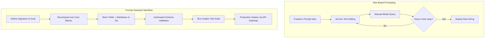
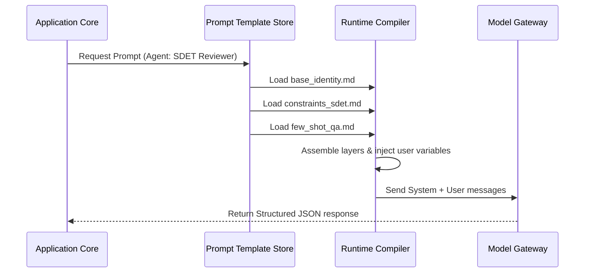
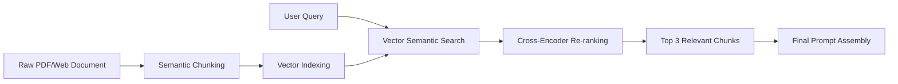
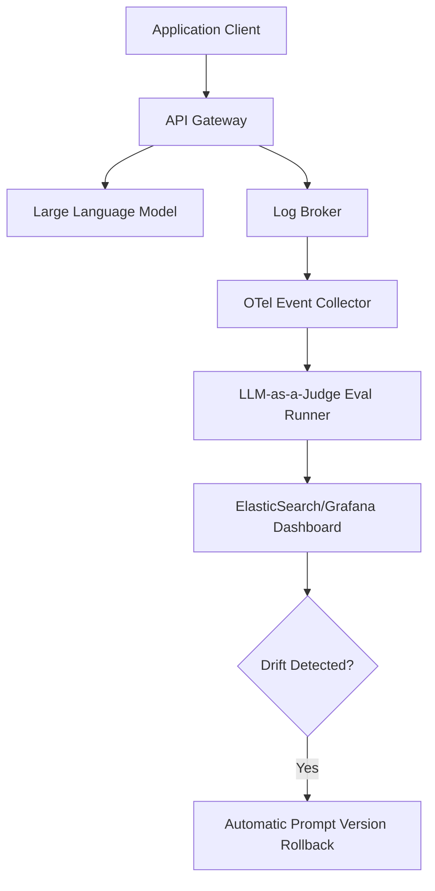

**Answer-first:** The Prompt Standard series establishes an engineering framework to transition teams from vibe-based prompt writing to version-controlled, schema-validated prompt design. By breaking prompts into modular, single-responsibility blocks, organizations can enforce strict output contracts, implement automated CI/CD validation gates, and optimize context token budgets for production-grade LLM applications.

This comprehensive guide is designed for **developers, BAs, PMs, QAs, content creators, accountants, operations staff, and anyone working with AI agents** who wants to move beyond "writing prompts by feel." A good prompt is not just a clever sentence — it is **a working standard that can be reused, tested, versioned, and improved over time.**

---

## Executive Summary — A Quick Look at Prompt Standard

### What Is Prompt Standard?

**Prompt Standard** is a way of standardizing how you write prompts so that AI agents work more reliably, are easier to control, and are easier to reuse across a team.

Instead of each person writing prompts in their own style, Prompt Standard turns prompts into structured operational documents:
- Who the agent is
- What it is allowed to do
- What it must not do
- What process it must follow
- What format it must return results in
- How it must behave when uncertain

In short: Prompt Standard helps teams move from "let's see if the AI understands" to "we set the rules clearly from the start."

### The Big Shift in 2026: Context Engineering

In 2026, the industry evolved from "Prompt Engineering" to **Context Engineering.** The key difference:

| Before (2024–2025) | Now (2026) |
| :--- | :--- |
| "Write a perfect prompt" | "Build a reliable prompt system" |
| Trial-and-error experimentation | Systematic engineering with testing |
| Context hardcoded in prompt text | Context dynamically injected (RAG/MCP) |
| Freeform output | Schema-enforced structured output |
| No version management | Version-controlled and monitored |

### Why Does This Matter?

Without standardization, AI agents commonly exhibit:
- Inconsistent responses for the same task
- Scope creep and rambling
- Forgotten output formats
- Confident answers even when data is missing
- Prompts scattered across personal notes and chat histories

With standardization, teams can share and reuse prompts, review prompts like code, version-control changes, attach evaluations, and reduce errors.

---

## Part 1 — What Is Prompt Standard and Why Should Your Team Care?

### The Real Problem Is Not Clever Wording

In a team setting, the main friction points are:
- Person A has a prompt that works great
- Person B asks the same thing but gets worse output
- After two weeks, nobody remembers which version was the good one
- It is unclear what principles guide the agent's behavior

What teams actually need is not just "a good prompt" but **a prompt with structure that can be managed.**

### Four Core Problems Solved
1. **Reduces Ambiguity**: The agent does not have to guess the team's intent.
2. **Increases Repeatability**: The same task type produces similar quality and format every time.
3. **Enables Handoff**: Prompts live in shared repos, not personal chat logs.
4. **Enables Improvement**: Clear components make debugging prompt failures simple.

### Vibe-Based vs. Structured Prompting Workflow



---

## Part 2 — The 8 Core Blocks of an Agent Prompt

A manageable prompt is divided into small, single-responsibility blocks:

1. **Identity**: Who is the agent? (e.g. Senior Backend Engineer)
2. **Mission**: Why does the agent exist? (e.g. Write correct, maintainable code with tests)
3. **Scope**: What is the agent allowed and forbidden to do?
4. **Context**: What is the technical and operational stack context?
5. **Tool Policy**: Guidelines on tool priority, read-before-edit rules, and permission boundaries.
6. **Workflow**: Step-by-step default process for the task.
7. **Output Contract**: Schema, formatting, and structural requirements for responses.
8. **Fallback / Uncertainty Policy**: Explicit rules on asking clarification vs. proceeding with stated assumptions.

### Structured Prompt Go Schema

```go
package prompt

import "fmt"

// CorePrompt represents the 8-block Prompt Standard structure
type CorePrompt struct {
	Identity      string            `yaml:"identity"`
	Constraints   []string          `yaml:"constraints"`
	Context       map[string]string `yaml:"context"`
	Guidelines    []string          `yaml:"guidelines"`
	InputVars     map[string]any    `yaml:"input_variables"`
	OutputFormat  string            `yaml:"output_format"`
	FewShot       []FewShotExample  `yaml:"few_shot_examples"`
	Fallback      string            `yaml:"fallback_handler"`
}

type FewShotExample struct {
	Input  string `yaml:"input"`
	Output string `yaml:"output"`
}

func (p *CorePrompt) Compile() string {
	return fmt.Sprintf("Identity: %s\nConstraints: %v\nOutput: %s", p.Identity, p.Constraints, p.OutputFormat)
}
```

---

## Part 3 — Separating Role, Rules, Workflow, and Skill

To prevent prompt chaos, decompose monolithic prompts into 4 modular layers:

- **Role**: Identity, decision authority, and tone (`roles/developer.md`)
- **Rules**: Invariants and safety constraints (`rules/coding-safety.md`)
- **Workflow**: Step-by-step procedure (`workflows/debug-issue.md`)
- **Skill**: Domain-specific implementation checklists (`skills/write-tests/SKILL.md`)



---

## Part 4 — Versioning and Evals

Prompts must be versioned in Git and tested against golden datasets using automated evaluation frameworks.

```go
package prompt_test

import (
	"testing"
	"github.com/stretchr/testify/assert"
)

func TestPromptTemplateValidation(t *testing.T) {
	tmpl, err := LoadTemplate("prompt-standard/part-4-versioning-and-evals.md")
	assert.NoError(t, err)

	variables := map[string]any{
		"UserQuestion": "How do I secure an API gateway?",
	}
	compiled, err := tmpl.Execute(variables)
	assert.NoError(t, err)
	
	assert.Contains(t, compiled, "Answer-first:")
	assert.Contains(t, compiled, "Lê Tuấn Anh")
}
```

---

## Part 5 — Team Template & Minimum Viable Kit

A lightweight directory structure for immediate team adoption:

```text
.agent/
  roles/        # developer.md, reviewer.md, writer.md
  rules/        # safety.md, coding-standards.md
  workflows/    # debug-issue.md, code-review.md
  skills/       # add-api-endpoint/, write-tests/
  evals/        # review-agent-cases.md
```

### Go Template Engine Compilation

```go
package main

import (
	"bytes"
	"text/template"
)

const teamPromptTemplate = `
## Identity
You are a senior DevOps engineer working on the tanhdev.com website.
## Goal
{{.Goal}}
## Constraints
- Enforce mTLS for all gateways.
`

func GeneratePrompt(goal string) (string, error) {
	tmpl, err := template.New("team").Parse(teamPromptTemplate)
	if err != nil {
		return "", err
	}
	var buf bytes.Buffer
	err = tmpl.Execute(&buf, map[string]any{"Goal": goal})
	return buf.String(), err
}
```

---

## Part 6 — Context Engineering

Context Engineering focuses on retrieving and injecting relevant, high-density context into the context window via RAG, MCP (Model Context Protocol), and dynamic context assembly.



---

## Part 7 — Declarative Prompting with DSPy

DSPy treats prompts as internal parameters optimized by algorithms rather than hand-crafted strings. Developers declare Input/Output signatures and compile them against datasets using metrics.

```python
class ReviewCode(dspy.Signature):
    """Review a code diff for bugs and security issues."""
    diff: str = dspy.InputField(desc="The code diff to review")
    findings: list[str] = dspy.OutputField(desc="List of issues found")
    severity: str = dspy.OutputField(desc="Overall severity: low/medium/high")
```

```go
package dspy

type Signature interface {
	Inputs() []string
	Outputs() []string
}

type Predictor struct {
	Sig Signature
}

func NewPredictor(sig Signature) *Predictor {
	return &Predictor{Sig: sig}
}

func (p *Predictor) Compile() string {
	return "Input: " + p.Sig.Inputs()[0] + " -> Output: " + p.Sig.Outputs()[0]
}
```

---

## Part 8 — Production PromptOps Pipeline

Production PromptOps governs the full prompt lifecycle: Prompt Registry → Golden Dataset Evals → LLM-as-a-Judge → Environment Promotion → Observability & Drift Detection.



---

## FAQ


Standardized prompting shifts agent behavior from unpredictable freeform text generation to structured API outputs. By standardizing prompts, teams can enforce strict schema compliance, version control changes, and write automated tests for prompt behaviors.



Prompt Standard decouples application logic from raw prompt strings by isolating roles, rules, and workflows into distinct layers. When a model updates, developers only need to run evaluations against their golden datasets and adjust specific modular blocks rather than refactoring the entire system.



Layered prompts dynamically construct the LLM context window based on current runtime state, only appending relevant rules and rulesets. This keeps prompt context compact, lowers time-to-first-token latency, and reduces API consumption costs.



CI/CD pipelines run automated evaluation tools (e.g., Promptfoo) against structured YAML registries. Any pull request modifying a prompt must run against a golden dataset, requiring a threshold pass rate (e.g., 95%) before merging into main.



DSPy compiles declarative pipelines into optimized prompt instructions and few-shot examples using optimization algorithms. Instead of manually editing adjectives, DSPy uses a metric (like accuracy) to evaluate outputs and backpropagate prompt improvements automatically.



Production systems log a sample of LLM inputs/outputs (e.g. 1%) and run asynchronous evaluations using an LLM-as-a-Judge. When semantic accuracy or format adherence drops below a configured threshold, automated alerts trigger and prompt versions can be rolled back.



