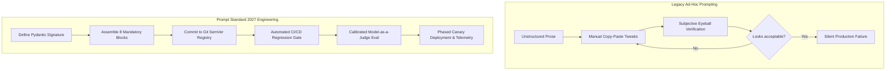

> **Answer-first:** The Prompt Standard series transforms enterprise AI interaction into an automated, version-controlled software engineering discipline: mandatory 8 core blocks, 4-tier layered prompt architecture, Git SemVer evals, team starter kit, dynamic context engineering, declarative DSPy compilation, production PromptOps pipelines, and Model Context Protocol (MCP) with 4-stage Hybrid RAG — 10 chapters, one unified timeline.

This comprehensive guide is designed for **software engineers, engineering leaders, product managers, QA automation specialists, and enterprise operations teams** seeking to transition from subjective trial-and-error prompting to deterministic, testable software assets.

Engineering organizations cannot scale autonomous AI agents on unversioned chat-window lore. A production prompt is not clever prose; it is a **versioned, testable, and machine-verifiable software contract (Input/Output Contract)** that enforces security boundaries, maximizes KV-cache reuse, and guarantees predictable downstream API behavior.

---

## 🔗 Flagship Pillar Hubs & Related Guides

- [High-Throughput Go Microservices Architecture](/posts/go-microservices/)
- [Generative UI with Model Context Protocol (MCP)](/posts/generative-ui-with-mcp-ai-native-frontend/)
- [Engineering Reading Map & Architectural Deep-Dives](/reading-map/)
- [Hire Technical Advisory & Architecture Consulting](/hire/)

---

## 📚 Complete Series Navigation (Executive Summary + Parts 1–9)

The overview table below details the complete 10-chapter curriculum, canonical URLs, and core architectural deliverables across both repositories.

| Chapter | Title & Canonical Deep-Dive | Core Architectural Deliverables & Production Artifacts |
| :--- | :--- | :--- |
| **Exec** | [**Executive Summary: The 2026–2027 Engineering Case**](/series/prompt-standard/executive-summary/) | Context-rot empirical data (18 models), OWASP LLM01 security mapping, 2027 reference stack, ROI model. |
| **Part 1** | [**Part 1: What Is a Prompt Standard and Why Your Team Needs One**](/series/prompt-standard/part-1-what-is-prompt-standard/) | Codified I/O contracts, the 4-property software asset model, team RACI matrix, anti-pattern triage. |
| **Part 2** | [**Part 2: Deconstructing the Agent Prompt: The 8 Mandatory Core Blocks**](/series/prompt-standard/part-2-core-blocks/) | The 8 mandatory prompt blocks, XML delimiter engineering, boundary locks, JSON Schema output contracts. |
| **Part 3** | [**Part 3: Layered Prompt Architecture: Building Modular Prompt Stacks**](/series/prompt-standard/part-3-layered-prompt-design/) | 4-layer decoupling (Role, Rules, SOP, Skill), prefix cache breakpoint alignment (>85% hit rate), Go compiler. |
| **Part 4** | [**Part 4: From Intuitive Prompting to Testable, Version-Controlled Prompts**](/series/prompt-standard/part-4-versioning-and-evals/) | Git SemVer tags, golden test datasets, automated git bisect regression hunting, McNemar statistical significance. |
| **Part 5** | [**Part 5: The Minimum Prompt Standard Starter Kit**](/series/prompt-standard/part-5-team-template/) | 5-directory repository tree, team conventions charter, pre-commit linting hooks, staging-to-prod checklist. |
| **Part 6** | [**Part 6: The Death of Prompt Engineering: Context Engineering in 2026**](/series/prompt-standard/part-6-context-engineering/) | Dynamic context assembly, attention saturation defense, 128k token budget partitioning, sliding summaries. |
| **Part 7** | [**Part 7: Declarative Prompting and Prompt Optimization with DSPy**](/series/prompt-standard/part-7-declarative-prompting-dspy/) | Declarative Signatures, Modules, MIPROv2 Bayesian optimizer, Python DSPy 2.5+ compilation pipeline. |
| **Part 8** | [**Part 8: Production PromptOps Pipeline: Registry, CI/CD Gates, and Rollbacks**](/series/prompt-standard/part-8-production-promptops/) | 5-stage closed loop, G-Eval calibrated judge, canary traffic shifting, OpenTelemetry GenAI spans, automated rollback. |
| **Part 9** | [**Part 9: Context Enrichment with Model Context Protocol (MCP) and Hybrid RAG**](/series/prompt-standard/part-9-mcp-and-hybrid-rag/) | Dynamic JSON-RPC tool schemas, 4-stage retrieval (Qdrant + BM25 + Cross-Encoder), LLMLingua-2 token compression. |

---

## The Paradigm Shift: From String Tinkering to System Architecture

```mermaid
graph TD
    subgraph AdHoc [Legacy Ad-Hoc Prompting]
        A["Unstructured Prose"] --> B["Manual Copy-Paste Tweaks"]
        B --> C["Subjective Eyeball Verification"]
        C --> D{"Looks acceptable?"}
        D -->|"Yes"| E["Silent Production Failure"]
        D -->|"No"| B
    end

    subgraph PromptStandard [Prompt Standard 2027 Engineering]
        F["Define Pydantic Signature"] --> G["Assemble 8 Mandatory Blocks"]
        G --> H["Commit to Git SemVer Registry"]
        H --> I["Automated CI/CD Regression Gate"]
        I --> J["Calibrated Model-as-a-Judge Eval"]
        J --> K["Phased Canary Deployment & Telemetry"]
    end
```

---

## ❓ Frequently Asked Questions (FAQ)


Freeform prompting leads to non-deterministic responses, silent regressions, unvetted prompt injection vulnerabilities (OWASP LLM01), and massive token billing waste. Prompt Standard converts prompts into modular, version-controlled software assets with strict schema contracts, enabling automated CI/CD testing and predictable runtime execution.



Layered Prompt Architecture aligns static global system instructions and immutable security guardrails at byte offset 0. Modern LLM APIs (Anthropic, OpenAI) cache matched prefixes, slashing input token billing by 70–90% and reducing Time-to-First-Token (TTFT) latency from ~1,800ms to under 250ms.



Rather than statically hardcoding dozens of external API definitions into prompt instructions (which bloats context windows and induces hallucination), MCP discovers and injects tool schemas dynamically just-in-time based on active user intent, keeping context payloads lean and focused.


---

[Start Reading: Executive Summary: The 2026–2027 Engineering Case →](/series/prompt-standard/executive-summary/)
