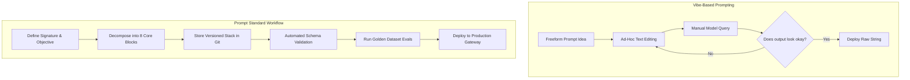
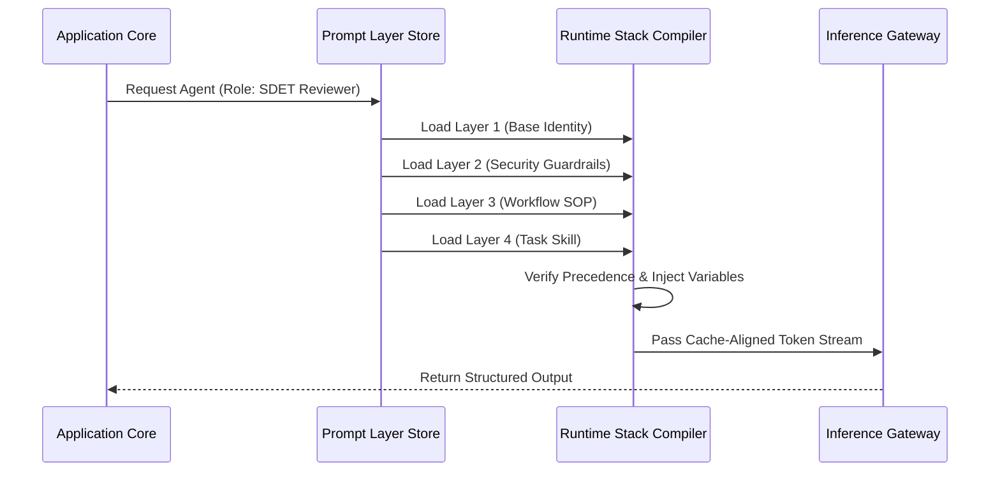

**Answer-first:** The Prompt Standard series defines a six-part engineering blueprint for production AI agents. By combining modular eight-block prompt structures, layered stack architectures, Model Context Protocol (MCP) tool injection, DSPy declarative compilation, and OWASP ASI-compliant PromptOps gates, teams replace ad-hoc prompting with deterministic, testable agent systems.

---

## Executive Summary: The 2026 Context Engineering Shift

By 2026, raw prompt engineering has evolved into **Context Engineering**, **Declarative Prompt Optimization**, and **Agentic Security Architecture**. Large context windows (1M+ tokens) have highlighted major operational challenges: context bloat, attention dilution ("needle-in-a-haystack" degradation), token costs, and vulnerability to indirect prompt injection.

The Prompt Standard series provides a complete technical blueprint to build, optimize, and secure enterprise AI agent workflows.

| Legacy Paradigm (2024) | Modern Prompt Standard (2026) |
| :--- | :--- |
| Ad-hoc text prompt tweaking | Deterministic Context Assembly Pipelines |
| Static tool definitions in system prompt | Dynamic Model Context Protocol (MCP) tool injection |
| Monolithic prompt text strings | 4-layer decoupled prompt stacks (Role, Rules, SOP, Skill) |
| Manual trial-and-error examples | Automated DSPy MIPROv2 declarative compilation |
| Unvalidated model deployments | CI/CD G-Eval prompt gates & OWASP ASI security |

Standardizing prompt engineering transforms informal prompt tweaking into a structured release workflow. The flow diagram below contrasts ad-hoc vibe prompting with the automated, schema-validated Prompt Standard pipeline.


```mermaid
graph TD
    subgraph VibePrompting [Vibe-Based Prompting]
        A[Freeform Prompt Idea] --> B[Ad-Hoc Text Editing]
        B --> C[Manual Model Query]
        C --> D{Does output look okay?}
        D -->|"Yes"| E[Deploy Raw String]
        D -->|"No"| B
    end

    subgraph PromptStandard [Prompt Standard Workflow]
        F[Define Signature & Objective] --> G[Decompose into 8 Core Blocks]
        G --> H[Store Versioned Stack in Git]
        H --> I[Automated Schema Validation]
        I --> J[Run Golden Dataset Evals]
        J --> K[Deploy to Production Gateway]
    end
```

---

## Series Navigation & Overview

The Prompt Standard series covers the full lifecycle of context engineering, declarative compilation, and production security. The overview table below outlines the core topics, code implementations, and key architectural highlights across all six parts.

| Part | Title & Summary Link | Key Highlights & Code Artifacts |
| :--- | :--- | :--- |
| **Part 1** | [*What Is Prompt Standard and Why Should Your Team Care?*](./part-1-context-engineering-evolution/) | Context window limits, token budget allocation formula, KV-cache prefix alignment, and Go `ContextAssembler`. |
| **Part 2** | [*The 8 Core Blocks of an Agent Prompt*](./part-2-the-8-core-blocks/) | The mandatory 8-block prompt layout, boundary lock rules, XML framing, and Go `CorePrompt` structural definition. |
| **Part 3** | [*Layered Prompt Architecture: Building Modular Prompt Stacks*](./part-3-layered-prompt-architecture/) | Decoupling roles, security guardrails, SOP workflows, and JIT skills; layer precedence; Go `PromptStack` compiler. |
| **Part 4** | [*Context Enrichment with MCP and Hybrid RAG*](./part-4-mcp-and-hybrid-rag/) | Model Context Protocol 2026 JSON-RPC schemas, AST chunking, cross-encoder re-ranking, Python `MCPContextPipeline`. |
| **Part 5** | [*Declarative Prompting and Prompt Optimization with DSPy*](./part-5-declarative-prompting-dspy/) | Declarative Signatures, Modules, MIPROv2 Bayesian teleprompters, Python DSPy compilation script, and JSON artifacts. |
| **Part 6** | [*Production PromptOps, CI/CD Gates, and OWASP Agent Security*](./part-6-promptops-evals-and-security/) | G-Eval LLM-as-a-Judge gates, Python CI gate runner, OWASP ASI Top 10 2026, Dual-LLM pattern, Go handoff validator. |

---

## Series Core Concepts Breakdown

### Parts 1 to 3: Foundations, Core Blocks & Layered Stacks

Parts 1 through 3 lay the foundation for structured prompt development. Rather than maintaining massive monolithic strings, agent prompts are broken down into 8 logical blocks: Identity, Mission, Scope Boundary Lock, Context Environment, Tool Policy, Workflow SOP, Output Contract, and Fallback Policy.

Agent prompts are structured into strongly typed data models to enable programmatic assembly and validation. The Go code snippet below defines the core eight-block prompt representation used throughout the series.

```go
package prompt

import "fmt"

// CorePrompt defines the 8-block Prompt Standard structure
type CorePrompt struct {
	Identity       string            `yaml:"identity"`
	Mission        string            `yaml:"mission"`
	ScopeLock      []string          `yaml:"scope_boundary_lock"`
	Environment    map[string]string `yaml:"context_environment"`
	ToolPolicy     []string          `yaml:"tool_policy"`
	WorkflowSOP    []string          `yaml:"workflow_sop"`
	OutputContract string            `yaml:"output_contract"`
	FallbackPolicy string            `yaml:"fallback_policy"`
}

func (p *CorePrompt) Compile() string {
	return fmt.Sprintf("Identity: %s\nMission: %s\nOutput: %s", p.Identity, p.Mission, p.OutputContract)
}
```

Decoupling static identity from dynamic security guardrails and execution skills prevents prompt sprawl. The sequence diagram below shows how runtime compilers assemble modular prompt layers before invoking LLM gateways.


```mermaid
sequenceDiagram
    participant App as Application Core
    participant Store as Prompt Layer Store
    participant Compiler as Runtime Stack Compiler
    participant LLM as Inference Gateway

    App->>Store: Request Agent (Role: SDET Reviewer)
    Store->>Compiler: Load Layer 1 (Base Identity)
    Store->>Compiler: Load Layer 2 (Security Guardrails)
    Store->>Compiler: Load Layer 3 (Workflow SOP)
    Store->>Compiler: Load Layer 4 (Task Skill)
    Compiler->>Compiler: Verify Precedence & Inject Variables
    Compiler->>LLM: Pass Cache-Aligned Token Stream
    LLM-->>App: Return Structured Output
```

---

### Parts 4 to 6: Advanced Context, DSPy Compilation & PromptOps Security

- **Part 4 (MCP & Hybrid RAG)**: Focuses on dynamic context injection using Model Context Protocol endpoints. Replaces naive vector search with AST semantic splitting, dense/sparse indexing, cross-encoder re-ranking, and token budgeting.
- **Part 5 (Declarative DSPy)**: Replaces manual prompt editing with programmatic compilation. Developers declare input-output Signatures and compile them against golden metrics using the DSPy MIPROv2 optimizer.
- **Part 6 (PromptOps & OWASP Security)**: Establishes CI/CD evaluation gates using LLM-as-a-Judge scoring to prevent regression releases. Implements OWASP ASI Top 10 2026 security controls, Dual-LLM parsing isolation, and Go inter-agent handoff validation contracts.

---

## FAQ


Freeform prompting leads to unpredictable responses, format failures, and unmaintainable prompt strings across codebases. Prompt Standard turns prompts into modular, version-controlled software assets with strict schema contracts, enabling automated CI/CD testing and reliable model execution.



Context Engineering manages context windows as dynamic token budgets. By separating static identity blocks for KV-cache prefix reuse, filtering tool schemas using Model Context Protocol (MCP), and re-ranking RAG context with cross-encoders, token bloat is reduced by up to 70%.



DSPy compiles high-level declarative Signatures into optimized prompt instructions and few-shot examples automatically. Using teleprompters like MIPROv2, DSPy evaluates candidate prompt variations against quantitative metric functions, selecting optimal configurations without manual string manipulation.



