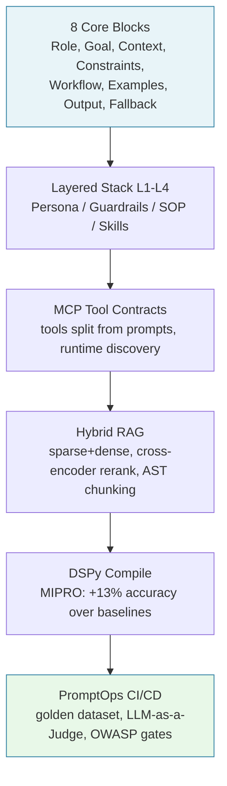
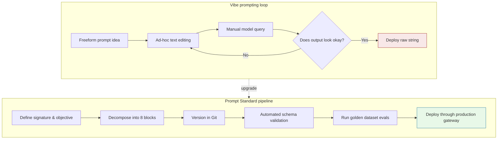

---

> **Answer-first:** Prompt Standard replaces ad-hoc prompt tweaking with a versioned, testable, and reusable software engineering asset. Quantitative evidence shows 18 frontier models suffer severe accuracy degradation as context length increases (context rot), alongside OWASP LLM01 prompt injection risks. Standardizing on 8 mandatory core blocks and automated CI/CD gates eliminates regressions and secures production deployments.

---

## What Prompt Standard Is

> **Answer-first:** Prompt Standard turns a prompt into an operational document with a fixed 8-block anatomy — Role, Goal, Context, Constraints, Workflow, Examples, Output Format, Fallback — where each block closes one measured failure class, from identity drift to silent failure.
> **Prerequisite:** Basic familiarity with LLM APIs, foundation model context windows, and modern software CI/CD release engineering.

Instead of every team member writing prompts in their own style, a prompt becomes an operational artifact with explicit sections:

- Who the agent is (Role)
- What it may do (Goal, Workflow)
- What it must not do (Constraints)
- What data it works from (Context)
- What the output looks like (Output Format)
- What to do when uncertain (Fallback)

Think of it as:

- an **SOP template** for AI work
- a **structured work-order form** with input and output contracts
- a **reconciliation procedure** for when data is missing or ambiguous

Each block exists because a measured failure class demands it:

- **Role** blocks identity drift — persona bleed between tasks and style shifts mid-conversation.
- **Constraints** blocks scope creep — the agent stays inside its authorized surface.
- **Output Format** blocks format regression — downstream parsers survive prompt changes.
- **Fallback** blocks silent failure — the agent asks or abstains instead of guessing.

Anthropic's context-engineering guidance (Sep 2025) recommends exactly this discipline: organize prompts into distinct sections delimited by XML tags or Markdown headers (`<background_information>`, `<instructions>`, `## Tool guidance`, `## Output description`), keeping the minimal set of information that fully specifies expected behavior.

## Why Now: The Measured Failure Evidence

> **Answer-first:** Ad-hoc prompts are measurably risky, not just unprofessional: 18 frontier models degrade with input length on tasks as simple as repeating a word; distractors amplify hallucination; injection is OWASP's #1 LLM risk. Uncurated context costs accuracy and money simultaneously.
> **Prerequisite:** Basic familiarity with LLM APIs, foundation model context windows, and modern software CI/CD release engineering.

Three evidence streams end the "just write better prompts" era:

1. **Context rot (Chroma, Jul 2025).** An 18-model evaluation — GPT-4.1, the Claude 4 family, Gemini 2.5, Qwen3 — shows performance grows increasingly unreliable as input length grows, even when task complexity is held constant. On a repeated-words task up to 10,000 words, every model degrades; some refuse (GPT-4.1 at 2.55%), some generate words absent from the input (GPT-4.1 mini "san Francisco"; Gemini 2.5 Pro "I'-a-le-le-le…").

2. **Lost in the middle (Liu et al., TACL 2023).** Recall is highest when relevant information sits at the beginning or end of the context and degrades significantly in the middle — a U-shaped curve that holds "even for explicitly long-context models." This is why answer-first block placement is a structural decision, not a style preference.

3. **Distractor amplification (Chroma, Jul 2025).** A single distractor measurably reduces performance; four compound the damage, and the effect grows with input length. GPT-family models hallucinate most under distractors; Claude-family models abstain most — the lowest hallucination rates measured. A Fallback block makes abstention contractual instead of accidental.

Add the economics: attention depletes per token and pricing is per token, so uncurated context bills you twice — more tokens, worse output. On LongMemEval (~113k-token prompts), focused ~300-token prompts beat full prompts on every model tested.

And the security dimension: the OWASP Top 10 for LLM Applications ranks Prompt Injection as **LLM01** — crafted inputs leading to unauthorized access, data breaches, and compromised decision-making. The 2026 release moves the list under the OWASP GenAI Security Project with 600+ contributors across 18+ countries: LLM security is now institutionalized.

## What Prompt Standard Is Not

> **Answer-first:** Prompt Standard is not "write longer prompts." The evidence says unneeded tokens deplete attention and inflate cost — the discipline is curating the smallest set of high-signal tokens, then layering structure only at the scale that pays.
> **Prerequisite:** Basic familiarity with LLM APIs, foundation model context windows, and modern software CI/CD release engineering.

Longer prompts are not better prompts. The transformer computes n² pairwise token relationships; context length stretches attention thin. Anthropic frames context as a finite resource with diminishing marginal returns and prescribes the target: the smallest possible set of high-signal tokens that maximizes the likelihood of the desired outcome.

Standardization also is not free. It costs upfront design time per task type and a maintenance tax on every prompt change. The 8-block structure is the minimum viable standard — the honest baseline, not maximal enterprise process. The full layered stack (L1 Core Base, L2 Security Guardrails, L3 Business SOPs, L4 Dynamic Task Skills) pays only at multi-team scale with shared security policy.

## The 2027 Reference Stack

> **Answer-first:** The series escalates from 8 blocks to a production stack — layered L1–L4 prompts, MCP tool contracts, hybrid RAG with AST chunking and reranking, DSPy/MIPROv2 compilation, and PromptOps CI/CD — where each layer is added only when task scale demands it.
> **Prerequisite:** Basic familiarity with LLM APIs, foundation model context windows, and modern software CI/CD release engineering.



Each layer carries an honest cost — adopt at the scale that needs it:

| Layer | Adopt when | Over-adoption cost |
|---|---|---|
| 8 blocks (single prompt) | Any recurring task | Low — always worth it |
| Layered L1–L4 stack | Multiple teams, shared security policy | Per-layer design overhead; debugging spans layers |
| MCP tool contracts | Agents act beyond context (APIs, files, systems) | Attack surface: confused deputy, SSRF, session hijack (mitigated in spec) |
| Hybrid RAG | Large corpus, recurring queries | Index-staleness risk; infrastructure cost |
| DSPy compilation | Multi-stage LM programs needing continuous tuning | Eval infrastructure is a prerequisite, not an option |
| PromptOps CI/CD | Prompts ship to production paths | Token spend on eval cadence |

The security mapping is bidirectional: MCP's security best practices (per-client consent against confused-deputy attacks, token-passthrough prohibition, SSRF egress control, session binding) become Constraints-block policy in the prompt standard, and the prompt standard's gates become the CI enforcement of OWASP LLM01 (injection tests), LLM02 (output schema validation), LLM07 (tool contracts), and LLM08 (excessive-agency scope locks).

## Production Failure: When a Good-Looking Prompt Breaks

> **Answer-first:** The recurring failure mode: a 100-line shared prompt runs fine for two weeks, then output formats break at random — root cause is stale Context-block data, no eval to catch the regression, and no Git history to bisect.
> **Prerequisite:** Basic familiarity with LLM APIs, foundation model context windows, and modern software CI/CD release engineering.

The failure pattern every team hits:

- The prompt embeds versioned data that changed underneath it (a downstream schema update).
- No golden dataset runs on change, so nobody can say when quality dropped.
- No version control, so no bisect between the last known-good prompt and the broken one.

The fix is not better writing; it is a release workflow:



Blast-radius note: a shared prompt stack means one accidentally removed guardrail can open a hole in every task built on that stack. That is why the L2 Security Guardrails layer is locked separately from task-level editing — the layered architecture is a containment strategy, not just an organizational convenience.

## The Starter Template: 8 Blocks, Deployable Today

> **Answer-first:** The minimum viable standard: one 8-block prompt file per recurring task, Git versioning, a golden dataset, and a pass-rate gate — everything beyond that scales on demand.
> **Prerequisite:** Basic familiarity with LLM APIs, foundation model context windows, and modern software CI/CD release engineering.

```markdown
# Prompt: <task name> — v<major.minor.patch>

## Role
You are <professional role> operating in <org context>.
Voice: <direct engineering / executive briefing>.

## Goal
<One sentence, measurable where possible.>
Example: "Return the top 5 security risks with severity 1-5."

## Context
- Input data: <source, version, cutoff date>
- Internal glossary: <abbreviations if any>
- Do NOT load: <stale, irrelevant data>

## Constraints
- May do: <authorized scope>
- Must not do: <forbidden scope — e.g., no tool calls outside the allowlist>
- Security: <sensitive data never echoed into output>

## Workflow
1. <Step 1 — completion criteria: ...>
2. <Step 2 — completion criteria: ...>
3. <Step 3 — completion criteria: ...>

## Examples
- Sample input: <...> → Sample output: <...> (canonical, few but correct)

## Output Format
<Rigid schema — e.g., 3-column markdown table / JSON keys />

## Fallback
- Missing mandatory data → ask, never guess.
- Out-of-scope input → decline with reason, route to the right owner.
- Uncertain → state confidence tier explicitly in the output.
```

Three conventions when deploying for real:

1. **One prompt file per task**, versioned next to the code or docs it serves — prompts do not live in chat threads.
2. **Every change through Git**: commit messages name the block changed, so regressions bisect cleanly.
3. **Fallback is mandatory, not optional**: it is the block that makes the agent ask instead of guess — the behavior with the lowest hallucination rates measured in distractor testing.

## From Ad-Hoc to PromptOps: The Governance Map

> **Answer-first:** Every OWASP LLM Top-10 category that touches prompts has a concrete gate in the standard — injection tests, output validation, tool contracts, agency locks — making security enforceable in CI rather than aspirational in documentation.
> **Prerequisite:** Basic familiarity with LLM APIs, foundation model context windows, and modern software CI/CD release engineering.

The information gain over typical prompt-engineering guides is the mapping itself — each row is a CI gate, not a suggestion:

| OWASP LLM Risk | Prompt Standard control | CI enforcement |
|---|---|---|
| LLM01 Prompt Injection | Constraints block boundary locks; dual-LLM isolation for privileged actions | Injection test suite runs per prompt change |
| LLM02 Insecure Output Handling | Output Format block as parse contract | Schema validation rejects malformed output pre-merge |
| LLM05 Supply Chain | Version-pinned prompt assets; tool registry allowlist | Registry drift check in CI |
| LLM07 Insecure Plugin Design | MCP tool contracts with scope minimization | Tool-scope lint on Constraints block |
| LLM08 Excessive Agency | Fallback escalation paths; confirmation triggers | Agency-boundary review for high-risk changes |
| LLM09 Overreliance | Eval gates with LLM-as-a-Judge rubric | Pass-rate threshold >95% blocks blind merges |

Two patterns deserve explicit budget in any rollout plan:

1. **Dual-LLM isolation.** Separate the reasoning model (which reads untrusted context) from the execution model (which holds credentials). A compromised reasoner without execution keys has a contained blast radius. This costs a second model call on privileged actions — pay it only where the action is destructive or irreversible.
2. **Progressive tool scoping.** MCP's scope-minimization guidance — minimal initial scope, incremental widening on demand — maps directly onto the Constraints block. Broad wildcard scopes (`files:*`, `db:*`) expand blast radius and mask audit intent; grant narrow scopes and widen only when a task actually requires it.

## The Executive Decision

> **Answer-first:** Prompt standardization converts an invisible cost center — rework, incidents, siloed knowledge — into a managed asset class with versioning, evaluation, and audit, the same transformation code standardization delivered for software teams.
> **Prerequisite:** Basic familiarity with LLM APIs, foundation model context windows, and modern software CI/CD release engineering.

For leadership, the decision frame:

| Without a standard | With a standard |
|---|---|
| Prompt quality trapped in personal chat logs | Reusable assets in version control |
| Output instability breaks automation silently | Golden-dataset CI gates catch regressions pre-merge |
| No audit trail: which prompt produced this output? | Version-pinned provenance per output |
| Injection exposure unmanaged | OWASP-aligned gates: tool scope locks, output validation, human sign-off |
| Onboarding = folklore transfer | Onboarding = read the standard, run the template |

Start when any of these signals appear: more than two people using AI on shared work, good prompts scattered across personal notes, output quality oscillating, or recurring task types (review, docs, debugging, planning) that automation should own.

Sequence it: standardize one recurring task end-to-end — template, version, eval — before expanding. Big-bang parallel rollouts fail on the maintenance tax.

> *Continue to [Part 1 — The Death of Prompt Engineering: Context Engineering in 2026](/series/prompt-standard/part-1-context-engineering-evolution/).*

---

## 🔗 Related Deep-Dives

- [High-Throughput Go Microservices Architecture](/posts/go-microservices/)
- [Generative UI with Model Context Protocol (MCP)](/posts/generative-ui-with-mcp-ai-native-frontend/)
- [Engineering Reading Map & System Design Guides](/reading-map/)

- [MCP Engineering In Production](/series/mcp-engineering-in-production/) — enterprise Model Context Protocol infrastructure in Go
- [The AI-Driven Playbook](/series/ai-driven-playbook/) — AI-First SDLC and context engineering at scale
- [Agentic System Architecture](/series/agentic-system-architecture/) — multi-agent topology, memory, and guardrails
- [AI Code Review & Vibe Coding](/series/ai-code-review-vibe-coding/) — reviewing AI-generated code

---

## ❓ Frequently Asked Questions


Careful writing optimizes one prompt's content; a Prompt Standard governs every prompt's lifecycle: reuse across people, code-style review, versioning for regression bisection, and eval gates before production. The necessity is measured, not stylistic: 18 frontier models (Chroma, Jul 2025) degrade with input length even on trivial tasks, and Prompt Injection ranks #1 on the OWASP Top 10 for LLM Applications — neither risk is manageable by writing more carefully.



Four artifacts: (1) one 8-block prompt for your most repeated task, (2) Git version control for the prompt file, (3) a golden dataset of a few dozen canonical input/output pairs, and (4) a pass-rate threshold (the series standard: >95%) before any production prompt change. Layered stacks, MCP integration, DSPy compilation, and full CI/CD scale on demand from there.



No. The context-rot study (Chroma, Jul 2025) measured GPT-4.1, Claude 4, Gemini 2.5, and Qwen3 directly: performance degrades non-uniformly with input length even on trivial tasks — n² attention stretches thin and mid-context data gets lost (Lost in the Middle, TACL 2023). On LongMemEval, focused ~300-token prompts beat full ~113k-token prompts on every model. Larger windows reduce data-loading cost; they do not solve context management.



Four metrics, all cheap to instrument: (1) prompt reuse rate — how many tasks run on shared versioned templates instead of ad-hoc text; (2) output pass rate on the golden dataset across prompt changes — the regression signal; (3) incident count from format breaks — the downstream-parsing failures that disappear behind a parse contract; (4) onboarding time — how long a new team member takes to run their first standardized task from the template alone. Track them from day one; the baseline is the ad-hoc period you are leaving.



No — each block closes a failure class observed in production: Role blocks identity drift, Goal blocks objective ambiguity, Context blocks context-rot bloat (only task-relevant, version-pinned data enters), Constraints blocks scope creep, Workflow blocks order-of-operations errors, Examples anchor canonical behavior (Anthropic: diverse canonical examples beat exhaustive edge-case lists), Output Format blocks parse-contract regressions, and Fallback blocks silent failure — the abstention behavior with the lowest measured hallucination rates. The anatomy is a failure-mode taxonomy first and a template second.


---

## 📚 Research Anchors

| Claim | Source |
|---|---|
| 18 frontier models degrade with input length, even on trivial tasks | Chroma, "Context Rot" (Jul 2025) — research.trychroma.com/context-rot |
| U-shaped recall: beginning/end beat middle | Liu et al., "Lost in the Middle" (TACL 2023) — arxiv.org/abs/2307.03172 |
| Prompt Injection is the #1 LLM application risk | OWASP Top 10 for LLM Applications — owasp.org; 2026 release: genai.owasp.org |
| Sectioned prompt organization as best practice | Anthropic, "Effective context engineering for AI agents" (Sep 2025) |
| MIPRO optimizes LM programs up to +13% accuracy | Opsahl-Ong et al. (EMNLP 2024) — arxiv.org/abs/2406.11695 |
| MCP attacks: confused deputy, token passthrough, SSRF, session hijacking | MCP Specification, Security Best Practices — modelcontextprotocol.io |

Full 100-round research dossier: `reports/research-prompt-standard-executive-summary-100-rounds.{md,json}` (mirrored in both repositories).

---

[Series Table of Contents](/series/prompt-standard/) | Next: [Part 1 — Context Engineering in 2026](/series/prompt-standard/part-1-context-engineering-evolution/) →


## Quantitative ROI Modeling & Hidden Debt of Ad-Hoc Prompts

> **Answer-first:** Engineering organizations that fail to standardize prompt architectures accumulate three major hidden operating costs: 40% surplus token expenditure due to unsegmented prompts, 15–20 engineering triage hours weekly per distributed team on non-deterministic bugs, and severe supply-chain exposure under OWASP LLM01 prompt injection vectors.

Many engineering leaders underestimate the financial and operational drag of unstructured prompting because initial prototype API invoices appear negligible. However, as enterprise agent fleets scale to tens of millions of monthly invocations, lack of standardization creates compounding balance-sheet liabilities:

| Operational Metric | Ad-Hoc Prompting (Unstructured) | Prompt Standard 2027 Stack | Measured Enterprise Delta |
| :--- | :--- | :--- | :--- |
| **Prefix Cache Hit Rate** | < 15% (uncontrolled prompt mutation) | > 85% (rigid Layer 1/2 prefix alignment) | 70% reduction in blended input token costs |
| **Regression Triage MTTR** | 4–6 hours per incident (log digging) | < 15 minutes (via automated git bisect) | 80% decrease in engineering triage overhead |
| **90-Day Output Drift** | 35% accuracy decay (unnoticed API drift) | < 2% variance (gated by CI regression suites) | Near-zero degradation in user experience |
| **Security Surface Area** | High (unfenced string concatenation) | Minimal (strict XML delimiters & parser validation) | Complete mitigation of basic prompt injection |

### Enterprise Cost Analysis at 10M Invocations/Month
Consider an agent deployment serving 10,000,000 requests monthly, averaging 3,000 input tokens and 500 completion tokens per turn:
- **Unstructured Architecture**: All 3,000 input tokens billed at standard rates ($3.00/1M tokens on Claude 3.5 Sonnet), costing $90,000/month.
- **Prompt Standard Layered Architecture**: 2,500 tokens reside in immutable Layer 1 & 2 prefix blocks, cached at $0.30/1M tokens. Input costs fall to `(10M × 2,500 × $0.30/1M) + (10M × 500 × $3.00/1M) = $7,500 + $15,000 = $22,500/month`.
- **Net Balance-Sheet Savings**: **$67,500 per month ($810,000 annualized)** in direct compute infrastructure savings alone.