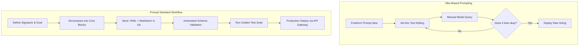

**Answer-first:** The Prompt Standard is an engineering framework that transitions teams from unstructured, trial-and-error prompt writing to version-controlled, modular prompt design. By structuring prompts into reusable blocks, teams reduce output variance, simplify collaboration, and enable automated CI/CD evaluation gates for production LLM integration.

## The Real Problem Is Not Clever Wording

Many people assume a good prompt is a cleverly worded prompt. That is only partially true.

In a team setting, the bigger problems are:
- Person A has a prompt that works great
- Person B asks the same thing but gets worse output
- After two weeks, nobody remembers which version was the good one
- It is unclear what principles guide the agent's behavior

What teams actually need is not just "a good prompt" but **a prompt with structure that can be managed.**

## A Very Practical Analogy

Think of a prompt as a brief for a new colleague.

If you only say:

```text
Please review this code for me.
```

the agent has to guess many things:
- Review for bugs or style?
- Is security a priority?
- Should it provide file references?
- Should it suggest fixes or just flag problems?

But if you say:

```text
You are a senior reviewer.
Prioritize bugs, regressions, and production risks.
Return findings first, with severity and file references.
If unsure, state your assumptions.
```

the quality becomes far more consistent.

That is the spirit of Prompt Standard.

## Prompt Standard Solves Four Core Problems

### 1. Reduces Ambiguity
The agent does not have to guess the team's "real intent."

### 2. Increases Repeatability
The same task type produces similar quality and format every time.

### 3. Enables Handoff
Prompts no longer live in one person's head.

### 4. Enables Improvement
When output is poor, the team knows which part of the prompt to fix.

## Common Failure Modes Without a Standard

### Overly Generic Prompts
Example: "Analyze this for me." — The agent has no idea what to analyze, from what perspective, or what output is expected.

### Monolithic Prompts
A single prompt hundreds of lines long that mixes role, context, output format, safety rules, and the current task. Impossible to maintain or reuse.

### No Fallback Behavior
The prompt never specifies:
- Should the agent ask for clarification or guess?
- Should it state confidence levels?
- How should it decline out-of-scope requests?

This is why agents often give "very confident but wrong" answers.

## Prompt Standard Should Be Treated as an Internal Asset

Teams already have:
- coding standards
- architecture guidelines
- PR templates
- incident checklists

Prompts deserve the same treatment:
- stored in a repository
- versioned
- owned
- reviewed

If a prompt directly affects output quality, it is already part of the working system.

## Key Takeaway

Prompt Standard does not make AI "magically smarter." It makes AI **guess less, stay on topic more, and work closer to how the team expects.**

> *In the next part, we introduce the simplest framework: the 8 core blocks of an agent prompt.*

### Vibe-Based vs. Structured Prompting Workflow

Traditional prompting relies on vibe-based trial-and-error editing, whereas the Prompt Standard workflow introduces systematic design, version control, and regression testing:



## FAQ


Prompt Standard decouples application logic from raw prompt strings by isolating roles, rules, and workflows into distinct layers. When a model updates, developers only need to run evaluations against their golden datasets and adjust specific modular blocks rather than refactoring the entire system.

---

> *Continue to [Part 2 — The 8 Core Blocks of an Agent Prompt](/series/prompt-standard/part-2-core-blocks/).*
