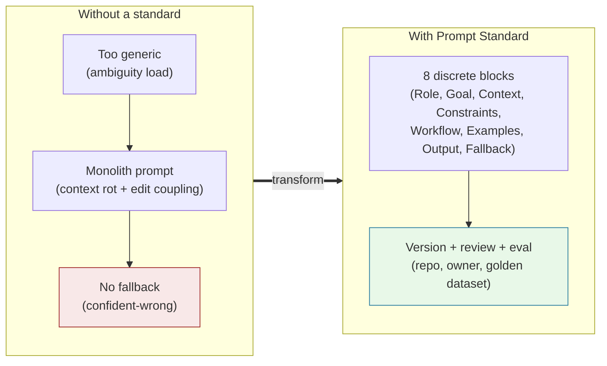
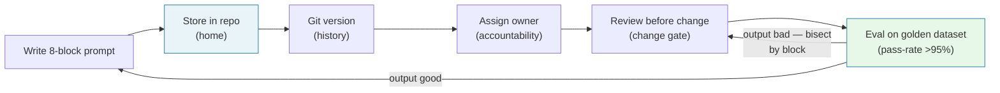

---

[← Previous: Part 6 — Production PromptOps, Evals & Security](/series/prompt-standard/part-6-promptops-evals-and-security/) | [Series Table of Contents](/series/prompt-standard/) | Next: [Part 8 — The Minimum Team Starter Kit](/series/prompt-standard/part-8-team-starter-kit/) →

> **Answer-first:** A Prompt Standard is an explicit I/O contract and standard operating procedure ensuring AI agents perform deterministically and reliably across team environments. It eliminates knowledge fragmentation, context rot, unversioned regressions, and onboarding friction by treating prompts as codified software engineering assets rather than personal ad-hoc notes stored across scattered private chat windows.

---

## The Real Problem Is Not Elegant Wording

> **Answer-first:** In a team setting, "a well-written prompt" is not the unit of value — a structured, governed prompt is. The familiar scenario: A's prompt works, B's attempt at the same task fails, and two weeks later nobody remembers which version was good.
> **Prerequisite:** Familiarity with foundational LLM interactions and an understanding of collaborative software development workflows.

Many people believe a good prompt is a cleverly worded one. That is only partly true.

In a team environment, the bigger problems are:

- Person A has a prompt that works reliably
- Person B asks the same task and gets visibly worse output
- After two weeks, nobody can find the good version
- Nobody knows which principles the agent is actually operating under

What a team needs is not "better prompt writers" but **prompts with structure and governance**.

The scale of the field is what makes intuition-only prompting an infeasible strategy. The Prompt Report (Schulhoff et al., arXiv:2406.06608 — 31 authors, v6 Feb 2025, self-described as "the most comprehensive survey on prompt engineering to date") systematizes **58 LLM prompting techniques**, **40 techniques for other modalities**, and **33 vocabulary terms** — while openly noting the field "suffers from conflicting terminology and a fragmented ontological understanding." When a discipline needs a 58-entry taxonomy to describe itself, choosing which technique fits which task is an engineering decision with measurable trade-offs — not a writing style.

## The Everyday Analogy: Onboarding a New Colleague

> **Answer-first:** A prompt is a brief for a new colleague: "review this code" forces the model to guess four or five things; naming the role, priorities, output shape, and uncertainty behavior stabilizes quality.
> **Prerequisite:** Familiarity with foundational LLM interactions and an understanding of collaborative software development workflows.

Treat the prompt as a work order for a new hire.

If you only say:

```text
Review this code for me.
```

the model must guess:
- Bug focus or style focus?
- Is security prioritized?
- Are file references expected?
- Should it propose fixes or only report findings?

Every unanswered question is a random variable injected into the output. Chroma's context-rot research (Jul 2025) supplies the measured mechanism: when a model must identify relevance and reason simultaneously — two tasks at once — performance drops on every model tested. Ambiguity is an endogenous distractor.

But if you specify:

```text
You are a senior reviewer.
Prioritize bugs, regressions, and production risk.
Return findings first, with severity and file references.
If uncertain, state your assumption.
```

quality stabilizes immediately.

That is the Prompt Standard in miniature: **reducing the number of random variables the model must fill in on its own.**

## The Finance Analogy: Reconciliation Rules

> **Answer-first:** An AI agent is like a new accounting staffer — "check this table for me" forces four guesses; a standard work order names the comparison source, the exception rule, and the result template.
> **Prerequisite:** Familiarity with foundational LLM interactions and an understanding of collaborative software development workflows.

A prompt is to an AI agent what a work order is to a new accounting staffer.

If you only say:

```text
Check this table for me.
```

the newcomer does not know whether to:
- verify arithmetic or business logic
- reconcile against which source
- stop or estimate when documents are missing
- reply with a short note, an error table, or a summary email

Specify it instead:

```text
Act as a reconciliation assistant.
Check mismatches between the sales report and the payment statement.
If data is missing, state "insufficient documentation to conclude."
Return results in three sections: matched, mismatched, missing.
```

and the output becomes trustworthy.

The sentence "insufficient documentation to conclude" is the crux: a reconciliation assistant that estimates when numbers are missing is an audit risk; one that flags the gap creates an audit trail. Chroma's distractor experiments measured the model-side equivalent: Claude-family models hallucinate least precisely because they abstain under ambiguity. A Fallback block converts that empirically safest behavior from accident into contract.

## The Four Problems a Prompt Standard Solves

> **Answer-first:** Four problems, four mechanisms — less ambiguity, more repeatability, easier handoff, easier improvement. Each maps to a structural cause, not a slogan.
> **Prerequisite:** Familiarity with foundational LLM interactions and an understanding of collaborative software development workflows.

### 1. Reduces ambiguity
The agent stops guessing the team's real intent. Mechanism: the Role block pins perspective, Constraints pins scope, Output Format pins form — each is a reviewable artifact, not a hope.

### 2. Increases repeatability
Same task type, near-identical output quality and format. Mechanism: intent is pinned identically across runs — repeatability is a property of the prompt, not the model.

### 3. Makes handoff possible
Prompts stop living in one person's head. Mechanism: a file in a repo with Git history replaces two-week-old chat archaeology.

### 4. Makes improvement tractable
When output disappoints, the team knows which block to edit. Mechanism: eight discrete blocks diff cleanly — "changed Constraints, kept Workflow" — instead of editing an undifferentiated monolith.

## The Three Measured Anti-Patterns

> **Answer-first:** Three failure modes dominate unstandardized prompting — too generic, overstuffed, no fallback — and each has a measured failure mechanism rather than folklore behind it.
> **Prerequisite:** Familiarity with foundational LLM interactions and an understanding of collaborative software development workflows.

### Anti-pattern 1: The generic prompt
Example: "Analyze this for me."

The model cannot know: analyze what, through which lens, delivering which artifact.

Measured mechanism: ambiguity creates endogenous distractors — the model spends its attention budget inferring intent instead of executing (Chroma, Jul 2025).

### Anti-pattern 2: The overstuffed prompt
A several-hundred-line string mixing role, business context, output format, safety rules, and the current task — every edit risks breaking an unrelated concern.

Measured mechanism: context rot — 18 frontier models (GPT-4.1, Claude 4 family, Gemini 2.5, Qwen3) degrade in accuracy as input length grows, even on trivial tasks; plus edit-coupling — a task-level edit can silently damage a safety rule living in the same string.

### Anti-pattern 3: The fallback-less prompt
Nothing specifies: ask or guess when data is missing? State confidence when unsure? How to decline out-of-scope requests?

This is why agents "answer very confidently while wrong."

Measured mechanism: hallucination under ambiguity. OWASP ranks Overreliance (LLM09) in its Top 10 because "failing to critically assess LLM outputs" leads to compromised decisions; a prompt that never specifies missing-data behavior institutionalizes exactly that risk.

The three anti-patterns compound — a generic monolith without fallback exhibits all three at once. The standard therefore fixes structure and behavior together:


```mermaid
graph LR
    subgraph FailMode ["Without a standard"]
        G["Too generic<br/>(ambiguity load)"] --> S["Monolith prompt<br/>(context rot + edit coupling)"]
        S --> F["No fallback<br/>(confident-wrong)"]
    end
    subgraph Standard ["With Prompt Standard"]
        B["8 discrete blocks<br/>(Role, Goal, Context, Constraints,<br/>Workflow, Examples, Output, Fallback)"] --> V["Version + review + eval<br/>(repo, owner, golden dataset)"]
    end
    FailMode ==>|"transform"| Standard

    style F fill:#f8e8e8,stroke:#a02a2a
    style V fill:#e8f8e8,stroke:#2a7da0
```

## The Prompt as a Managed Asset

> **Answer-first:** A prompt that affects output quality is a system component and deserves the four asset properties — repo, version, owner, review — the same treatment coding standards, PR templates, and incident checklists already receive.
> **Prerequisite:** Familiarity with foundational LLM interactions and an understanding of collaborative software development workflows.

Teams already run asset inventories:

- coding standards
- architecture guidelines
- PR templates
- incident checklists

Non-engineering departments run the same pattern with different names: standard forms, approval workflows, closing checklists, reconciliation principles.

Prompts deserve identical treatment:

- **In the repo** — a prompt living in chat history has no findability, no versions, no ownership; searchability decays with scroll.
- **Versioned** — Git history makes quality regressions bisectable: diff the prompt change log against the eval timeline to find the offending edit.
- **Owned** — an owner per file answers "who fixes this at 3am."
- **Reviewed** — prompt changes through review import code-review discipline: a guardrail edit gets a second pair of eyes before production.

The four properties close into a governed loop:


```mermaid
graph LR
    W["Write 8-block prompt"] --> R["Store in repo<br/>(home)"]
    R --> V["Git version<br/>(history)"]
    V --> O["Assign owner<br/>(accountability)"]
    O --> RV["Review before change<br/>(change gate)"]
    RV --> E["Eval on golden dataset<br/>(pass-rate >95%)"]
    E -->|"output good"| W
    E -->|"output bad — bisect<br/>by block"| RV

    style R fill:#e8f4f8,stroke:#2a7da0
    style E fill:#e8f8e8,stroke:#2a7da0
```

The governance contrast, activity by activity:

| Activity | Without a standard | With a Prompt Standard |
|---|---|---|
| Finding the good prompt | Digging through two-week-old chats | `git log` / search the repo |
| Changing a prompt | Edited in chat, nobody reviews | Prompt-PR, block-level diff, reviewed before merge |
| Prompt breaks at 3am | No owner, no rollback | Named owner, rollback to known-good commit |
| Onboarding a new member | Folklore transfer from the veteran | Read the prompt file + a one-page convention |
| Improving a prompt | Blind edits, no signal | Golden dataset blocks regressions pre-production |
| Answering "why did the AI do that?" | Unknowable — no prompt record | Diff the exact prompt version that produced the output |

A field with 58 surveyed techniques and a meta-analyzed literature contains knowledge worth versioning. Letting it decay back into folklore wastes science that has already been written down.

## Production Failure: Two Good Weeks, Then Breakage

> **Answer-first:** The classic failure: a copied prompt runs well for two weeks, then output drifts — root cause is stale embedded data, no owner, and no known-good version to roll back to.
> **Prerequisite:** Familiarity with foundational LLM interactions and an understanding of collaborative software development workflows.

The familiar scenario: the team copies a long prompt from the strongest member's chat window. It works for two weeks. Then output starts drifting out of format at random. The root cause is rarely the model:

- Data embedded in the prompt is older than the downstream schema
- Nobody owns it, so nobody updated it
- There is no known-good version to roll back to

Under asset management, the same scenario plays differently: the data change shows up in a reviewed diff, the last known-good commit is one `checkout` away, and the responsible owner was named from day one.

The two-week test for whether your prompt is done: can a colleague take over your task from the prompt file alone — without asking you anything? If they still need you, the prompt is not finished.

## Maturity Model: Where Teams Actually Sit

> **Answer-first:** Prompt capability matures in five observable levels — from ad-hoc chat, to shared snippets, to structured blocks, to versioned assets, to eval-gated PromptOps — and the jump that pays first is level 2 → 3, not the tooling levels.
> **Prerequisite:** Familiarity with foundational LLM interactions and an understanding of collaborative software development workflows.

An information-gain framing unique to this chapter: most guides describe techniques; this matrix lets a team locate itself and pick the next move — each level is observable in the team's artifacts, not in aspiration:

| Level | Observable artifact | Failure mode it still has | Next move |
|---|---|---|---|
| 1. Ad-hoc | Prompts typed fresh per session, in chat only | All three anti-patterns, full variance | Save the one prompt that works |
| 2. Shared snippets | A "good prompts" doc or note | Stale data, no owner, silent drift | Restructure the top snippet into 8 blocks |
| 3. Structured blocks | Prompt files with labeled blocks per task | No regression signal when edited | Add Git versioning + owner per file |
| 4. Versioned assets | Repo, Git history, owners, prompt-PR review | "Better" edits unverified | Stand up a small golden dataset |
| 5. Eval-gated PromptOps | CI eval gates, pass-rate thresholds, injection tests | Eval-cost discipline, scope creep of the standard itself | Cadence discipline; measure eval spend |

Two properties of the ladder worth internalizing:

1. **The 2 → 3 jump pays first.** Restructuring one shared snippet into blocks is where ambiguity, overstuffed monoliths, and missing fallback all get fixed simultaneously — before any tooling exists.
2. **Each level's failure mode names the next level.** The ladder is self-diagnosing: whatever still breaks at your level is precisely what the next level installs. If nothing breaks, you are done — do not climb for prestige.

## What to Remember

> **Answer-first:** A Prompt Standard does not make the model smarter — it makes the model guess less, drift less, and work closer to how the team intends. One line for the ops ledger: write instructions so the AI never improvises with your data and procedures.
> **Prerequisite:** Familiarity with foundational LLM interactions and an understanding of collaborative software development workflows.

A Prompt Standard is not a magic intelligence amplifier.

It makes AI **guess less, go off-topic less, and work closer to what the team actually wants**.

And its scope is honest: the standard does not eliminate hallucination, and it does not replace evaluation — it removes the controllable variance; the rest is measurement discipline.

> *Next: [Part 2 — The 8 Core Blocks of an Agent Prompt](/series/prompt-standard/part-2-the-8-core-blocks/), the minimal framework the rest of the series builds on.*

---

## 🔗 Related Deep-Dives

- [High-Throughput Go Microservices Architecture](/posts/go-microservices/)
- [Generative UI with Model Context Protocol (MCP)](/posts/generative-ui-with-mcp-ai-native-frontend/)
- [Engineering Reading Map & System Design Guides](/reading-map/)

- [Executive Summary: The 2026–2027 Engineering Case](/series/prompt-standard/executive-summary/)
- [Part 6 Deep-Dive: Production PromptOps, Continuous Testing & Prompt Injection](/series/prompt-standard/part-6-promptops-evals-and-security/)
- [MCP Engineering In Production](/series/mcp-engineering-in-production/)
- [The AI-Driven Playbook](/series/ai-driven-playbook/)

---

## ❓ Frequently Asked Questions


Prompt engineering is an individual skill — selecting among 58 surveyed techniques (The Prompt Report, arXiv:2406.06608) to write one good prompt. A Prompt Standard is team regulation: the mandatory 8-block structure, the version → review → eval lifecycle, and explicit ownership. A brilliant prompt engineer without a standard still leaves the team at bus-factor-1 dependence on that person.



Three anti-patterns, each with a measured mechanism: (1) too generic — the model spends its attention budget inferring intent instead of executing; (2) overstuffed — 18 frontier models (Chroma, Jul 2025) degrade with input length even on trivial tasks, and mixed concerns mean every edit can break another; (3) no fallback — the model answers confidently with missing data, the behavior with the highest measured hallucination rates.



Yes, at minimum scope, if two or more people use AI for the same work — the good prompt of one person should reach the others. The starter kit: one 8-block prompt file for the most repeated task, one page of conventions (naming, owner, review rule), and a golden dataset of a few dozen input/output pairs. No infrastructure: no eval platform, no DSPy, no MCP gateway — tooling follows demonstrated need.



Run the two-week takeover test: hand a colleague the prompt file and nothing else. If they can execute the task to spec without asking you questions, the prompt is standardization-ready. If they ask about intent, scope, or format, those questions are your missing blocks — each unanswered question maps to exactly one block (Role, Constraints, or Output Format) waiting to be written.



Upfront: 30–60 minutes to structure one task's prompt into blocks and write the conventions page. Ongoing: a maintenance tax on every prompt change (review + eval run) proportional to your pass-rate threshold. Offset: every failure the standard removes — rework from format breaks, incident response from confident-wrong answers, and onboarding time that currently runs on folklore transfer. Teams that measure onboarding time-to-first-task and format-break incident count before and after see the payback directly; teams that don't measure are guessing in the other direction too. One budget rule keeps the tax proportionate: eval runs fire on prompt change, not continuously, and on a sample of the golden dataset rather than the full suite.


---

## 📚 Research Anchors

| Claim | Source |
|---|---|
| 58 LLM techniques + 33 terms + meta-analysis — "most comprehensive survey to date" | Schulhoff et al., The Prompt Report (arXiv:2406.06608, v6 Feb 2025, 31 authors) |
| Ambiguity/distractors degrade every model; abstention is safest | Chroma, "Context Rot" (Jul 2025) — research.trychroma.com/context-rot |
| Overreliance (LLM09): unaudited LLM outputs compromise decisions | OWASP Top 10 for LLM Applications — owasp.org |
| 18 frontier models degrade with input length, even trivially | Chroma, "Context Rot" (Jul 2025) — GPT-4.1, Claude 4, Gemini 2.5, Qwen3 |
| Section-organized prompts as best practice | Anthropic, "Effective context engineering for AI agents" (Sep 2025) |

Full 100-round research dossier: `reports/research-prompt-standard-part-7-what-is-prompt-standard-100-rounds.{md,json}` (mirrored in both repositories). Version note: the Prompt Report is arXiv v6 (Feb 2025), not yet journal-published — cite the version; context-rot figures trace to the Chroma technical report (Jul 2025: 18 models, 8 input lengths, 11 needle positions per configuration). During dossier verification, one candidate arXiv ID was rejected because it resolved to an unrelated physics paper — a working example of the AI-citation-mismatch discipline every claim in this series follows.

---

[← Previous: Part 6 — Production PromptOps, Evals & Security](/series/prompt-standard/part-6-promptops-evals-and-security/) | [Series Table of Contents](/series/prompt-standard/) | Next: [Part 8 — The Minimum Team Starter Kit](/series/prompt-standard/part-8-team-starter-kit/) →


## The Enterprise RACI Responsibility Matrix for Prompt Engineering

> **Answer-first:** Scaling AI agent development across cross-functional product teams mandates an explicit RACI governance model separating architectural prompt syntax, domain accuracy assertions, and CI/CD cost guardrails between Prompt Engineers, Domain SMEs, and Platform Leads.

Without clear boundary lines, team collaboration degrades into subjective debates over prompt wording and arbitrary prompt edits. The RACI matrix below establishes organizational accountability:

| Lifecycle Activity | Prompt Engineer | Domain Specialist / SME | Tech Lead / Platform Ops |
| :--- | :---: | :---: | :---: |
| **System Identity & Archetype Design** | Responsible | Accountable | Consulted |
| **Boundary Lock & Negative Constraints** | Responsible | Accountable | Consulted |
| **Pydantic Schema & Output Contracts** | Responsible | Consulted | Accountable |
| **Golden Test Fixture Curation** | Consulted | Responsible | Accountable |
| **CI Gating Thresholds & Eval Policies** | Consulted | Informed | Responsible & Accountable |
| **Token Budgeting & Drift Telemetry** | Informed | Informed | Responsible & Accountable |

### Four Immutable Principles of Technical Prompt Decomposition
1. **Single Responsibility Principle (SRP)**: A single prompt must govern exactly one reasoning transformation. Never combine unstructured document parsing, financial reconciliation, and SQL generation into one monolithic instruction set.
2. **Deterministic Output Guarantees**: Downstream APIs require strict JSON Schema or Pydantic validation contracts. Prose responses without machine-parseable delimiters are prohibited in enterprise pipelines.
3. **Immutable Security Guardrails**: System guardrails against prompt injection and privilege escalation must be hardcoded into system-level static layers, never exposed to user-configurable parameters.
4. **Independent Version Lineage**: Every functional modification to a prompt requires an explicit SemVer bump and commit SHA attribution in the central registry.