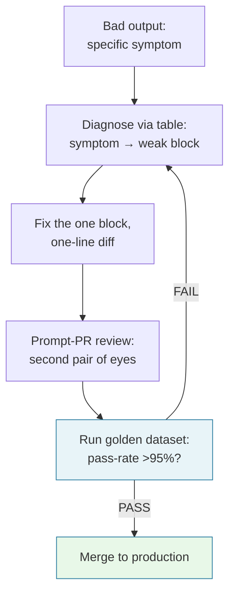

---

> **Prerequisite:** Understanding of basic system prompt structures and LLM tokenization boundaries.

> **Answer-first:** Production agent prompts must be structured into 8 mandatory blocks: Identity, Mission, Scope, Context, Tools, Execution, Constraints, and Output. This architectural modularity directly prevents context rot and distractor amplification across long context windows, guaranteeing deterministic schema compliance, boundary enforcement, and predictable downstream automated tool invocation across complex enterprise multi-turn environments.

---

## Why Blocks, Not Prose: The Measured Case

> **Answer-first:** Blocks reduce misinterpretation (Anthropic recommends wrapping each content type in its own tag), make prompts diff-reviewable at block granularity, and map one-to-one onto documented failure classes. The golden rule tests the structure: if a colleague with minimal context could follow your prompt, the model can too.

The monolithic system prompt fails in production for structural reasons, not stylistic ones. Anthropic's official guidance frames the discipline: "Think of Claude as a brilliant but new employee who lacks context on your norms and workflows" — and the golden rule: "Show your prompt to a colleague with minimal context on the task and ask them to follow it. If they'd be confused, Claude will be too."

Three properties make the block structure the right answer:

1. **Unambiguous parsing.** "XML tags help Claude parse complex prompts unambiguously, especially when your prompt mixes instructions, context, examples, and variable inputs. Wrapping each type of content in its own tag (for example, `<instructions>`, `<context>`, `<input>`) reduces misinterpretation."
2. **Reviewable units.** Eight labeled blocks diff cleanly — "changed Scope, kept Workflow" — enabling prompt code review; a prose monolith has no review unit.
3. **Failure-class coverage.** Each anti-pattern from the taxonomy (generic, overstuffed, no-fallback) resolves block-by-block — the anatomy is a failure-mode taxonomy made structural.

The execution dependency graph across all eight blocks:

```mermaid
graph LR
    B1["1. Identity & Archetype<br/>closes identity drift"] --> B2["2. Mission & Goals<br/>closes goal ambiguity"]
    B2 --> B3["3. Scope & Boundary Lock<br/>closes scope creep"]
    B3 --> B4["4. Context & Environment<br/>closes context rot"]
    B4 --> B5["5. Tool Policy & Least Agency<br/>closes tool misuse"]
    B5 --> B6["6. Workflow & SOP<br/>closes order-of-operations errors"]
    B6 --> B7["7. Output Schema Contract<br/>closes format regression"]
    B7 --> B8["8. Fallback & Uncertainty Policy<br/>closes confident-wrong answers"]

    style B1 fill:#e8f4f8,stroke:#2a7da0
    style B8 fill:#e8f8e8,stroke:#2a7da0
```



---

## 1. Identity & Archetype Block

> **Answer-first:** One to three sentences that pin role, domain authority, and persona boundaries — "Even a single sentence makes a difference" (Anthropic). This is the cheapest steering lever in the prompt.

Defines the agent's core role, domain authority level, Non-Human Identity (NHI) identifier, and persona boundaries.

- **Key Fields:** Name, Archetype, Identity_ID, Authority_Level.

Vendor guidance for writing it:

- The minimal form works: "You are a helpful coding assistant specializing in Python" — a single sentence already focuses behavior and tone.
- Explain the role's motivation, not just the title — "Claude is smart enough to generalize from the explanation."
- For apps depending on self-identification, pin model awareness explicitly: "The assistant is Claude, created by Anthropic. The current model is Claude Opus 5."
- Identity is also the stable prefix that KV-cache reuse depends on — persona consistency is a cost optimization, not only a tone concern.

Anti-pattern: "You are a helpful AI" — fails the golden rule. A new employee told only "be helpful" still asks every follow-up question the blocks exist to answer.

## 2. Mission & Goal Block

> **Answer-first:** The Mission states the measurable outcome and the action stance — suggest or implement — because the model obeys the verb you use. "Can you suggest some changes?" yields suggestions; "Change this function" yields changes.

States the explicit, quantitative objective for the active task session, framing what constitutes successful completion.

- **Key Fields:** Primary Objective, Quantitative Success Criteria, Expected Deliverables.

Three rules from the official guidance:

1. **Request "above and beyond" explicitly.** "Create an analytics dashboard" ≠ "Create an analytics dashboard. Include as many relevant features and interactions as possible." If you want extras, say so.
2. **Verbs set the action mode.** "For Claude to take action, be more explicit" — suggestion-framing produces suggestions even when you hoped for implementation.
3. **Pick a default stance.** Aggressive: `<default_to_action>` — "By default, implement changes rather than only suggesting them. If the user's intent is unclear, infer the most useful likely action and proceed." Conservative: `<do_not_act_before_instructions>` — "Do not jump into implementation or change files unless clearly instructed... default to providing information, doing research, and providing recommendations." Not choosing leaves the stance to the model's guess.

## 3. Scope & Boundary Lock Block

> **Answer-first:** Scope converts "be careful" into checkable permissions organized by reversibility: local reversible actions run freely; destructive, hard-to-reverse, and visible-to-others actions require confirmation. "When encountering obstacles, do not use destructive actions as a shortcut."

Establishes hard operational boundaries (`BOUNDARY_LOCK`): out-of-scope domains, forbidden file paths, prohibited actions. Out-of-scope requests abort immediately rather than trigger partial fixes.

- **Key Fields:** In-Scope Domains, Out-of-Scope Domains, Enforcement Policy.

The reversibility criterion, from Anthropic's agent safety guidance:

| Action class | Examples | Policy |
|---|---|---|
| Local, reversible | editing files, running tests | free to act |
| Destructive | deleting files or branches, dropping tables, `rm -rf` | confirm first |
| Hard to reverse | `git push --force`, `git reset --hard`, amending published commits | confirm first |
| Visible to others | pushing code, commenting on PRs/issues, sending messages, shared infrastructure | confirm first |

Model-generation note: directives tuned for earlier models ("CRITICAL: You MUST...") cause overtriggering on newer ones — "dial back any aggressive language." Scope blocks are versioned with the model they target.

## 4. Context & Environment Block

> **Answer-first:** Context admits only task-relevant, version-pinned data — and placement is a measured decision: long data at the top, query at the end, up to +30% quality (Anthropic internal tests). The U-shape (Lost in the Middle) is the mechanism: attention is strongest at context edges.

Provides runtime metadata: operating system attributes, repository directories, active timestamps, authentication levels. Isolating runtime variables prevents path and permission assumptions.

- **Key Fields:** Runtime OS, Working Directory, Execution Timestamp, User Privilege Level.

Placement rules with numbers:

1. **Longform data at the top.** "Place your long documents and inputs near the top of your prompt, above your query, instructions, and examples. This improves performance across all models."
2. **Queries at the end.** "Queries at the end can improve response quality by up to 30 percent in tests, especially with complex, multidocument inputs."

The underlying mechanism is the U-shaped recall curve (Lost in the Middle, TACL 2023): performance is highest at the beginning and end of the context window, degraded in the middle — the data-top/query-end layout parks each content type where attention is strongest. Context rot compounds the case: 18 frontier models degrade with input length even on trivial tasks, so "just in case" context is measurably counterproductive.

For multidocument inputs, tag provenance: wrap each document in `<document index="n">` with `<source>` and `<document_content>` subtags — metadata travels with data. For long-document tasks, ground first: "ask Claude to quote relevant parts of the documents first before carrying out its task."

## 5. Tool Policy & Least Agency Block

> **Answer-first:** Tool Policy defines which tools, under what caps, with what error behavior — because "agents are only as effective as the tools we give them." Consolidated tools beat wrapped APIs, responses need token caps (25,000 default), and error messages are prompt engineering.

Enforces least privilege across MCP function calls: authorized tools, mandatory pre-execution checks for state-changing commands, fail-closed for unverified operations.

- **Key Fields:** Authorized Tools List, Irreversible Action Rules, Fail-Closed Policy.

The quantitative evidence (Anthropic, "Writing effective tools for agents," Sep 2025):

1. **Consolidate instead of wrapping APIs.** "Instead of implementing a `list_users`, `list_events`, and `create_event` tools, consider implementing a `schedule_event` tool which finds availability and schedules an event"; `search_logs` over `read_logs`; `get_customer_context` over three separate getters. "Too many tools or overlapping tools can also distract agents from pursuing efficient strategies."
2. **Cap response sizes.** "For Claude Code, we restrict tool responses to 25,000 tokens by default" — production policies define caps, pagination, and truncation with steering instructions.
3. **Concise vs detailed modes.** A `response_format` enum cut a Slack tool response from 206 tokens (detailed) to 72 (concise) — "we use ~⅓ of the tokens with 'concise' tool responses."
4. **Natural language over cryptic IDs.** "Merely resolving arbitrary alphanumeric UUIDs to more semantically meaningful and interpretable language... significantly improves Claude's precision in retrieval tasks by reducing hallucinations."
5. **Errors are prompt engineering.** "Prompt-engineer your error responses to clearly communicate specific and actionable improvements, rather than opaque error codes" — the web-search incident: Claude appended "2025" to queries until the tool description was fixed.
6. **Namespacing works.** `asana_search` vs `jira_search` delineates boundaries; prefix- vs suffix-based namespacing showed "non-trivial effects on our tool-use evaluations."
7. **Description refinement moves benchmarks.** "Claude Sonnet 3.5 achieved state-of-the-art performance on the SWE-bench Verified evaluation after we made precise refinements to tool descriptions, dramatically reducing error rates."

## 6. Workflow & Procedural Execution Block

> **Answer-first:** Workflows are numbered steps where order matters, each ending on a checkable completion criterion, closing with a self-check step — but bound outcomes rather than prescribing reasoning, because "Claude's reasoning frequently exceeds what a human would prescribe."

Defines step-by-step SOPs: a deterministic step graph with embedded verification checkpoints, replacing arbitrary execution paths.

- **Key Fields:** Sequential SOP Steps, Pre-condition Checks, Self-Verification Gates.

Four refinement rules from the official guidance:

1. **Number steps when order or completeness matters** — "Provide instructions as sequential steps using numbered lists."
2. **Completion criteria per step** — each step ends on a condition the executor can check ("every modified model accounted for" beats "produce a change list").
3. **Self-check as the final step.** "Append something like 'Before you finish, verify your answer against [test criteria].' This catches errors reliably, especially for coding and math."
4. **Prefer general instructions over prescriptive steps.** Over-prescribed workflows cause over-verification and token inflation on newer models — instructions tuned for earlier generations should be removed, not rewritten, when migrating.

For long-horizon tasks, name the state formats: structured JSON for state (`tests.json` with id/name/status/passing/failing), freeform text for progress notes (`progress.txt`), and git as the backbone — "Claude's latest models perform especially well in using git to track state across multiple sessions."

## 7. Output Schema Contract Block

> **Answer-first:** The Output Contract is the parse contract downstream systems live on — and since Claude 4.6, prefilled responses return a 400 error. Structured Outputs and explicit instructions are the only contract mechanisms; state them positively, match prompt style to desired output, and kill preambles contractually.

Defines the exact structural schema (JSON Schema, Pydantic) for the final response. Conversational framing, preambles, and post-execution commentary are explicitly forbidden — output must be parseable directly.

- **Key Fields:** Schema Definition, Strict Formatting Rules, Zero-Conversational-Text Rule.

Four rules from the official guidance:

1. **State what to do, not what to avoid.** Instead of "Do not use markdown in your response," write "Your response should be composed of smoothly flowing prose paragraphs."
2. **Use XML format indicators.** "Write the prose sections of your response in `<smoothly_flowing_prose_paragraphs>` tags."
3. **Prompt style bleeds into output.** "Removing markdown from your prompt can reduce the volume of markdown in the output" — match the prompt's style to the output you want.
4. **Prefills are dead.** "Starting with Claude 4.6 models, prefilled responses... are no longer supported. Requests with prefilled assistant messages return a 400 error." The migration: Structured Outputs ("designed specifically to constrain Claude's responses to follow a given schema"), tool enums for classification, direct instructions for preamble elimination — "newer models can reliably match complex schemas when told to."

The security counterpart: OWASP LLM02 (Insecure Output Handling) requires treating every model output as untrusted input — the contract is the spec the validator enforces.

## 8. Fallback & Uncertainty Policy Block

> **Answer-first:** Fallback makes abstention contractual — and abstention is the empirically safest measured behavior: Claude-family models hallucinate least precisely because they abstain under ambiguity (Chroma, 18 models, Jul 2025). Missing data → ask; insufficient basis → state confidence; risky action → confirm.

Specifies behavior when instructions conflict, tools error, or confidence falls below threshold: halt, emit structured diagnostics, or request clarification — never fabricate.

- **Key Fields:** Tool Error Strategy, Ambiguity Handling, Uncertainty Thresholds.

The measured basis: in distractor experiments across 18 frontier models, Claude-family models showed the lowest hallucination rates because they abstain under ambiguity; GPT-family models hallucinated most by answering anyway. The Fallback block converts the empirically safest behavior from accident into obligation.

Three rules close the space:

1. Missing mandatory data → ask or flag, never guess.
2. Out-of-scope input → decline with reason and route to the right owner.
3. Uncertainty → state the confidence tier in the output — machine-parseable, so downstream systems can route low-confidence results to human review automatically.

Compliance framing: an agent that guesses on missing data creates liability; one that flags and escalates creates an audit trail (OWASP LLM09 Overreliance is the complementary risk).

---

## XML Prompt Framing and Template

Modern LLMs demonstrate higher instruction compliance when system prompts utilize structural XML tags — "Use consistent, descriptive tag names across your prompts. Nest tags when content has a natural hierarchy" (Anthropic). The production template:

```python
"""
2026 Production Agent 8-Block Prompt Schema Template.
Enforces XML isolation across identity, mission, boundary locks, and output contracts.
"""

AGENT_8BLOCK_PROMPT_TEMPLATE = """
<agent_prompt_version="2026.1">

<block_1_identity>
Name: {agent_name}
Archetype: {archetype}
Identity_ID: {nhi_identity_id}
Authority_Level: {authority_level}
</block_1_identity>

<block_2_mission>
Objective: {primary_objective}
Success_Criteria: {success_criteria}
</block_2_mission>

<block_3_scope_boundary_lock>
IN_SCOPE: {in_scope_domains}
OUT_OF_SCOPE: {out_of_scope_domains}
POLICY: If requested action is OUT_OF_SCOPE, invoke BOUNDARY_LOCK and return explicit refusal.
</block_3_scope_boundary_lock>

<block_4_context_environment>
Runtime_OS: {runtime_os}
Working_Dir: {working_directory}
Execution_Time: {execution_timestamp}
User_Role: {user_role}
</block_4_context_environment>

<block_5_tool_policy>
Allowed_Tools: {allowed_tools_list}
Irreversible_Actions: Requires explicit confirmation gate before execution.
Fail_Closed: True (If policy evaluation fails, abort action).
</block_5_tool_policy>

<block_6_workflow_sop>
Step 1: Inspect environment and validate input parameters.
Step 2: Execute domain analysis using approved tools.
Step 3: Run self-verification against criteria.
Step 4: Formulate structured output.
</block_6_workflow_sop>

<block_7_output_contract>
Format: JSON Schema strictly matching `{output_schema_name}`.
Rule: Do not add intro/outro conversational text. Respond ONLY with valid JSON.
</block_7_output_contract>

<block_8_fallback_uncertainty_policy>
On Tool Failure: Surface error to coordinator, do not invent mock data.
On Ambiguity: Flag confidence < 0.85, output `[UNCERTAINTY_DETECTED]` with missing requirements.
</block_8_fallback_uncertainty_policy>

</agent_prompt_version>
"""
```

Block omission rules keep the template honest: Tool Policy only when tools exist; Examples (3–5, relevant, diverse, wrapped in `<example>` tags) when format anchoring matters; Identity and Mission always. The framework is a checklist, not a ritual.

---

## Production Failure: Which Block Broke

> **Answer-first:** Blocks enable layered diagnosis: wrong perspective → Identity; overreach → Scope; format drift → Output Contract; confident guessing → Fallback. Without blocks, diagnosis is impossible and every fix is blind.

The loop closes with eval, not vibes — each fix ships through the golden-dataset gate before production:



Scenario: a review bot suddenly starts rambling about style. Without blocks, the team edits blind — dropping "don't ramble" into the middle of the prompt. With blocks, diagnosis takes 30 seconds: **the Scope block lacks the style-comment prohibition**; fix the block, review a one-line diff, confirm no regression on the golden dataset.

The debug table every prompt owner keeps next to the eval dashboard:

| Output symptom | Missing/weak block | Fix |
|---|---|---|
| Wrong voice or lens | Identity | Pin role + reason for role |
| Overreach, touched forbidden files | Scope | Add permission enum + confirmations |
| Right task, wrong stack suggestions | Context | Pin stack, versions, conventions |
| Wrong tool calls, wrong-file edits | Tool Policy | Allowlist + description refinement |
| Wrong step order, skipped verification | Workflow | Number steps + self-check gate |
| Format drift, broken parsers | Output Contract | Schema + XML tags + positive rules |
| Confident answers with missing data | Fallback | Ask-clause + confidence tier |

The loop closes with eval, not vibes — each fix ships through the golden-dataset gate before production.

---

## FAQ


No. Tool Policy is only present when the agent has tools; Examples (3–5, relevant and diverse, wrapped in `<example>` tags) when format anchoring matters; Identity and Mission form the permanent minimum. The framework is a checklist scaled to the task — a simple review prompt runs fine on 6–7 blocks. What is mandatory is the *discipline*: every block you omit is a documented decision, not an oversight.



Because the measured evidence says long prompts are worse, not just harder to maintain: 18 frontier models degrade in accuracy as input length grows — even on trivial tasks (Chroma, Jul 2025) — and n² attention stretches thin. Mixed concerns in one string also create edit-coupling: a task-level edit silently damages a safety rule living in the same text. Block separation isolates the blast radius of every change. Context rot is why the Context block admits only version-pinned, task-relevant data.



Long data at the top, above instructions and examples; the query at the very end. Anthropic's guidance: "Place your long documents and inputs near the top of your prompt" — and "queries at the end can improve response quality by up to 30 percent in tests, especially with complex, multidocument inputs." The mechanism is the U-shaped recall curve (Lost in the Middle, TACL 2023): attention is strongest at the edges of the context window. The standard block order encodes this: stable identity/policy prefix → long data → query last.



Prefilled assistant messages return a 400 error on Claude 4.6 and later — the feature is formally deprecated. The replacement is the Output Contract itself: Structured Outputs constrain responses to a given JSON schema; classification tasks use tools with enum fields; preamble elimination moves to direct system-prompt instructions ("Respond directly without preamble. Do not start with phrases like 'Here is...'"). Newer models "can reliably match complex schemas when told to" — the contract is stronger than the hack it replaced, because it is validated, not assumed.




## 🔗 Related Deep-Dives

- [High-Throughput Go Microservices Architecture](/posts/go-microservices/)
- [Generative UI with Model Context Protocol (MCP)](/posts/generative-ui-with-mcp-ai-native-frontend/)
- [Engineering Reading Map & System Design Guides](/reading-map/)

- [Executive Summary: The 2026–2027 Engineering Case](/series/prompt-standard/executive-summary/)
- [Part 7 — What Is a Prompt Standard](/series/prompt-standard/part-7-what-is-prompt-standard/)
- [Part 3 — Layered Prompt Architecture](/series/prompt-standard/part-3-layered-prompt-architecture/)
- [MCP Engineering In Production](/series/mcp-engineering-in-production/) — where Tool Policy meets real MCP infrastructure

🔗 **Next Step:** Continue to [Part 3 — Layered Prompt Architecture](/series/prompt-standard/part-3-layered-prompt-architecture/) for the following module in the series.
