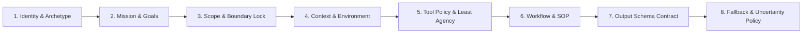

**Answer-first:** Production agent prompts are built using an 8-block modular schema rather than monolithic text strings. Isolating identity, mission, boundary locks, environment context, tool policies, workflows, output contracts, and uncertainty handlers stops agent drift, enforces fail-closed execution, and eliminates prompt injection vulnerabilities in automated multi-agent applications.

---

## The Failure of Monolithic Prompts in Autonomous Systems

When building complex agentic systems, single-paragraph system prompts break down quickly. Freeform text instructions allow models to misinterpret priorities, mix security rules with output formatting, or hallucinate tool execution parameters when faced with ambiguous requests.

In 2026, enterprise prompt architectures mandate strict separation of concerns through an **8-Block Modular Prompt Schema**. Each logical block handles a single aspect of the agent runtime. By enforcing structured XML framing around each block, systems prevent instruction bleeding, enable unit testing of individual prompt components, and support dynamic compilation pipelines.

---

## Architectural Overview of the 8-Block Schema

The 8-block schema organizes agent behavior into isolated, sequential execution domains. This structural boundary guarantees that security policies cannot be overridden by user payload data or dynamic tool returns.

The diagram below maps the execution dependency graph across all eight core agent prompt blocks.



---

## Detailed Block Specifications

Each of the eight blocks fulfills a specific operational contract within the model's attention mechanism.

### 1. Identity & Archetype Block
Defines the agent's core role, domain authority level, Non-Human Identity (NHI) identifier, and persona boundaries. Establishing a precise technical archetype anchors the model's prior weights to domain-specific knowledge bases while stripping out irrelevant conversational persona traits.
- **Key Fields:** Name, Archetype, Identity_ID, Authority_Level.

### 2. Mission & Goal Block
States the explicit, quantitative objective for the active task session. This block frames what constitutes successful completion, providing objective evaluation criteria for internal chain-of-thought verification gates.
- **Key Fields:** Primary Objective, Quantitative Success Criteria, Expected Deliverables.

### 3. Scope & Boundary Lock Block
Establishes hard operational boundaries (`BOUNDARY_LOCK`). This block explicitly lists out-of-scope domains, forbidden file paths, and prohibited actions. If an incoming command targets an out-of-scope resource, the model must abort execution immediately rather than attempting a partial fix.
- **Key Fields:** In-Scope Domains, Out-of-Scope Domains, Enforcement Policy.

### 4. Context & Environment Block
Provides real-time runtime metadata, including operating system attributes, target repository directories, active timestamps, and user authentication levels. Isolating runtime environment variables prevents the agent from making assumptions about operating system paths or permissions.
- **Key Fields:** Runtime OS, Working Directory, Execution Timestamp, User Privilege Level.

### 5. Tool Policy & Least Agency Block
Enforces the Principle of Least Privilege across Model Context Protocol (MCP) function calls. It defines which tools are authorized, mandates mandatory pre-execution checks for state-changing commands, and sets a fail-closed directive for unverified operations.
- **Key Fields:** Authorized Tools List, Irreversible Action Rules, Fail-Closed Policy.

### 6. Workflow & Procedural Execution Block
Defines step-by-step Standard Operating Procedures (SOPs) for task resolution. Rather than allowing the LLM to choose arbitrary execution paths, this block provides a deterministic step graph with embedded verification checkpoints.
- **Key Fields:** Sequential SOP Steps, Pre-condition Checks, Self-Verification Gates.

### 7. Output Schema Contract Block
Defines the exact structural schema (such as JSON Schema or Pydantic definitions) required for the agent's final response. It explicitly forbids conversational framing, preambles, or post-execution commentary, ensuring the output can be parsed directly by automated backend systems.
- **Key Fields:** Schema Definition, Strict Formatting Rules, Zero-Conversational-Text Rule.

### 8. Fallback & Uncertainty Policy Block
Specifies protocol behavior when instructions conflict, tools return errors, or context confidence falls below acceptable thresholds. Instead of fabricating results, the agent must halt execution, emit structured diagnostic logs, or request clarification.
- **Key Fields:** Tool Error Strategy, Ambiguity Handling, Uncertainty Thresholds.

---

## XML Prompt Framing and Stopping Agent Drift

Modern LLMs demonstrate higher instruction compliance when system prompts utilize structural XML tags (such as `<block_1_identity>` and `<block_3_scope_boundary_lock>`). XML tagging provides explicit boundary markers that prevent the model from confusing user inputs with system-level control directives.

The Python code template below demonstrates the production representation of the 8-Block schema as used in multi-agent orchestration engines.

```python
"""
2026 Production Agent 8-Block Prompt Schema Template.
Enforces XML isolation across identity, mission, boundary locks, and output contracts.
"""

AGENT_8BLOCK_PROMPT_TEMPLATE = """
<agent_prompt_version="2026.1">

<block_1_identity>
Name: {agent_name}
Archetype: {archetype}
Identity_ID: {nhi_identity_id}
Authority_Level: {authority_level}
</block_1_identity>

<block_2_mission>
Objective: {primary_objective}
Success_Criteria: {success_criteria}
</block_2_mission>

<block_3_scope_boundary_lock>
IN_SCOPE: {in_scope_domains}
OUT_OF_SCOPE: {out_of_scope_domains}
POLICY: If requested action is OUT_OF_SCOPE, invoke BOUNDARY_LOCK and return explicit refusal.
</block_3_scope_boundary_lock>

<block_4_context_environment>
Runtime_OS: {runtime_os}
Working_Dir: {working_directory}
Execution_Time: {execution_timestamp}
User_Role: {user_role}
</block_4_context_environment>

<block_5_tool_policy>
Allowed_Tools: {allowed_tools_list}
Irreversible_Actions: Requires explicit confirmation gate before execution.
Fail_Closed: True (If policy evaluation fails, abort action).
</block_5_tool_policy>

<block_6_workflow_sop>
Step 1: Inspect environment and validate input parameters.
Step 2: Execute domain analysis using approved tools.
Step 3: Run self-verification against criteria.
Step 4: Formulate structured output.
</block_6_workflow_sop>

<block_7_output_contract>
Format: JSON Schema strictly matching `{output_schema_name}`.
Rule: Do not add intro/outro conversational text. Respond ONLY with valid JSON.
</block_7_output_contract>

<block_8_fallback_uncertainty_policy>
On Tool Failure: Surface error to coordinator, do not invent mock data.
On Ambiguity: Flag confidence < 0.85, output `[UNCERTAINTY_DETECTED]` with missing requirements.
</block_8_fallback_uncertainty_policy>

</agent_prompt_version>
"""
```

---

## FAQ


XML tags provide unambiguous syntax delimiters that LLMs recognize as structural boundaries during token parsing. While Markdown headers can be confused with content formatting inside retrieved RAG documents, explicit XML tag pairs prevent instruction injection by isolating control logic from user data payloads.



When a prompt includes a strictly enforced Scope and Boundary Lock block, the model halts execution as soon as an out-of-scope condition is detected. Instead of executing unauthorized tool calls or attempting speculative actions, the agent returns an explicit refusal payload detailing the boundary violation.



The Fallback and Uncertainty Policy block sets clear rules for handling low-confidence scenarios and tool errors. By explicitly instructing the model to flag missing information rather than generating speculative answers, system architects convert potential hallucinations into actionable diagnostic error states.



