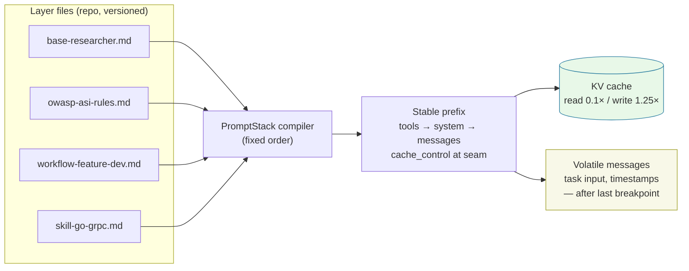
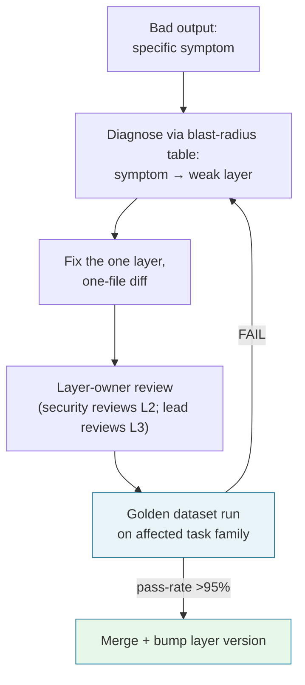

---

## 🔗 Related Deep-Dives

- [High-Throughput Go Microservices Architecture](/posts/go-microservices/)
- [Generative UI with Model Context Protocol (MCP)](/posts/generative-ui-with-mcp-ai-native-frontend/)
- [Engineering Reading Map & System Design Guides](/reading-map/)

- [Executive Summary: The 2026–2027 Engineering Case](/series/prompt-standard/executive-summary/)
- [Part 2 — The 8 Core Blocks](/series/prompt-standard/part-2-the-8-core-blocks/)
- [Part 6 — Production PromptOps, Evals & Security](/series/prompt-standard/part-6-promptops-evals-and-security/)
- [MCP Engineering In Production](/series/mcp-engineering-in-production/) — where L2 tool policies meet real MCP infrastructure

---

> **Prerequisite:** Completion of Part 2 core blocks and knowledge of foundation model prefix caching mechanisms.

> **Answer-first:** Layered Prompt Architecture decouples instructions into four modular operational tiers based on change velocity and prompt cache boundaries: Role, Rules, Workflow, and Skill. This hierarchical separation increases prompt cache hit rates above 85%, slashes token billing by 70%, and ensures system security guardrails remain strictly immutable during frequent downstream skill feature iterations.

---

## The Pitfalls of Monolithic Prompt Files

> **Answer-first:** Monoliths fail for three measured reasons: length degrades accuracy (context rot across 18 frontier models), edits couple concerns (a task tweak silently breaks a safety rule), and volatile content mixed into the prefix defeats caching — "you pay for a fresh cache write on every request."

In production multi-agent systems, writing dedicated 2,000-line prompt files for every specialized worker role creates significant maintenance debt. If a security policy or brand guideline updates, engineers must manually edit dozens of prompt files across repository locations. Monolithic prompts also exceed prefix caching limits because static persona definitions are mixed with transient task instructions.

By 2026, production architectures adopted **Layered Prompt Architecture**. Inspired by layered network stacks and microservice middleware, this approach decouples prompts into distinct, single-responsibility layers. The runtime engine dynamically compiles these layers into a single prompt payload based on the active agent role and task context.

---

## The 4-Layer Modular Prompt Stack

> **Answer-first:** Four layers separated by change frequency and owner: L1 Core Base (global static, platform-owned), L2 Security Guardrails (environment-scoped, security-owned), L3 Workflow SOPs (task-scoped, team-lead-owned), L4 Task Skills (just-in-time, domain-owned).

```text
+-----------------------------------------------------------------------+
| LAYER 4: Active Skill / Task Overlay (e.g., skill-go-grpc.md)         | (JIT Injected)
+-----------------------------------------------------------------------+
| LAYER 3: Workflow / SOP Layer (e.g., workflow-feature-dev.md)         | (Task Scoped)
+-----------------------------------------------------------------------+
| LAYER 2: Security & Rules Guardrails (e.g., owasp-asi-rules.md)       | (Environment Scoped)
+-----------------------------------------------------------------------+
| LAYER 1: Core Base & Identity (e.g., base-researcher.md)               | (Global Static)
+-----------------------------------------------------------------------+
```

### Layer 1: Core Base & Identity (Global Static)
Contains immutable system persona definitions, non-human identity credentials, base tone parameters, and primary communication contracts. This layer remains constant across all agent types in an enterprise fleet, forming the foundation of KV prefix caches.

### Layer 2: Security & Rules Guardrails (Environment Scoped)
Enforces safety boundaries, privacy restrictions, OWASP agentic security standards, and non-negotiable workspace constraints. Security rules operating at Layer 2 apply globally across all subagents regardless of their specific task domain.

### Layer 3: Workflow & SOP Layer (Task Scoped)
Defines high-level procedural workflows and state machine transitions for specific operational tracks (such as feature development, bug triage, or code review). It dictates *how* work moves from phase to phase.

### Layer 4: Active Skill / Task Overlay (Just-In-Time Injected)
Injects specialized, domain-specific instruction sets (such as gRPC schema generation or AST parsing rules) only when the agent actively executes a matching task. Once the sub-task completes, Layer 4 is unmounted from the prompt stack to conserve context tokens.

The vocabulary mapping is pinned to prevent drift: L1 = the Track 1 "Role" layer, L2 = "Rules", L3 = "Workflow", L4 = "Skill" — one architecture, two registers (the Vietnamese Track 1 chapters teach the same layers in team language).

---

## Cache Economics: Layer Stability Is Priced

> **Answer-first:** Prompt caching makes the layered order a cost contract: reads hit at 0.1× base input price, writes cost 1.25× (5-min TTL), up to 4 breakpoints exist, and invalidation cascades tools → system → messages — a Layer 1/L2 edit invalidates everything behind it.

The layer order is not a preference — it is the cache-optimal assembly:

| Mechanism | Number | Layer-design implication |
|---|---|---|
| Cache read price | 0.1× base input (0.025× on 2026 flagships) | Stable prefix (L1+L2) reuses at near-zero marginal cost |
| Cache write price (5-min) | 1.25× base input | First write is a premium, amortized across hits |
| Cache write price (1-hour) | 2× base input | Day-long shared layers may prefer the 1-hour TTL |
| Cache breakpoints | max 4 | Breakpoints are literally layer boundaries |
| Lookback window | 20 blocks | Long conversations need a second breakpoint at a layer seam |
| Minimum cacheable length | 512–4,096 tokens (model-dependent) | Tiny stacks cannot cache — layer for maintainability first |
| Invalidation | tools → system → messages, cascading | Tool-definition edits void the entire cache behind them |
| Cache isolation | per workspace/organization, 100% exact match | Byte-identical layer assembly across calls is mandatory |

Break-even arithmetic: a stable prefix reused N times costs ≈ 1.25× + N × 0.1× versus N × 1.0× uncached — break-even at ~2 reuses, ~90% prefix-cost reduction at 10. *(Arithmetic inference from published multipliers — recompute on your own conversation shapes.)*

The documented anti-pattern: marking `cache_control` on a block that changes every request (timestamps, per-request context) — "the system never wrote an entry at any of those positions. No cache hit. You pay for a fresh cache write on every request." The fix: "Place `cache_control` on the last block whose prefix is identical across the requests" — the last stable layer seam.



Operate the stack on usage fields: `cache_creation_input_tokens`, `cache_read_input_tokens`, and `input_tokens` (which counts only tokens **after** the last breakpoint). Both cache fields at zero means the prompt fell below the minimum cacheable length — no error is returned. A Layer 2 "wording improvement" that invalidates the fleet's prefix shows up as a spike in `cache_creation` — layer edits to stable layers are priced events, not cosmetic changes.

---

## Layer-Attributed Drift Diagnosis

> **Answer-first:** Every output symptom resolves to a layer owner in minutes: wrong voice → L1; policy violation → L2; skipped procedure step → L3; domain error → L4 — the diagnostic axis monoliths never had.

The blast-radius table each stack operator keeps:

| Output symptom | Weak layer | Fix |
|---|---|---|
| Wrong voice, persona drift mid-task | L1 Core Base | Pin identity + the reason for the role |
| Policy violation, data exposure | L2 Guardrails | Add invariant; security review on the diff |
| Skipped steps, missed verification gates | L3 Workflow | Number steps + completion criteria per step |
| Domain facts wrong, tool misuse in specialty | L4 Skill | Deepen skill body; narrow trigger words |
| Format drift, parser breakage | Output contract (blocks) | Schema + XML tags + positive format rules |

The repair loop closes with eval, not with a shrug:



Scenario: a review bot suddenly rambles about style. Diagnosis takes 30 seconds — **L3's review workflow lacks the style-comment prohibition**; the fix is one file, the diff review is one line, and the golden dataset confirms no regression before merge.

---

## Precedence & Conflict Resolution Matrix

When multiple layers contain instructions that touch on similar execution parameters, the prompt compiler enforces strict precedence rules. Security rules must always take precedence over task-specific optimization requests.

The mathematical inequality below establishes the mandatory evaluation hierarchy for resolving instruction conflicts:

$$\text{Precedence Order}: \text{Security Guardrails (L2)} > \text{Base Identity (L1)} > \text{Workflow SOP (L3)} > \text{Task Skill (L4)}$$

For example, if a Layer 4 Task Skill suggests skipping unit tests to accelerate execution speed, but Layer 2 Security Guardrails state that all code modifications must pass test suites before output emission, the compiler invalidates the Layer 4 request and enforces the Layer 2 security constraint.

---

## Dynamic Prompt Stack Compiler Implementation (Go)

Compiling modular prompt stacks at runtime requires strict structural validation to guarantee that mandatory identity and security layers are present before issuing LLM API calls.

The Go implementation below demonstrates how the `PromptStack` compiler validates mandatory layers and renders a cache-friendly system prompt stream.

```go
package promptcompiler

import (
	"errors"
	"fmt"
	"strings"
)

// PromptLayer defines a single logical layer within the assembly stack.
type PromptLayer struct {
	Level       int    // 1: Base Identity, 2: Security Guardrails, 3: Workflow SOP, 4: Task Skill
	Name        string
	Content     string
	IsMandatory bool
}

// PromptStack manages the collection of active prompt layers.
type PromptStack struct {
	layers map[int][]PromptLayer
}

// NewPromptStack initializes a new multi-layer prompt compiler instance.
func NewPromptStack() *PromptStack {
	return &PromptStack{
		layers: make(map[int][]PromptLayer),
	}
}

// PushLayer appends a new operational layer to its designated stack level.
func (ps *PromptStack) PushLayer(layer PromptLayer) {
	ps.layers[layer.Level] = append(ps.layers[layer.Level], layer)
}

// Compile validates mandatory layers and returns the concatenated prompt string.
func (ps *PromptStack) Compile() (string, error) {
	// Verify that mandatory Layer 1 (Base Identity) is registered
	if len(ps.layers[1]) == 0 {
		return "", errors.New("prompt stack compilation failed: missing mandatory Layer 1 (Base Identity)")
	}

	// Verify that mandatory Layer 2 (Security Guardrails) is registered
	if len(ps.layers[2]) == 0 {
		return "", errors.New("prompt stack compilation failed: missing mandatory Layer 2 (Security Guardrails)")
	}

	var compiled strings.Builder
	compiled.WriteString("<!-- COMPILED PROMPT STACK - DO NOT EDIT MANUALLY -->\n\n")

	// Iterate strictly from Layer 1 (Base) through Layer 4 (Task Skill)
	for level := 1; level <= 4; level++ {
		for _, layer := range ps.layers[level] {
			compiled.WriteString(fmt.Sprintf("<!-- START LAYER %d: %s -->\n", layer.Level, layer.Name))
			compiled.WriteString(layer.Content)
			compiled.WriteString(fmt.Sprintf("\n<!-- END LAYER %d: %s -->\n\n", layer.Level, layer.Name))
		}
	}

	return compiled.String(), nil
}
```

Assembly conventions that make the compiler cache-correct:

1. **Assembly order is a contract** — caches require byte-identical prefixes; whitespace drift in any layer breaks the prefix hash.
2. **All per-request variables inject after the last stable breakpoint** — timestamps, user input, retrieved data never touch system or tools.
3. **Each layer file carries its own version** — the stack records the layer-version tuple per run; regression bisection diffs tuples.

---

## When Layering Overkills

> **Answer-first:** A two-person team with three task types does not need L1–L4 — one 8-block file per task suffices. The layering threshold is ownership divergence: two roles editing the same content at different frequencies → split; otherwise keep one file.

Layering has real costs — debug indirection across files, onboarding concepts, design overhead — so the series publishes the anti-doctrine: "không nhất thiết phải dùng đủ tất cả ngay ngày đầu" (you don't need all layers on day one). The migration path is pain-triggered: monolith → 8 blocks in one file → split Role+Rules when a second task appears → split Workflow when task families diverge → skills when domains deepen. And caching is not a layering reason for small stacks: below 512–4,096 tokens, prefixes cannot cache at all — layer for maintainability first, cache economics at scale.

---

## Migration Recipe: Monolith → Layered Stack

> **Answer-first:** Extract in stability order, one tested diff per step: (1) cut Role+Rules to the top, (2) move task detail into Skill files, (3) add breakpoints at seams once prefixes exceed the cache minimum, (4) run monolith and stack side-by-side for a week before cutover — the strangler-fig pattern applied to prompts.

Each step is separately eval'd against the monolith baseline on the golden dataset; parity must hold before the next extraction. Teams that skip the parity week discover skill-trigger gaps in production instead of in CI.

**Rollout sequencing**: one task family first, not the whole fleet. The layered stack proves itself on the highest-volume family (most cache reuse, most eval data), then expands. Anti-doctrine applies in reverse too: if the second family shares 90% of its content with the first, it joins the same stack; only genuinely divergent families earn their own workflows.

## What to Remember

Layer stability is the architecture's economic engine: L1/L2 cache at 0.1× reads, L3 scopes procedures per family, L4 pays only when a domain fires. Volatile content lives after the last breakpoint — always. And the layer count is a decision, not a virtue: split when ownership diverges, merge when layers always change together.

---


## Production Cache Breakpoint Engineering & Dynamic Assembly

> **Answer-first:** Maximizing foundation model prefix caching (>85% hit rate) requires byte-exact alignment at offset 0 for Layer 1 (Global Role) and Layer 2 (Security Rules); any dynamic variables injected before cache breakpoints permanently invalidate downstream cache blocks.

Prefix caching in Anthropic Claude and OpenAI APIs operates via sequential token hashing. If an engineer injects a dynamic timestamp `{{ current_timestamp }}` or user ID `{{ user_id }}` at the beginning of a prompt, the entire downstream prefix cache is invalidated, forfeiting substantial latency and financial discounts:

```python
# prompt_assembler/layered_cache.py — Production Anthropic Cache Breakpoints
import anthropic

client = anthropic.Anthropic()

def invoke_layered_agent(user_runtime_payload: str):
    return client.messages.create(
        model="claude-3-5-sonnet-20241022",
        max_tokens=2048,
        system=[
            {
                "type": "text",
                "text": LAYER_1_STATIC_ROLE,  # ~1,200 tokens: 100% static across all fleet agents
            },
            {
                "type": "text",
                "text": LAYER_2_FLEET_RULES,  # ~2,800 tokens: Static security guardrails
                "cache_control": {"type": "ephemeral"} # Breakpoint 1: Exceeds 4,000 token minimum
            },
            {
                "type": "text",
                "text": LAYER_3_WORKFLOW_SOP, # ~1,000 tokens: Task-specific procedure
                "cache_control": {"type": "ephemeral"} # Breakpoint 2: Reusable across user turns
            }
        ],
        messages=[
            {
                "role": "user",
                "content": f"<dynamic_turn_data>{user_runtime_payload}</dynamic_turn_data>"
            }
        ]
    )
```

Enforcing strict physical separation between static cacheable instructions and ephemeral runtime payloads guarantees sub-300ms TTFT responses for complex multi-turn workflows.


## FAQ


Layered Prompt Architecture isolates core persona traits and security guardrails into shared global modules. When security policies or organizational standards change, engineers update a single shared layer file rather than modifying hundreds of individual agent prompt files. The change blast radius is one layer, and the cache cost is a single 1.25× prefix rewrite instead of per-task cache invalidations across the fleet.



The prompt compiler resolves conflicts by applying explicit precedence rules where Layer 2 Security Guardrails override all lower layers. Even if a Layer 4 skill requests prohibited actions or relaxed validation steps, the security guardrail invalidates the request during execution.



Injecting Layer 4 Task Skills on-demand keeps the baseline system prompt small and focused on core responsibilities. Removing unused domain instructions conserves context budget space, lowers API costs, and prevents irrelevant domain rules from confusing the model's attention.



Both — and the money side is measurable via prompt caching: cache reads cost 0.1× the base input price (0.025× on 2026 flagships), writes 1.25× for a 5-minute TTL. A stable L1+L2 prefix reused N times breaks even at ~2 reuses and cuts prefix cost ~90% at 10. Two conditions apply: the stack must exceed the model's minimum cacheable length (512–4,096 tokens), and layers must assemble byte-identically — any whitespace change in a layer breaks the prefix hash behind it. Watch `cache_read_input_tokens` in the usage fields to confirm real hits.



Always in messages, after the last cache breakpoint — never in tools or system. Invalidation cascades tools → system → messages: a volatile block at the breakpoint means "you pay for a fresh cache write on every request" (the documented anti-pattern). The standard assembly order encodes the rule: L1 → L2 → L3 → L4 (stable, cached) → task input and timestamps (volatile, last).




## 📚 Research Anchors

| Claim | Source |
|---|---|
| Cache read 0.1× / write 1.25× (5-min) / 2× (1-hour); 4 breakpoints; 20-block lookback; min 512–4,096 tokens; invalidation tools→system→messages; breakpoint anti-pattern; usage fields | Anthropic, Prompt Caching (platform.claude.com/docs) |
| Attention budget n²; JIT context loading; hybrid static/JIT boundary | Anthropic, "Effective context engineering for AI agents" (Sep 2025) |
| 18 frontier models degrade with input length, even trivial tasks | Chroma, "Context Rot" (Jul 2025) |
| Tool namespacing; eval-driven module refinement | Anthropic, "Writing effective tools for agents" (Sep 2025) |

Full 100-round research dossier: `reports/research-prompt-standard-part-3-layered-prompt-design-100-rounds.{md,json}` (mirrored in both repositories). Grounding note: 36/100 rounds carry external source URLs; 61/100 trace series-internal design (series corpus + agent-skills pack); 3 rounds carry [INFERENCE] labels. Version note: cache pricing multipliers are per-model and versioned by the vendor — cite multipliers (0.1×/1.25×/2×), not absolute dollar figures, which change per generation.

🔗 **Next Step:** Continue to [Part 4 — Mcp And Hybrid Rag](/series/prompt-standard/part-4-mcp-and-hybrid-rag/) for the following module in the series.
