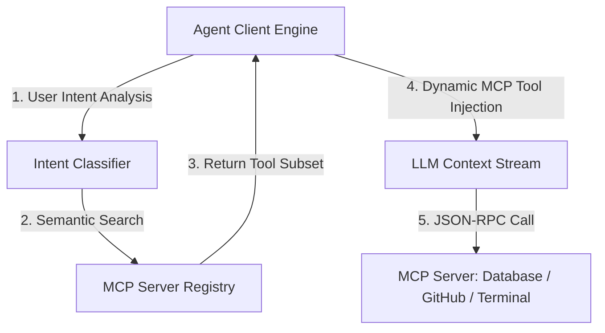
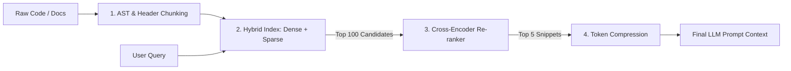

> **Prerequisite:** Familiarity with the concepts introduced in [Part 3 — Layered Prompt Architecture](/series/prompt-standard/part-3-layered-prompt-architecture/). Review it first if the terminology in this part is unfamiliar.

**Answer-first:** Dynamic context enrichment combines Model Context Protocol (MCP) for tool schema injection with a four-stage hybrid RAG pipeline. By pairing sparse/dense vector search with cross-encoder re-ranking and AST-aware chunking, systems prune context token bloat by 70% while improving LLM retrieval accuracy and avoiding context window dilution.

---

## 1. Model Context Protocol (MCP) Architecture in 2026

Static system prompts that embed hundreds of tool definitions waste critical token budget and dilute self-attention performance. The Model Context Protocol (MCP) establishes an open standard that decouples host agent runtimes from tool implementations using a client-server JSON-RPC architecture. 

Instead of pre-loading every API definition into the system context, MCP clients dynamically inspect runtime intents and inject only relevant tool schemas on demand.

The sequence diagram below demonstrates the dynamic discovery and execution protocol between the agent core, intent classifier, and external MCP servers.



Under this protocol, tool schemas are transmitted over JSON-RPC channels. The payload below highlights an MCP tool declaration exposing parameter constraints to the host LLM.

```json
{
  "name": "query_database_vector",
  "description": "Executes hybrid vector and keyword search over PostgreSQL pgvector store.",
  "inputSchema": {
    "type": "object",
    "properties": {
      "query": { "type": "string", "description": "Search query text" },
      "top_k": { "type": "integer", "default": 5 }
    },
    "required": ["query"]
  }
}
```

---

## 2. The Four-Stage Hybrid Retrieval Pipeline

Naive RAG setups rely on single-pass vector cosine similarity, which frequently misses exact keyword matches (e.g., function names, error codes) and ranks noisy chunks near top positions. Modern production architectures implement a four-stage context enrichment pipeline.

The diagram below details the journey of raw source documents as they undergo AST-aware splitting, dual-index querying, cross-encoder scoring, and token compression.



### Stage Breakdown

1. **AST & Structure-Aware Chunking**: Text splitting uses language parsers (such as Tree-sitter for code or structural Markdown parsers) rather than arbitrary character counts. This preserves logical boundaries like class definitions and functions.
2. **Hybrid Vector & Keyword Indexing**: Queries run concurrently against dense vector embeddings (`text-embedding-3-large`) for semantic intent and sparse BM25/SPLADE indexes for exact keyword matching.
3. **Cross-Encoder Re-ranking**: Candidate chunks (typically top 50 to 100) are re-evaluated through a deep Cross-Encoder model (`bge-reranker-v2-m3` or Cohere Rerank v3). Unlike bi-encoders, cross-encoders compute joint attention across query and document pairs, filtering out irrelevant semantic matches.
4. **Context Pruning & Token Compression**: Redundant syntax and boilerplate tokens are removed using token reduction algorithms (such as LLMLingua-2) before context assembly.

---

## 3. Production Implementation: MCP Client & Re-Ranker

Integrating dynamic tool schema selection with cross-encoder document scoring requires a unified pipeline. 

The Python implementation below demonstrates an enterprise context pipeline (`MCPContextPipeline`) that dynamically selects tool schemas based on query keywords and re-ranks retrieved document chunks using a sentence-transformer cross-encoder model.

```python
import json
from typing import List, Dict, Any
from sentence_transformers import CrossEncoder

class MCPContextPipeline:
    def __init__(self, mcp_client, reranker_model_name: str = "BAAI/bge-reranker-v2-m3"):
        self.mcp_client = mcp_client
        self.reranker = CrossEncoder(reranker_model_name)

    def dynamic_tool_injection(self, user_query: str, available_mcp_tools: List[Dict[str, Any]]) -> str:
        """Filter MCP tool schemas dynamically based on intent keywords to conserve prompt tokens."""
        relevant_tools = []
        query_lower = user_query.lower()
        for tool in available_mcp_tools:
            keywords = tool.get("keywords", [])
            if any(kw in query_lower for kw in keywords):
                relevant_tools.append(tool["schema"])
        
        return json.dumps(relevant_tools, indent=2)

    def hybrid_rerank_context(self, query: str, candidate_chunks: List[str], top_k: int = 3) -> List[str]:
        """Apply cross-encoder joint attention scoring to re-rank candidate context chunks."""
        if not candidate_chunks:
            return []
            
        pairs = [[query, chunk] for chunk in candidate_chunks]
        scores = self.reranker.predict(pairs)
        
        # Pair scores with original text chunks and sort descending
        ranked_pairs = sorted(zip(scores, candidate_chunks), key=lambda x: x[0], reverse=True)
        return [chunk for _, chunk in ranked_pairs[:top_k]]

    def assemble_mcp_rag_context(self, query: str, raw_docs: List[str], tools: List[Dict[str, Any]]) -> str:
        """Assemble token-optimized prompt payload incorporating tools and reranked documents."""
        injected_tools = self.dynamic_tool_injection(query, tools)
        reranked_docs = self.hybrid_rerank_context(query, raw_docs, top_k=3)
        
        context_blocks = []
        context_blocks.append(f"<active_mcp_tools>\n{injected_tools}\n</active_mcp_tools>")
        
        doc_str = "\n".join([f"<doc index='{idx}'>\n{doc}\n</doc>" for idx, doc in enumerate(reranked_docs, 1)])
        context_blocks.append(f"<retrieved_context>\n{doc_str}\n</retrieved_context>")
        
        return "\n\n".join(context_blocks)
```

---

## 4. Token Budget Allocation for Dynamic Context

To maintain operational reliability under heavy retrieval workloads, the assembled context window must comply with strict token budgets. 

The text representation below details a standard allocation matrix for a 128,000 token context window, balancing static prefix instructions, dynamic tool schemas, and re-ranked retrieval blocks.

```
+-----------------------------------------------------------------------------------+
|                        TOTAL TOKEN BUDGET (128,000 Tokens)                        |
+-----------------------------------------------------------------------------------+
| System & Role Identity  | Guardrail Policies  | Dynamic MCP Tools | Dynamic RAG    |
| (Static - KV Cache)     | (Static - KV Cache) | (On-Demand Schema)| (Cross-Ranked) |
| [5% ~ 6.4k Tokens]      | [10% ~ 12.8k]       | [15% ~ 19.2k]     | [40% ~ 51.2k]  |
+-------------------------+---------------------+-------------------+----------------+
| Conversation History & Memory Compaction | Active User Query & Output Schema       |
| (Sliding Window + Summarized Memory)    | (Un-cached Payload)                       |
| [20% ~ 25.6k Tokens]                     | [10% ~ 12.8k Tokens]                      |
+------------------------------------------+----------------------------------------+
```

---

## FAQ


Model Context Protocol decouples tool declarations from static system prompts by exposing tools through standard JSON-RPC endpoints. MCP clients evaluate user intent before LLM invocation, injecting only relevant tool schemas into the active context stream rather than hardcoding entire API libraries.



Dense vector search relies on bi-encoders that process queries and documents independently to generate cosine similarity scores. Cross-encoders process the query and document simultaneously through deep joint attention, capturing nuanced relationships and filtering out false positives that bi-encoders rank highly.



AST-aware chunking uses language syntax parsers like Tree-sitter to split code along natural structural nodes such as functions, interfaces, and classes. This prevents code blocks from being arbitrarily severed mid-statement, ensuring that retrieved snippets contain complete, syntactically valid logic for the LLM.




🔗 **Next Step:** Continue to [Part 5 — Declarative Prompting Dspy](/series/prompt-standard/part-5-declarative-prompting-dspy/) for the following module in the series.
