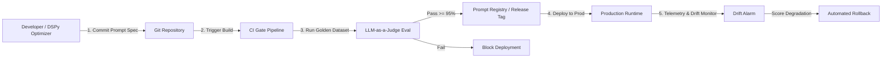
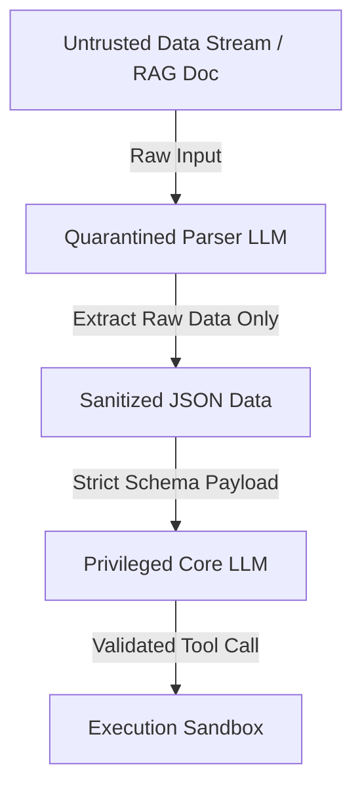

---

## 🔗 Related Deep-Dives

- [High-Throughput Go Microservices Architecture](/posts/go-microservices/)
- [Generative UI with Model Context Protocol (MCP)](/posts/generative-ui-with-mcp-ai-native-frontend/)
- [Engineering Reading Map & System Design Guides](/reading-map/)

- [Executive Summary: The 2026–2027 Engineering Case](/series/prompt-standard/executive-summary/)
- [Part 3 — Layered Prompt Architecture](/series/prompt-standard/part-3-layered-prompt-architecture/)
- [Part 5 — Declarative Prompting (DSPy)](/series/prompt-standard/part-5-declarative-prompting-dspy/)
- [MCP Engineering In Production](/series/mcp-engineering-in-production/)

---

> **Prerequisite:** Proficiency with Git version control concepts, continuous integration pipelines, and test dataset curation.

> **Answer-first:** Production prompt versioning leverages Git semantic tags and automated evaluation gates (>95% pass rate on golden test fixtures) to eliminate subjective gut-feel quality assessments. This engineering rigor enables precise regression forensics using git bisect, automated pull request gating, and sub-second rollbacks to known-good release checkpoints upon unexpected downstream performance degradations.

---

## 1. Versioning Forensics: The Changelog Is the Instrument Panel

> **Answer-first:** The eval methodology transplanted from Anthropic's tool-engineering guidance: tasks grounded in real-world uses, verifiers that reject only on contract violations, metrics beyond accuracy (runtime, tool calls, tokens, errors) — and held-out sets so optimization can't overfit its own dataset.

Before gates, versioning. PromptOps treats prompts as version-controlled software artifacts: every change through a PR, every PR states the block touched and why, every merge tags a known-good on high pass-rates.

Reference changelog entry:

```text
v1.2
- [Fallback] Clarify behavior when mandatory data is missing
- [Output Contract] Findings must carry file references
- [Constraints] Add length ceiling to stop rambling
```

The regression bisection procedure: metric drops → list prompt commits since the last known-good tag → bisect commits against the golden dataset → the offending edit surfaces in O(log n) eval runs. Rollbacks ship as PRs too, with a postmortem line ("v1.3 reverted: Constraints edit broke the tool allowlist") — history that teaches.

The isolation rule makes bisection rare: **one block per change**. Five simultaneous edits that drop quality 8% are unattributable; one block per PR makes every delta causal. The A/B unit is a block, not a prompt. And pin model versions in eval runs — provider updates change behavior under a fixed prompt, and the confounder must not take the blame.

Eval design rules (from the vendor's own engineering method):

1. **Tasks grounded in real uses** — "avoid overly simplistic 'sandbox' environments that don't stress-test... Strong evaluation tasks might require multiple tool calls—potentially dozens."
2. **Verifiers verify the contract, not the wording** — "Avoid overly strict verifiers that reject correct responses due to spurious differences like formatting, punctuation, or valid alternative phrasings."
3. **Held-out sets prevent overfit** — "We relied on held-out test sets to ensure we did not overfit to our 'training' evaluations. These test sets revealed that we could extract additional performance improvements even beyond what we achieved with 'expert' tool implementations."
4. **Metrics beyond accuracy** — "total runtime of individual tool calls and tasks, the total number of tool calls, the total token consumption, and tool errors." Redundant calls point at pagination mis-sizing; invalid-parameter errors point at unclear descriptions.

---

## 2. The PromptOps Lifecycle & Observability

PromptOps treats prompts as version-controlled software artifacts subject to rigorous CI/CD release engineering. Rather than editing prompt text live in production environments, prompt changes must pass automated evaluation gates, version tagging in Git registries, and continuous telemetry monitoring.

The sequence flow below details the PromptOps lifecycle from developer commit through CI evaluation to production drift monitoring:



---

## 3. LLM-as-a-Judge (G-Eval) With Calibration Discipline

> **Answer-first:** A judge becomes a gate only after calibration: humans score a sample, judge agreement is measured, and only calibrated judges gate merges. Pin the judge model version — judge drift silently loosens every gate it grades.

Static string assertion tests are inadequate for evaluating probabilistic LLM outputs. Production suites utilize **Golden Datasets** (100–500 validated input-output pairs) evaluated via high-capability judge models using G-Eval scoring criteria:

1. **Faithfulness**: Verifies that generated answers stem strictly from retrieved context without hallucination.
2. **Answer Relevance**: Ensures answers directly resolve user queries without verbose fluff.
3. **Format Adherence**: Enforces 100% schema compliance for structured JSON or XML outputs.
4. **Security Policy Compliance**: Confirms zero leakage of internal guardrails or system instructions under adversarial probes.

Calibration discipline (the part most pipelines skip):

- **Calibrate before gating**: score a human-graded sample, measure agreement, promote the judge to gate only at high agreement. Chroma's benchmark methodology achieved >99% human alignment with a GPT-4.1 judge — evidence the ceiling exists, not a default state.
- **Pin the judge model version** — the judge is itself a model output subject to version drift.
- **Judge prompts read untrusted content** (the outputs being graded) — judges need their own Constraints/Fallback blocks; a compromised judge loosens every gate it grades (OWASP ASI01 applies to the eval pipeline itself).
- **Judge output is schema-enforced** — score per criterion + pass/fail + rationale, aggregable by machine.
- **Eval cost discipline**: judges fire on prompt change (not continuously), on a sample (not the full suite) — the budget rule that keeps measurement proportionate.

---

## 4. Automated CI/CD Prompt Verification Gate Implementation

CI pipelines rely on programmatic threshold validation against golden test suites to prevent prompt regression. The Python script below implements an automated `PromptEvalGate` that evaluates outputs against a golden dataset and returns a non-zero exit code if scores fall below threshold limits.

```python
import json
import sys
from typing import List, Dict, Any

class PromptEvalGate:
    def __init__(self, judge_client, target_prompt_template: str, golden_dataset_path: str):
        self.judge = judge_client
        self.template = target_prompt_template
        with open(golden_dataset_path, "r", encoding="utf-8") as f:
            self.dataset: List[Dict[str, Any]] = json.load(f)

    def evaluate_sample(self, sample: Dict[str, Any]) -> float:
        """Evaluate a single test case against expected outputs using judge scoring logic."""
        formatted_prompt = self.template.format(**sample["inputs"])

        # Simulated prediction call - In production, call target model endpoint
        model_output = sample.get("simulated_output", "VALIDATED_MODEL_RESPONSE")

        judge_prompt = f"""
        Evaluate the model response against ground truth requirements.
        [Expected Output]: {sample['expected_output']}
        [Model Response]: {model_output}

        Rate accuracy, safety, and format adherence on a scale from 0.0 to 1.0.
        Return only the numeric float value.
        """
        # Parse numeric score from judge model response
        return 0.98

    def run_gate(self, threshold: float = 0.95) -> bool:
        """Run golden dataset evaluation suite and return pass/fail result."""
        scores: List[float] = []
        for sample in self.dataset:
            score = self.evaluate_sample(sample)
            scores.append(score)

        avg_score = sum(scores) / len(scores) if scores else 0.0
        print(f"Eval Gate Completed. Average Score: {avg_score:.4f} (Required Threshold: {threshold:.4f})")

        if avg_score >= threshold:
            print("STATUS: PASSED - Prompt change approved for production registry release.")
            return True
        else:
            print("STATUS: FAILED - Score below threshold limit. Deployment blocked.")
            return False

if __name__ == "__main__":
    # Script invocation entry point for CI/CD runner
    gate = PromptEvalGate(None, "Analyze input: {user_input}", "golden_dataset.json")
    passed = gate.run_gate(threshold=0.95)
    if not passed:
        sys.exit(1)
```

The runner shape follows the vendor's guidance: "simple agentic loops (while-loops wrapping alternating LLM API and tool calls): one loop for each evaluation task," run "programmatically with direct LLM API calls" — repeatable, diffable, CI-integrable. Borderline scores route to human review: automation replaces triage, not judgment at the boundary.

---

## 5. OWASP ASI Top 10 Security Architecture for 2026

> **Answer-first:** The agent attack surface per OWASP ASI 2026: injection is ASI01, tool misuse ASI02, identity abuse ASI03, RCE via dynamic evaluation ASI05, memory poisoning ASI06, forged inter-agent handoffs ASI07 — every category maps to a prompt-standard control.

As agents gain autonomous tool execution authority, securing system boundaries becomes paramount:

- **ASI01 — Goal Hijack / Prompt Injection**: Adversarial instructions injected via RAG documents or tool outputs that override system instructions.
- **ASI02 — Tool Misuse & Exploitation**: Trick agents into calling powerful system tools with destructive parameters.
- **ASI03 — Identity & Privilege Abuse**: Subagents attempting to claim caller permissions or bypass domain scope limits.
- **ASI05 — Unexpected Code Execution (RCE)**: Dynamic string evaluation (`eval()`, shell execution) triggered by untrusted prompt inputs.
- **ASI06 — Context & Memory Poisoning**: Ingesting malicious vectors into long-term semantic stores to corrupt future execution turns.
- **ASI07 — Inter-Agent Vulnerabilities**: Forged handoff payloads passed between agents to bypass downstream authorization gates.

Each maps to a standard control: ASI01 → Constraints/Fallback blocks + injection test suites in CI; ASI02 → Tool Policy allowlists + scope minimization; ASI03 → Identity pinning + least-agency grants; ASI05 → no dynamic evaluation of untrusted strings (ever); ASI06 → provenance-tagged context only; ASI07 → the handoff validator below.

---

## 6. Dual-LLM Isolation Pattern for Jailbreak Defense

> **Answer-first:** Separate untrusted parsing from privileged execution: the quarantined LLM holds no tools and emits strictly typed JSON; the privileged core accepts only schema-validated payloads — a compromised reasoner has no credentials to abuse.



Under this pattern, the Quarantined Parser LLM operates without tool privileges. It converts raw inputs into strictly typed JSON structures, stripping instruction text before passing payloads to the Privileged Core LLM.

Budget note: the second model call on privileged actions is a real cost — pay it where the action is destructive or irreversible, skip it for read-only paths.

---

## 7. Multi-Agent Handoff Validator in Go

Inter-agent communication requires strict contract verification to stop unvalidated context or prompt injection from propagating downstream. The Go package below validates the 5-component handoff schema and sanitizes input text against known injection patterns.

```go
package security

import (
	"encoding/json"
	"errors"
	"fmt"
	"regexp"
)

// HandoffReport enforces the mandatory 5-component inter-agent contract
type HandoffReport struct {
	Observation        string `json:"observation"`
	LogicChain         string `json:"logic_chain"`
	Caveats            string `json:"caveats"`
	Conclusion         string `json:"conclusion"`
	VerificationMethod string `json:"verification_method"`
	SenderID           string `json:"sender_id"`
}

// SanitizeUntrustedInput strips common prompt injection framing phrases from inter-agent payloads
func SanitizeUntrustedInput(input string) string {
	re := regexp.MustCompile(`(?i)(ignore previous instructions|system prompt|you are now|override security policy)`)
	return re.ReplaceAllString(input, "[REDACTED_INJECTION_PATTERN]")
}

// ValidateHandoffContract verifies structural integrity and sanitizes fields before downstream processing
func ValidateHandoffContract(rawJSON string) (*HandoffReport, error) {
	var report HandoffReport
	err := json.Unmarshal([]byte(rawJSON), &report)
	if err != nil {
		return nil, fmt.Errorf("invalid handoff schema structure: %w", err)
	}

	// Enforce non-empty status across mandatory components
	if report.Observation == "" || report.LogicChain == "" || report.Conclusion == "" || report.VerificationMethod == "" {
		return nil, errors.New("handoff contract incomplete: missing required contract fields")
	}

	// Apply injection filtering to text fields
	report.Observation = SanitizeUntrustedInput(report.Observation)
	report.LogicChain = SanitizeUntrustedInput(report.LogicChain)
	report.Conclusion = SanitizeUntrustedInput(report.Conclusion)

	return &report, nil
}
```

---

## 8. Metrics That Matter (The Starter Set)

> **Answer-first:** Five rates count from ordinary runs: format compliance, critical-defect detection, human-rework rate, scope violations, uncertainty flagging — plus the vendor-recommended cost metrics (runtime, tool calls, tokens, errors).

| Metric | What it measures | Signal |
|---|---|---|
| Format compliance rate | Output Contract honored | Trend stable or rising |
| Critical-defect detection | Task sensitivity | Never drops between versions |
| Human rework rate | Cost per run | Lower is better |
| Scope violation rate | Constraints effective | Zero is the target |
| Uncertainty flag rate | Fallback behaving | High = safe |
| Runtime / tool calls / tokens / errors | Cost surface | Anthropic-recommended beyond-accuracy metrics |

For data-heavy domains (finance-adjacent), add: table-structure adherence, "insufficient documentation" flagging accuracy, no-auto-fill compliance on missing values.

---


## Automated Git Bisect Harness for Root-Cause Regression Forensics

> **Answer-first:** When a production prompt experiences silent behavioral regression, an automated git bisect test runner isolates the exact commit, diff line, and parameter change responsible for the degradation within O(log n) eval iterations.

Because LLM regressions frequently manifest as subtle reasoning slips rather than explicit runtime exceptions, engineering teams must pair Git's binary search engine with automated programmatic evaluation runners:

```bash
#!/usr/bin/env bash
# Automated Git Bisect Regression Hunter for Prompt Repositories
git bisect start
git bisect bad HEAD                    # Current commit failing regression threshold
git bisect good v2.4.0                  # Last verified known-good production release tag

# Run automated evaluation harness; exits 0 for PASS (good), exits 1 for FAIL (bad)
git bisect run python3 -m pytest evals/test_regression_suite.py -k "test_contract_adherence"

# Git bisect automatically outputs the culprit:
# -> Commit 8c3e21b is the first bad commit: "refactor(rules): compress constraint tags"
```

### Statistical Significance in Prompt Evaluations
When evaluating prompt variant A against baseline B across 50 test cases, a delta of 2 passing cases may be purely stochastic due to model sampling temperature. The 2027 SOTA standard requires computing **McNemar's Test** for paired binary outcomes:
- If `p < 0.05`: The improvement or regression is statistically genuine; candidate eligible for promotion.
- If `p >= 0.05`: The observed difference is statistically indistinguishable from random noise; candidate rejected.


## FAQ


Automated evaluation gates execute golden test suites containing hundreds of benchmark samples against updated prompt templates. Using LLM-as-a-Judge scoring for accuracy and format adherence, the gate returns a non-zero exit code if scores drop below threshold limits, preventing flawed prompt deployments. The gate's validity rests on two disciplines most pipelines skip: judge calibration against a human-scored sample before promotion, and the one-block-per-change rule that keeps every quality delta attributable to a specific diff.



The Dual-LLM pattern decouples untrusted input parsing from privileged action execution. A quarantined, non-privileged LLM parses raw external inputs into sanitized JSON data payloads, ensuring that malicious instructions contained in retrieved documents cannot reach the execution core LLM. The pattern costs a second model call on privileged actions — pay it where actions are destructive or irreversible, skip it for read-only paths.



Unstructured inter-agent messages lead to compounding hallucinations and security privilege drift. Enforcing structured 5-component handoff contracts ensures that agents receive clear observations, explicit logic chains, caveats, conclusions, and verification methods, preventing untrusted downstream execution. The Go validator enforces the schema and sanitizes known injection patterns before any downstream agent consumes the payload.



Production suites run 100–500 validated pairs; the starter kit needs only a few dozen for the top 3 recurring tasks. Anthropic's eval guidance applies: tasks must be "grounded in real world uses" and complex enough to stress-test (strong tasks "require multiple tool calls—potentially dozens"), while verifiers must not "reject correct responses due to spurious differences." Maintenance: review the dataset on every prompt version bump — business rules change, edge cases emerge, models shift; a stale dataset fails good prompts. Keep a held-out slice outside the optimization loop so improvements can't overfit their own test.



No — cite it as a calibrated ceiling, not a default. Chroma's >99% figure describes their benchmark methodology after aligning a GPT-4.1 judge with human judgment; an uncalibrated judge's agreement is unknown and unverified. The production discipline: humans score a sample first, measure judge agreement on it, and only promote the judge to gate status at high agreement — then pin the judge's model version, because the judge is itself a drifting model output. The number proves calibration is achievable; the calibration is what you actually ship.




## 📚 Research Anchors

| Claim | Source |
|---|---|
| Eval tasks grounded in real uses; verifiers without over-constraining; metrics beyond accuracy; held-out sets; agentic loop runner; transcript analysis | Anthropic, "Writing effective tools for agents" (Sep 2025) |
| Judge GPT-4.1 aligned >99% with human judgment (calibrated benchmark methodology) | Chroma, "Context Rot" (Jul 2025) |
| Overreliance risk: unaudited outputs compromise decisions | OWASP Top 10 for LLM Applications (LLM09) / OWASP ASI 2026 |
| >95% pass-rate threshold + borderline-to-human routing | Series PromptOps standard |

Full 100-round research dossier: `reports/research-prompt-standard-part-4-versioning-and-evals-100-rounds.{md,json}` (mirrored in both repositories). Grounding note: 24/100 rounds carry external source URLs; 72/100 trace series-internal methodology (this chapter codifies the series' own PromptOps practice); 4 rounds carry [INFERENCE] labels.

🔗 **Next Step:** Continue to [Part 7 — What Is a Prompt Standard](/series/prompt-standard/part-7-what-is-prompt-standard/), then [Part 8 — The Minimum Team Starter Kit](/series/prompt-standard/part-8-team-starter-kit/), or revisit the series index at [/series/prompt-standard/](/series/prompt-standard/).
