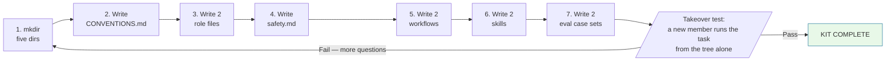
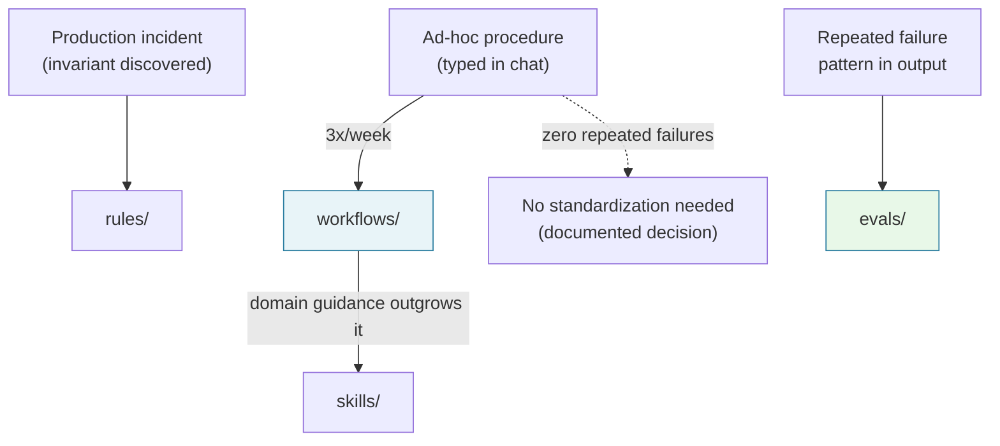

---

[← Previous Chapter: Part 4 — Prompt Versioning and CI/CD Evals](/series/prompt-standard/part-4-versioning-and-evals/) | [Series Hub: Prompt Standard](/series/prompt-standard/) | [Next Chapter: Part 6 — Context Engineering & Dynamic Ingestion →](/series/prompt-standard/part-6-context-engineering/)

## 🔗 Related Deep-Dives

- [High-Throughput Go Microservices Architecture](/posts/go-microservices/)
- [Generative UI with Model Context Protocol (MCP)](/posts/generative-ui-with-mcp-ai-native-frontend/)
- [Engineering Reading Map & System Design Guides](/reading-map/)

---

> **Prerequisite:** Understanding of repository layout standards, code review workflows, and team contribution guidelines.

> **Answer-first:** The enterprise prompt starter kit standardizes five core directories (roles, rules, workflows, skills, evals) alongside a central conventions charter for immediate team adoption. This modular layout defines explicit code ownership, strict promotion gates from sandbox to production, and shared evaluation harnesses, converting scattered personal prompts into permanent institutional engineering capital assets.

---

## The Goal Is Not Perfection, It Is Usable on Monday

> **Answer-first:** Teams delay standardization believing they must first build a large system — the actual requirement is a five-directory kit. The tree is the Part 3 layer model collapsed into directories, plus evals/ because Part 4 proved measurement is half the system.

Many teams postpone prompt standardization because they imagine a large platform effort first.

The actual minimum is five directories:

- `roles/` — L1 identity
- `rules/` — L2 invariants
- `workflows/` — L3 procedures
- `skills/` — L4 domain depth
- `evals/` — the measurement half

The five directories are not arbitrary: they are the four-layer model of [Part 3](/series/prompt-standard/part-3-layered-prompt-architecture/) plus the measurement discipline of [Part 4](/series/prompt-standard/part-6-promptops-evals-and-security/) — the whole series folded into a file tree.

The structure has production precedent: the agent-skills pack operates **108 skills, 34 roles, 24 workflows** in precisely this shape — centralized rules propagate to every role without per-file edits, and the pack passes 16/16 validation gates at that scale. Your starter tree will not need restructuring when it grows.

## The Directory Tree

```text
.agent/
  roles/
    developer.md
    reviewer.md
    writer.md
  rules/
    safety.md
    coding-standards.md
  workflows/
    debug-issue.md
    code-review.md
    quick-docs.md
  skills/
    add-api-endpoint/
      SKILL.md
    write-tests/
      SKILL.md
  evals/
    review-agent-cases.md
    docs-agent-cases.md
CONVENTIONS.md
```

## Minimum Content Per Directory

### Roles
Each role file carries:
- identity (one to three sentences — "Even a single sentence makes a difference" per Anthropic)
- responsibilities
- decision boundaries
- communication style

Acceptance test per role file: Anthropic's golden rule — show it to a colleague with minimal context; if they'd be confused, the model will be too.

### Rules
Each rules file contains:
- clear prohibitions
- safety principles
- internal invariants

Keep every file under ~10 lines — long rule files get skimmed; short ones get enforced. The starter `safety.md` is four prohibitions: no hand-editing generated files, no destructive commands, no fabricated test results, no secret exposure.

### Workflows
Each workflow answers:
- when to use (trigger)
- the numbered execution steps (numbering where order matters — Anthropic guidance)
- the expected output

Every step ends on a checkable completion criterion; the final step is a self-check ("Before you finish, verify your answer against [test criteria]").

### Skills
Each skill states:
- which tasks it serves
- which tasks it does not
- execution checklist
- common pitfalls

Trigger words front-load the file; the body loads only on trigger match — the 108 coexisting pack skills never cross-fire precisely because of this granularity discipline.

### Evals
Each eval case set carries:
- sample inputs
- pass/fail criteria
- the mandatory-detection list (critical errors the agent must catch)

The starter case set follows the five-probe pattern: happy path, performance case, format-only change, missing-context case, security case — five failure classes, five cases.

The kit extends by directory addition — never by restructuring:

```text
.agent/
  skills/
    reconcile-report/
      SKILL.md
  evals/
    reconciliation-cases.md
```

`reconcile-report` (finance add-on) specifies: permitted data sources, the "insufficient data" flag rule, the mandatory diff-table format, and the no-guessing-on-missing-amounts principle.

## CONVENTIONS.md — The Kit's Constitution

> **Answer-first:** Four lines: naming, owner field, review routing, changelog format — the conventions page converts a directory tree into governed infrastructure. Naming is the onboarding UX: new members find the right template without asking.
> **Prerequisite:** Understanding of repository layout standards, code review workflows, and team contribution guidelines.

| Item | Content | Why |
|---|---|---|
| Naming | lowercase-hyphen, one owner tag in frontmatter | New members find files by name — naming is onboarding UX |
| Owner | `owner: <handle>` per file | "Who fixes this at 3am?" answered structurally |
| Review routing | roles/workflows → team lead; rules/ → security; skills/ → domain owner; evals/ → task owner | Every diff routes to its authority |
| Versioning | Changelog header per file (version + date + change) | Regression bisection later |

Keep the page to one screen — anything longer belongs on the docs site, not at the kit's front door. Reviewers cite the page in review comments ("naming violation", "missing owner") — it converts taste disputes into checklist items.

## Two Starter Templates

### The Engineering Template

```text
# Identity
You are an engineering agent working in a Go microservices repo.

# Mission
Prioritize correctness, safety, and maintainability.

# Scope
May read code, edit code, and run local validation.
No breaking-compatibility changes without explicit confirmation.

# Context
The repo uses Clean Architecture, DDD, Kratos, PostgreSQL, Redis, and Dapr.

# Workflow
Understand the current state, choose the smallest change, implement, verify, report.

# Output Contract
State the changes made, files touched, verification results, and remaining risks.

# Uncertainty
If data is missing for a major decision, stop and ask concisely.
```

### The Accounting (Reconciliation) Template

```text
# Identity
You are a financial data reconciliation assistant.

# Mission
Prioritize accuracy, no guessing, and clear separation of well-founded vs missing data.

# Scope
May compare figures, detect mismatches, and summarize anomalies.
Must not fill in missing figures or conclude without sufficient documentation.

# Context
Data includes the sales report, the payment statement, and the internal lead sheet.

# Output Contract
Return results in three sections: matched, mismatched, insufficient data.

# Uncertainty
If the basis is insufficient, state "insufficient data to conclude".
```

Both templates demonstrate deliberate block omission: engineering runs 7 blocks (no Tool Policy — the agent has no tools yet); accounting runs 6 blocks (no Workflow — single-pass comparison). Omission is a documented decision, never an oversight.

The remaining three starters (PM brief, tester test-cases, CS response) follow the same anatomy — porting between teams touches only the Context block; the anatomy travels, the context stays local.

## The Three-Step Rollout

> **Answer-first:** Step 1: pick the 1–2 most repeated use cases (by repetition count, not impressiveness). Step 2: write the first standard prompts from the templates. Step 3: watch output for 1–2 weeks and fix on repeated failures — do not standardize everything on day one.
> **Prerequisite:** Understanding of repository layout standards, code review workflows, and team contribution guidelines.

### Step 1
Pick one or two most-repeated use cases — code review, quick docs. Repetition amortizes the template cost and generates eval data fastest.

### Step 2
Write the first standard prompts for them — 20 minutes from template, not a design project.

### Step 3
Watch output for one to two weeks, then fix based on repeated failures — each repeated failure maps to a block; fix the block, note the changelog. At volume, repeated failures graduate into case files in evals/.

Week one produces three numbers with zero infrastructure: how many runs used the template vs ad-hoc (reuse), which format breaks appeared (pre-eval signal), how many questions new members asked (onboarding friction).

Full bootstrap in seven steps — an afternoon with checkpoints:



Do not standardize everything on day one. The kit is done when the takeover test passes: a new member takes over your task from the tree alone — no questions to you — and two colleagues independently produce compatible prompts from the same template.

## Promotion and Archival Rules Between Directories

> **Answer-first:** The kit lives on pain-triggered promotion: an ad-hoc procedure typed 3x/week → workflows/; domain guidance outgrowing a workflow → skills/; an invariant discovered in an incident → rules/; a repeated failure pattern → evals/. Workflows nobody follows get archived, not defended.
> **Prerequisite:** Understanding of repository layout standards, code review workflows, and team contribution guidelines.



Usage is the only legitimacy test: dead files mislead new members more than missing files. Monthly, borrow the period-end close rhythm: conventions still one page? rules still true? workflows still match practice? skills still triggering? evals still passing? — five questions, twenty minutes.

## Production Failure: The Perfect Kit That Sits on the Shelf

> **Answer-first:** The kit's most common failure is not breaking — it is not being used: templates no task matches (template fiction), case files never run (eval theater), files without owners (owner sprawl). All three are diagnosable by the takeover test.
> **Prerequisite:** Understanding of repository layout standards, code review workflows, and team contribution guidelines.

The scenario: a team copies a beautiful kit template from a blog, spends two evenings customizing it, merges it... and three weeks later, the chat logs show everyone still typing prompts by hand because "the template doesn't match my actual task." The root cause is always one of three:

- **Template fiction** — templates written for imagined tasks, not the repeated real ones. Selecting use cases by repetition count prevents this disease entirely.
- **Eval theater** — case files written beautifully and never run. Attach them to Step 3 of the rollout; they run at the same cadence as the fix loop.
- **Owner sprawl** — orphan files nobody reviews or maintains. The `owner:` frontmatter field is the vaccine.

All three share one diagnostic: a failed takeover test — the new member cannot run the task from the tree. When it fails, don't add longer documentation; ask the member what was missing, and write exactly that piece.

## What Template Posts Skip (and This Kit Ships)

> **Answer-first:** The information gain over typical team-prompt-template posts is the governance half: the evals/ directory, the conventions page with review routing, ownership fields, promotion rules between directories, and the honest anti-doctrine — none of which ship in template-list posts.
> **Prerequisite:** Understanding of repository layout standards, code review workflows, and team contribution guidelines.

The comparison, dimension by dimension:

| Dimension | Typical template post | This kit |
|---|---|---|
| Directory tree | Shipped, sometimes decorated | Shipped — plus the layer-model mapping (why each directory exists) |
| Evals | Absent | evals/ from day one — five-probe pattern, real inputs |
| Governance | None | CONVENTIONS.md: naming, owner, review routing, changelog |
| Growth rules | "Add more as needed" | Pain-triggered promotion: 3x/week → workflow; incident → rule; failure pattern → eval |
| Failure modes | Not discussed | Template fiction, eval theater, owner sprawl — each takeover-test diagnosable |
| Scale evidence | None | The pack precedent: 108/34/24 at 16/16 gates |
| Honesty | "Best practice" framing | The anti-doctrine: do not standardize everything day one; stall-vs-satisfied is a management read on the repeated-failure count |

The last row is the one most posts cannot afford: the kit's honest failure mode is working-but-not-growing — team standardizes two use cases and stops. Acceptable if those two were the pain; a stall if the pain was bigger. The kit gives you the signal (repeated failures outside standardized use cases); the verdict stays human.

## What to Remember

> **Answer-first:** A good Prompt Standard is one the whole team can use, understand, and modify — if only one person understands the prompt system, it is not standardized yet.
> **Prerequisite:** Understanding of repository layout standards, code review workflows, and team contribution guidelines.

A good standard should be:

- clear (a one-page conventions file)
- sufficient (five directories, no more)
- maintainable (one owner, one version per file)
- tied to real work (evals use real inputs)

Four numbers say the kit works, countable from week one: **reuse rate up, format-break incidents down, onboarding time down, pass rate stable or up.**

The kit is deliberately the floor, not the ceiling: when it strains — more than five active prompts, more than three task types, a security review need — the deep-dive chapters take over: layered stacks with cache economics, MCP tool contracts, DSPy compilation, and CI-gated PromptOps.

The graduation signals, as a checklist you can audit quarterly:

| Signal you observe | Threshold | What it unlocks |
|---|---|---|
| Active prompt files | >5 | Layered stack assembly (Part 3's compiler) |
| Distinct task types | >3 | Workflow specialization + skill registry discipline |
| Security review requirement | any | OWASP-aligned eval gates (Part 6) |
| Prompt-change volume | >2/week | CI eval automation (sampled golden-dataset runs) |
| Cross-team rule sharing | 2+ teams | Cache-aligned layer design (0.1× read economics) |
| Agentic tool surface | any MCP tools | Tool Policy blocks + namespaced registry |

None of these unlock prematurely — the kit's five directories remain the base layer under every later upgrade; nothing you build this afternoon gets thrown away.

> *Return to the [series index](/series/prompt-standard/) for the full roadmap, or use this series as internal onboarding material for your team.*

---

## ❓ Frequently Asked Questions


Five directories (roles/, rules/, workflows/, skills/, evals/) plus a CONVENTIONS.md page, two templates, and two eval case sets — assembled in 30–60 minutes via the seven-step bootstrap. The structure has real-scale precedent: the agent-skills pack runs 108 skills / 34 roles / 24 workflows in exactly this shape without restructuring as it grew, and its centralized rules reach every role without per-file edits. The kit is complete when the takeover test passes — a new member runs a task from the tree alone, and two colleagues independently produce compatible prompts from the same template.



Because standardization without measurement is half a system — the Part 4 thesis. The eval-lite start needs only the five-probe pattern (happy, performance, format-only, missing-context, security) for your first two use cases: a few dozen real input/output pairs per Anthropic's "grounded in real world uses" guidance. Without evals/, every later template change ships without a regression signal — you return to vibes-based judgment, the exact practice this series exists to replace.



Both — one anatomy, five doors. The engineering template runs 7 blocks (Tool Policy omitted — no tools yet); the accounting template runs 6 (Workflow omitted — single-pass comparison); the finance add-on is skills/reconcile-report/ plus evals/reconciliation-cases.md. The difference between teams is the Context block only — the anatomy travels, the context is local. One standard, five entry vocabularies: PM, Developer, Tester, Accounting, CS.



One to two of the most-repeated use cases — selected by repetition count, not impressiveness (code review and quick docs beat novel demos). Expansion follows pain-triggered promotion: an ad-hoc procedure typed 3x/week promotes into workflows/; an invariant discovered in an incident lands in rules/; a repeated failure pattern lands in evals/. The kit graduates when you exceed ~5 active prompts, ~3 task types, or a security-review need — at which point the deep-dive chapters (layered stacks, MCP, DSPy, CI gates) become the next step, not before.


---

## 📚 Research Anchors

| Claim | Source |
|---|---|
| Golden rule (colleague test); one-sentence roles; numbered steps; self-check; incremental progress; reversibility classes | Anthropic, Prompting best practices (platform.claude.com/docs) |
| Eval tasks grounded in real uses; verifiers without over-constraining | Anthropic, "Writing effective tools for agents" (Sep 2025) |
| Pack structure 108 skills / 34 roles / 24 workflows, 16/16 validation gates | agent-skills pack (internal repo structure, verifiable via validate-all) |
| Five-probe eval pattern; pain-triggered promotion; takeover test | Series PromptOps standard (Track 1 Parts 1–5) |

Full 100-round research dossier: `reports/research-prompt-standard-part-5-team-template-100-rounds.{md,json}` (mirrored in both repositories). Grounding note: 20/100 rounds carry external source URLs; 77/100 trace series/pack-internal evidence (this kit codifies the structure the series itself runs on — series-internal is the primary source class by design); 3 rounds carry [INFERENCE] labels. Scale figures (108 skills / 34 roles / 24 workflows / 16 gates) are verifiable by running `python3 core/scripts/validate-all.py` from the agent-skills repository.

---

[Series Table of Contents](/series/prompt-standard/) | You have reached the final part. Revisit the [series index](/series/prompt-standard/) for the full roadmap.


## Automated Pre-Commit Linting Hooks for Prompt Repositories

> **Answer-first:** Installing automated pre-commit hooks in team repositories guarantees that 100% of committed prompt markdown files adhere strictly to the 8-block schema, pass secret scanning, and include valid YAML frontmatter before pushing to remote branches.

To prevent unformatted or insecure prompt files from entering team repositories, the starter kit provides an out-of-the-box `.pre-commit-config.yaml` specification:

```yaml
# .pre-commit-config.yaml — Automated Prompt Standard Linter
repos:
  - repo: local
    hooks:
      - id: lint-prompt-blocks
        name: Enforce 8 Core Prompt Blocks
        entry: python3 scripts/lint_prompt_structure.py
        language: python
        files: ^(roles|skills|workflows)/.*\.md$
        pass_filenames: true
      - id: detect-api-credentials
        name: Block Hardcoded Credentials & API Keys
        entry: detect-secrets-hook
        language: python
        files: ^.*\.md$
      - id: validate-pydantic-schemas
        name: Validate Prompt Pydantic Schema Contracts
        entry: python3 scripts/verify_schemas.py
        language: python
        stages: [pre-push]
```

### The 5-Minute Production Readiness Gatekeeper Checklist
1. [ ] Are Layer 1 (Role) and Layer 2 (Rules) completely static and isolated from user input?
2. [ ] Are all runtime variables enclosed in unambiguous XML tags (`<user_input>`, `<data_context>`)?
3. [ ] Does the golden test suite contain at least 10 ground-truth fixtures (including 2 adversarial probes)?
4. [ ] Did the candidate pass the automated CI gate with >= 95% pass rate across pinned models?
5. [ ] Is the prompt contract committed with an explicit SemVer tag and entry in `CHANGELOG.md`?