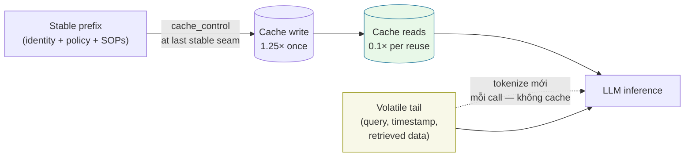
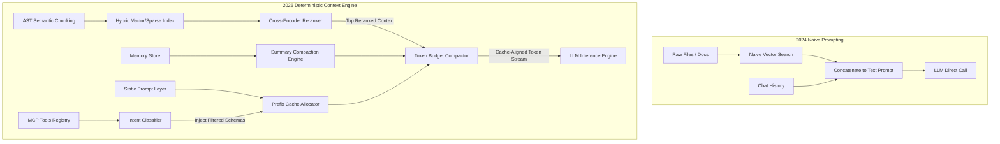
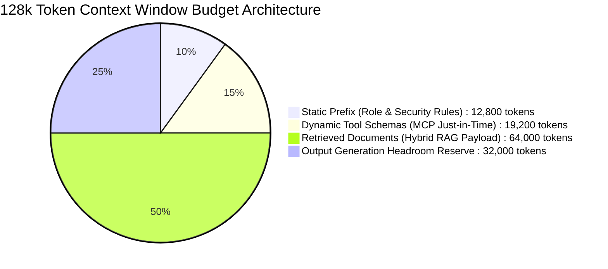

---

## 🔗 Related Deep-Dives

- [High-Throughput Go Microservices Architecture](/posts/go-microservices/)
- [Generative UI with Model Context Protocol (MCP)](/posts/generative-ui-with-mcp-ai-native-frontend/)
- [Engineering Reading Map & System Design Guides](/reading-map/)

- [Executive Summary: The 2026–2027 Engineering Case](/series/prompt-standard/executive-summary/)
- [Part 2 — The 8 Core Blocks](/series/prompt-standard/part-2-the-8-core-blocks/)
- [Part 3 — Layered Prompt Architecture](/series/prompt-standard/part-3-layered-prompt-architecture/)
- [Part 4 — Context Enrichment with MCP and Hybrid RAG](/series/prompt-standard/part-4-mcp-and-hybrid-rag/)

---

> **Prerequisite:** Knowledge of retrieval-augmented generation architectures, tokenization limits, and vector database semantics.

> **Answer-first:** Context Engineering represents the systematic orchestration of dynamic information pipelines into the LLM context window, superseding static prompt string tweaking. Anchored by three core pillars—hybrid vector retrieval, dynamic Model Context Protocol (MCP) tool injection, and token budget compression—it actively counters attention degradation and distractor amplification across expanding long context windows in production.

---

## The Paradigm Shift: From String Manipulation to System Architecture

> **Answer-first:** Anthropic's own redefinition sealed the shift: context engineering is "the set of strategies for curating and maintaining the optimal set of tokens (information) during LLM inference" — the unit of optimization moved from the sentence to the token stream, and the practitioner's job from writing to curating.

During the early deployment phase of Large Language Models (LLMs) in 2024, prompt engineering focused primarily on intuitive phrasing, magic keywords, and monolithic system prompts. Developers attempted to solve instruction-following failures by adding aggressive formatting rules or natural language pleas to the text stream.

As production applications expanded to multi-agent orchestrations, Model Context Protocol (MCP) integrations, and retrieval-augmented generation (RAG), this informal text manipulation proved inadequate. Massive context windows spanning 1 million to 2 million tokens introduced severe technical bottlenecks: attention degradation across long sequences (the "needle in a haystack" failure), excessive inference latency, escalating API token consumption, and systemic vulnerability to indirect prompt injections.

By 2026, enterprise software architecture replaced ad-hoc prompt tweaking with **Context Engineering**. Instead of treating the prompt as a static text string, Context Engineering treats context as an execution stack assembled dynamically at runtime. The system allocates token budgets across state blocks, aligns memory layouts to optimize Key-Value (KV) prefix caching, and enforces strict boundary isolation between control instructions and untrusted external inputs.

The measured evidence behind the shift — every claim vendor-published or peer-reviewed:

1. **Context rot**: 18 frontier models (GPT-4.1, Claude 4 family, Gemini 2.5, Qwen3) grow "increasingly unreliable as input length grows — even on simple tasks" (Chroma, Jul 2025).
2. **Attention as budget**: every token depletes a finite attention budget with diminishing marginal returns (Anthropic, Sep 2025); the target is "the smallest possible set of high-signal tokens."
3. **U-shaped recall**: relevant information at the beginning or end of context is recalled best, mid-context worst — "even for explicitly long-context models" (Lost in the Middle, TACL 2023).
4. **Placement dividend**: queries at the end of the prompt improve quality "by up to 30 percent in tests, especially with complex, multidocument inputs" (Anthropic best-practices guidance).
5. **Focused beats full**: focused ~300-token prompts beat full ~113k-token prompts on every model tested in the LongMemEval configuration (Chroma).
6. **Distractor amplification**: a single distractor measurably degrades performance; four compound the damage, worsening with length (Chroma).

---

## Comparative Analysis: 2024 Prompting vs. 2026 Context Engineering

> **Answer-first:** The transition spans seven engineering dimensions — from monolithic strings to assembly pipelines, naive stuffing to token budgets, static functions to MCP injection, manual tuning to DSPy compilation, top-k cosine to hybrid reranking, zero caching to prefix alignment, and ad-hoc text to OWASP ASI posture.

The transition from early prompt design to modern context pipeline architecture spans seven core engineering dimensions.

The following comparison table highlights the operational shift between 2024 intuition-driven prompt engineering and 2026 deterministic context engineering frameworks.

| Dimension | 2024 Prompt Engineering Paradigm | 2026 Context Engineering Paradigm |
|---|---|---|
| **Core Abstraction** | Monolithic text string (System + User Prompt) | Dynamic Context Assembly Pipeline (Structured State Blocks) |
| **Context Window Strategy** | Naive context stuffing (dumping raw files/chat history) | Deterministic Token Budgeting & Sliding Window Compaction |
| **Tool Integration** | Static function definitions embedded in system prompt | Dynamic Model Context Protocol (MCP) Tool Injection |
| **Prompt Optimization** | Manual trial-and-error instruction tweaking | Declarative DSPy Compilation & Teleprompter Metric Tuning |
| **RAG Retrieval** | Naive vector top-k cosine similarity search | Multi-stage Hybrid Retrieval (AST Semantic Chunking + Dense/Sparse + Cross-Encoder) |
| **Caching Strategy** | None (full prompt re-tokenization per turn) | Prefix Cache-Aligned Prompt Layering (Anthropic/OpenAI KV Cache optimization) |
| **Security Posture** | Ad-hoc text instructions ("Ignore previous instructions") | OWASP ASI-compliant Sandboxing, Dual-LLM pattern, Fail-Closed Policy |

---

## Dynamic Context Assembly & Token Budgeting

> **Answer-first:** Context allocation is governed like OS RAM: fixed percentage budgets per functional category, strict upper bounds, and dynamic pruning of transient payloads — because unbounded growth diffuses attention across irrelevant tokens.

In production AI applications, context window allocation must be governed with the same discipline as operating system RAM allocation. Unbounded context growth degrades LLM output accuracy due to attention diffusion across irrelevant tokens.

Context Engineering enforces fixed mathematical budgets for each functional category within a 128,000-token window budget. The system prioritizes static operational rules while dynamically pruning transient retrieval payloads and historical chat turns.

The diagram below illustrates the exact structural layout of a cache-optimized 128,000-token context budget in modern agentic runtime engines.

```text
+-----------------------------------------------------------------------------------+
|                        TOTAL TOKEN BUDGET (e.g., 128,000 Tokens)                  |
+-----------------------------------------------------------------------------------+
| System & Role Identity  | Scope & Guardrails  | Dynamic MCP Tools | Dynamic RAG    |
| (Static - Prefix Cache) | (Static - Cache)    | (On-Demand Schema)| (Cross-Ranked) |
| [5% ~ 6.4k Tokens]      | [10% ~ 12.8k]       | [15% ~ 19.2k]     | [40% ~ 51.2k]  |
+-------------------------+---------------------+-------------------+----------------+
| Conversation History & Memory Compaction | Active User Query & Output Schema       |
| (Sliding Window + Summarized Memory)    | (Un-cached Payload)                       |
| [20% ~ 25.6k Tokens]                     | [10% ~ 12.8k Tokens]                      |
+------------------------------------------+----------------------------------------+
```

The mathematical equation governing total context token distribution ensures strict upper-bound resource constraints across all active components:

$$\text{Budget}_{\text{total}} = T_{\text{identity}} + T_{\text{policy}} + T_{\text{tools}} + T_{\text{retrieval}} + T_{\text{history}} + T_{\text{query\_output}}$$

Where each term corresponds to:
- $T_{\text{identity}}$: Core agent persona and domain archetype (5% of budget)
- $T_{\text{policy}}$: Security guardrails and OWASP boundary rules (10% of budget)
- $T_{\text{tools}}$: Model Context Protocol schema parameters (15% of budget)
- $T_{\text{retrieval}}$: Re-ranked hybrid RAG document snippets (40% of budget)
- $T_{\text{history}}$: Summarized conversation memory stream (20% of budget)
- $T_{\text{query\_output}}$: Active incoming payload and targeted response space (10% of budget)

---

## Prefix Cache Alignment Mechanics

> **Answer-first:** Above an 80% KV prefix-cache hit rate, ordering must stay static from token position zero — and the vendor economics make it worth it: cache reads at 0.1× base input price, writes at 1.25× (5-min TTL), up to 4 breakpoints, with invalidation cascading tools → system → messages.

High-performance LLM serving frameworks (such as vLLM, TensorRT-LLM, Anthropic, and OpenAI API endpoints) utilize Key-Value (KV) cache reuse to achieve near-zero prefill latency for repeated prompts. To maximize the KV prefix cache hit rate above 80%, context engines ordering must remain entirely static from token position zero.

Context assembly pipelines structure memory streams into four distinct stability zones:

1. **Static Block (Tokens 0 - N)**: System Identity, Core Guardrails, and immutable workspace policies. Because these tokens never change across turns or requests, modern inference backends cache their attention states indefinitely.
2. **Semi-Static Block (Tokens N - M)**: Standard Operating Procedures (SOPs) and core MCP tool declarations active for the current application session.
3. **Dynamic Block (Tokens M - K)**: Highly relevant RAG retrieval chunks dynamically retrieved per query and filtered via cross-encoder re-ranking.
4. **Volatile Block (Tokens K - Z)**: Recent conversation turns, active execution state, and the latest user query.

The cache economics that justify the discipline:



At ~10 reuses the stable prefix costs roughly 90% less than uncached runs (1.25× + 10 × 0.1× versus 10 × 1.0×) — and the lookback discipline (breakpoints at layer seams, volatile content after the last one) keeps those hits coming.

---

## Architecture: 2024 Naive Prompting vs. 2026 Deterministic Context Engine

> **Answer-first:** The single-pass concatenation becomes a multi-stage compilation flow: static prefix caching, intent-filtered MCP injection, AST-chunked hybrid retrieval, cross-encoder reranking, memory compaction — all converging on a budget-enforced, cache-aligned token stream.

The transformation from single-pass prompt concatenation to a deterministic context engine requires a multi-stage compilation flow.

The following Mermaid graph compares the legacy 2024 pipeline against the 2026 cache-aligned context assembly engine.



---

## Code Implementation: Go Context Assembler Engine

> **Answer-first:** The assembler enforces budget boundaries before the inference call: token estimation, sliding-window pruning on retrieved documents, static-prefix ordering for KV-cache hits — assembly is compiled code, not string concatenation.

Building a deterministic context assembler in Go requires enforcing token budgeting boundaries prior to submitting payloads to the inference endpoint. The implementation below manages token estimation, enforces sliding window boundaries on retrieved documents, and maintains prefix ordering for KV cache optimization.

The Go source code snippet below provides a thread-safe implementation of the 2026 `ContextAssembler` pipeline with strict token allocation guards.

```go
package contextengine

import (
	"fmt"
	"strings"
)

// TokenBudget defines strict upper bounds for context window sections.
type TokenBudget struct {
	TotalMaxTokens     int
	IdentityAllocation int // ~5%
	PolicyAllocation   int // ~10%
	ToolsAllocation    int // ~15%
	RAGAllocation      int // ~40%
	HistoryAllocation  int // ~20%
	OutputAllocation   int // ~10%
}

// ContextBlock represents an isolated memory segment within the context stream.
type ContextBlock struct {
	Name     string
	Content  string
	Tokens   int
	IsStatic bool // Controls placement for KV cache alignment
}

// ContextAssembler compiles state blocks into a cache-optimized context string.
type ContextAssembler struct {
	Budget TokenBudget
}

// NewContextAssembler initializes a budget based on total window limit.
func NewContextAssembler(maxTokens int) *ContextAssembler {
	return &ContextAssembler{
		Budget: TokenBudget{
			TotalMaxTokens:     maxTokens,
			IdentityAllocation: int(float64(maxTokens) * 0.05),
			PolicyAllocation:   int(float64(maxTokens) * 0.10),
			ToolsAllocation:    int(float64(maxTokens) * 0.15),
			RAGAllocation:      int(float64(maxTokens) * 0.40),
			HistoryAllocation:  int(float64(maxTokens) * 0.20),
			OutputAllocation:   int(float64(maxTokens) * 0.10),
		},
	}
}

// EstimateTokens calculates an approximate token count for string content.
func EstimateTokens(text string) int {
	words := len(strings.Fields(text))
	if words == 0 {
		return 0
	}
	return (words * 4) / 3
}

// Assemble constructs the final cache-aligned system payload within budget limits.
func (ca *ContextAssembler) Assemble(
	identity string,
	policies []string,
	mcpTools string,
	ragDocs []string,
	chatHistory []string,
	query string,
) (string, error) {
	var builder strings.Builder

	// 1. Static Prefix Block (Identity & Security Policies) -> Highest Cache Hit Rate
	builder.WriteString("<system_identity>\n" + identity + "\n</system_identity>\n\n")
	builder.WriteString("<security_policies>\n" + strings.Join(policies, "\n") + "\n</security_policies>\n\n")

	// 2. Semi-Static Block (Model Context Protocol Tools)
	toolsTokens := EstimateTokens(mcpTools)
	if toolsTokens <= ca.Budget.ToolsAllocation {
		builder.WriteString("<mcp_tool_schemas>\n" + mcpTools + "\n</mcp_tool_schemas>\n\n")
	} else {
		return "", fmt.Errorf("MCP Tool schema token count (%d) exceeds assigned budget (%d)", toolsTokens, ca.Budget.ToolsAllocation)
	}

	// 3. Dynamic RAG Context (Pruned dynamically to allocated budget)
	ragBudget := ca.Budget.RAGAllocation
	currentRAGTokens := 0
	builder.WriteString("<retrieved_context>\n")
	for _, doc := range ragDocs {
		t := EstimateTokens(doc)
		if currentRAGTokens+t <= ragBudget {
			builder.WriteString(doc + "\n---\n")
			currentRAGTokens += t
		} else {
			break // Budget threshold reached
		}
	}
	builder.WriteString("</retrieved_context>\n\n")

	// 4. Compacted Conversation History & Active Query Block
	builder.WriteString("<user_query>\n" + query + "\n</user_query>")

	return builder.String(), nil
}
```

---


## Dynamic 128k Context Window Budget Allocation

> **Answer-first:** Modern Context Engineering enforces a rigid 10/15/50/25 token allocation across a 128,000 token context window, guaranteeing that models operate within their high-attention fidelity zone while preventing distractor-induced hallucination spikes.

Empirical studies on long-context models demonstrate that unconstrained context injection triggers dramatic accuracy drops (up to 40% degradation in reasoning tasks) due to attention saturation. Production systems must budget token space rigorously:



### Context Compaction & Sliding Conversation Windows
- **Automated Summary Rollup**: When interactive multi-turn sessions exceed 8 conversational turns, an asynchronous background isolate compiles older turns into a consolidated `<session_summary>` block, reclaiming 80% of historical token overhead.
- **Distractor Filtering Threshold**: Every document chunk returned by hybrid retrieval must clear a minimum Cross-Encoder re-ranking threshold of 0.65. Marginal chunks are dropped completely to safeguard model reasoning fidelity.


## FAQ


Expanding an LLM's context window to millions of tokens increases the physical space available, but it does not fix attention dilution or the high cost of processing unpruned data. Processing massive raw contexts significantly increases token latency and inference costs while degrading accuracy as models miss key details buried in unstructured text streams.



KV cache prefix alignment structures context streams so that identical static instructions remain at the front of every API request. Serving engines save compute resources by reusing pre-computed Key-Value attention tensors from memory instead of re-processing static tokens on every turn.



Static prompt engineering relies on manually written, hardcoded text templates pasted directly into model calls. Dynamic context assembly programmatically fetches, filters, and formats active state variables, tool schemas, and RAG context blocks into a budget-enforced context payload at runtime.



No — the 8-block anatomy, output contracts, and fallback policies from this series are more important than ever; they form the static prefix that caching and assembly optimize around. What died is the idea that prompt quality is a wording skill: the measured failure modes (context rot across 18 frontier models, U-shaped recall, distractor amplification) live in the token stream around the instructions, not in the phrasing. The writing discipline becomes the smallest slice of an engineering discipline — hosted by it, not replaced by it.



MCP is a token-economics mechanism as much as a connectivity standard: tool schemas occupy real budget (the reference design allocates ~15% of a 128k window), so schemas must be intent-filtered rather than blanket-injected. The tool-design guidance compounds it: consolidate tools semantically (schedule_event over three CRUD wrappers), because "too many tools or overlapping tools can distract agents"; cap responses (Claude Code defaults to 25,000 tokens); and prefer concise response formats — a detailed Slack response cost 206 tokens versus 72 concise, roughly a third per call. And the protocol carries a real security model (confused-deputy, token-passthrough prohibition, SSRF mitigations), so the plumbing is also the trust boundary.




## 📚 Research Anchors

| Claim | Source |
|---|---|
| Context-rot across 18 frontier models; distractor amplification; focused-beats-full | Chroma, "Context Rot" (Jul 2025) — research.trychroma.com/context-rot |
| U-shaped recall, mid-context degradation | Liu et al., "Lost in the Middle" (TACL 2023) — arxiv.org/abs/2307.03172 |
| Context engineering definition; attention budget; JIT loading; sub-agent contexts | Anthropic, "Effective context engineering for AI agents" (Sep 2025) |
| +30% query placement; provenance document tags; grounding by quote | Anthropic, Prompting best practices (platform.claude.com/docs) |
| Cache reads 0.1× / writes 1.25×; 4 breakpoints; invalidation hierarchy | Anthropic, Prompt Caching (platform.claude.com/docs) |
| Tool consolidation; response_format 206→72; 25K response cap | Anthropic, "Writing effective tools for agents" (Sep 2025) |

Full 100-round research dossier: `reports/research-prompt-standard-part-6-context-engineering-100-rounds.{md,json}` (mirrored in both repositories). Grounding note: 60/100 rounds carry external source URLs; 37/100 trace series-internal design; 3 rounds carry [INFERENCE]/[VERIFICATION-NOTE] labels. The budget percentages (5/10/15/40/20/10) are the series' design defaults, not vendor figures — recalibrate per workload.

🔗 **Next Step:** Continue to [Part 2 — The 8 Core Blocks](/series/prompt-standard/part-2-the-8-core-blocks/) for the following module in the series.