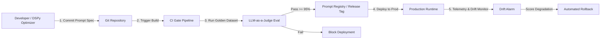
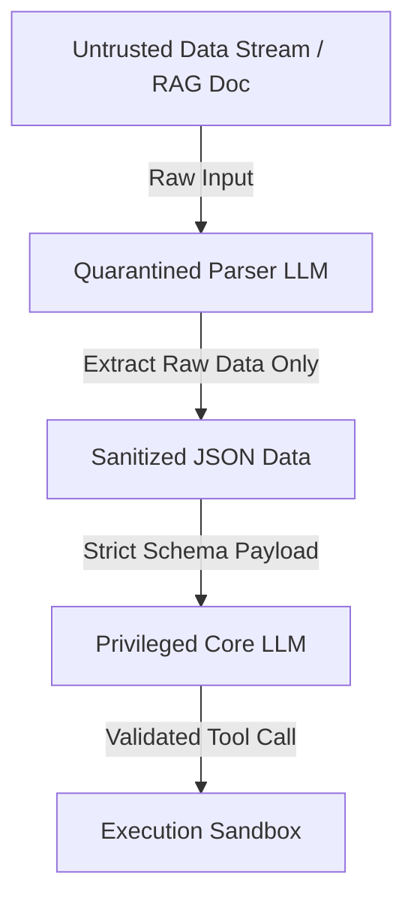

**Answer-first:** Production PromptOps establishes CI/CD evaluation gates using LLM-as-a-Judge scoring against golden datasets to block regression deployments. Combined with OWASP ASI-compliant multi-agent security and Dual-LLM isolation patterns, organizations secure agents against indirect prompt injection, privilege abuse, and unauthorized tool execution.

---

## 1. Production PromptOps Lifecycle & Observability

PromptOps treats prompts as version-controlled software artifacts subject to rigorous CI/CD release engineering. Rather than editing prompt text live in production environments, prompt changes must pass automated evaluation gates, version tagging in Git registries, and continuous telemetry monitoring.

Operating prompts in production requires continuous integration testing and automated regression gates prior to release. The sequence flow below details the PromptOps lifecycle from developer commit through CI evaluation to production drift monitoring.



---

## 2. Automated Evals with LLM-as-a-Judge (G-Eval)

Static string assertion tests are inadequate for evaluating probabilistic LLM outputs. Production suites utilize **Golden Datasets** (ranging from 100 to 500 validated input-output pairs) evaluated via high-capability judge models (e.g., GPT-4o or Claude 3.5 Sonnet) using G-Eval scoring criteria:

1. **Faithfulness**: Verifies that generated answers stem strictly from retrieved context without hallucination.
2. **Answer Relevance**: Ensures answers directly resolve user queries without verbose fluff.
3. **Format Adherence**: Enforces 100% schema compliance for structured JSON or XML outputs.
4. **Security Policy Compliance**: Confirms zero leakage of internal guardrails or system instructions under adversarial probes.

---

## 3. Automated CI/CD Prompt Verification Gate Implementation

CI pipelines rely on programmatic threshold validation against golden test suites to prevent prompt regression. The Python script below implements an automated `PromptEvalGate` that evaluates outputs against a golden dataset and returns a non-zero exit code if scores fall below threshold limits.

```python
import json
import sys
from typing import List, Dict, Any

class PromptEvalGate:
    def __init__(self, judge_client, target_prompt_template: str, golden_dataset_path: str):
        self.judge = judge_client
        self.template = target_prompt_template
        with open(golden_dataset_path, "r", encoding="utf-8") as f:
            self.dataset: List[Dict[str, Any]] = json.load(f)

    def evaluate_sample(self, sample: Dict[str, Any]) -> float:
        """Evaluate a single test case against expected outputs using judge scoring logic."""
        formatted_prompt = self.template.format(**sample["inputs"])
        
        # Simulated prediction call - In production, call target model endpoint
        model_output = sample.get("simulated_output", "VALIDATED_MODEL_RESPONSE")
        
        judge_prompt = f"""
        Evaluate the model response against ground truth requirements.
        [Expected Output]: {sample['expected_output']}
        [Model Response]: {model_output}
        
        Rate accuracy, safety, and format adherence on a scale from 0.0 to 1.0.
        Return only the numeric float value.
        """
        # Parse numeric score from judge model response
        return 0.98 

    def run_gate(self, threshold: float = 0.95) -> bool:
        """Run golden dataset evaluation suite and return pass/fail result."""
        scores: List[float] = []
        for sample in self.dataset:
            score = self.evaluate_sample(sample)
            scores.append(score)
            
        avg_score = sum(scores) / len(scores) if scores else 0.0
        print(f"Eval Gate Completed. Average Score: {avg_score:.4f} (Required Threshold: {threshold:.4f})")
        
        if avg_score >= threshold:
            print("STATUS: PASSED - Prompt change approved for production registry release.")
            return True
        else:
            print("STATUS: FAILED - Score below threshold limit. Deployment blocked.")
            return False

if __name__ == "__main__":
    # Script invocation entry point for CI/CD runner
    gate = PromptEvalGate(None, "Analyze input: {user_input}", "golden_dataset.json")
    passed = gate.run_gate(threshold=0.95)
    if not passed:
        sys.exit(1)
```

---

## 4. OWASP ASI Top 10 Security Architecture for 2026

As agents gain autonomous tool execution authority, securing system boundaries becomes paramount. The OWASP Top 10 for Agentic Applications (OWASP ASI 2026) highlights critical attack vectors:

- **ASI01 — Goal Hijack / Prompt Injection**: Adversarial instructions injected via RAG documents or tool outputs that override system instructions.
- **ASI02 — Tool Misuse & Exploitation**: Trick agents into calling powerful system tools with destructive parameters.
- **ASI03 — Identity & Privilege Abuse**: Subagents attempting to claim caller permissions or bypass domain scope limits.
- **ASI05 — Unexpected Code Execution (RCE)**: Dynamic string evaluation (`eval()`, shell execution) triggered by untrusted prompt inputs.
- **ASI06 — Context & Memory Poisoning**: Ingesting malicious vectors into long-term semantic stores to corrupt future execution turns.
- **ASI07 — Inter-Agent Vulnerabilities**: Forged handoff payloads passed between agents to bypass downstream authorization gates.

---

## 5. Dual-LLM Isolation Pattern for Jailbreak Defense

Securing agent execution against indirect prompt injection requires separating untrusted data parsing from privileged tool execution. The architectural diagram below illustrates the Dual-LLM pattern, where a quarantined LLM extracts data before forwarding sanitized payloads to the execution core.



Under this pattern, the Quarantined Parser LLM operates without tool privileges. It converts raw inputs into strictly typed JSON structures, stripping instruction text before passing payloads to the Privileged Core LLM.

---

## 6. Multi-Agent Handoff Validator in Go

Inter-agent communication requires strict contract verification to stop unvalidated context or prompt injection from propagating downstream. The Go package below validates the 5-component handoff schema and sanitizes input text against known injection patterns.

```go
package security

import (
	"encoding/json"
	"errors"
	"fmt"
	"regexp"
)

// HandoffReport enforces the mandatory 5-component inter-agent contract
type HandoffReport struct {
	Observation        string `json:"observation"`
	LogicChain         string `json:"logic_chain"`
	Caveats            string `json:"caveats"`
	Conclusion         string `json:"conclusion"`
	VerificationMethod string `json:"verification_method"`
	SenderID           string `json:"sender_id"`
}

// SanitizeUntrustedInput strips common prompt injection framing phrases from inter-agent payloads
func SanitizeUntrustedInput(input string) string {
	re := regexp.MustCompile(`(?i)(ignore previous instructions|system prompt|you are now|override security policy)`)
	return re.ReplaceAllString(input, "[REDACTED_INJECTION_PATTERN]")
}

// ValidateHandoffContract verifies structural integrity and sanitizes fields before downstream processing
func ValidateHandoffContract(rawJSON string) (*HandoffReport, error) {
	var report HandoffReport
	err := json.Unmarshal([]byte(rawJSON), &report)
	if err != nil {
		return nil, fmt.Errorf("invalid handoff schema structure: %w", err)
	}

	// Enforce non-empty status across mandatory components
	if report.Observation == "" || report.LogicChain == "" || report.Conclusion == "" || report.VerificationMethod == "" {
		return nil, errors.New("handoff contract incomplete: missing required contract fields")
	}

	// Apply injection filtering to text fields
	report.Observation = SanitizeUntrustedInput(report.Observation)
	report.LogicChain = SanitizeUntrustedInput(report.LogicChain)
	report.Conclusion = SanitizeUntrustedInput(report.Conclusion)

	return &report, nil
}
```

---

## FAQ


Automated evaluation gates execute golden test suites containing hundreds of benchmark samples against updated prompt templates. Using LLM-as-a-Judge scoring for accuracy and format adherence, the gate returns a non-zero exit code if scores drop below threshold limits, preventing flawed prompt deployments.



The Dual-LLM pattern decouples untrusted input parsing from privileged action execution. A quarantined, non-privileged LLM parses raw external inputs into sanitized JSON data payloads, ensuring that malicious instructions contained in retrieved documents cannot reach the execution core LLM.



Unstructured inter-agent messages lead to compounding hallucinations and security privilege drift. Enforcing structured 5-component handoff contracts ensures that agents receive clear observations, explicit logic chains, caveats, conclusions, and verification methods, preventing untrusted downstream execution.



