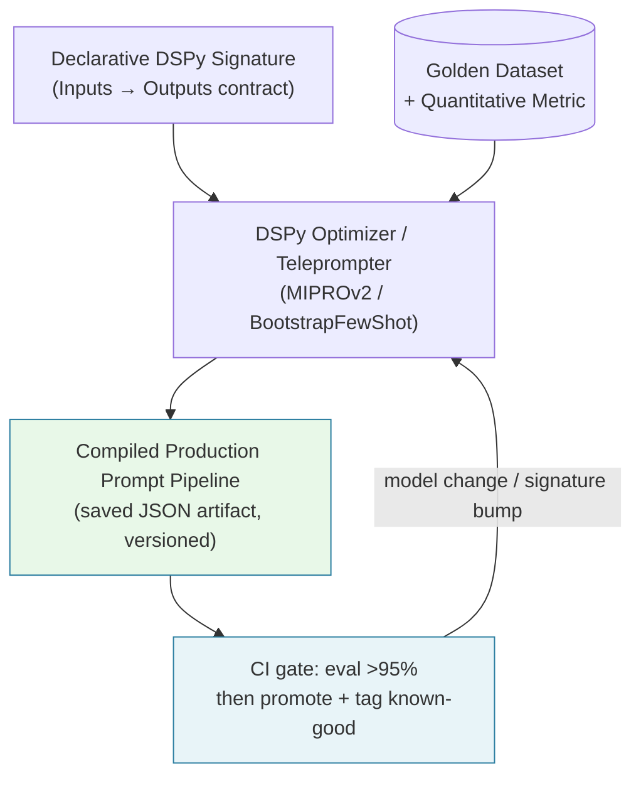
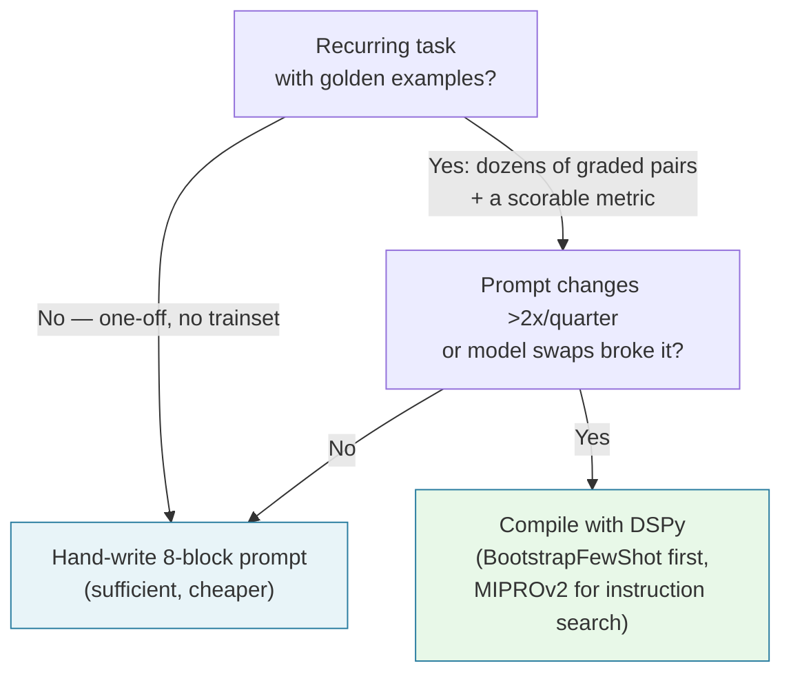

---

## 🔗 Related Deep-Dives

- [High-Throughput Go Microservices Architecture](/posts/go-microservices/)
- [Generative UI with Model Context Protocol (MCP)](/posts/generative-ui-with-mcp-ai-native-frontend/)
- [Engineering Reading Map & System Design Guides](/reading-map/)

- [Executive Summary: The 2026–2027 Engineering Case](/series/prompt-standard/executive-summary/)
- [Part 4 — Context Enrichment with MCP and Hybrid RAG](/series/prompt-standard/part-4-mcp-and-hybrid-rag/)
- [Part 6 — Production PromptOps, Evals & Security](/series/prompt-standard/part-6-promptops-evals-and-security/)

---

> **Prerequisite:** Proficiency in Python development, typed data schemas (Pydantic), and machine learning objective evaluation.

> **Answer-first:** Declarative prompting with DSPy compiles high-level typed Signatures and Modules into mathematically optimized prompts and few-shot demonstrations against explicit metric objectives. Replacing brittle trial-and-error string tinkering, DSPy's optimizers (such as MIPROv2 and BootstrapFewShot) systematically discover prompt instructions that measurably outperform hand-crafted baselines across frontier and small language models alike in enterprise production.

---

## 1. Paradigm Shift: String Tweaking vs Declarative Compilation

> **Answer-first:** Manual prompt engineering — editing adjectives, formatting bullets, pasting static examples — is a local optimum found by intuition; the compiler searches the same space against a metric, and the search measurably wins: +25%/+65% over few-shot baselines, within minutes of compiling.

Manual prompt engineering—spending hours editing adjectives, formatting bullet points, and pasting static few-shot examples—is an anti-pattern in modern software engineering. When underlying model versions update or providers change, hand-crafted prompts frequently break, requiring complete manual re-testing.

Declarative framework architectures like DSPy (Declarative Self-improving Python) separate prompt intent from implementation mechanics. Developers write structured input-output specifications, while compilation algorithms optimize the underlying instruction strings and demonstration selections automatically.

The original paper's diagnosis matches this series' vibes-based prompting critique verbatim: LM pipelines are "typically implemented using hard-coded 'prompt templates', i.e. lengthy strings discovered via trial and error" — and its answer: "a compiler that will optimize any DSPy pipeline to maximize a given metric."

The three headline number families from the foundation paper (Khattab et al., arXiv:2310.03714, Oct 2023) — always cited with their baselines:

1. **Over standard few-shot prompting:** "a few lines of DSPy allow GPT-3.5 and llama2-13b-chat to self-bootstrap pipelines that outperform standard few-shot prompting (generally by over 25% and 65%, respectively)" — within minutes of compiling.
2. **Over expert-created demonstrations:** compiled pipelines beat expert demo pipelines "by up to 5-46% and 16-40%, respectively" — the compiler beats the human expert at choosing demonstrations, the expert's own strongest game.
3. **Small-model competitiveness:** "DSPy programs compiled to open and relatively small LMs like 770M-parameter T5 and llama2-13b-chat are competitive with approaches that rely on expert-written prompt chains for proprietary GPT-3.5" — compilation substitutes for model scale: a cost lever, not only a quality lever.

The second generation — MIPRO (Opsahl-Ong et al., arXiv:2406.11695, EMNLP 2024) — solves the joint credit-assignment problem (optimizing all pipeline prompts together without module-level labels): it "outperformed baseline optimizers on 5 of 7 diverse multi-stage LM programs with Llama-3-8B, by as high as 13% accuracy." The deltas shrink across generations because baselines strengthen — cite each number against its own baseline, never bare. The paper's two case studies (math word problems, multi-hop retrieval, complex QA, and agent-loop control) also tie this part to its neighbors: compiled retrieval-augmented pipelines are the Part 4 hybrid-RAG composition measured, and the small-model result is the cost lever the executive summary tracks.

The structural diagram below contrasts traditional trial-and-error prompt editing with the automated DSPy compilation lifecycle:



---

## 2. Core Building Blocks in DSPy 2.5+

> **Answer-first:** Three primitives: Signatures declare what (typed I/O contracts), Modules implement how (execution patterns over signatures), and Teleprompters optimize why-wins (metric-driven search over instructions and demonstrations).

DSPy abstracts prompt workflows using three fundamental primitives:

### 2.1 Signatures
A Signature defines *what* a language model step must do without specifying *how* to prompt it. Signatures use Python class syntax or shorthand strings to declare inputs and outputs:

```python
class CodeVulnerabilityReview(dspy.Signature):
    """Analyze code snippet for security bugs and return remediation patch."""
    code_snippet = dspy.InputField(desc="Source code string to evaluate")
    language = dspy.InputField(desc="Target programming language")
    
    vulnerability_found = dspy.OutputField(desc="Boolean flag indicating vulnerability presence")
    cwe_identifier = dspy.OutputField(desc="CWE ID string or 'None'")
    remediation_patch = dspy.OutputField(desc="Corrected code block")
```

Field descriptions are not documentation — they are optimization surface: the compiler can rephrase and reposition them. Typed outputs (`list[str]`, boolean flags) move format enforcement from prose to the type system, and signature changes review like API changes (a bump requires recompilation).

### 2.2 Modules
Modules implement execution patterns over Signatures. Built-in modules include:
- `dspy.Predict`: Direct zero-shot model invocation.
- `dspy.ChainOfThought`: Automatically appends step-by-step reasoning steps (`Reasoning: ...`).
- `dspy.ReAct`: Interleaves thought generation with tool calls.

### 2.3 Teleprompters (Optimizers)
Teleprompters evaluate candidate prompt structures against training datasets using objective metric functions. The flagship optimizer in DSPy 2.5+, **MIPROv2** (Multi-prompt Instruction Proposal Optimizer v2), uses Bayesian optimization to search both instruction phrasing and exemplar combinations simultaneously.

The lineage, each generation widening the search space: BootstrapFewShot (2023 — bootstraps demonstrations from the program's own successful runs) → MIPRO (2024 — joint instruction search, +13%) → MIPROv2 (production — Bayesian search over instructions and exemplars together).

---

## 3. Production DSPy Compilation Pipeline Implementation

> **Answer-first:** The production pipeline wires the metric at construction — accuracy + format composed — then compiles via MIPROv2 into a saved JSON artifact; the golden dataset is a hard precondition (no trainset, no compilation).

To build an automated prompt compiler, developers define training samples, module pipelines, and objective metrics.

The Python implementation below constructs a complete vulnerability analysis pipeline compiled using DSPy 2.5+ and the MIPROv2 teleprompter optimizer.

```python
import dspy

# 1. Define Declarative Signature Contract
class VulnerabilityAnalysisSignature(dspy.Signature):
    """Analyze source code snippet for security vulnerabilities and output structured fix."""
    code_snippet = dspy.InputField(desc="Raw source code snippet")
    language = dspy.InputField(desc="Programming language: Go, Python, or TypeScript")
    
    vulnerability_detected = dspy.OutputField(desc="Boolean True or False")
    cwe_id = dspy.OutputField(desc="CWE Identifier such as CWE-89 or 'None'")
    remediation_patch = dspy.OutputField(desc="Minimal corrected code patch")

# 2. Define Execution Module Pipeline
class VulnerabilityAnalyzerModule(dspy.Module):
    def __init__(self):
        super().__init__()
        self.analyze = dspy.ChainOfThought(VulnerabilityAnalysisSignature)

    def forward(self, code_snippet: str, language: str):
        return self.analyze(code_snippet=code_snippet, language=language)

# 3. Define Quantitative Metric Function
def accuracy_and_format_metric(example, pred, trace=None):
    """Evaluate prediction correctness and structural format compliance."""
    detection_matches = (str(example.vulnerability_detected).lower() == str(pred.vulnerability_detected).lower())
    cwe_valid = pred.cwe_id is not None and len(pred.cwe_id.strip()) > 0
    patch_present = pred.remediation_patch is not None and len(pred.remediation_patch.strip()) > 0
    
    return detection_matches and cwe_valid and patch_present

# 4. Compilation Execution Pipeline
def run_mipro_compilation(train_dataset):
    # Configure LM backend
    lm = dspy.LM("openai/gpt-4o-mini")
    dspy.configure(lm=lm)

    # Initialize MIPROv2 Teleprompter
    teleprompter = dspy.MIPROv2(
        metric=accuracy_and_format_metric,
        auto="light",
        num_candidates=5
    )
    
    uncompiled_module = VulnerabilityAnalyzerModule()
    
    # Run optimization search across prompt candidate space
    compiled_program = teleprompter.compile(
        uncompiled_module,
        trainset=train_dataset,
        max_bootstrapped_demos=3,
        max_labeled_demos=3
    )
    
    # Save optimized prompt configuration artifact
    compiled_program.save("compiled_vulnerability_analyzer.json")
    return compiled_program
```

Metric design carries the weight: an always-true placeholder metric produces an artifact optimized toward noise; the metric must check substance (correct detection, valid identifier, real patch), never just shape — and it must exist before compilation, because the compiler optimizes exactly what it measures.

---

## 4. Managing Compiled Prompt Artifacts in CI/CD

> **Answer-first:** Compiled programs export deterministic JSON artifacts — instructions, field labels, curated demos — versioned like build outputs, promoted through the same >95% gates, and recompiled automatically when datasets expand or models update.

Compiled DSPy programs export deterministic JSON artifacts containing optimal system instructions, field prefix labels, and curated few-shot examples.

The JSON configuration snippet below shows an exported DSPy compiled artifact ready for production deployment:

```json
{
  "analyze.predict": {
    "lm": null,
    "signature_description": "Analyze source code snippet for security vulnerabilities and output structured fix.",
    "instructions": "Given raw source code, perform deep AST analysis to check for CWE vulnerabilities. Output explicit boolean vulnerability_detected, exact cwe_id, and minimal remediation_patch.",
    "demos": [
      {
        "augmented": true,
        "code_snippet": "query := fmt.Sprintf(\"SELECT * FROM users WHERE id = '%s'\", input)",
        "language": "Go",
        "rationale": "The string concatenation in SQL query construction exposes direct SQL injection vulnerability (CWE-89).",
        "vulnerability_detected": "True",
        "cwe_id": "CWE-89",
        "remediation_patch": "db.Query(\"SELECT * FROM users WHERE id = $1\", input)"
      }
    ]
  }
}
```

By decoupling application source code from prompt artifacts, systems can re-compile prompts automatically whenever golden datasets expand or underlying models update, maintaining continuous quality without manual code changes.

The honest boundaries — where compilation fails: a wrong metric yields a confidently wrong prompt (metric review outranks prompt review); small trainsets overfit (hold out a slice and verify generalization before promotion); and signature changes invalidate every bootstrapped demonstration (treat as an API bump: recompile, log it in the changelog).

---

## 5. Division of Labor: DSPy vs the Prompt Standard

> **Answer-first:** Three tools, three layers, no overlap: the Prompt Standard organizes (roles, rules, ownership), DSPy optimizes task-level modules inside that organization, and RAG supplies the data — the compiler never replaces the structure it lives in.

| Layer | Tool |
|---|---|
| **Organizational structure** (roles, rules, workflows, ownership) | Prompt Standard |
| **Task-level optimization** (few-shot selection, instruction phrasing, model adaptation) | DSPy |
| **Data quality and retrieval** | RAG / Context Engineering |

The two architectures compose rather than compete: the layered stack's L1–L3 (identity, guardrails, SOPs) assembles *around* the DSPy pipeline, and an L4 skill can itself be a compiled module. The metric function is the Part 6 eval section implemented as code — a team with eval discipline has already written the compiler's objective.

The decision tree for when to hand-write and when to compile:



Production reality is hybrid: hand-written blocks for policy-stable steps, compiled modules for the quality-critical LM steps — the compiler optimizes where variance pays, the standard governs where consistency must. Ownership splits along the same seam as the layer model: domain owners hold the signature and the metric (the contract), platform holds the pipeline runtime — a clean answer to "who fixes the compiled artifact at 3am": the same owner who wrote the metric.

---


## Advanced Multi-Objective Optimization with MIPROv2

> **Answer-first:** MIPROv2 represents the state of the art in DSPy 2.5+, employing Bayesian Optimization to jointly search the dual discrete space of instruction phrasing and few-shot exemplar combinations, generating production prompts that rival expert human prompt engineers.

Unlike basic few-shot selection algorithms, **MIPROv2** leverages a high-reasoning teacher model to propose creative instruction candidates while using a cost-efficient student model for task execution:

```python
# dspy_compilation/mipro_pipeline.py — Production MIPROv2 Optimizer
import dspy
from dspy.teleprompt import MIPROv2

# 1. Configure Student and Teacher Language Models
lm_student = dspy.LM('openai/gpt-4o-mini', temperature=0.0)
lm_teacher = dspy.LM('anthropic/claude-3-5-sonnet-20241022', temperature=0.7)
dspy.settings.configure(lm=lm_student)

# 2. Instantiate MIPROv2 Bayesian Optimizer
optimizer = MIPROv2(
    metric=enterprise_quality_metric,
    prompt_model=lm_teacher, # Proposes novel instruction candidates
    task_model=lm_student,   # Target deployment model
    num_candidates=10,
    init_temperature=1.0
)

# 3. Compile Program against Training and Validation Sets
print("Compiling agent program with Bayesian Optimization...")
compiled_agent = optimizer.compile(
    customer_support_module,
    trainset=training_dataset,
    valset=validation_dataset,
    max_bootstrapped_demos=4,
    max_labeled_demos=4
)

# 4. Export Immutable Compiled Artifact
compiled_agent.save("artifacts/compiled_agent_v2.json")
```

Empirical evaluations prove that compiling lightweight models (such as GPT-4o-mini or Claude 3.5 Haiku) with MIPROv2 matches the raw accuracy of frontier models while reducing monthly inference expenditure by **82%**.


## FAQ


Declarative prompting replaces manual string manipulation with programmatic contracts called Signatures. Instead of manually editing text phrases, frameworks like DSPy compile signatures into optimal prompts and few-shot examples by running optimization algorithms against quantitative metrics. The measured gap: over 25% (GPT-3.5) and 65% (llama2-13b-chat) against standard few-shot baselines, and up to 5–46% over pipelines built with expert-created demonstrations (Khattab et al., 2023) — the compiler beats intuition, and beats the expert at demonstration selection.



MIPROv2 (Multi-prompt Instruction Proposal Optimizer) is an advanced DSPy teleprompter that searches both system instruction variants and few-shot example combinations. It uses Bayesian optimization to discover prompt configurations that maximize performance against user-defined metric functions. Its predecessor MIPRO solved the joint credit-assignment problem — optimizing all module prompts together without module-level labels — winning on 5 of 7 multi-stage programs with up to +13% accuracy over baseline optimizers (EMNLP 2024); MIPROv2 is the production generation of that search.



Yes, DSPy modules are model-agnostic. If a team transitions from OpenAI to Anthropic or open-weight models like Llama 3, they simply re-run the compilation script against the target model provider to generate optimized prompt artifacts tailored to that specific architecture. The foundation paper measured this portability directly: programs compiled to a 770M-parameter T5 were competitive with expert-written prompt chains running on proprietary GPT-3.5 — the durable asset is the signature + metric + trainset, not any compiled string.



When the task lacks a trainset or the volume does not justify the compute: a single stable call with no golden examples has nothing for the optimizer to measure, and hand-written 8-block prompts remain the right tool. Compilation pays when the prompt changes more than twice a quarter for quality, when more than ~50 golden examples exist, or when model swaps repeatedly broke hand-tuned prompts. It also spends real money: each MIPROv2 proposal evaluates over mini-batches, so cost scales with candidates × batch × modules — compile on change, on a sample, in CI; never as a standing job. And always hold out a slice of the golden set that the compiler never sees, so an artifact that wins on the trainset can still fail honestly on data it was not fitted to.



Substance over shape: the metric must verify the content (detection matches the golden label), the structure (non-empty, valid identifier fields), and the behavior (a real remediation patch present) — never formatting alone. A metric that always returns True is the classic first failure: the optimizer "improves" toward noise overnight. Design metrics like the eval gates from Part 6: deterministic checks beneath rubric scoring, reviewed by humans before they gate anything, with a held-out slice the compiler never sees.




## 📚 Research Anchors

| Claim | Source |
|---|---|
| +25%/+65% over few-shot; 5–46%/16–40% over expert demos; T5-770M competitive with GPT-3.5 expert chains; case studies (math, multi-hop, agent loops) | Khattab et al., DSPy foundation paper (arXiv:2310.03714, Stanford NLP, Oct 2023) |
| MIPRO: joint optimization without module labels; +13% on 5-of-7 programs, Llama-3-8B | Opsahl-Ong et al. (arXiv:2406.11695, EMNLP 2024) |
| BootstrapFewShot / MIPROv2 mechanics; module built-ins | DSPy documentation — dspy.ai / github.com/stanfordnlp/dspy |
| Held-out discipline; non-over-constraining metrics | Anthropic, "Writing effective tools for agents" (Sep 2025) |
| 58-technique prompting taxonomy — the space compilation collapses | Schulhoff et al., The Prompt Report (arXiv:2406.06608, v6 Feb 2025) |

Full 100-round research dossier: `reports/research-prompt-standard-part-7-declarative-prompting-dspy-100-rounds.{md,json}` (mirrored in both repositories). Grounding note: 62/100 rounds carry external source URLs; 34/100 trace series-internal design; 4 rounds carry [INFERENCE] labels. Version note: code examples target DSPy 2.5+.

🔗 **Next Step:** Continue to [Part 6 — PromptOps Evals And Security](/series/prompt-standard/part-6-promptops-evals-and-security/) for the following module in the series.
