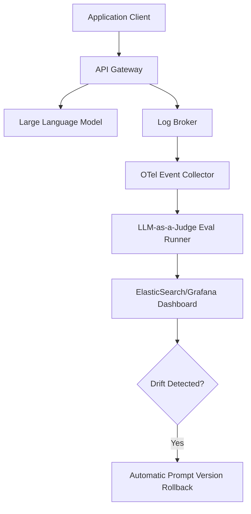

**Answer-first:** Production PromptOps establishes operational pipelines for monitoring, logging, and continuous deployment of prompts. By capturing a sample of runtime inputs/outputs and analyzing semantic drift via LLM-as-a-Judge evaluations, engineering teams detect performance degradation and safely roll back prompt configurations in real-time.

## Prompts in Production Are Not "Set and Forget"

If your team has followed this series, you now have:
- a structural foundation (Parts 1–5)
- a context engineering strategy (Part 6)
- an optimization approach (Part 7)

But none of that matters if your prompts degrade silently in production. Models update, data distributions shift, user behavior changes — and your carefully tuned prompt starts producing worse results without anyone noticing.

**PromptOps** is the discipline of managing prompts through their entire lifecycle: development → testing → deployment → monitoring → iteration.

## The PromptOps Pipeline

### Stage 1: Prompt Registry

Move prompts out of your application code and into a managed registry.

Why:
- Prompts can be updated without code deployments
- Non-engineers (PMs, domain experts) can propose changes through a review UI
- Every change is tracked with author, timestamp, and rationale

This is the prompt equivalent of moving configuration out of source code and into a config service.

### Stage 2: Golden Dataset and Automated Evaluation

A **golden dataset** is a curated set of input/output pairs that represent the expected behavior of your prompt.

For a code review agent, this might include:
- a diff with a null pointer bug → expected: agent flags the bug
- a diff with only formatting changes → expected: agent says "no issues"
- a diff with a security vulnerability → expected: agent flags with high severity
- a diff with insufficient context → expected: agent states assumptions

**Automated evaluation** runs every prompt change against this dataset and produces a score.

### Stage 3: LLM-as-a-Judge

For tasks where output quality is subjective (e.g., writing, summarization, tone), use a powerful model as an automated judge:

```text
[Judge System Prompt]
You are evaluating the quality of an AI agent's output.

Score each response on:
1. Accuracy (0–5): Are the facts correct?
2. Completeness (0–5): Are all key points covered?
3. Format compliance (0–5): Does it match the output contract?
4. Hallucination (0–5): Is there any fabricated information?

Provide scores and a one-line justification for each.
```

LLM-as-a-Judge is not perfect, but it scales infinitely compared to human review and catches regressions that simple string matching cannot.

### Stage 4: Environment Promotion

Treat prompt deployment like code deployment:

```text
Development → Staging → Production
```

- **Development:** Engineers and PMs iterate freely.
- **Staging:** The prompt is tested against the golden dataset. It must pass the evaluation gate.
- **Production:** The prompt is deployed to live traffic. Rollback is instant if metrics degrade.

### Stage 5: Production Observability and Drift Detection

Once deployed, monitor:
- **Latency:** Is the prompt causing slower responses?
- **Token usage:** Is the prompt consuming more tokens than expected?
- **Output quality:** Sample production outputs and run them through the judge periodically.
- **User feedback signals:** Thumbs up/down, regeneration rates, escalation to human.

**Drift detection** means automatically flagging when production output quality drops below a threshold, even if no one changed the prompt (because the model itself may have been updated).

## Platform Landscape (2026)

| Platform | Strengths | Best For |
| :--- | :--- | :--- |
| **Braintrust** | Deep eval integration, CI/CD gates | Engineering-heavy teams |
| **Maxim AI** | End-to-end: simulation, eval, observability | Full-lifecycle management |
| **Promptfoo** | CLI-driven, CI/CD native, open-source | Automated regression testing |
| **LangSmith** | Deep tracing for LangChain/LangGraph | Teams in the LangChain ecosystem |
| **Adaline** | Release governance, eval gates | Enterprise governance focus |
| **PromptLayer** | User-friendly UI for collaboration | Cross-functional teams |

For most teams starting out, **Promptfoo** (open-source, CLI-first) is the lowest-friction entry point.

## The Minimum Viable PromptOps Stack

If you cannot adopt a full platform today, start with these three practices:

1. **Store prompts in Git.** Every change goes through a pull request with a rationale.
2. **Maintain 10 golden test cases per agent.** Run them manually (or in CI) after every prompt change.
3. **Log 1% of production outputs.** Review them weekly for quality drift.

This takes less than a day to set up and prevents the most common failure mode: silent prompt degradation.

## Key Takeaway

The teams that win with AI in 2026 are not the ones with the cleverest prompts. They are the ones with the most disciplined prompt lifecycle.

**Prompt Standard gives you structure. Context Engineering gives you data. DSPy gives you optimization. PromptOps gives you confidence that it all keeps working.**

> *You can return to the [Series Hub](/series/prompt-standard/) to review the full learning path, or use this series as onboarding material for your team.*

### Production PromptOps Observability Loop

The telemetry pipeline monitors live agent performance, running offline judges to detect drift and automate rollbacks:



## FAQ


Production systems log a sample of LLM inputs/outputs (e.g., 1%) and run asynchronous evaluations using an LLM-as-a-Judge. When semantic accuracy or format adherence drops below a configured threshold, the system triggers alerts for engineers to inspect.


