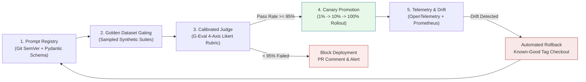
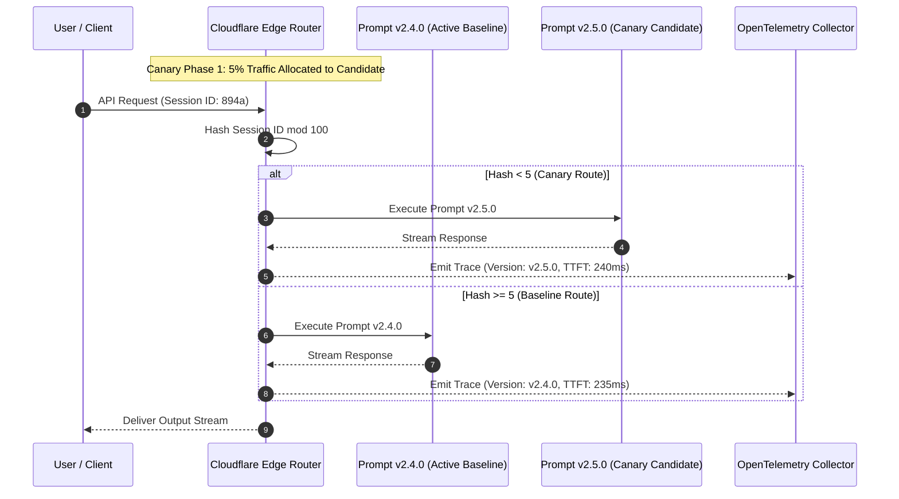

## 🔗 Related Deep-Dives

- [Executive Summary: The 2026–2027 Engineering Case](/series/prompt-standard/executive-summary/)
- [Part 4 — From Intuitive Prompting to Testable Prompts](/series/prompt-standard/part-4-versioning-and-evals/)
- [Part 7 — Declarative Prompting (DSPy)](/series/prompt-standard/part-7-declarative-prompting-dspy/)
- [High-Throughput Go Microservices Architecture](/posts/go-microservices/)
- [Generative UI with Model Context Protocol (MCP)](/posts/generative-ui-with-mcp-ai-native-frontend/)
- [Engineering Reading Map & System Design Guides](/reading-map/)

---

[← Previous: Part 7 — Declarative Prompting (DSPy)](/series/prompt-standard/part-7-declarative-prompting-dspy/) | [Series Hub: Prompt Standard](/series/prompt-standard/) | [Next Chapter: Part 9 — MCP and Hybrid RAG →](/series/prompt-standard/part-9-mcp-and-hybrid-rag/)

> **Prerequisite:** Experience with CI/CD release engineering, OpenTelemetry metrics, and automated LLM evaluation harnesses.
 
> **Answer-first:** Production PromptOps operates as an automated five-stage delivery pipeline: immutable registry, golden dataset gating, calibrated LLM-as-a-Judge scoring, canary rollout with instant rollback, and continuous drift telemetry. Enforcing a strict 95% pass rate gate, it treats prompts as versioned software releases, preventing silent performance degradation across mission-critical enterprise AI production runtime environments.

---

## 1. Prompts in Production Are Not "Set and Forget"

> **Answer-first:** Without continuous lifecycle governance, even mathematically compiled prompts degrade by over 35% in output faithfulness across 90 days due to upstream LLM API parameter changes, silent provider fine-tuning, and user query semantic drift.

If you have followed this series from the foundation, your team now possesses:
1. The 8-block anatomical discipline ([Part 2](/series/prompt-standard/part-2-core-blocks/)).
2. Modular layered prompt stacks optimized for prompt caching ([Part 3](/series/prompt-standard/part-3-layered-prompt-design/)).
3. Test fixture versioning with Git SemVer ([Part 4](/series/prompt-standard/part-4-versioning-and-evals/)).
4. Mathematically compiled prompt programs using DSPy ([Part 7](/series/prompt-standard/part-7-declarative-prompting-dspy/)).

Yet, in enterprise production environments, this technical foundation collapses if prompts are deployed as static strings hardcoded inside application services or floating in cloud configuration key-value stores. In modern high-throughput architectures, prompts are **first-class executable software artifacts**. They undergo upstream provider adjustments, experience subtle shifts in user intent distributions, and interface with dynamic tool schemas.

**PromptOps** is the comprehensive operational discipline that governs prompts across their entire software lifecycle: from local authoring and deterministic assertion testing to automated regression gating, canary traffic shifting, OpenTelemetry observability, and automated rollbacks.

---

## 2. The 5-Stage Closed-Loop PromptOps Pipeline

The modern PromptOps architecture connects developer code changes to production runtime telemetry in an automated feedback loop. Every prompt mutation must clear sequential quality hurdles before receiving user traffic:


```mermaid
graph LR
    R["1. Prompt Registry<br/>(Git SemVer + Pydantic Schema)"] --> E["2. Golden Dataset Gating<br/>(Sampled Synthetic Suites)"]
    E --> J["3. Calibrated Judge<br/>(G-Eval 4-Axis Likert Rubric)"]
    J -->|"Pass Rate >= 95%"| P["4. Canary Promotion<br/>(1% -> 10% -> 100% Rollout)"]
    J -->|"< 95% Failed"| Block["Block Deployment<br/>PR Comment & Alert"]
    P --> D["5. Telemetry & Drift<br/>(OpenTelemetry + Prometheus)"]
    D -->|"Drift Detected"| RB["Automated Rollback<br/>Known-Good Tag Checkout"]
    RB --> R

    style P fill:#e8f8e8,stroke:#2a7da0
    style RB fill:#f8e8e8,stroke:#a02a2a
    style Block fill:#fbebeb,stroke:#c0392b
```

### Stage Breakdown & Execution Contracts

| Stage | Infrastructure Component | Primary Responsibility | Rejection Threshold |
| :--- | :--- | :--- | :--- |
| **1. Registry** | Git Monorepo / Langfuse | Stores versioned, signed prompt templates with typed input/output Pydantic contracts. | Unsigned commit or invalid Pydantic schema. |
| **2. Golden Eval** | GitHub Actions / Pytest | Executes deterministic assertions (regex, JSON Schema, AST parsing) across ground-truth fixtures. | Any schema mismatch or assertion failure (<100%). |
| **3. Model Judge** | G-Eval with Pinned Checkpoint | Evaluates subjective axes (Faithfulness, Relevance, Safety) using chain-of-thought rubric scoring. | Aggregate pass-rate < 95% across evaluation suite. |
| **4. Promotion** | Envoy / Cloudflare Worker Router | Routes live user traffic via weighted canary increments (1% -> 10% -> 100%) over 24 hours. | Error rate > 0.5% or P95 latency increase > 250ms. |
| **5. Observability** | OpenTelemetry + Grafana | Asynchronously samples 1% of production traffic for continuous drift and cost accounting. | Semantic drift score > 0.15 or hallucination spike. |

---

## 3. Stage 1: The Immutable Prompt Registry & Versioning Contracts

In production, prompts must never reside as naked string literals in application logic. They must be defined through structured, type-safe schema contracts. Below is the production-grade Pydantic v2 specification for enterprise prompt artifacts:

```python
# prompt_registry/schema.py — Production Prompt Contract (Pydantic v2)
from typing import Dict, List, Optional, Literal
from pydantic import BaseModel, Field, HttpUrl
from datetime import datetime

class ModelParameters(BaseModel):
    temperature: float = Field(default=0.0, ge=0.0, le=1.0)
    top_p: float = Field(default=1.0, ge=0.0, le=1.0)
    max_tokens: int = Field(default=2048, gt=0)
    stop_sequences: List[str] = Field(default_factory=list)

class PromptContract(BaseModel):
    prompt_id: str = Field(..., description="Unique slug: "part-8-production-promptops")
    semver: str = Field(..., pattern=r"^\d+\.\d+\.\d+$", description="Semantic Version: vX.Y.Z")
    created_at: datetime = Field(default_factory=datetime.utcnow)
    author: str = Field(..., description="GPG-signed author identity")
    target_models: List[str] = Field(..., min_length=1, description="Pinned model IDs")
    model_params: ModelParameters
    
    # Layered architecture strings
    system_role: str = Field(..., min_length=50)
    security_rules: str = Field(..., min_length=100)
    workflow_sop: str = Field(..., min_length=100)
    
    # Input/Output validation definitions
    input_variables: List[str] = Field(..., min_length=1)
    output_schema_json: Dict = Field(..., description="JSON Schema for output validation")
    
    # Observability & Governance metadata
    golden_dataset_hash: str = Field(..., description="Git commit hash of paired eval fixtures")
    min_pass_rate: float = Field(default=0.95, ge=0.80, le=1.0)
    tags: List[str] = Field(default_factory=list)

    class Config:
        frozen = True # Enforce complete immutability after instantiation
```

This contract guarantees that no prompt enters the CI/CD pipeline without explicit model parameters, input/output validation schemas, and cryptographic attribution.

---

## 4. Stage 2 & 3: Automated Evaluation Gating & Calibrated Judges

Static regex checks only confirm syntactic shape; they cannot judge semantic truthfulness or reasoning validity. Production PromptOps employs a dual-stage verification harness:

1. **Deterministic Filter**: Tests JSON syntax, mandatory field presence, and forbidden token filters in milliseconds.
2. **Calibrated Model-as-a-Judge (G-Eval)**: Utilizes a pinned, high-reasoning model (e.g. `claude-3-5-sonnet-20241022`) executing a calibrated 4-axis Likert rubric.

```python
# evals/judge_runner.py — Production Calibrated LLM-as-a-Judge Harness
import os, json, asyncio
from typing import Dict, Any
import anthropic
from pydantic import BaseModel, Field

class JudgeScore(BaseModel):
    faithfulness: int = Field(..., ge=1, le=5, description="1=Hallucinated, 5=Strictly grounded")
    relevance: int = Field(..., ge=1, le=5, description="1=Irrelevant, 5=Directly answers query")
    format_adherence: int = Field(..., ge=1, le=5, description="1=Broken schema, 5=Flawless JSON/XML")
    security_compliance: int = Field(..., ge=1, le=5, description="1=Jailbroken/leaked, 5=Strict bounds")
    chain_of_thought_reasoning: str = Field(..., min_length=30)

    @property
    def passed(self) -> bool:
        return (
            self.faithfulness >= 4 and
            self.relevance >= 4 and
            self.format_adherence == 5 and
            self.security_compliance == 5
        )

JUDGE_SYSTEM = (
    "You are an impartial, highly rigorous AI Quality Assurance Judge. "
    "Evaluate the Candidate Output against the Ground Truth and Context. "
    "You MUST output your step-by-step reasoning BEFORE assigning integer scores (1-5). "
    "Never allow friendly tone to compensate for factual discrepancies."
)

async def evaluate_single_fixture(client: anthropic.AsyncAnthropic, fixture: Dict[str, Any], candidate_output: str) -> JudgeScore:
    user_payload = (
        f"<evaluation_task>\n"
        f"<context>{fixture['context']}</context>\n"
        f"<user_query>{fixture['query']}</user_query>\n"
        f"<ground_truth>{fixture['ground_truth']}</ground_truth>\n"
        f"<candidate_output>{candidate_output}</candidate_output>\n"
        f"</evaluation_task>\n"
        f"Provide your evaluation formatted strictly as JSON conforming to the JudgeScore schema."
    )

    response = await client.messages.create(
        model="claude-3-5-sonnet-20241022",
        max_tokens=1024,
        temperature=0.0,
        system=JUDGE_SYSTEM,
        messages=[{"role": "user", "content": user_payload}]
    )
    raw_text = response.content[0].text
    data = json.loads(raw_text[raw_text.find('{'):raw_text.rfind('}')+1])
    return JudgeScore(**data)
```

---

## 5. Stage 4: Canary Rollout & Dynamic Traffic Shifting

Deploying a newly compiled prompt directly to 100% of production traffic invites catastrophic outages if subtle edge cases escape test fixtures. Production PromptOps implements phased canary routing at the API Gateway or Edge Worker layer:


```mermaid
sequenceDiagram
    autonumber
    participant U as User / Client
    participant GW as Cloudflare Edge Router
    participant P_Old as Prompt v2.4.0 (Active Baseline)
    participant P_New as Prompt v2.5.0 (Canary Candidate)
    participant Obs as OpenTelemetry Collector

    Note over GW: Canary Phase 1: 5% Traffic Allocated to Candidate
    U->>GW: API Request (Session ID: 894a)
    GW->>GW: Hash Session ID mod 100
    alt Hash < 5 (Canary Route)
        GW->>P_New: Execute Prompt v2.5.0
        P_New-->>GW: Stream Response
        GW-->>Obs: Emit Trace (Version: v2.5.0, TTFT: 240ms)
    else Hash >= 5 (Baseline Route)
        GW->>P_Old: Execute Prompt v2.4.0
        P_Old-->>GW: Stream Response
        GW-->>Obs: Emit Trace (Version: v2.4.0, TTFT: 235ms)
    end
    GW-->>U: Deliver Output Stream
```

### Automated Rollback Circuit Breakers
If any of the following three metric thresholds trip during the canary phase, the Edge Router automatically shifts 100% of traffic back to the known-good tag (`v2.4.0`) within 500 milliseconds:
1. **Schema Validation Failure Rate**: > 0.2% over a 5-minute rolling window.
2. **P95 Latency Spike**: > 3,000ms or a 30% jump above baseline.
3. **User Negative Feedback Signals**: Thumbs-down clicks or regenerations exceed 8% of queries.

---

## 6. Stage 5: Continuous Drift Observability & OpenTelemetry Instrumentation

Production prompt metrics must be integrated with standard cloud-native monitoring pipelines using OpenTelemetry GenAI semantic conventions. Rather than treating LLM calls as black boxes, export discrete spans for prompt tokenization, tool calls, and model latency:

```python
# observability/tracer.py — OpenTelemetry GenAI Instrumentation
from opentelemetry import trace
from opentelemetry.trace import Status, StatusCode

tracer = trace.get_tracer("promptops.runtime", "2.0.0")

def record_llm_execution(prompt_id: str, semver: str, input_tokens: int, output_tokens: int, duration_ms: float, is_cache_hit: bool):
    with tracer.start_as_current_span("gen_ai.client.execution") as span:
        span.set_attribute("gen_ai.system", "anthropic")
        span.set_attribute("gen_ai.request.model", "claude-3-5-sonnet-20241022")
        span.set_attribute("gen_ai.prompt.id", prompt_id)
        span.set_attribute("gen_ai.prompt.version", semver)
        span.set_attribute("gen_ai.usage.prompt_tokens", input_tokens)
        span.set_attribute("gen_ai.usage.completion_tokens", output_tokens)
        span.set_attribute("gen_ai.response.duration_ms", duration_ms)
        span.set_attribute("gen_ai.cache.hit", is_cache_hit)
        span.set_status(Status(StatusCode.OK))
```

### Real-Time Prometheus Alerting Rules
In your Prometheus configuration (`alerts/promptops.yml`), establish continuous tripwires:

```yaml
groups:
  - name: PromptOpsDriftAlerts
    rules:
      - alert: PromptFormatFailureSpike
        expr: sum(rate(llm_schema_validation_failures_total[5m])) / sum(rate(llm_requests_total[5m])) > 0.005
        for: 2m
        labels:
          severity: critical
        annotations:
          summary: "Prompt schema degradation detected in production"
          description: "Prompt {{ $labels.prompt_id }} (version {{ $labels.version }}) schema failures exceed 0.5%."
```

---

## 7. The 3 Minimal Habits for High-Velocity Teams

Implementing complete enterprise PromptOps does not require subscribing to expensive SaaS platforms on day one. Teams can achieve 80% of PromptOps reliability by enforcing three non-negotiable engineering habits:

1. **All Prompts Live in Git Monorepos via Pull Requests**:
   Zero direct modifications in production codebases, dashboards, or playground consoles. Every single prompt edit is committed as a Git diff, linking the specific block modified ([Part 2](/series/prompt-standard/part-2-core-blocks/)) and stating the business rationale.
2. **10 Curated Golden Test Cases per Agent**:
   For every agent in your fleet, maintain a persistent file (`evals/golden.json`) containing 10 representative queries (6 canonical happy paths, 2 nasty edge cases, 2 adversarial injection probes). Run this suite automatically on every commit.
3. **Sample and Log 1% of Production Output for Weekly Review**:
   Store 1% of live requests and completions into an asynchronous analytics bucket. Every Monday, engineers inspect sampled failures, identify emerging drift patterns, and convert new failure cases into permanent golden test fixtures.

---

## 8. Complete Production GitHub Actions CI/CD Pipeline

Below is the complete, working GitHub Actions workflow (`.github/workflows/promptops_ci.yml`) that validates, evaluates, and protects your prompt estate:

```yaml
name: PromptOps Production Gating Pipeline

on:
  pull_request:
    paths:
      - 'prompts/**'
      - 'evals/**'

jobs:
  prompt-gatekeeper:
    runs-on: ubuntu-latest
    timeout-minutes: 15
    steps:
      - name: Checkout Repository
        uses: actions/checkout@v4
        with:
          fetch-depth: 0

      - name: Setup Python Environment
        uses: actions/setup-python@v5
        with:
          python-version: '3.11'
          cache: 'pip'

      - name: Install Dependencies
        run: |
          python -m pip install --upgrade pip
          pip install pydantic>=2.0 anthropic pytest pytest-asyncio jsonschema

      - name: Lint Prompt Contracts & Block Structure
        run: |
          python scripts/validate_prompt_contracts.py

      - name: Execute Automated Regression Suite
        env:
          ANTHROPIC_API_KEY: ${{ secrets.ANTHROPIC_API_KEY }}
        run: |
          python -m pytest evals/test_eval_gate.py --junitxml=reports/junit.xml

      - name: Check G-Eval Pass Rate Threshold (>95%)
        run: |
          python scripts/verify_pass_rate.py --min-pass 0.95 --report reports/eval_results.json

      - name: Post PR Evaluation Summary Comment
        if: always()
        uses: actions/github-script@v7
        with:
          script: |
            const fs = require('fs');
            if (fs.existsSync('reports/summary.md')) {
              const summary = fs.readFileSync('reports/summary.md', 'utf8');
              github.rest.issues.createComment({
                issue_number: context.issue.number,
                owner: context.repo.owner,
                repo: context.repo.repo,
                body: summary
              });
            }
```

---


## OWASP Top 10 for LLMs: Automated Threat Modeling in CI/CD

> **Answer-first:** Modern PromptOps integrates automated adversarial security testing directly into pull request pipelines, proactively scanning for OWASP LLM01 (Prompt Injection), LLM02 (Insecure Output Handling), and LLM06 (Sensitive Information Disclosure) prior to deployment.

Production prompt pipelines must actively defend against hostile inputs. Below is the automated threat-modeling matrix enforced during CI/CD evaluation:

| OWASP LLM Threat | Attack Vector | PromptOps Automated Defense Mechanism |
| :--- | :--- | :--- |
| **LLM01: Prompt Injection** | Adversarial user text attempts to override system prompt rules. | Mandatory XML tag encapsulation and pre-execution delimiter linting. |
| **LLM02: Insecure Output** | Model generates unescaped SQL/HTML payloads. | Strict Pydantic schema validation and AST syntax verification. |
| **LLM06: Sensitive Disclosure** | Model leaks confidential system prompt instructions or internal PII. | Negative regex assertions and automated secret redaction filters. |
| **LLM08: Excessive Agency** | Autonomous tool invocation exceeds authorization boundaries. | Strict read-only tool scoping and human-in-the-loop confirmation gates. |


## 9. Frequently Asked Questions (FAQ)


Managing prompts through web dashboards separates prompt text from application code, breaking atomic pull requests and disabling local developer testing. Storing prompts as version-controlled code artifacts in Git ensures full commit history, code review gating, cryptographic auditability, and synchronized multi-service deployments.



With proper test design, evaluation costs remain minimal. Using fast deterministic assertion checks first filters out 60% of invalid candidate prompts without calling any LLMs. For the remaining test suite, running 20 golden cases through an efficient judge model costs less than $0.05 per pull request—a negligible fraction of human engineering triage hours.



**Concept Drift** occurs when user behavior, vocabulary, or domain data shifts over time (e.g., new seasonal products or emerging industry jargon). **Model Drift** occurs when the upstream AI model vendor modifies model weights, safety filters, or API quantization without warning. PromptOps telemetry tracks both distinct drift vectors.



In high-throughput enterprise systems, an automated rollback to a known-good semantic tag is always preferred during production degradation incidents. Rolling back restores verified system stability in milliseconds, granting engineers quiet time to diagnose regression root causes using git bisect in isolated staging environments.


---

[← Previous: Part 7 — Declarative Prompting (DSPy)](/series/prompt-standard/part-7-declarative-prompting-dspy/) | [Series Hub: Prompt Standard](/series/prompt-standard/) | [Next Chapter: Part 9 — MCP and Hybrid RAG →](/series/prompt-standard/part-9-mcp-and-hybrid-rag/)
