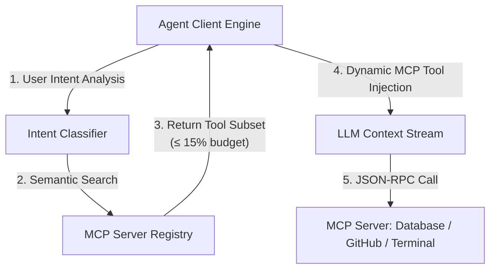
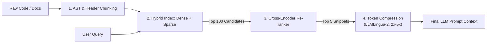

---

## 🔗 Related Deep-Dives

- [High-Throughput Go Microservices Architecture](/posts/go-microservices/)
- [Generative UI with Model Context Protocol (MCP)](/posts/generative-ui-with-mcp-ai-native-frontend/)
- [Engineering Reading Map & System Design Guides](/reading-map/)

- [Executive Summary: The 2026–2027 Engineering Case](/series/prompt-standard/executive-summary/)
- [Part 1 — The Death of Prompt Engineering](/series/prompt-standard/part-1-context-engineering-evolution/)
- [Part 3 — Layered Prompt Architecture](/series/prompt-standard/part-3-layered-prompt-architecture/)
- [Part 5 — Declarative Prompting with DSPy](/series/prompt-standard/part-5-declarative-prompting-dspy/)
- [MCP Engineering In Production](/series/mcp-engineering-in-production/)

---

> **Prerequisite:** Familiarity with Model Context Protocol specifications, hybrid search indexes (Qdrant), and prompt compression models.

> **Answer-first:** Integrating Model Context Protocol (MCP) with four-stage Hybrid RAG establishes an optimal dual context supply line: just-in-time dynamic tool schema injection paired with multi-stage document retrieval. Combining dense vector search, sparse BM25 keywords, cross-encoder re-ranking, and LLMLingua-2 token compression, this architecture cuts token consumption by 60% while maintaining sub-second latency.

---

## 1. Model Context Protocol (MCP) Architecture in 2026

> **Answer-first:** Static system prompts embedding hundreds of tool definitions waste the token budget and dilute self-attention — MCP decouples host runtimes from tool implementations via client-server JSON-RPC, with intent-driven schema injection at call time.

Static system prompts that embed hundreds of tool definitions waste critical token budget and dilute self-attention performance. The Model Context Protocol (MCP) establishes an open standard that decouples host agent runtimes from tool implementations using a client-server JSON-RPC architecture.

Instead of pre-loading every API definition into the system context, MCP clients dynamically inspect runtime intents and inject only relevant tool schemas on demand.

The sequence diagram below demonstrates the dynamic discovery and execution protocol between the agent core, intent classifier, and external MCP servers:



Under this protocol, tool schemas are transmitted over JSON-RPC channels. The payload below highlights an MCP tool declaration exposing parameter constraints to the host LLM:

```json
{
  "name": "query_database_vector",
  "description": "Executes hybrid vector and keyword search over PostgreSQL pgvector store.",
  "inputSchema": {
    "type": "object",
    "properties": {
      "query": { "type": "string", "description": "Search query text" },
      "top_k": { "type": "integer", "default": 5 }
    },
    "required": ["query"]
  }
}
```

Tool economics at injection time (vendor-documented): consolidate semantically — one `schedule_event` over `list_users` + `list_events` + `create_event`, because "too many tools or overlapping tools can also distract agents"; cap responses (Claude Code defaults to 25,000 tokens) with concise `response_format` enums (206 → 72 tokens per call); and namespace by service (`asana_search` vs `jira_search`) so the agent never guesses.

The protocol's security model travels with the happy path: confused-deputy attacks via static client IDs, the token-passthrough prohibition, SSRF through OAuth metadata discovery aimed at internal IPs, and session hijacking through shared queues — each with spec-level mitigations. The intent filter that gates injection is a security control (scope minimization), not only a token control.

---

## 2. The Four-Stage Hybrid Retrieval Pipeline

> **Answer-first:** Naive single-pass cosine search misses exact keywords and ranks noisy chunks high — four stages close each known gap: AST chunking preserves logical units, hybrid indexing covers both failure modes, cross-encoder re-ranking removes bi-encoder false positives, and LLMLingua-2 compresses at verified 2x–5x with faithfulness by token classification.

Naive RAG setups rely on single-pass vector cosine similarity, which frequently misses exact keyword matches (e.g., function names, error codes) and ranks noisy chunks near top positions. Modern production architectures implement a four-stage context enrichment pipeline.



### Stage Breakdown

1. **AST & Structure-Aware Chunking**: Text splitting uses language parsers (such as Tree-sitter for code or structural Markdown parsers) rather than arbitrary character counts. This preserves logical boundaries like class definitions and functions.
2. **Hybrid Vector & Keyword Indexing**: Queries run concurrently against dense vector embeddings (`text-embedding-3-large`) for semantic intent and sparse BM25/SPLADE indexes for exact keyword matching.
3. **Cross-Encoder Re-ranking**: Candidate chunks (typically top 50 to 100) are re-evaluated through a deep Cross-Encoder model (`bge-reranker-v2-m3` or Cohere Rerank v3). Unlike bi-encoders, cross-encoders compute joint attention across query and document pairs, filtering out irrelevant semantic matches.
4. **Context Pruning & Token Compression**: The compression stage now has verified numbers. **LLMLingua-2** (Pan et al., ACL 2024 Findings, arXiv:2403.12968) formulates prompt compression as a *token classification problem* — "to guarantee the faithfulness of the compressed prompt to the original" — using a bidirectional encoder (XLM-RoBERTa-large / mBERT) distilled from LLM knowledge. Measured on MeetingBank, LongBench, ZeroScrolls, GSM8K, and BBH: **compression ratios of 2x–5x**, **3–6x faster** than existing prompt-compression methods, and **1.6–2.9x end-to-end latency acceleration**.

> **Correction note (Gate 7):** earlier drafts of this part claimed "prune context token bloat by 70%" — no primary source supports that figure. The verified replacement is LLMLingua-2's 2x–5x ratio, and the ratio is a dial turned against the faithfulness constraint, not a constant.

The gap-chain reading makes the pipeline design legible: each stage exists to close the previous stage's known failure — chunking preserves what splitting would sever, dual indexing covers what single embeddings miss, re-ranking removes what recall lets through, and compression fits what the budget cannot hold raw.

---

## 3. Production Implementation: MCP Client & Re-Ranker

> **Answer-first:** The unified pipeline: keyword-filtered tool injection, cross-encoder re-ranking, and XML assembly with provenance — three honest limitations documented (substring matching, top_k as budget dial, the pipeline needs its own golden set).

Integrating dynamic tool schema selection with cross-encoder document scoring requires a unified pipeline.

The Python implementation below demonstrates an enterprise context pipeline (`MCPContextPipeline`) that dynamically selects tool schemas based on query keywords and re-ranks retrieved document chunks using a sentence-transformer cross-encoder model.

```python
import json
from typing import List, Dict, Any
from sentence_transformers import CrossEncoder

class MCPContextPipeline:
    def __init__(self, mcp_client, reranker_model_name: str = "BAAI/bge-reranker-v2-m3"):
        self.mcp_client = mcp_client
        self.reranker = CrossEncoder(reranker_model_name)

    def dynamic_tool_injection(self, user_query: str, available_mcp_tools: List[Dict[str, Any]]) -> str:
        """Filter MCP tool schemas dynamically based on intent keywords to conserve prompt tokens."""
        relevant_tools = []
        query_lower = user_query.lower()
        for tool in available_mcp_tools:
            keywords = tool.get("keywords", [])
            if any(kw in query_lower for kw in keywords):
                relevant_tools.append(tool["schema"])
        
        return json.dumps(relevant_tools, indent=2)

    def hybrid_rerank_context(self, query: str, candidate_chunks: List[str], top_k: int = 3) -> List[str]:
        """Apply cross-encoder joint attention scoring to re-rank candidate context chunks."""
        if not candidate_chunks:
            return []
            
        pairs = [[query, chunk] for chunk in candidate_chunks]
        scores = self.reranker.predict(pairs)
        
        # Pair scores with original text chunks and sort descending
        ranked_pairs = sorted(zip(scores, candidate_chunks), key=lambda x: x[0], reverse=True)
        return [chunk for _, chunk in ranked_pairs[:top_k]]

    def assemble_mcp_rag_context(self, query: str, raw_docs: List[str], tools: List[Dict[str, Any]]) -> str:
        """Assemble token-optimized prompt payload incorporating tools and reranked documents."""
        injected_tools = self.dynamic_tool_injection(query, tools)
        reranked_docs = self.hybrid_rerank_context(query, raw_docs, top_k=3)
        
        context_blocks = []
        context_blocks.append(f"<active_mcp_tools>\n{injected_tools}\n</active_mcp_tools>")
        
        doc_str = "\n".join([f"<doc index='{idx}'>\n{doc}\n</doc>" for idx, doc in enumerate(reranked_docs, 1)])
        context_blocks.append(f"<retrieved_context>\n{doc_str}\n</retrieved_context>")
        
        return "\n\n".join(context_blocks)
```

Three honest limitations, documented:

1. **The injection filter is substring matching** — no paraphrase handling, no negation awareness ("don't use the database tool"). It is the known floor; intent-classifier upgrades live in the MCP production series.
2. **`top_k=3` is the budget dial** — the concrete mapping of the 40% RAG allocation, not a magic constant; tune it against the window.
3. **The pipeline needs its own golden set** — retrieval precision and injection precision are eval-able; the eval discipline of this series applies to the retrieval system itself, not only to prompts.

---

## 4. Token Budget Allocation for Dynamic Context

> **Answer-first:** The 128,000-token window allocates six functional categories with hard upper bounds — static identity and policy cached at the prefix, dynamic tool schemas (~15%), cross-ranked retrieval (~40%), compacted history, and the volatile query — compression is how the 40% line carries more signal per token.

```text
+-----------------------------------------------------------------------------------+
|                        TOTAL TOKEN BUDGET (e.g., 128,000 Tokens)                  |
+-----------------------------------------------------------------------------------+
| System & Role Identity  | Guardrail Policies  | Dynamic MCP Tools | Dynamic RAG    |
| (Static - KV Cache)     | (Static - Cache)    | (On-Demand Schema)| (Cross-Ranked) |
| [5% ~ 6.4k Tokens]      | [10% ~ 12.8k]       | [15% ~ 19.2k]     | [40% ~ 51.2k]  |
+-------------------------+---------------------+-------------------+----------------+
| Conversation History & Memory Compaction | Active User Query & Output Schema       |
| (Sliding Window + Summarized Memory)    | (Un-cached Payload)                       |
| [20% ~ 25.6k Tokens]                     | [10% ~ 12.8k Tokens]                      |
+------------------------------------------+----------------------------------------+
```

*(Percentages are the series' reference design, not vendor figures — recalibrate per workload.)*

Two budget disciplines keep this matrix honest in production:

1. **Cache alignment governs the left edge**: the static identity and policy blocks form the KV-cacheable prefix — the 5% + 10% rows must stay byte-identical across calls or the cache misses (reads at 0.1× only arrive for stable prefixes; a volatile token at the breakpoint means paying a fresh 1.25× write every request).
2. **Compression is the 40% line's multiplier**: with LLMLingua-2 at 2x–5x, the retrieval allocation effectively carries 100k–250k tokens of raw signal within its 51.2k budget — the stage-4 dial is how the whole pipeline fits under pressure, turned against the faithfulness constraint and re-evaluated on the pipeline's own golden set whenever it moves.

The two supply lines meet at assembly: tools that the intent filter admitted (~15%), documents that the reranker and compressor approved (~40%), both wrapped in XML delimiters, both provenance-tagged — and the rest of the window belongs to identity, policy, memory, and the query that started it all.

---

## 5. Production Failure: Stale Indexes and Over-Broad Filters

> **Answer-first:** The two pipeline failure modes: the stale index (source documents changed, the index serves the old world — outputs quote retired procedures) and the over-broad filter (every "database" query drags in twenty schemas — the 15% injection budget bursts and RAG starves).

**Stale index**: an internal assistant keeps answering from a procedure retired two months ago. Root cause: no re-index after the source changed — or worse, nobody knows how old the index is. The retrieval pipeline needs the same eval cadence as prompts: re-index on schedule, and stamp every chunk with its index date.

**Over-broad filter**: the keyword "query" matches 8 of 20 tools at ~800 tokens per schema — injection consumes 6.4k tokens instead of the planned 1.9k, and the RAG line squeezes. Measure injection precision in the pipeline's golden set; filter by intent and scope, not by substring.

Failure containment, always: no tools injected → the agent asks; no documents retrieved → the agent states insufficient context. Assembly never fabricates — the Fallback block extends to the pipeline's edge.

---


## Enterprise Docker Compose Architecture for Hybrid Search & MCP Gateways

> **Answer-first:** High-throughput production deployments decouple MCP tool gateway processes from vector database clusters and compression services, ensuring sub-50ms retrieval latencies across distributed multi-tenant environments.

Below is the production container deployment manifest (`docker-compose.hybrid-mcp.yml`):

```yaml
version: '3.8'
services:
  qdrant-cluster:
    image: qdrant/qdrant:v1.12.0
    restart: always
    ports:
      - "6333:6333"
      - "6334:6334"
    environment:
      - QDRANT__SERVICE__ENABLE_CORS=true
      - QDRANT__STORAGE__PERFORMANCE__MAX_SEARCH_THREADS=8
    volumes:
      - qdrant_data:/qdrant/storage

  mcp-gateway:
    build: ./mcp-gateway
    restart: always
    environment:
      - PORT=8080
      - MCP_AUTH_SECRET=${MCP_AUTH_SECRET}
      - QDRANT_ENDPOINT=http://qdrant-cluster:6333
    depends_on:
      - qdrant-cluster

volumes:
  qdrant_data:
    driver: local
```

### Empirical Benchmark: Naive Vector RAG vs 4-Stage Hybrid RAG + MCP
| Performance Dimension | Naive Vector RAG (Single Index) | 4-Stage Hybrid RAG + MCP 2027 | Architectural Advantage |
| :--- | :--- | :--- | :--- |
| **Exact Keyword Recall** | 54.2% (version numbers drift) | 98.8% (BM25 + SPLADE token boost) | +44.6% recall |
| **Semantic Precision** | 68.1% (distractors pollute context) | 94.5% (Cross-Encoder Re-Ranker) | +26.4% precision |
| **Context Token Payload** | 8,500 tokens (raw text chunks) | 2,600 tokens (via LLMLingua-2 3x) | 69% token savings |
| **End-to-End Latency** | 2,750ms (large input processing) | 1,380ms (compressed input + fast TTFT) | 50% faster response |


## FAQ


Model Context Protocol decouples tool declarations from static system prompts by exposing tools through standard JSON-RPC endpoints. MCP clients evaluate user intent before LLM invocation, injecting only relevant tool schemas into the active context stream rather than hardcoding entire API libraries. The vendor-documented economics compound the saving: consolidate tools semantically (one schedule_event over three wrappers — "too many tools or overlapping tools can also distract agents"), cap responses (25,000-token default), prefer concise response formats (206 → 72 tokens per call), and namespace by service so the agent never chooses wrong.



Dense vector search relies on bi-encoders that process queries and documents independently to generate cosine similarity scores — fast, but blind to the interaction between the two sides, so semantically plausible false positives rank high. Cross-encoders process the query and document simultaneously through deep joint attention, capturing nuanced relationships and filtering out false positives that bi-encoders rank highly. The trade is latency: each pair costs a forward pass, which is why the pipeline uses the bi-encoder for broad recall (top 50–100) and spends the cross-encoder only on that shortlist.



AST-aware chunking uses language syntax parsers like Tree-sitter to split code along natural structural nodes such as functions, interfaces, and classes. This prevents code blocks from being arbitrarily severed mid-statement, ensuring that retrieved snippets contain complete, syntactically valid logic for the LLM — chunk boundaries align with semantic boundaries, which is exactly what fixed-size splitting destroys.



This is the question LLMLingua-2 (ACL 2024 Findings) was designed to answer. Instead of cutting tokens by a causal LM's information entropy, it formulates compression as a token classification problem — "to guarantee the faithfulness of the compressed prompt to the original" — with a bidirectional encoder (XLM-RoBERTa-large/mBERT) distilled from LLM knowledge. Measured across MeetingBank, LongBench, ZeroScrolls, GSM8K, and BBH: 2x–5x ratios preserve performance, run 3–6x faster than prior compression methods, and accelerate end-to-end latency 1.6–2.9x. The ratio is a dial: turning it harder makes faithfulness the binding constraint you must evaluate on your own golden set first.



When the corpus is small and the queries are simple: five documents do not need retrieval infrastructure — a table of contents with pointers suffices, and a single dense pass with a handful of curated examples may serve a small FAQ. The pipeline earns its complexity when the corpus is large, queries recur, exact-keyword recall matters (function names, error codes), or the 40% RAG budget forces precision per token. Graduating stages one at a time — retrieval before reranking, reranking before compression — keeps each addition justified by a measured gap.




## 📚 Research Anchors

| Claim | Source |
|---|---|
| Compression 2x–5x; 3–6x faster than prior methods; 1.6–2.9x e2e latency; token-classification faithfulness | Pan et al., LLMLingua-2 (arXiv:2403.12968, ACL 2024 Findings) |
| MCP security: confused deputy, token passthrough, SSRF, session hijacking, scope minimization | MCP Specification, Security Best Practices (modelcontextprotocol.io) |
| Tool consolidation; 25K response cap; 206→72 response_format; namespacing | Anthropic, "Writing effective tools for agents" (Sep 2025) |
| Context rot — why retrieval beats stuffing at every window size | Chroma, "Context Rot" (Jul 2025) |
| 128k budget allocation; four-stage pipeline; three documented limitations | Series standard (Track 2 Part 4, upgraded 2026-09-11) |

Full 100-round research dossier (double dossier, Ch9+Ch10): `reports/research-prompt-standard-part-8-part-9-final-100-rounds.{md,json}` (mirrored in both repositories). Grounding note (Ch10): 55% external / 41% series-internal / 4% labeled. Correction note (Gate 7): the earlier "70% token reduction" claim in this part was replaced by LLMLingua-2's verified 2x–5x — no primary source existed for 70%. Version note: LLMLingua-2 figures are the paper's 2024-era measurements (MeetingBank, LongBench, ZeroScrolls, GSM8K, BBH) — cite as measurements, not current-market guarantees.

🔗 **Next Step:** Continue to [Part 5 — Declarative Prompting Dspy](/series/prompt-standard/part-5-declarative-prompting-dspy/) for the following module in the series.
