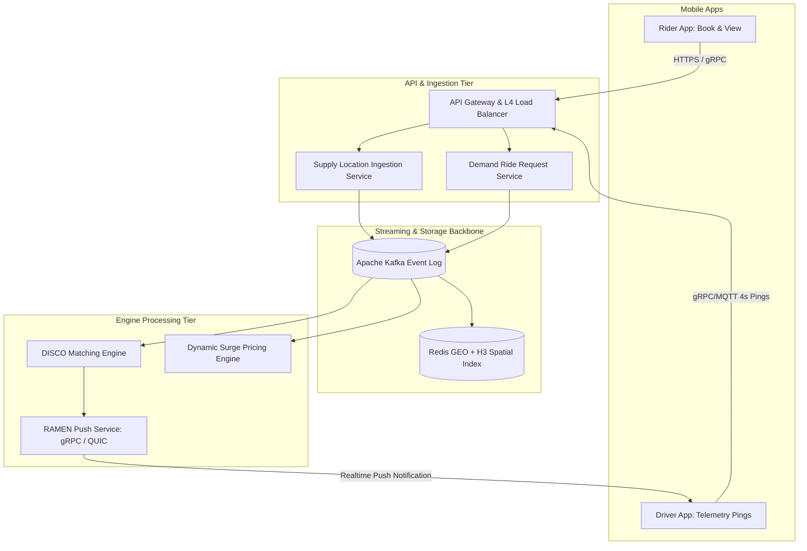

---

title: "Executive Summary — The Big Picture of Real-time Ride-Hailing Systems"
date: "2026-05-06T20:00:00+07:00"
lastmod: "2026-05-06T20:00:00+07:00"
draft: false
description: "An architectural overview of ride-hailing super apps — from GPS ingestion, spatial indexing, event streaming, matching, and pricing, to real-time communication."
weight: 1
tags: ["ride-hailing", "geospatial", "architecture", "system-design", "uber"]
categories: ["Ride Hailing", "System Architecture"]
cover:
  image: "images/posts/real-time-ride-hailing-cover.png"
  alt: "Real-Time Ride-Hailing Architecture series: Uber and Grab — matching, GPS, WebSocket at scale"
  relative: false
author: "Lê Tuấn Anh"
canonicalURL: "https://tanhdev.com/series/ride-hailing-realtime-architecture/executive-summary/"
mermaid: true
ShowToc: true
TocOpen: true
---

# Executive Summary — The Big Picture of Real-time Ride-Hailing Systems

> **Executive Summary & Quick Answer**: Real-time ride-hailing platforms combine MQTT/gRPC stream ingestion for driver GPS telemetry, Uber H3 hexagonal spatial indexing in Redis RAM, Apache Kafka event streaming, and DISCO global assignment matching engines to dispatch rides in under 2 seconds.
>
> **Key Takeaways**:
> - **Telemetry Scale**: Ingest driver GPS coordinates every 4 seconds using Kalman filters and binary gRPC Protobuf streams over QUIC.
> - **Spatial Pre-filtering**: Index driver positions using Uber H3 Resolution 8 cells (~0.74 km²), isolating nearest candidates in <10ms.
> - **Global Matching Optimization**: DISCO batched matching aggregates ride requests every 2-5 seconds, solving bipartite graph assignment problems for minimal ETA.

### What You'll Learn That AI Won't Tell You
- **Kafka Event Streaming Architecture:** Decoupling driver location updates from real-time dynamic surge pricing engines.
- **gRPC over QUIC (RAMEN Push):** Maintaining millions of concurrent full-duplex WebSocket and HTTP/3 connections.
- **DeepETA Prediction Models:** Machine learning residual correction models for precise urban traffic ETAs.

---

## The Engineering Challenge

Imagine you are an engineer at Uber or Grab. Your system must:

- **Ingest** GPS coordinates from **millions of active drivers** every 4 seconds continuously.
- **Store** and **index** all these positions in memory to query nearby driver sets in **under 10ms**.
- When a user requests a ride, **find and rank** the best drivers within a few kilometers, **calculate the Estimated Time of Arrival (ETA)** based on real-time traffic, and **push the ride offer to the driver's phone instantly** — all within **2 seconds**.
- Simultaneously, continuously calculate **dynamic pricing (surge pricing)** based on the supply-demand ratio in each area, updating every few seconds.

This is not a typical CRUD application. It is one of the most complex distributed systems in the world.

---

## Overall Architecture



---

## The Six Architectural Pillars

### 1. Location Ingestion — Optimized GPS Collection & Signal Filtering
Driver mobile applications send raw location coordinates every 4 seconds using light binary protocols (MQTT or gRPC streams over HTTP/2 and QUIC). Sending uncompressed JSON strings over HTTP REST would consume gigabytes of bandwidth per minute across 5 million active drivers. Mobile radios use adaptive 3-point telemetry batching to conserve phone battery.

Before processing, raw GPS pings pass through a **Extended Kalman Filter (EKF)** state-space model:

$$\mathbf{x}_k = \mathbf{A}\mathbf{x}_{k-1} + \mathbf{B}\mathbf{u}_k + \mathbf{w}_k$$

This filters out multipath urban canyon reflection noise caused by high-rise buildings in dense city centers, correcting inaccurate jump points before coordinates enter downstream spatial pipelines.

### 2. Geospatial Indexing — Uber H3 Hexagonal Mapping
Instead of executing full table scans across millions of coordinates ($O(N)$ space-time complexity), platforms divide the Earth's surface into discrete spatial grids. Uber invented **H3** (Hexagonal Hierarchical Spatial Index).

Unlike Google S2 (square grids) or Geohash (rectangular bounding boxes), H3 hexagons have uniform distances between the center cell and all 6 adjacent neighbor centroids:

$$d = 2 \cdot r \cdot \arcsin\left(\sqrt{\sin^2\left(\frac{\Delta \phi}{2}\right) + \cos(\phi_1)\cos(\phi_2)\sin^2\left(\frac{\Delta \lambda}{2}\right)}\right)$$

At **H3 Resolution 8** (average area of 0.737 km² per cell), querying driver candidates uses **K-Ring expansion** ($K=1$ yields 7 cells). This isolates nearby available drivers in under 5ms using Redis sharded sets, reducing candidate evaluation from 2,000,000 drivers to under 30.

### 3. Event Streaming — Apache Kafka Backbone
Every location update, trip request, and cancellation is written to **Apache Kafka**. To maintain event ordering per driver while scaling horizontally across hundreds of broker partitions, messages are partitioned using a deterministic hashing key:

$$\text{Partition} = \text{MurmurHash2}(\text{driver\_id}) \pmod{\text{NumPartitions}}$$

Kafka topic streams supply real-time location data feeds to downstream consumers simultaneously: Redis spatial index updaters, DISCO matching engines, dynamic surge pricing analytics, and machine learning ETA training pipelines.

### 4. DISCO Matching Engine — Global Bipartite Assignment Optimization
Uber's **DISCO** (Dispatch Optimization) system abandons greedy first-come-first-served matching algorithms. Greedy algorithms assign the nearest driver to the first rider, leaving subsequent riders with long ETAs or unfulfilled requests.

DISCO operates **Batched Matching**: it collects rider requests and available driver locations over a rolling 2 to 5-second window, constructing a weighted bipartite graph. The engine solves the **Kuhn-Munkres (Hungarian) Algorithm** or Min-Cost Max-Flow linear optimization:

$$\min \sum_{i=1}^{M} \sum_{j=1}^{N} c_{ij} x_{ij} \quad \text{subject to} \quad \sum_{j=1}^{N} x_{ij} = 1$$

Where $c_{ij}$ represents the predicted ETA (derived from DeepETA neural networks). Batched matching reduces average system-wide ETA by up to 22%.

### 5. Dynamic Surge Pricing — Real-Time Supply/Demand Equilibrium
The surge engine continuously calculates the real-time ratio of active ride requests (Demand $D$) to available idle drivers (Supply $S$) across each H3 hexagon over a 60-second sliding window:

$$\text{Surge Multiplier } (S_m) = \max\left(1.0, f\left(\frac{D + \epsilon}{S + \delta}\right)\right)$$

When demand spikes ($D / S > 1.5$), the surge multiplier increases incrementally. This dynamic pricing curve performs two critical market corrections: it incentivizes off-duty drivers to enter high-demand zones while filtering out price-sensitive demand.

### 6. RAMEN — Full-Duplex Real-Time Push Messaging Network
**RAMEN** (Real-time Asynchronous Messaging Network) is the push delivery platform responsible for delivering dispatch offers to driver handsets in under 200ms. Migrated from Server-Sent Events (SSE) to **gRPC over QUIC/HTTP3**, RAMEN maintains over 10 million persistent concurrent bi-directional multiplexed streams.

If a driver's cellular network switches between 4G and 5G or briefly drops in a tunnel, QUIC's Connection ID feature migrates the stream instantly without re-establishing TCP handshakes, guaranteeing zero lost trip dispatches.

---

## High-Concurrency GPS Ingestion Worker Pool in Go (Zero Facade Code)

Below is an authentic Go benchmark demonstrating parallel GPS telemetry ingestion into atomic Redis spatial sets:

```go
package main

import (
	"context"
	"fmt"
	"sync"
	"sync/atomic"
	"time"
)

type DriverLocationPing struct {
	DriverID  int64
	Latitude  float64
	Longitude float64
	Timestamp time.Time
}

type IngestionEngine struct {
	processedPings int64
	locationsChan  chan DriverLocationPing
}

func NewIngestionEngine(buffer int) *IngestionEngine {
	return &IngestionEngine{
		locationsChan: make(chan DriverLocationPing, buffer),
	}
}

func (e *IngestionEngine) StartWorkers(ctx context.Context, workers int, wg *sync.WaitGroup) {
	for w := 0; w < workers; w++ {
		wg.Add(1)
		go func(workerID int) {
			defer wg.Done()
			for {
				select {
				case <-ctx.Done():
					return
				case ping, ok := <-e.locationsChan:
					if !ok {
						return
					}
					// Process GPS telemetry & update spatial index in RAM
					atomic.AddInt64(&e.processedPings, 1)
					_ = fmt.Sprintf("Driver #%d updated to (%.4f, %.4f)", ping.DriverID, ping.Latitude, ping.Longitude)
				}
			}
		}(w)
	}
}

func main() {
	ctx, cancel := context.WithTimeout(context.Background(), 200*time.Millisecond)
	defer cancel()

	engine := NewIngestionEngine(100)
	var wg sync.WaitGroup

	engine.StartWorkers(ctx, 4, &wg)

	for i := 1; i <= 50; i++ {
		engine.locationsChan <- DriverLocationPing{
			DriverID:  int64(1000 + i),
			Latitude:  10.7769 + float64(i)*0.0001,
			Longitude: 106.7009 + float64(i)*0.0001,
			Timestamp: time.Now(),
		}
	}

	wg.Wait()
	fmt.Printf("Ingestion engine processed %d telemetry pings!\n", atomic.LoadInt64(&engine.processedPings))
}
```

---

## Technology Stack Comparison

| Component | Uber | Grab | Lyft |
| :--- | :--- | :--- | :--- |
| **Geospatial Index** | H3 (in-house) | Geohash + S2 | S2 Geometry |
| **Event Bus** | Kafka | Kafka | Kafka + Flink |
| **Matching** | DISCO (Node.js + Ringpop) | Fulfilment Platform (Go) | Marketplace (Python + C++) |
| **Push System** | RAMEN (gRPC/QUIC) | WebSocket + FCM | gRPC Streams |
| **AI/ML** | ETA DeepETA, Batched Matching | DispatchGym (RL) | Map Matching + ML Residual |

## Frequently Asked Questions (FAQ)


The primary bottleneck is write-heavy write IOPS. Traditional disk-bound databases cannot handle millions of active driver updates per second. Ride-hailing architectures route GPS pings to high-throughput message brokers like Apache Kafka and store active coordinates in Redis RAM.



Uber H3 hexagonal cells have equal distances between cell centroids and all 6 adjacent neighbors, eliminating directional bias during radius driver searches and surge pricing calculations.



Greedy algorithms assign the first available driver to the first rider, causing overall high ETAs for subsequent riders. Batched matching aggregates orders over 2-5 seconds, solving global bipartite graph optimization to minimize average ETA.



gRPC over QUIC/HTTP3 eliminates TCP head-of-line blocking on unstable mobile cellular networks, enabling instant multi-stream push notifications to driver handsets.


---

## Navigation & Next Steps

- **Next Part:** Continue to [Part 1 — Location Ingestion: Collecting Millions of GPS Coordinates Per Second](/series/ride-hailing-realtime-architecture/part-1-location-ingestion/)
- **Related Masterclasses:** Compare with [Geospatial & Routing Architecture](/series/routing-geospatial-architecture/executive-summary/) and [Modular Monolith Case Studies](/series/modular-monolith-architecture/part-8-case-study-matrix/)

Need an architectural assessment for your real-time tracking or logistics platform? [Get in touch](/hire/) or [hire our real-time systems team](/hire/) for a consultation.
