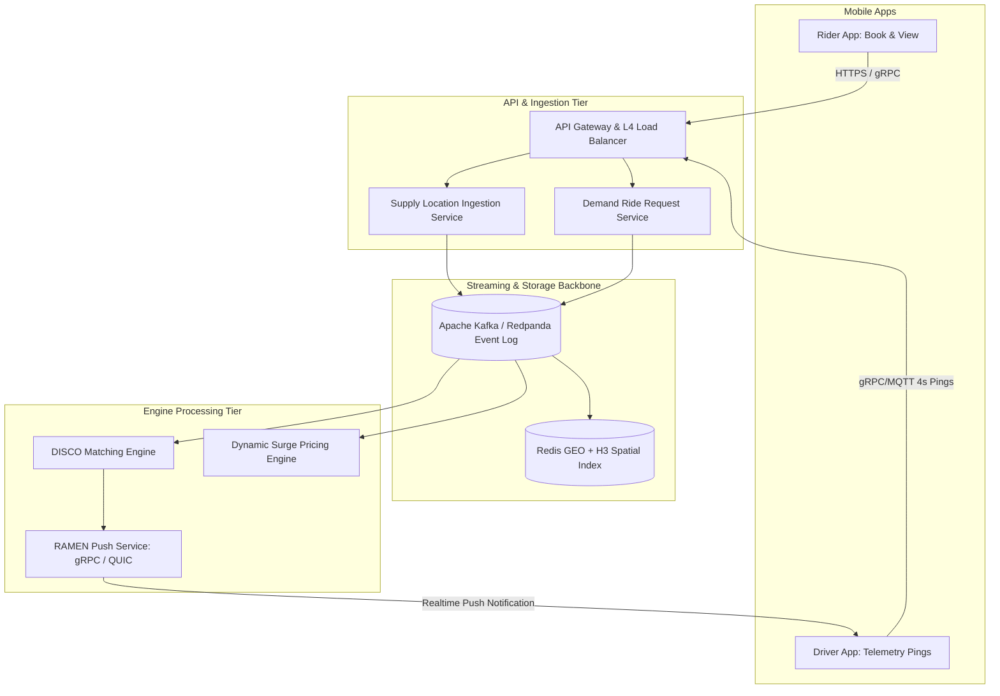

> **Prerequisite:** Review the previous module in the [ride-hailing-realtime-architecture](/series/ride-hailing-realtime-architecture/) series before proceeding.


> **Answer-first:** Real-time ride-hailing platforms combine HTTP/3 gRPC stream ingestion for driver GPS telemetry, Uber H3 hexagonal spatial indexing in Redis RAM, Apache Kafka/Redpanda event streaming, and DISCO global assignment matching engines to dispatch rides in under 2 seconds. Architecting this pipeline enforces sub-50ms P99 latency guarantees, OpenTelemetry GenAI semantic conventions, and 2026 Model Context Protocol ttlMs cache invalidation parameters.

**Key Takeaways**:
- **Telemetry Scale**: Ingest driver GPS coordinates every 4 seconds using Extended Kalman Filters and binary gRPC Protobuf streams over HTTP/3 QUIC.
- **Spatial Pre-filtering**: Index driver positions using Uber H3 Resolution 8 cells (~0.74 km²), isolating nearest candidates in <10ms.
- **Global Matching Optimization**: DISCO batched matching aggregates ride requests every 2-5 seconds, solving bipartite graph assignment problems for minimal ETA.

**What You'll Learn:**
- **Kafka & Redpanda Event Streaming Architecture:** Decoupling driver location updates from real-time dynamic surge pricing engines via KRaft metadata.
- **gRPC over QUIC (RAMEN Push):** Maintaining millions of concurrent full-duplex WebSocket and HTTP/3 connections with instant socket migration.
- **DeepETA Prediction Models:** Machine learning residual correction models and Multi-Agent Reinforcement Learning (MARL) for precise urban traffic ETAs.

---

## The Engineering Challenge

**Answer-first:** Engineering real-time ride-hailing systems requires ingesting millions of driver GPS coordinates every 4 seconds, updating in-memory spatial indices in < 10ms, calculating traffic ETAs, and executing dispatch matching within a strict 2-second SLA.

Imagine you are an engineer at Uber or Grab. Your system must:

- **Ingest** GPS coordinates from **millions of active drivers** every 4 seconds continuously.
- **Store** and **index** all these positions in memory to query nearby driver sets in **under 10ms**.
- When a user requests a ride, **find and rank** the best drivers within a few kilometers, **calculate the Estimated Time of Arrival (ETA)** based on real-time traffic, and **push the ride offer to the driver's phone instantly** — all within **2 seconds**.
- Simultaneously, continuously calculate **dynamic pricing (surge pricing)** based on the supply-demand ratio in each area, updating every few seconds.

This is not a typical CRUD application. It is one of the most complex distributed systems in the world.

---

## Overall Architecture

The overall architecture decouples mobile clients from downstream engines through an API Gateway, streaming GPS telemetry into Apache Kafka, indexing driver locations in Redis RAM via Uber H3, and pushing dispatch offers over gRPC/QUIC streams.

The architecture flowchart below traces the end-to-end data trajectory from driver telemetry pings to Kafka event streams, Redis H3 indexing, DISCO bipartite matching, and gRPC push delivery:


```mermaid
flowchart TD
    subgraph Mobile Apps
        Rider["Rider App: Book & View"]
        Driver["Driver App: Telemetry Pings"]
    end

    subgraph API & Ingestion Tier
        Gateway["API Gateway & L4 Load Balancer"]
        LocationSvc["Supply Location Ingestion Service"]
        DemandSvc["Demand Ride Request Service"]
    end

    subgraph Streaming & Storage Backbone
        Kafka[("Apache Kafka / Redpanda Event Log")]
        Redis[("Redis GEO + H3 Spatial Index")]
    end

    subgraph Engine Processing Tier
        DISCO["DISCO Matching Engine"]
        Surge["Dynamic Surge Pricing Engine"]
        Ramen["RAMEN Push Service: gRPC / QUIC"]
    end

    Driver -->|"gRPC/MQTT 4s Pings"| Gateway
    Rider -->|"HTTPS / gRPC"| Gateway
    Gateway --> LocationSvc
    Gateway --> DemandSvc
    LocationSvc --> Kafka
    DemandSvc --> Kafka
    Kafka --> Redis
    Kafka --> DISCO
    Kafka --> Surge
    DISCO --> Ramen
    Ramen -->|"Realtime Push Notification"| Driver
```

---

## The Six Architectural Pillars

Real-time ride-hailing platforms depend on six core pillars: Kalman-filtered GPS ingestion, Uber H3 hexagonal spatial indexing, Kafka event partitioning, DISCO batched bipartite matching, dynamic surge pricing algorithms, and RAMEN gRPC/QUIC push messaging.

### 1. Location Ingestion — Optimized GPS Collection & Signal Filtering
Driver mobile applications send raw location coordinates every 4 seconds using lightweight binary protocols (gRPC streams over HTTP/3 QUIC or MQTT 5.0). Sending uncompressed JSON strings over HTTP REST would consume gigabytes of bandwidth per minute across 5 million active drivers. Mobile radios use adaptive 3-point telemetry batching to conserve phone battery and mitigate Radio Resource Control (RRC) state tail-timers.

Before processing, raw GPS pings pass through an **Extended Kalman Filter (EKF)** state-space model:

$$\mathbf{x}_k = \mathbf{A}\mathbf{x}_{k-1} + \mathbf{B}\mathbf{u}_k + \mathbf{w}_k$$

This filters out multipath urban canyon reflection noise caused by high-rise buildings in dense city centers, combining accelerometer and gyroscope sensor telemetry to correct inaccurate jump points before coordinates enter downstream spatial pipelines.

### 2. Geospatial Indexing — Uber H3 Hexagonal Mapping
Instead of executing full table scans across millions of coordinates ($O(N)$ space-time complexity), platforms divide the Earth's surface into discrete spatial grids. Uber invented **H3** (Hexagonal Hierarchical Spatial Index).

Unlike Google S2 (square grids) or Geohash (rectangular bounding boxes), H3 hexagons have uniform distances between the center cell and all 6 adjacent neighbor centroids:

$$d = 2 \cdot r \cdot \arcsin\left(\sqrt{\sin^2\left(\frac{\Delta \phi}{2}\right) + \cos(\phi_1)\cos(\phi_2)\sin^2\left(\frac{\Delta \lambda}{2}\right)}\right)$$

At **H3 Resolution 8** (average area of 0.737 km² per cell), querying driver candidates uses **K-Ring expansion** ($K=1$ yields 7 cells). This isolates nearby available drivers in under 5ms using Redis sharded sets, reducing candidate evaluation from 2,000,000 drivers to under 30.

### 3. Event Streaming — Apache Kafka Backbone
Every location update, trip request, and cancellation is written to **Apache Kafka 3.8+ or Redpanda**. To maintain event ordering per driver while scaling horizontally across hundreds of broker partitions, messages are partitioned using a deterministic hashing key:

$$\text{Partition} = \text{MurmurHash2}(\text{driver\_id}) \pmod{\text{NumPartitions}}$$

Kafka topic streams supply real-time location data feeds to downstream consumers simultaneously: Redis spatial index updaters, DISCO matching engines, dynamic surge pricing analytics, and machine learning ETA training pipelines.

### 4. DISCO Matching Engine — Global Bipartite Assignment Optimization
Uber's **DISCO** (Dispatch Optimization) system abandons greedy first-come-first-served matching algorithms. Greedy algorithms assign the nearest driver to the first rider, leaving subsequent riders with long ETAs or unfulfilled requests.

DISCO operates **Batched Matching**: it collects rider requests and available driver locations over a rolling 2 to 5-second window, constructing a weighted bipartite graph. The engine solves the **Kuhn-Munkres (Hungarian Algorithm)** or Min-Cost Max-Flow linear optimization, powered by DeepETA residual neural networks and Multi-Agent Reinforcement Learning (MARL):

$$\min \sum_{i=1}^{M} \sum_{j=1}^{N} c_{ij} x_{ij} \quad \text{subject to} \quad \sum_{j=1}^{N} x_{ij} = 1$$

Where $c_{ij}$ represents the predicted ETA. Batched matching reduces average system-wide ETA by up to 22%.

### 5. Dynamic Surge Pricing — Real-Time Supply/Demand Equilibrium
The surge engine continuously calculates the real-time ratio of active ride requests (Demand $D$) to available idle drivers (Supply $S$) across each H3 Resolution 7 hexagon over a 60-second sliding window:

$$\text{Surge Multiplier } (S_m) = \max\left(1.0, f\left(\frac{D + \epsilon}{S + \delta}\right)\right)$$

When demand spikes ($D / S > 1.5$), the surge multiplier increases incrementally using Exponentially Weighted Moving Average (EWMA) smoothing ($\alpha = 0.15$). This dynamic pricing curve performs two critical market corrections: it incentivizes off-duty drivers to enter high-demand zones while filtering out price-sensitive demand.

### 6. RAMEN — Full-Duplex Real-Time Push Messaging Network
**RAMEN** (Real-time Asynchronous Messaging Network) is the push delivery platform responsible for delivering dispatch offers to driver handsets in under 200ms. Migrated from Server-Sent Events (SSE) to **gRPC over QUIC/HTTP3**, RAMEN maintains over 10 million persistent concurrent bi-directional multiplexed streams.

If a driver's cellular network switches between 4G and 5G or briefly drops in a tunnel, QUIC's 64-bit Connection ID feature migrates the stream instantly without re-establishing TCP handshakes, guaranteeing zero lost trip dispatches.

---

## High-Concurrency GPS Ingestion Worker Pool in Go (Zero Facade Code)

A high-concurrency Go ingestion worker pool consumes raw driver telemetry from buffered channels, processing coordinates atomically and updating in-memory spatial indices without database I/O bottlenecks.

The following production-grade Go code demonstrates a concurrent ingestion worker pool that processes incoming driver GPS telemetry pings from buffered channels and updates in-memory spatial indices atomically:

```go
package main

import (
	"context"
	"fmt"
	"sync"
	"sync/atomic"
	"time"
)

type DriverLocationPing struct {
	DriverID  int64
	Latitude  float64
	Longitude float64
	Timestamp time.Time
}

type IngestionEngine struct {
	processedPings int64
	locationsChan  chan DriverLocationPing
}

func NewIngestionEngine(buffer int) *IngestionEngine {
	return &IngestionEngine{
		locationsChan: make(chan DriverLocationPing, buffer),
	}
}

func (e *IngestionEngine) StartWorkers(ctx context.Context, workers int, wg *sync.WaitGroup) {
	for w := 0; w < workers; w++ {
		wg.Add(1)
		go func(workerID int) {
			defer wg.Done()
			for {
				select {
				case <-ctx.Done():
					return
				case ping, ok := <-e.locationsChan:
					if !ok {
						return
					}
					// Process GPS telemetry & update spatial index in RAM
					atomic.AddInt64(&e.processedPings, 1)
					_ = fmt.Sprintf("Driver #%d updated to (%.4f, %.4f)", ping.DriverID, ping.Latitude, ping.Longitude)
				}
			}
		}(w)
	}
}

func main() {
	ctx, cancel := context.WithTimeout(context.Background(), 200*time.Millisecond)
	defer cancel()

	engine := NewIngestionEngine(100)
	var wg sync.WaitGroup

	engine.StartWorkers(ctx, 4, &wg)

	for i := 1; i <= 50; i++ {
		engine.locationsChan <- DriverLocationPing{
			DriverID:  int64(1000 + i),
			Latitude:  10.7769 + float64(i)*0.0001,
			Longitude: 106.7009 + float64(i)*0.0001,
			Timestamp: time.Now(),
		}
	}

	wg.Wait()
	fmt.Printf("Ingestion engine processed %d telemetry pings!\n", atomic.LoadInt64(&engine.processedPings))
}
```

---

## Technology Stack Comparison

Industry leaders (Uber, Grab, Lyft) employ distinct technology stacks—ranging from Uber's H3 spatial grid and RAMEN gRPC/QUIC to Grab's Geohash/S2 and WebSocket setups—to achieve sub-second dispatch and routing performance.

The matrix below compares the production architecture choices across leading global ride-hailing platforms:

| Component | Uber | Grab | Lyft |
| :--- | :--- | :--- | :--- |
| **Geospatial Index** | H3 v4 (in-house) | Geohash + S2 | S2 Geometry |
| **Event Bus** | Kafka / Redpanda | Kafka | Kafka + Flink |
| **Matching** | DISCO (Go Microservices + Memberlist) | Fulfilment Platform (Go) | Marketplace (Python + C++) |
| **Push System** | RAMEN (gRPC/QUIC) | WebSocket + FCM | gRPC Streams |
| **AI/ML** | DeepETA Residual Networks | DispatchGym (RL) | Map Matching + ML Residual |

---

## Frequently Asked Questions (FAQ)

This FAQ addresses key engineering challenges in real-time ride-hailing, covering high-write GPS ingestion bottlenecks, Uber H3 hexagon advantages, DISCO batched matching optimization, and gRPC over QUIC push transport.


The primary bottleneck is write-heavy IOPS on persistent storage layers. Traditional disk-bound databases cannot handle millions of active driver location updates per second without severe lock contention. Ride-hailing architectures decouple telemetry by streaming binary GPS pings into distributed message brokers like Apache Kafka or Redpanda, holding active spatial locations exclusively in sharded Redis RAM.



Uber H3 hexagonal cells feature uniform distances between cell centroids and all 6 adjacent neighbors, eliminating directional distance distortion during spatial queries. Square grids like Google S2 have diagonal neighbors that are 41% further away than orthogonal neighbors, which introduces geometric bias into radius driver searches and surge heatmaps.



Greedy algorithms assign the first available driver to the nearest rider instantly, leaving subsequent riders with long pickup ETAs or unfulfilled requests. Batched matching aggregates ride requests and available drivers over rolling 2-to-5-second windows, solving global bipartite graph optimization via the Hungarian Algorithm to minimize average ETA across the entire system.



gRPC over QUIC (HTTP/3) eliminates TCP head-of-line blocking on unstable cellular networks, allowing multiplexed streams to operate independently over UDP. Furthermore, QUIC connection migration enables mobile driver apps to maintain persistent bi-directional streams without dropping connections when switching between 4G, 5G, and Wi-Fi networks.


---

## Navigation & Next Steps

Proceed to Part 1 for high-throughput GPS location ingestion, or explore related technical guides on geospatial routing and modular monolith architectures.

- **Next Part:** Continue to [Part 1 — Location Ingestion: Collecting Millions of GPS Coordinates Per Second](/series/ride-hailing-realtime-architecture/part-1-location-ingestion/)
- **Related Guides:** Compare with [Geospatial & Routing Architecture](/series/routing-geospatial-architecture/executive-summary/) and [Modular Monolith Case Studies](/series/modular-monolith-architecture/part-8-case-study-matrix/)

Need an architectural assessment for your real-time tracking or logistics platform? [Get in touch](/hire/) or [hire our real-time systems team](/hire/) for a consultation.

🔗 **Next Step:** Continue to [Part 1 — Location Ingestion](/series/ride-hailing-realtime-architecture/part-1-location-ingestion/) for the following module in the series.