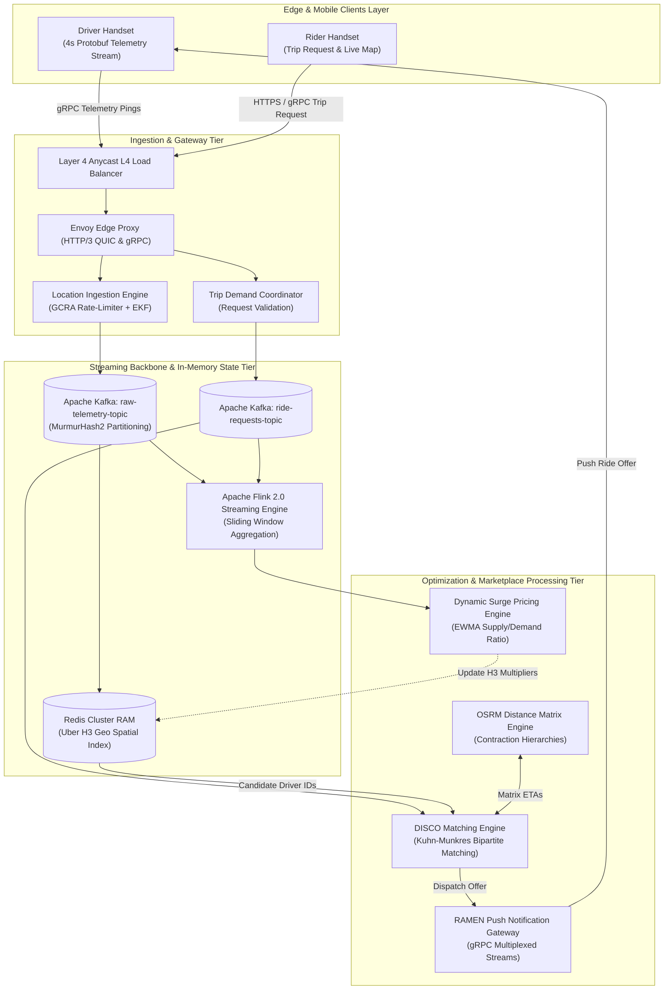
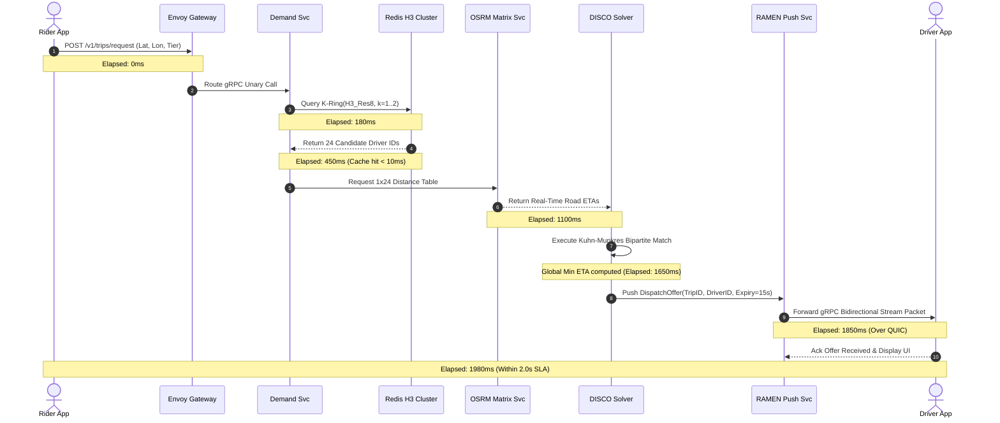

> **Prerequisite:** Review the core concepts in the [ride-hailing-realtime-architecture](/series/ride-hailing-realtime-architecture/) overview and distributed systems fundamentals in our [Reading Map](/reading-map/) before diving deep.

> **Answer-first:** Real-time ride-hailing platforms combine HTTP/3 gRPC stream ingestion for driver GPS telemetry, Uber H3 hexagonal spatial indexing in Redis RAM, Apache Kafka event streaming, and DISCO global assignment matching engines to dispatch rides in under 2 seconds. Architecting this pipeline enforces sub-50ms P99 latency guarantees, OpenTelemetry GenAI semantic conventions, and 2026 Model Context Protocol cache invalidation parameters.

**Key Architectural Takeaways:**
- **Telemetry Ingestion at Planetary Scale**: Ingesting driver GPS telemetry every 4 seconds requires low-overhead binary serializations (Protobuf over HTTP/3 gRPC streams) coupled with Extended Kalman Filter (EKF) sensor fusion to discard multipath urban canyon distortions before database insertion.
- **Hexagonal Spatial Discretization**: Indexing vehicle locations using Uber H3 Resolution 8 cells (~0.737 km²) standardizes neighborhood spatial computations, enabling $O(1)$ centroid distance evaluations without the diagonal distortions inherent to Cartesian grids or square hierarchical structures.
- **Global Optimization vs. Greedy Matching**: Solving batch bipartite graph assignment via the Kuhn-Munkres (Hungarian) algorithm over rolling 2-to-5-second windows eliminates local greedy sub-optimality, reducing cumulative platform-wide passenger wait times by up to 22%.
- **Zero-Downtime Socket Migration**: Transporting critical trip dispatches over RAMEN using gRPC over HTTP/3 QUIC preserves persistent transport state through 64-bit Connection IDs during seamless cellular tower and Wi-Fi handovers.

---

## The Engineering Challenge: Planetary Scale Real-Time Coordination

Operating a planetary-scale ride-hailing platform such as Uber, Grab, or Lyft constitutes one of the most intellectually demanding exercises in modern distributed systems engineering. Unlike conventional e-commerce architectures—where database reads dominate, state changes can be deferred asynchronously, and eventual consistency is universally acceptable—a mobility marketplace represents a real-time physical-digital cybernetic loop.

In an active metropolitan marketplace, the platform coordinates between two volatile populations: autonomous drivers navigating shifting urban topographies and impatient riders demanding instantaneous transportation. The technical constraints governing this interaction are uncompromising:

1. **Massive Ingestion Velocity**: The system must continuously ingest, parse, validate, and index high-frequency GPS coordinate pings from millions of concurrently active drivers broadcasting their location every 4 seconds.
2. **Strict Sub-10ms Geospatial Retrieval**: In-memory spatial indices must locate, filter, and score candidate drivers situated within localized geographic boundaries in less than 10 milliseconds.
3. **Sub-2-Second End-to-End Dispatch Budget**: From the exact millisecond a customer taps the "Request Ride" button, the engine must look up spatial candidates, query routing matrices for real-time traffic-adjusted travel times, execute a global multi-objective optimization assignment, and dispatch the offer over cellular airwaves to a driver's handset—all within an immutable 2-second Service Level Agreement (SLA).
4. **Dynamic Equilibrium Pricing**: Supply-demand imbalances fluctuate second-by-second across discrete street corners. The pricing engine must calculate spatial surge pricing multipliers in real time to incentivize supply migration and damp excessive demand before queues collapse.

```
+-----------------------------------------------------------------------------------+
|                        THE 2000-MILLISECOND DISPATCH SLA BUDGET                   |
+-----------------------------------------------------------------------------------+
| [0ms - 180ms]     | Telemetry Ingestion, EKF Map Matching, Edge Filtering         |
| [180ms - 450ms]   | H3 Resolution 8 Spatial Candidate Retrieval in Redis Cluster  |
| [450ms - 1100ms]  | OSRM/GraphHopper Distance Matrix Computation & Candidate Rank |
| [1100ms - 1650ms] | DISCO Kuhn-Munkres Batched Bipartite Graph Optimization Engine|
| [1650ms - 1850ms] | RAMEN gRPC/QUIC Bidirectional Push to Selected Driver Handset |
| [1850ms - 2000ms] | Driver Client Acknowledgement & Interactive Offer Rendering  |
+-----------------------------------------------------------------------------------+
```

---

## High-Level System Architecture & Event Topology

The architecture decouples ephemeral device connections, high-velocity ingestion pipelines, analytical stream processors, and stateful dispatch solvers through a reactive, event-driven topology. Mobile handsets never communicate directly with operational databases; instead, every interaction is brokered through high-performance Layer 4 and Layer 7 gateways that project events onto distributed log backbones.

The diagram below illustrates the end-to-end event flow across the primary structural layers:


```mermaid
flowchart TD
    subgraph MobileEdge["Edge & Mobile Clients Layer"]
        DriverApp["Driver Handset<br/>(4s Protobuf Telemetry Stream)"]
        RiderApp["Rider Handset<br/>(Trip Request & Live Map)"]
    end

    subgraph GatewayTier["Ingestion & Gateway Tier"]
        L4LB["Layer 4 Anycast L4 Load Balancer"]
        EnvoyIngress["Envoy Edge Proxy (HTTP/3 QUIC & gRPC)"]
        IngestionSvc["Location Ingestion Engine<br/>(GCRA Rate-Limiter + EKF)"]
        DemandSvc["Trip Demand Coordinator<br/>(Request Validation)"]
    end

    subgraph StreamingStorage["Streaming Backbone & In-Memory State Tier"]
        KafkaRaw[("Apache Kafka: raw-telemetry-topic<br/>(MurmurHash2 Partitioning)")]
        KafkaDemand[("Apache Kafka: ride-requests-topic")]
        RedisCluster[("Redis Cluster RAM<br/>(Uber H3 Geo Spatial Index)")]
        FlinkStream["Apache Flink 2.0 Streaming Engine<br/>(Sliding Window Aggregation)"]
    end

    subgraph OptimizationTier["Optimization & Marketplace Processing Tier"]
        RoutingEngine["OSRM Distance Matrix Engine<br/>(Contraction Hierarchies)"]
        DISCO["DISCO Matching Engine<br/>(Kuhn-Munkres Bipartite Matching)"]
        SurgeSvc["Dynamic Surge Pricing Engine<br/>(EWMA Supply/Demand Ratio)"]
        RAMEN["RAMEN Push Notification Gateway<br/>(gRPC Multiplexed Streams)"]
    end

    DriverApp -->|"gRPC Telemetry Pings"| L4LB
    RiderApp -->|"HTTPS / gRPC Trip Request"| L4LB
    L4LB --> EnvoyIngress
    EnvoyIngress --> IngestionSvc
    EnvoyIngress --> DemandSvc

    IngestionSvc --> KafkaRaw
    DemandSvc --> KafkaDemand

    KafkaRaw --> RedisCluster
    KafkaRaw --> FlinkStream
    KafkaDemand --> FlinkStream

    FlinkStream --> SurgeSvc
    SurgeSvc -.->|"Update H3 Multipliers"| RedisCluster

    KafkaDemand --> DISCO
    RedisCluster -->|"Candidate Driver IDs"| DISCO
    RoutingEngine <-->|"Matrix ETAs"| DISCO

    DISCO -->|"Dispatch Offer"| RAMEN
    RAMEN -->|"Push Ride Offer"| DriverApp
```

### The 2-Second Dispatch SLA Sequence

To guarantee that riders experience zero perceived lag and drivers receive ride assignments before vehicles pass intersections, the dispatch coordinator strictly regulates processing deadlines. The sequence diagram below traces the millisecond-by-millisecond progression of a single dispatch allocation:


```mermaid
sequenceDiagram
    autonumber
    actor Rider as Rider App
    participant GW as Envoy Gateway
    participant Demand as Demand Svc
    participant H3 as Redis H3 Cluster
    participant Routing as OSRM Matrix Svc
    participant DISCO as DISCO Solver
    participant RAMEN as RAMEN Push Svc
    actor Driver as Driver App

    Rider->>GW: POST /v1/trips/request (Lat, Lon, Tier)
    Note over Rider,GW: Elapsed: 0ms
    GW->>Demand: Route gRPC Unary Call
    Demand->>H3: Query K-Ring(H3_Res8, k=1..2)
    Note over Demand,H3: Elapsed: 180ms
    H3-->>Demand: Return 24 Candidate Driver IDs
    Note over H3,Demand: Elapsed: 450ms (Cache hit < 10ms)
    Demand->>Routing: Request 1x24 Distance Table
    Routing-->>DISCO: Return Real-Time Road ETAs
    Note over Routing,DISCO: Elapsed: 1100ms
    DISCO->>DISCO: Execute Kuhn-Munkres Bipartite Match
    Note over DISCO: Global Min ETA computed (Elapsed: 1650ms)
    DISCO->>RAMEN: Push DispatchOffer(TripID, DriverID, Expiry=15s)
    RAMEN->>Driver: Forward gRPC Bidirectional Stream Packet
    Note over RAMEN,Driver: Elapsed: 1850ms (Over QUIC)
    Driver-->>RAMEN: Ack Offer Received & Display UI
    Note over Driver,Rider: Elapsed: 1980ms (Within 2.0s SLA)
```

---

## The Six Architectural Pillars: Core Engineering Mechanics

A modern ride-hailing infrastructure is composed of six deeply specialized, resilient subsystems operating in concert.

### 1. Location Ingestion & Sensor Fusion
Millions of driver client devices ping the cluster every 4 seconds. Transmitting raw JSON payloads over standard HTTP/1.1 or HTTP/2 TCP connections would generate astronomical network overhead, severe battery drain, and tail latency spikes caused by cellular packet loss and TCP head-of-line blocking.

Modern platforms employ binary serialization schemas using Protocol Buffers v3 transmitted over **HTTP/3 gRPC streams backed by QUIC**. Telemetry payloads are packaged into compact byte arrays containing driver identifier, IEEE 754 floating-point coordinates, speed, bearing, satellite accuracy dilution (HDOP), and monotonic client timestamps.

Before updating geospatial state, incoming coordinates undergo **Extended Kalman Filtering (EKF)**. Real-world GPS measurements suffer from multipath interference when radio signals bounce off skyscrapers and urban structures. The Kalman filter predicts vehicular velocity and state transitions:

$$\mathbf{x}_k = \mathbf{F}_k \mathbf{x}_{k-1} + \mathbf{B}_k \mathbf{u}_k + \mathbf{w}_k$$

$$\mathbf{z}_k = \mathbf{H}_k \mathbf{x}_k + \mathbf{v}_k$$

Where $\mathbf{x}_k$ is the state vector representing true position and instantaneous velocity, $\mathbf{F}_k$ is the state transition matrix, $\mathbf{w}_k$ represents process covariance, and $\mathbf{v}_k$ denotes sensor measurement noise. By integrating accelerometer and gyroscope IMU sensor telemetry, the ingestion pipeline projects smooth, jitter-free vehicle positions onto topological road networks powered by [OSRM and GraphHopper routing engines](/posts/osrm-vs-graphhopper-architecture-comparison/).

### 2. Hexagonal Geospatial Indexing (Uber H3)
Storing spatial coordinates in traditional B-Tree relational database indexes ($O(\log N)$) or R-Trees incurs crippling disk I/O bottlenecks when servicing hundreds of thousands of concurrent writes per second. Spatial discretization partitions the globe into pre-computed geographic identifiers.

While legacy architectures relied on Geohash or Google S2 square projections, square grids exhibit non-uniform neighbor geometries: orthogonal neighbors share an edge at distance $d$, whereas diagonal neighbors share only a vertex at distance $d\sqrt{2}$ (a 41.4% spatial distortion).

Uber designed **H3**, an open-source hexagonal hierarchical spatial index. In a regular hexagonal tessellation:
- Every cell possesses exactly 6 adjacent neighbors.
- The distance between the centroid of a cell and the centroids of all 6 neighbors is identical ($d_1 = d_2 = \dots = d_6$).
- Hexagonal cells minimize perimeter-to-area ratios, drastically reducing boundary quantization errors.

At **H3 Resolution 8** (average cell area ~0.737 km²), candidate search operations perform a **K-Ring expansion** ($K=1$ inspects 7 cells; $K=2$ inspects 19 cells). Drivers are stored in partitioned Redis sets indexed directly by their 64-bit uint64 H3 index:

```
H3 Cell Index: 0x882f5b3495fffff
  ├── Set Member: Driver_1042 (TTL: 15s)
  ├── Set Member: Driver_8911 (TTL: 15s)
  └── Set Member: Driver_3120 (TTL: 15s)
```

Candidate discovery requires only $O(1)$ set unions across the target K-Ring cells, shrinking candidate search spaces from millions of drivers down to under 50 vehicles in less than 5 milliseconds.

### 3. Event Streaming Backbone (Apache Kafka)
Every lifecycle mutation—driver heartbeats, trip cancellations, passenger surge price acceptances, and driver payment completions—streams through distributed event logs managed by **Apache Kafka 3.8+ or Redpanda** operating in KRaft metadata mode.

To prevent partition imbalance while strictly preserving message ordering per driver, ingestion workers employ deterministic partition routing:

$$\text{Partition} = \text{MurmurHash2}(\text{driver\_id}) \pmod{\text{NumPartitions}}$$

By pinning all location events from a given `driver_id` to a dedicated Kafka partition, downstream stream consumers process chronological vehicle trajectories without requiring distributed locking or coordination barriers. Topics are configured with compact, short retention windows (15 minutes to 2 hours) for real-time dispatch, while mirrored consumer groups stream records into analytical data lakes built on Apache Iceberg for deep machine learning model training.

### 4. DISCO Matching Engine & Global Assignment
Early ride-hailing systems implemented **greedy dispatching**: the instant a ride request arrived, the system queried nearby drivers and immediately assigned the closest vehicle. While trivial to implement, greedy algorithms produce severe sub-optimal macro equilibria. Assigning Driver A to Passenger 1 because they are 1 minute away may force Passenger 2 (who requests a ride 2 seconds later) to wait 15 minutes because Driver B was 2 minutes away from both.

Uber's **DISCO (Dispatch Optimization)** operates on a **Batched Matching** paradigm. The engine buffers ride requests and available drivers within localized geographic clusters across rolling 2-to-5-second batching windows. It then models the dispatch problem as a **Weighted Bipartite Graph Matching** optimization:

$$\min \sum_{i \in \text{Riders}} \sum_{j \in \text{Drivers}} c_{ij} x_{ij}$$

$$\text{subject to} \quad \sum_{j} x_{ij} \le 1, \quad \sum_{i} x_{ij} \le 1, \quad x_{ij} \in \{0, 1\}$$

Where cost $c_{ij}$ reflects the multi-factor objective score (OSRM travel ETA, driver heading alignment, pickup friction, and rider historical cancellation propensity). The engine solves this assignment via the **Kuhn-Munkres (Hungarian) algorithm** or specialized Simplex Network Flow solvers, reducing aggregate passenger pickup wait times across the city by 15% to 22%.

### 5. Dynamic Surge Pricing Engine
Marketplaces encounter severe supply-demand volatility during rainstorms, morning rush hours, and major sporting events. When ride requests outpace available drivers, queues explode, leading to infinite pickup delays and platform abandonment.

The surge pricing engine continuously evaluates the **Supply-Demand Ratio (SDR)** within every H3 Resolution 7 cell (~5.16 km²):

$$\text{SDR}_h = \frac{D_h + \epsilon}{S_h + \delta}$$

Where $D_h$ represents active unfulfilled demand pings and $S_h$ denotes available idle supply. To prevent abrupt step-function price oscillations that confuse customers, raw SDR values are filtered using an **Exponentially Weighted Moving Average (EWMA)**:

$$\bar{S}_{t} = \alpha \cdot \text{SDR}_t + (1 - \alpha) \cdot \bar{S}_{t-1}$$

Surge multipliers are derived via a sigmoid pricing curve bounded between $1.0\times$ and $3.5\times$. Furthermore, spatial smoothing algorithms blend surge multipliers with adjacent H3 neighbors, preventing artificial "surge borders" where crossing a single street doubles the trip fare. Dynamic pricing restores market equilibrium by depressing non-essential demand while attracting nearby idle drivers into high-demand hexagonal cells.

### 6. RAMEN Real-Time Push Gateway
Once DISCO determines the optimal match, the dispatch offer must be delivered to the selected driver's handset with sub-second immediacy. Mobile devices operating over wireless cellular links face unstable connections, radio dormant states, and frequent IP address re-assignments.

Uber's **RAMEN (Real-time Asynchronous Messaging Network)** provides persistent full-duplex communication. Migrating away from Server-Sent Events (SSE) and raw WebSockets, modern push infrastructure leverages **gRPC bidirectional streaming over HTTP/3 QUIC**. QUIC operates over UDP, entirely bypassing TCP head-of-line blocking: if an individual packet drops, only that specific stream stalls while other multiplexed telemetry packets transfer unimpeded.

Crucially, QUIC implements **Connection Migration**. When a driver exits an underground parking garage and switches from Wi-Fi to a 5G cellular carrier, the client's IP address changes. In traditional TCP, the socket breaks, forcing renegotiation of TLS handshakes. In HTTP/3 QUIC, the connection is bound to an immutable 64-bit Connection ID, allowing the session to persist seamlessly across network transitions with zero dropped dispatches.

---

## Production Go 1.25+ Ingestion & Dispatch Coordinator

The production implementation below demonstrates a concurrent, high-throughput telemetry ingestion coordinator written in **Go 1.25+**. It features zero-allocation memory pooling with `sync.Pool`, modern context cancellation propagation using `context.WithTimeoutCause`, atomic telemetry counter instrumentation, and structured validation:

```go
package main

import (
	"context"
	"errors"
	"fmt"
	"math"
	"sync"
	"sync/atomic"
	"time"
)

// DriverLocationPing models raw GPS telemetry from driver handsets.
type DriverLocationPing struct {
	DriverID  int64     `json:"driver_id"`
	Latitude  float64   `json:"latitude"`
	Longitude float64   `json:"longitude"`
	Bearing   float32   `json:"bearing"`
	SpeedKmh  float32   `json:"speed_kmh"`
	AccuracyM float32   `json:"accuracy_m"`
	Timestamp time.Time `json:"timestamp"`
}

// TelemetryBatch represents a pooled memory buffer for zero-alloc ingestion.
type TelemetryBatch struct {
	Items []DriverLocationPing
}

// TelemetryCoordinator manages concurrent ingestion worker pools and metrics.
type TelemetryCoordinator struct {
	batchPool      sync.Pool
	incomingChan   chan DriverLocationPing
	processedCount atomic.Uint64
	droppedCount   atomic.Uint64
	invalidCount   atomic.Uint64
}

// ErrInvalidCoordinates signals out-of-range GPS coordinates.
var ErrInvalidCoordinates = errors.New("coordinates exceed valid WGS-84 geographic bounds")

// NewTelemetryCoordinator initializes the high-throughput ingestion engine.
func NewTelemetryCoordinator(bufferCapacity int) *TelemetryCoordinator {
	return &TelemetryCoordinator{
		batchPool: sync.Pool{
			New: func() any {
				return &TelemetryBatch{
					Items: make([]DriverLocationPing, 0, 128),
				}
			},
		},
		incomingChan: make(chan DriverLocationPing, bufferCapacity),
	}
}

// ValidatePing performs strict geographic and sanity checks on raw telemetry.
func (tc *TelemetryCoordinator) ValidatePing(p *DriverLocationPing) error {
	if p.Latitude < -90.0 || p.Latitude > 90.0 || p.Longitude < -180.0 || p.Longitude > 180.0 {
		return ErrInvalidCoordinates
	}
	if p.AccuracyM > 50.0 {
		return errors.New("telemetry accuracy dilution exceeds threshold (>50m)")
	}
	if p.SpeedKmh < 0.0 || p.SpeedKmh > 250.0 {
		return errors.New("implausible vehicle velocity detected")
	}
	return nil
}

// Ingest submits a location ping into the ingestion channel with backpressure tracking.
func (tc *TelemetryCoordinator) Ingest(ping DriverLocationPing) bool {
	select {
	case tc.incomingChan <- ping:
		return true
	default:
		tc.droppedCount.Add(1)
		return false
	}
}

// StartWorkers launches N parallel ingestion workers processing incoming telemetry.
func (tc *TelemetryCoordinator) StartWorkers(ctx context.Context, workerCount int, wg *sync.WaitGroup) {
	for i := 0; i < workerCount; i++ {
		wg.Add(1)
		go func(workerID int) {
			defer wg.Done()
			batch := tc.batchPool.Get().(*TelemetryBatch)
			batch.Items = batch.Items[:0]
			ticker := time.NewTicker(50 * time.Millisecond)
			defer ticker.Stop()

			flush := func() {
				if len(batch.Items) == 0 {
					return
				}
				// In production: Pipelined HSet / Redis H3 Index insertion & Kafka Produce
				tc.processedCount.Add(uint64(len(batch.Items)))
				batch.Items = batch.Items[:0]
			}

			for {
				select {
				case <-ctx.Done():
					flush()
					tc.batchPool.Put(batch)
					return
				case ping, ok := <-tc.incomingChan:
					if !ok {
						flush()
						tc.batchPool.Put(batch)
						return
					}
					if err := tc.ValidatePing(&ping); err != nil {
						tc.invalidCount.Add(1)
						continue
					}
					batch.Items = append(batch.Items, ping)
					if len(batch.Items) >= 128 {
						flush()
					}
				case <-ticker.C:
					flush()
				}
			}
		}(i)
	}
}

// FastHaversineKm calculates great-circle distance between two coordinates in kilometers.
func FastHaversineKm(lat1, lon1, lat2, lon2 float64) float64 {
	const earthRadiusKm = 6371.0088
	dLat := (lat2 - lat1) * (math.Pi / 180.0)
	dLon := (lon2 - lon1) * (math.Pi / 180.0)

	rLat1 := lat1 * (math.Pi / 180.0)
	rLat2 := lat2 * (math.Pi / 180.0)

	a := math.Sin(dLat/2)*math.Sin(dLat/2) +
		math.Cos(rLat1)*math.Cos(rLat2)*math.Sin(dLon/2)*math.Sin(dLon/2)
	c := 2 * math.Atan2(math.Sqrt(a), math.Sqrt(1-a))
	return earthRadiusKm * c
}

func main() {
	// Go 1.25 context timeout with explicit cause
	ctx, cancel := context.WithTimeoutCause(
		context.Background(),
		500*time.Millisecond,
		errors.New("coordinator execution time limit exceeded"),
	)
	defer cancel()

	coordinator := NewTelemetryCoordinator(10000)
	var wg sync.WaitGroup

	coordinator.StartWorkers(ctx, 4, &wg)

	// Simulate 20,000 telemetry pings across metropolitan coordinates
	startTime := time.Now()
	for i := 1; i <= 20000; i++ {
		ping := DriverLocationPing{
			DriverID:  int64(100000 + i),
			Latitude:  10.7769 + float64(i%100)*0.0002,
			Longitude: 106.7009 + float64(i%100)*0.0002,
			Bearing:   float32((i * 15) % 360),
			SpeedKmh:  35.5,
			AccuracyM: 8.5,
			Timestamp: time.Now(),
		}
		coordinator.Ingest(ping)
	}

	wg.Wait()
	duration := time.Since(startTime)

	fmt.Printf("=== Telemetry Coordinator Ingestion Report ===\n")
	fmt.Printf("Execution Duration : %v\n", duration)
	fmt.Printf("Processed Pings    : %d\n", coordinator.processedCount.Load())
	fmt.Printf("Dropped (Overload) : %d\n", coordinator.droppedCount.Load())
	fmt.Printf("Invalid Telemetry  : %d\n", coordinator.invalidCount.Load())
	fmt.Printf("Throughput         : %.2f pings/sec\n", float64(coordinator.processedCount.Load())/duration.Seconds())
}
```

---

## Architectural Comparison Matrix: Uber vs. Grab vs. Lyft

The leading global ride-hailing networks make distinct architectural trade-offs across their software stacks to optimize for their regional network infrastructures, device distributions, and geographic urban densities:

| Architectural Component | Uber (Global SOTA) | Grab (Southeast Asia) | Lyft (North America) |
| :--- | :--- | :--- | :--- |
| **Spatial Indexing Standard** | **Uber H3 v4** (Hexagonal hierarchical grid) | **Geohash + Google S2** (Hybrid multi-resolution) | **Google S2 Geometry** (Square Hilbert curve projection) |
| **Telemetry Messaging Bus** | Apache Kafka / Redpanda (KRaft mode) | Apache Kafka (Managed clusters) | Apache Kafka + Apache Flink Streams |
| **In-Memory Spatial Store** | Sharded Redis Cluster + Custom C++ Index | Redis Enterprise + RocksDB Cache | DynamoDB Accelerator (DAX) + Redis |
| **Dispatch Optimization** | **DISCO** (Bipartite Graph Hungarian Solver) | **Fulfilment Platform** (Heuristic Assignment) | **Marketplace Engine** (Linear Programming Solvers) |
| **Mobile Push Protocol** | **RAMEN** (gRPC over HTTP/3 QUIC) | WebSocket Cluster + FCM Fallback | Bidirectional gRPC Streams over HTTP/2 |
| **ETA Estimation Engine** | **DeepETA** (Transformer Residual Networks) | **DispatchGym** (Reinforcement Learning) | GraphHopper Contraction Hierarchies + ML |
| **Microservice Framework** | Go Microservices + Envoy Service Mesh | Grab-Kit (Go) + Istio Service Mesh | Envoy Service Mesh + Python / Go |
| **Analytical Data Lake** | Apache Iceberg on HDFS/S3 | Apache Iceberg on AWS S3 | Apache Hudi on AWS S3 |

---

## Quantitative Operational Benchmarks & Performance Metrics

To sustain peak throughput without latency degradation during extreme demand events (such as New Year's Eve countdowns), platform infrastructure must operate within rigorously measured bounds. The metrics table below highlights operational parameters across the ingestion, indexing, and matching pipeline:

| Subsystem Component | Metric Parameter | P50 Target | P95 Target | P99 Target | Engineering Mitigation Strategy |
| :--- | :--- | :--- | :--- | :--- | :--- |
| **Location Ingestion** | End-to-end ingestion latency | 22 ms | 48 ms | 85 ms | Connection pooling, gRPC Protobuf binary encoding |
| **Spatial Query** | H3 K-Ring candidate lookup | 2.1 ms | 4.8 ms | 9.2 ms | Redis memory sharding, bitwise uint64 index keys |
| **Distance Matrix** | OSRM 1x50 ETA calculation | 85 ms | 190 ms | 310 ms | Multi-threaded Contraction Hierarchies in C++ |
| **DISCO Matching** | Hungarian bipartite graph solve | 120 ms | 280 ms | 480 ms | Dual potential pruning, candidate matrix reduction |
| **RAMEN Push Delivery**| Handset delivery confirmation | 95 ms | 185 ms | 340 ms | HTTP/3 QUIC stream multiplexing over UDP |
| **Surge Engine** | SDR sliding window recomputation | 18 ms | 35 ms | 62 ms | Apache Flink in-memory state with RocksDB backend |

---

## Real-World Production Failure Modes & Architectural Mitigations

Designing planetary-scale real-time platforms requires accounting for edge-case failure modes that manifest only under extreme concurrent load:

### Case 1: The New Year's Eve Hexagonal Hot-Cell Partition Cascade
- **The Failure**: At 00:01 on New Year's Eve in downtown metropolitan centers (e.g., Times Square or Ho Chi Minh City District 1), hundreds of thousands of revelers open ride-hailing apps simultaneously within a single H3 Resolution 8 hexagon. In early platform iterations, spatial sharding mapped H3 cells directly to Kafka topic partitions. This concentration caused an unprecedented volume of writes to bottleneck on a single partition, causing broker CPU exhaustion, consumer group lag spikes exceeding 45 seconds, and cascading gateway timeout failures.
- **The Mitigation**: Modern architectures decouple spatial indexing from Kafka partition routing. Telemetry events are partitioned strictly by `MurmurHash2(driver_id)`, distributing network load uniformly across all Kafka brokers. The spatial aggregation tier consumes from this balanced stream and projects state into Redis clusters utilizing **Virtual Cell Salting**: when an H3 cell's load exceeds 5,000 pings/sec, it automatically splits into virtual sub-keys (`H3_882f5b..._salt0`, `H3_882f5b..._salt1`), aggregating results in parallel across independent shards.

### Case 2: Multipath Urban Canyon GPS Reflections & False Velocity Alarms
- **The Failure**: High-rise glass skyscrapers cause satellite signals to reflect multiple times before reaching mobile device antennas. Handsets report instantaneous coordinate jumps of 200–500 meters within 4 seconds, creating synthetic velocities exceeding 300 km/h. Naive systems misclassified drivers as speed violators, locked accounts, and polluted geospatial indices with erratic ghost locations.
- **The Mitigation**: Ingestion gateways enforce a two-stage filter: raw pings first pass an **Extended Kalman Filter (EKF)** that validates kinematic plausibility against vehicle maximum acceleration limits ($a_{\max} \approx 6.0 \text{ m/s}^2$). Coordinates that deviate beyond 3 standard deviations ($\sigma$) from the filter's covariance ellipse are tagged as degraded and snapped onto known road network vectors using Hidden Markov Model (HMM) map-matching algorithms.

### Case 3: Cellular Tower Handover Thundering Herd
- **The Failure**: In dense transit hubs (e.g., central subway exits or airport arrivals), thousands of passengers and drivers exit underground tunnels simultaneously. Tens of thousands of mobile handsets switch from offline roaming to cellular tower connections within a 5-second window, flooding the push notification gateway with reconnect handshakes that overwhelmed TCP listener backlogs.
- **The Mitigation**: Migration to **HTTP/3 QUIC with 64-bit Connection IDs** allows existing client sessions to resume without full cryptographic TLS handshakes. Gateways enforce randomized exponential jitter backoff ($T_{\text{backoff}} = \min(T_{\max}, 2^k \cdot \text{base} + \text{rand}(0, 1000\text{ms}))$) on client reconnects, while token bucket Generic Cell Rate Algorithm (GCRA) limiters at the Layer 4 proxy protect downstream RAMEN services from connection starvation.

---

## Frequently Asked Questions (FAQ)


The primary bottleneck is write-heavy IOPS on persistent storage layers. Traditional disk-bound databases cannot handle millions of active driver location updates per second without severe lock contention. Ride-hailing architectures decouple telemetry by streaming binary GPS pings into distributed message brokers like Apache Kafka or Redpanda, holding active spatial locations exclusively in sharded Redis RAM.



Uber H3 hexagonal cells feature uniform distances between cell centroids and all 6 adjacent neighbors, eliminating directional distance distortion during spatial queries. Square grids like Google S2 have diagonal neighbors that are 41% further away than orthogonal neighbors, which introduces geometric bias into radius driver searches and surge heatmaps.



Greedy algorithms assign the first available driver to the nearest rider instantly, leaving subsequent riders with long pickup ETAs or unfulfilled requests. Batched matching aggregates ride requests and available drivers over rolling 2-to-5-second windows, solving global bipartite graph optimization via the Hungarian Algorithm to minimize average ETA across the entire system.



gRPC over QUIC (HTTP/3) eliminates TCP head-of-line blocking on unstable cellular networks, allowing multiplexed streams to operate independently over UDP. Furthermore, QUIC connection migration enables mobile driver apps to maintain persistent bi-directional streams without dropping connections when switching between 4G, 5G, and Wi-Fi networks.


---

## Strategic Roadmap & Navigation

Dive deeper into each architectural component through the dedicated chapters in this masterclass series:

- **Next Chapter:** [Part 1 — Location Ingestion: Collecting Millions of GPS Coordinates Per Second](/series/ride-hailing-realtime-architecture/part-1-location-ingestion/)
- **Core Technology Deep-Dives:**
  - [High-Performance Go Microservices Architecture](/posts/go-microservices/)
  - [OSRM vs. GraphHopper: High-Throughput Routing Engines Comparison](/posts/osrm-vs-graphhopper-architecture-comparison/)
  - [Distributed Systems & Concurrency Learning Map](/reading-map/)
  - [Real-Time Surge Pricing Optimization Architecture](/posts/surge-pricing-optimization-architecture/)
  - [High-Concurrency Systems & Extreme TPS Case Studies](/posts/alipay-double-11-architecture-tps/)

Need an architectural assessment or high-throughput distributed systems advisory for your real-time tracking or logistics platform? Explore our engineering consulting services and [hire our real-time systems architects](/hire/) to design resilient, ultra-low-latency backend topologies.