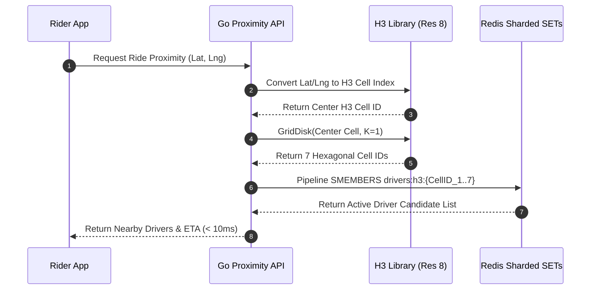

---

title: "Uber H3 Geospatial Indexing: Find Nearest Driver in <100ms with Redis (Production Guide)"
slug: "part-2-geospatial-indexing"
date: "2026-05-06T20:00:00+07:00"
lastmod: "2026-06-26T21:00:00+07:00"
draft: false
description: "How Uber and Grab find the nearest driver in <100ms: H3 hexagonal grid at Resolution 8, Redis GEO vs SET+H3, K-Ring search, S2 Geometry, and a complete Go"
weight: 3
categories: ["Ride Hailing", "Geospatial"]
tags: ["ride-hailing", "geospatial", "h3", "redis", "uber"]
mermaid: true
cover:
  image: "images/posts/real-time-ride-hailing-cover.png"
  alt: "Real-Time Ride-Hailing Architecture series: Uber and Grab — matching, GPS, WebSocket at scale"
  relative: false
author: "Lê Tuấn Anh"
canonicalURL: "https://tanhdev.com/series/ride-hailing-realtime-architecture/part-2-geospatial-indexing/"
ShowToc: true
TocOpen: true
---

> **Executive Summary & Quick Answer**: Uber and Grab find the nearest available driver in under 100ms by dividing the Earth's surface into hexagonal cells (H3 index at Resolution 8, each ~0.74 km²). Instead of calculating distance to every driver, they look up only the 7 cells nearest to the rider — reducing millions of comparisons to dozens.

---

## The Problem: Finding a Needle in a Haystack

When you tap "Book" on Grab or Uber, the platform backend must discover every available driver within a radius of 2 to 3 kilometers in under 10 milliseconds. However, the system is actively tracking millions of concurrent drivers.

Executing a naive database query — calculating straight-line distance from the rider to **every** registered driver in PostgreSQL using PostGIS — is computationally impossible at scale:

```sql
-- The Naive Approach (Brute Force):
SELECT * FROM drivers
WHERE ST_Distance(driver_location, rider_location) < 2000 -- 2km
ORDER BY ST_Distance(driver_location, rider_location);
```

With 5,000,000 active drivers across a continent, evaluating 5,000,000 floating-point Haversine distance equations per trip request exhausts CPU cores and causes multi-second database connection pool queuing.

The solution: **Spatial Indexing**. By partitioning the surface of the Earth into discrete spatial grid cells, systems index driver positions into in-memory hash sets, reducing the search space from 5 million candidates to under 50 in sub-millisecond lookup times.



---

## Method 1: Geohash & Bounding Box Spatial Partitioning

**Geohash** encodes two-dimensional latitude and longitude coordinates into a single Base32 alphanumeric string (e.g. `w3gvk1e7`). Geohash partitions the world recursively using a quadtree hierarchy into rectangular bounding boxes.

```text
Coordinates: 10.7769, 106.7009 (District 1, Ho Chi Minh City)
Geohash: w3gvk1   (cell ~1.2km × 0.6km)
         w3gvk1e  (cell ~153m × 153m)
         w3gvk1e7 (cell ~38m × 19m)

Prefix Sharing Characteristic:
  w3gvk1e  ← Cells sharing a prefix are located near each other
  w3gvk1f
  w3gvk1g
```

### Key Advantages
- **Prefix Matching:** Nearby points frequently share matching string prefixes, enabling indexed SQL queries (`WHERE geohash LIKE 'w3gvk1%'`).
- **Redis Native Integration:** Redis uses 52-bit Geohashes internally inside its Sorted Set `GEOADD` and `GEOSEARCH` primitives.

### The Boundary Edge Problem & Distance Distortion
Geohash partitions the map into rectangular grids. Two drivers standing 10 meters apart across a boundary line will produce entirely different string prefixes. A query searching strictly for prefix `w3gvk1` will fail to detect a driver standing at `w3gvk3` just across the street.

To prevent edge drops, query pipelines must fetch the **target cell plus its 8 surrounding neighbors** (a $3 \times 3$ grid of 9 cells). Furthermore, rectangular cells stretch geographically as latitude moves toward the poles, creating severe distance distortion.

---

## Method 2: H3 — Uber's Hexagonal Hierarchical Grid

To overcome the spatial distortion of rectangular Geohashes, Uber engineered **H3** (Hexagonal Hierarchical Spatial Index). H3 projects an icosahedron onto the Earth's sphere, partitioning the surface into regular hexagonal cells.

### Why Hexagons Outperform Squares
The fundamental geometric advantage of hexagons over squares or triangles is **Neighbor Equidistance**:

```text
Square Grid Distortion (Geohash):       Hexagonal Grid Uniformity (H3):

┌────┬────┬────┐                           ╱╲    ╱╲
│    │    │    │                          ╱  ╲  ╱  ╲
│  d2│  d1│  d2│                         │ d1 ││ d1 │
│    │    │    │                          ╲  ╱  ╲  ╱
├────┼────┼────┤                           ╲╱    ╲╱
│  d1│  ● │  d1│                           ╱╲  ● ╱╲
│    │    │    │                          │ d1 ││ d1 │
├────┼────┼────┤                          ╲  ╱  ╲  ╱
│  d2│  d1│  d2│                           ╲╱    ╲╱
└────┴────┴────┘                           ╱╲    ╱╲
                                          │ d1 ││ d1 │
d1 = edge distance                        ╲  ╱  ╲  ╱
d2 = corner distance (d2 = d1 * √2)        ╲╱    ╲╱
                                      All 6 neighbors are at 
                                      EXACTLY distance d1!
```

- **Square Grids:** Feature 4 orthogonal neighbors at distance $d_1$ and 4 diagonal neighbors at distance $d_2 = d_1 \sqrt{2} \approx 1.414 d_1$. This 41% distance discrepancy introduces directional bias into radius search algorithms.
- **Hexagonal Grids:** All 6 adjacent neighbors share the exact same distance $d_1$ between cell centroids. Neighbor traversal forms smooth, isotropic circles.

### H3 Resolution Hierarchy (0 to 15)

H3 supports 16 resolution levels. Uber uses specific resolutions for distinct architectural subsystems:

| Resolution | Average Hexagon Area | Edge Length | Subsystem Application |
| :--- | :--- | :--- | :--- |
| **Res 0** | 4,357,449 km² | 1,107 km | Global continental aggregation |
| **Res 4** | 1,770 km² | 22.6 km | Regional dispatch & city limits |
| **Res 7** | 5.16 km² | 1.22 km | **Surge Pricing & Heatmap Aggregation** |
| **Res 8** | 0.737 km² | 0.461 km | **Driver Matching & Proximity Search** |
| **Res 9** | 0.105 km² | 0.174 km | Precise walking pickup point matching |
| **Res 12** | 0.003 km² | 0.029 km | Street-level parking slot indexing |

### K-Ring Traversal Complexity ($3k(k+1)+1$)
A **K-Ring** (or `GridDisk`) expands outward from a central hexagon by $K$ concentric rings of cells. The total number of hexagonal cells $N$ in a K-Ring is calculated mathematically as:

$$N(K) = 1 + 6 \sum_{i=1}^{K} i = 1 + 3K(K+1)$$

- **$K=0$ (Center cell):** $1$ cell (~0.74 km²).
- **$K=1$ (1st Ring):** $1 + 3(1)(2) = 7$ cells (~5.16 km²).
- **$K=2$ (2nd Ring):** $1 + 3(2)(3) = 19$ cells (~14.00 km²).
- **$K=3$ (3rd Ring):** $1 + 3(3)(4) = 37$ cells (~27.26 km²).

To find nearby drivers, the API converts a rider's GPS location into an H3 Resolution 8 index, retrieves the 7 cell IDs ($K=1$), and executes a multi-key pipeline lookup in Redis.

### Production Go Implementation with H3 v4 & Redis Pipeline

```go
package main

import (
	"context"
	"fmt"
	"time"

	"github.com/go-redis/redis/v8"
	"github.com/uber/h3-go/v4"
)

type ProximityService struct {
	rdb *redis.Client
}

func NewProximityService(rdb *redis.Client) *ProximityService {
	return &ProximityService{rdb: rdb}
}

// FindNearbyDrivers retrieves driver IDs in < 10ms using H3 K-Ring Redis pipeline
func (s *ProximityService) FindNearbyDrivers(ctx context.Context, riderLat, riderLng float64, kRingSteps int) ([]string, error) {
	// 1. Convert Lat/Lng to H3 Resolution 8 cell index
	centerCell := h3.LatLngToCell(h3.LatLng{Lat: riderLat, Lng: riderLng}, 8)

	// 2. Obtain K-Ring cell IDs (K=1 gives 7 cells)
	searchCells := h3.GridDisk(centerCell, kRingSteps)

	// 3. Pipeline SMEMBERS calls to Redis sharded SETs
	pipe := s.rdb.Pipeline()
	cmds := make([]*redis.StringSliceCmd, len(searchCells))

	for i, cell := range searchCells {
		key := fmt.Sprintf("drivers:h3:%s", cell.String())
		cmds[i] = pipe.SMembers(ctx, key)
	}

	_, err := pipe.Exec(ctx)
	if err != nil && err != redis.Nil {
		return nil, fmt.Errorf("redis pipeline failed: %w", err)
	}

	// 4. Aggregate driver IDs
	driverSet := make(map[string]struct{})
	for _, cmd := range cmds {
		for _, driverID := range cmd.Val() {
			driverSet[driverID] = struct{}{}
		}
	}

	drivers := make([]string, 0, len(driverSet))
	for id := range driverSet {
		drivers = append(drivers, id)
	}

	return drivers, nil
}

func main() {
	rdb := redis.NewClient(&redis.Options{Addr: "localhost:6379"})
	svc := NewProximityService(rdb)

	ctx, cancel := context.WithTimeout(context.Background(), 5*time.Second)
	defer cancel()

	// Locate drivers near District 1, HCMC (10.7769, 106.7009)
	drivers, err := svc.FindNearbyDrivers(ctx, 10.7769, 106.7009, 1)
	if err != nil {
		fmt.Printf("Proximity Search Error: %v\n", err)
		return
	}

	fmt.Printf("[H3 Search Result] Found %d active drivers in 7 H3 cells!\n", len(drivers))
}
```

---

## Method 3: Google S2 Geometry & 64-Bit Hilbert Curves

**Google S2 Geometry** projects the Earth onto a cube, mapping each face with a space-filling **Hilbert Curve**. S2 represents every spatial cell as a single **64-bit integer (`uint64`)**.

### Advantages of S2 64-Bit Integers
- **Memory Efficiency:** Storing 64-bit integers in Go maps or Redis Bitmaps consumes 50% less RAM than storing 15-character H3 string keys.
- **Fast Comparisons & Sorting:** Integer comparisons (`cellA < cellB`) execute in 1 CPU clock cycle.
- **Used By:** Google Maps, MongoDB Geospatial indexes, Foursquare, and Lyft.

```go
import "github.com/golang/geo/s2"

// S2: Find all 64-bit Cell IDs covering a 2km radius from a coordinate point
func GetS2CoveringCells(lat, lng float64, radiusMeters float64) []s2.CellID {
	center := s2.PointFromLatLng(s2.LatLngFromDegrees(lat, lng))
	angle := s2.Angle(radiusMeters / 6371000.0) // Earth radius in meters
	cap := s2.CapFromCenterAngle(center, angle)

	coverer := &s2.RegionCoverer{
		MinLevel: 13,
		MaxLevel: 15,
		MaxCells: 20,
	}
	return coverer.Covering(cap)
}
```

---

## Sharded Redis SETs vs Single Redis GEO Key

When designing high-concurrency Redis spatial architectures:

| Metric | Single Redis GEO Key (`GEOADD`) | Sharded H3 Redis SETs (`SMEMBERS`) |
| :--- | :--- | :--- |
| **Data Structure** | Single Sorted Set (ZSET) | Thousands of Sharded SETs |
| **Write Lock Scope** | Locks single ZSET key under high write IOPS | Locks individual H3 cell key |
| **Cluster Scaling** | Un-shardable (single Redis node CPU bottleneck) | Horizontally distributed across Redis Cluster slots |
| **Query Latency** | $O(\log N + M)$ | $O(1)$ per cell key lookup |

By partitioning driver updates into separate Redis SET keys by H3 Cell ID (`drivers:h3:8865b5962bffff`), write traffic scales linearly across 64 Redis cluster nodes.

---

## Frequently Asked Questions (FAQ)


Hexagonal cells have a constant distance between the center of a cell and the centers of all its adjacent neighbors. This uniform neighbor distance simplifies radius searches and dynamic calculations, whereas square grids suffer from diagonal distance distortion.



K-Ring level 2 calculates the origin H3 cell plus two concentric rings of surrounding hexagons, yielding a total of 19 cells ($3 \times 2 \times 3 + 1 = 19$). Querying these 19 Redis keys covers a ~2km search radius.



A single Redis GEO key stores all driver locations in one Sorted Set, creating CPU bottlenecks and cluster resharding friction. Sharding each H3 cell into a separate Redis SET key distributes write IOPS evenly across cluster nodes.



Resolution 8 (average cell area ~0.74 km², edge length ~461 meters) is the global industry standard for driver matching, balancing spatial precision with query fan-out complexity.


---

## Navigation & Next Steps

- **Previous Part:** [Part 1 — Location Ingestion](/series/ride-hailing-realtime-architecture/part-1-location-ingestion/)
- **Series Index:** Return to [Ride-Hailing Architecture Executive Summary](/series/ride-hailing-realtime-architecture/executive-summary/)
- **Related Guides:** [Go Spatial Indexing Masterclass](/series/routing-geospatial-architecture/part-3-spatial-indexing/) and [Redis Caching Strategies](/series/system-design/03-caching-strategies-redis-golang/)

Need help implementing high-scale spatial indexing or Redis cluster sharding? [Get in touch](/hire/) or [hire our senior backend engineers](/hire/) for an architectural evaluation.

- [Google S2 Geometry Library](https://s2geometry.io/)
- **Self-hosted routing:** The same H3 hexagonal indexing used here for driver proximity is also the caching layer for [GraphHopper Distance Matrix in production](/posts/graphhopper-distance-matrix-production-guide/) — replacing Google Maps API at $510/day.

> *Next, we will delve into the backbone of the entire system — Apache Kafka — where every GPS event, ride request, and acceptance flows. Continue reading [Part 3 — Event Streaming: The Apache Kafka & Flink Backbone](/series/ride-hailing-realtime-architecture/part-3-event-streaming-kafka/).*


