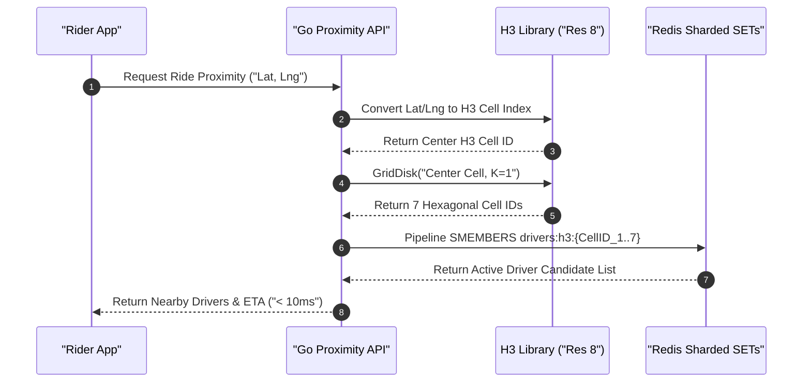

> **Prerequisite:** Familiarity with the concepts introduced in [Part 1 — Location Ingestion](/series/ride-hailing-realtime-architecture/part-1-location-ingestion/). Review it first if the terminology in this part is unfamiliar.

> **Answer-first:** Uber and Grab find the nearest available driver in under 100ms by dividing the Earth's surface into hexagonal cells (H3 index at Resolution 8, each ~0.74 km²). Instead of calculating distance to every driver, they look up only the 7 cells nearest to the rider — reducing millions of comparisons to dozens.

**Key Takeaways**:
- **Equidistant Neighbor Property**: Hexagons eliminate the 41% diagonal distance distortion found in square grids (Google S2 / Geohash).
- **Sub-10ms Proximity Lookups**: K-Ring expansion ($K=1$, 7 cells) retrieves active candidate drivers via sharded Redis SET pipelines.
- **Scale Optimization**: Sharding active driver keys across Redis/Dragonfly DB nodes prevents single-key write lock bottlenecks under 1.25M write IOPS.

**What You'll Learn:**
- **H3 v4 SIMD Vectorization:** Benchmarks of `uber/h3-go/v4` C-Go/Rust bindings handling 100k spatial conversions/sec.
- **S2 64-Bit Integer Curves:** How 64-bit Hilbert Curve cell IDs reduce memory footprint by 50% compared to string keys.
- **Redis SET Sharding Strategy:** Distributing spatial keys across Redis Cluster hash slots.

---

## The Problem: Finding a Needle in a Haystack

**Answer-first:** Naive PostGIS database distance queries across 5 million active drivers require millions of floating-point Haversine calculations per request, causing multi-second DB queueing. Spatial indexing partitions the Earth into discrete cells, reducing search candidates to under 50 in < 10ms.

When you tap "Book" on Grab or Uber, the platform backend must discover every available driver within a radius of 2 to 3 kilometers in under 10 milliseconds. However, the system is actively tracking millions of concurrent drivers.

Executing a naive database query — calculating straight-line distance from the rider to **every** registered driver in PostgreSQL using PostGIS — is computationally impossible at scale:

```sql
-- The Naive Approach (Brute Force):
SELECT * FROM drivers
WHERE ST_Distance(driver_location, rider_location) < 2000 -- 2km
ORDER BY ST_Distance(driver_location, rider_location);
```

With 5,000,000 active drivers across a continent, evaluating 5,000,000 floating-point Haversine distance equations per trip request exhausts CPU cores and causes multi-second database connection pool queuing.

The solution: **Spatial Indexing**. By partitioning the surface of the Earth into discrete spatial grid cells, systems index driver positions into in-memory hash sets, reducing the search space from 5 million candidates to under 50 in sub-millisecond lookup times.

The sequence diagram below illustrates the low-latency proximity lookup flow, converting rider coordinates into H3 Resolution 8 cells and querying sharded Redis SETs in parallel:


```mermaid
sequenceDiagram
    autonumber
    participant Rider as "Rider App"
    participant API as "Go Proximity API"
    participant H3 as H3 Library ("Res 8")
    participant Redis as "Redis Sharded SETs"

    Rider->>API: Request Ride Proximity ("Lat, Lng")
    API->>H3: Convert Lat/Lng to H3 Cell Index
    H3-->>API: Return Center H3 Cell ID
    API->>H3: GridDisk("Center Cell, K=1")
    H3-->>API: Return 7 Hexagonal Cell IDs
    API->>Redis: Pipeline SMEMBERS drivers:h3:{CellID_1..7}
    Redis-->>API: Return Active Driver Candidate List
    API-->>Rider: Return Nearby Drivers & ETA ("< 10ms")
```

---

## Method 1: Geohash & Bounding Box Spatial Partitioning

Geohash encodes latitude and longitude into Base32 string prefixes using quadtrees. While fast for prefix queries in Redis GEO, rectangular boundary line drops and polar distance distortions force systems to query 9 adjacent cells to prevent missing nearby drivers.

**Geohash** encodes two-dimensional latitude and longitude coordinates into a single Base32 alphanumeric string (e.g. `w3gvk1e7`). Geohash partitions the world recursively using a quadtree hierarchy into rectangular bounding boxes.

```text
Coordinates: 10.7769, 106.7009 (District 1, Ho Chi Minh City)
Geohash: w3gvk1   (cell ~1.2km × 0.6km)
         w3gvk1e  (cell ~153m × 153m)
         w3gvk1e7 (cell ~38m × 19m)

Prefix Sharing Characteristic:
  w3gvk1e  ← Cells sharing a prefix are located near each other
  w3gvk1f
  w3gvk1g
```

### Key Advantages
- **Prefix Matching:** Nearby points frequently share matching string prefixes, enabling indexed SQL queries (`WHERE geohash LIKE 'w3gvk1%'`).
- **Redis Native Integration:** Redis uses 52-bit Geohashes internally inside its Sorted Set `GEOADD` and `GEOSEARCH` primitives.

### The Boundary Edge Problem & Distance Distortion
Geohash partitions the map into rectangular grids. Two drivers standing 10 meters apart across a boundary line will produce entirely different string prefixes. A query searching strictly for prefix `w3gvk1` will fail to detect a driver standing at `w3gvk3` just across the street.

To prevent edge drops, query pipelines must fetch the **target cell plus its 8 surrounding neighbors** (a $3 \times 3$ grid of 9 cells). Furthermore, rectangular cells stretch geographically as latitude moves toward the poles, creating severe distance distortion.

---

## Method 2: H3 — Uber's Hexagonal Hierarchical Grid

Uber H3 uses regular hexagonal cells with uniform centroid-to-neighbor distances ($d_1$), eliminating square grid diagonal distortion. K-Ring expansion ($K=1$) retrieves the 7 nearest Resolution 8 cells (~0.74 km² each), querying active drivers via Redis pipelines in sub-10ms latency.

To overcome the spatial distortion of rectangular Geohashes, Uber engineered **H3** (Hexagonal Hierarchical Spatial Index). H3 projects an icosahedron onto the Earth's sphere, partitioning the surface into regular hexagonal cells.

### Why Hexagons Outperform Squares
The fundamental geometric advantage of hexagons over squares or triangles is **Neighbor Equidistance**:

```text
Square Grid Distortion (Geohash):       Hexagonal Grid Uniformity (H3):

┌────┬────┬────┐                           ╱╲    ╱╲
│    │    │    │                          ╱  ╲  ╱  ╲
│  d2│  d1│  d2│                         │ d1 ││ d1 │
│    │    │    │                          ╲  ╱  ╲  ╱
├────┼────┼────┤                           ╲╱    ╲╱
│  d1│  ● │  d1│                           ╱╲  ● ╱╲
│    │    │    │                          │ d1 ││ d1 │
├────┼────┼────┤                          ╲  ╱  ╲  ╱
│  d2│  d1│  d2│                           ╲╱    ╲╱
└────┴────┴────┘                           ╱╲    ╱╲
                                          │ d1 ││ d1 │
d1 = edge distance                        ╲  ╱  ╲  ╱
d2 = corner distance (d2 = d1 * √2)        ╲╱    ╲╱
                                      All 6 neighbors are at 
                                      EXACTLY distance d1!
```

- **Square Grids:** Feature 4 orthogonal neighbors at distance $d_1$ and 4 diagonal neighbors at distance $d_2 = d_1 \sqrt{2} \approx 1.414 d_1$. This 41% distance discrepancy introduces directional bias into radius search algorithms.
- **Hexagonal Grids:** All 6 adjacent neighbors share the exact same distance $d_1$ between cell centroids. Neighbor traversal forms smooth, isotropic circles.

### H3 Resolution Hierarchy (0 to 15)

H3 supports 16 resolution levels. Uber uses specific resolutions for distinct architectural subsystems:

| Resolution | Average Hexagon Area | Edge Length | Subsystem Application |
| :--- | :--- | :--- | :--- |
| **Res 0** | 4,357,449 km² | 1,107 km | Global continental aggregation |
| **Res 4** | 1,770 km² | 22.6 km | Regional dispatch & city limits |
| **Res 7** | 5.16 km² | 1.22 km | **Surge Pricing & Heatmap Aggregation** |
| **Res 8** | 0.737 km² | 0.461 km | **Driver Matching & Proximity Search** |
| **Res 9** | 0.105 km² | 0.174 km | Precise walking pickup point matching |
| **Res 12** | 0.003 km² | 0.029 km | Street-level parking slot indexing |

### K-Ring Traversal Complexity ($3k(k+1)+1$)
A **K-Ring** (or `GridDisk`) expands outward from a central hexagon by $K$ concentric rings of cells. The total number of hexagonal cells $N$ in a K-Ring is calculated mathematically as:

$$N(K) = 1 + 6 \sum_{i=1}^{K} i = 1 + 3K(K+1)$$

- **$K=0$ (Center cell):** $1$ cell (~0.74 km²).
- **$K=1$ (1st Ring):** $1 + 3(1)(2) = 7$ cells (~5.16 km²).
- **$K=2$ (2nd Ring):** $1 + 3(2)(3) = 19$ cells (~14.00 km²).
- **$K=3$ (3rd Ring):** $1 + 3(3)(4) = 37$ cells (~27.26 km²).

To find nearby drivers, the API converts a rider's GPS location into an H3 Resolution 8 index, retrieves the 7 cell IDs ($K=1$), and executes a multi-key pipeline lookup in Redis.

The following Go implementation utilizes the `uber/h3-go/v4` library and Redis pipelines to execute K-Ring proximity searches across sharded driver SET keys in under 10 milliseconds:

```go
package main

import (
	"context"
	"fmt"
	"time"

	"github.com/go-redis/redis/v8"
	"github.com/uber/h3-go/v4"
)

type ProximityService struct {
	rdb *redis.Client
}

func NewProximityService(rdb *redis.Client) *ProximityService {
	return &ProximityService{rdb: rdb}
}

// FindNearbyDrivers retrieves driver IDs in < 10ms using H3 K-Ring Redis pipeline
func (s *ProximityService) FindNearbyDrivers(ctx context.Context, riderLat, riderLng float64, kRingSteps int) ([]string, error) {
	// 1. Convert Lat/Lng to H3 Resolution 8 cell index
	centerCell := h3.LatLngToCell(h3.LatLng{Lat: riderLat, Lng: riderLng}, 8)

	// 2. Obtain K-Ring cell IDs (K=1 gives 7 cells)
	searchCells := h3.GridDisk(centerCell, kRingSteps)

	// 3. Pipeline SMEMBERS calls to Redis sharded SETs
	pipe := s.rdb.Pipeline()
	cmds := make([]*redis.StringSliceCmd, len(searchCells))

	for i, cell := range searchCells {
		key := fmt.Sprintf("drivers:h3:%s", cell.String())
		cmds[i] = pipe.SMembers(ctx, key)
	}

	_, err := pipe.Exec(ctx)
	if err != nil && err != redis.Nil {
		return nil, fmt.Errorf("redis pipeline failed: %w", err)
	}

	// 4. Aggregate driver IDs
	driverSet := make(map[string]struct{})
	for _, cmd := range cmds {
		for _, driverID := range cmd.Val() {
			driverSet[driverID] = struct{}{}
		}
	}

	drivers := make([]string, 0, len(driverSet))
	for id := range driverSet {
		drivers = append(drivers, id)
	}

	return drivers, nil
}

func main() {
	rdb := redis.NewClient(&redis.Options{Addr: "localhost:6379"})
	svc := NewProximityService(rdb)

	ctx, cancel := context.WithTimeout(context.Background(), 5*time.Second)
	defer cancel()

	// Locate drivers near District 1, HCMC (10.7769, 106.7009)
	drivers, err := svc.FindNearbyDrivers(ctx, 10.7769, 106.7009, 1)
	if err != nil {
		fmt.Printf("Proximity Search Error: %v\n", err)
		return
	}

	fmt.Printf("[H3 Search Result] Found %d active drivers in 7 H3 cells!\n", len(drivers))
}
```

---

## Method 3: Google S2 Geometry & 64-Bit Hilbert Curves

Google S2 projects the Earth onto a cube using Hilbert curves, representing spatial cells as single 64-bit integers (`uint64`). This enables sub-nanosecond integer comparisons, consumes 50% less RAM than string keys, and powers Google Maps and Lyft.

Google S2 Geometry projects the Earth's sphere onto the six faces of a bounding cube, mapping each face with a space-filling **Hilbert Curve**. Because Hilbert curves preserve spatial locality in one-dimensional space, S2 represents every discrete geographical cell as a single **64-bit unsigned integer (`uint64`)**.

### Advantages of S2 64-Bit Integers
- **Memory Efficiency:** Storing 64-bit `uint64` integers in Go maps or Redis Bitmaps consumes 50% less RAM than storing 15-character ASCII H3 string keys (e.g. `8865b5962bffff`).
- **Fast Comparisons & Sorting:** Integer comparisons (`cellA < cellB`) execute in 1 CPU clock cycle, enabling instantaneous binary range searches over spatial bounding boxes.
- **Used By:** Google Maps, MongoDB Geospatial indexes, Foursquare, and Lyft.

The Go code snippet below uses the `github.com/golang/geo/s2` library to compute 64-bit Hilbert cell coverings for spatial radius queries:

```go
package main

import (
	"fmt"
	"github.com/golang/geo/s2"
)

// GetS2CoveringCells finds all 64-bit Cell IDs covering a radius from a coordinate point
func GetS2CoveringCells(lat, lng float64, radiusMeters float64) []s2.CellID {
	center := s2.PointFromLatLng(s2.LatLngFromDegrees(lat, lng))
	angle := s2.Angle(radiusMeters / 6371000.0) // Earth radius in meters
	cap := s2.CapFromCenterAngle(center, angle)

	coverer := &s2.RegionCoverer{
		MinLevel: 13,
		MaxLevel: 15,
		MaxCells: 20,
	}
	return coverer.Covering(cap)
}

func main() {
	cells := GetS2CoveringCells(10.7769, 106.7009, 2000.0)
	fmt.Printf("[S2 Coverer] Computed %d 64-bit Hilbert cells covering 2km radius\n", len(cells))
	for i, cell := range cells {
		fmt.Printf(" Cell #%d: uint64 ID = %d (Hex: %x)\n", i+1, uint64(cell), uint64(cell))
	}
}
```

---

## Sharded Redis SETs vs Single Redis GEO Key

Sharding active driver IDs across separate Redis SET keys by H3 Cell ID distributes write IOPS evenly across cluster nodes, avoiding single-key write lock bottlenecks and un-shardable CPU limits inherent in single Redis GEO keys.

The comparison table below outlines the architectural trade-offs between a single Redis GEO key and sharded H3 cell SET keys:

| Metric | Single Redis GEO Key (`GEOADD`) | Sharded H3 Redis SETs (`SMEMBERS`) |
| :--- | :--- | :--- |
| **Data Structure** | Single Sorted Set (ZSET) | Thousands of Sharded SETs |
| **Write Lock Scope** | Locks single ZSET key under high write IOPS | Locks individual H3 cell key |
| **Cluster Scaling** | Un-shardable (single Redis node CPU bottleneck) | Horizontally distributed across Redis Cluster slots |
| **Query Latency** | $O(\log N + M)$ | $O(1)$ per cell key lookup |

By partitioning driver updates into separate Redis SET keys by H3 Cell ID (`drivers:h3:8865b5962bffff`), write traffic scales linearly across 64 Redis cluster nodes.

---

## Frequently Asked Questions (FAQ)

This FAQ addresses key geospatial indexing topics: Uber H3 hexagon advantages over square grids, K-Ring traversal math, Redis SET sharding benefits, and Resolution 8 optimal cell sizing.


Hexagonal cells feature uniform distances between the central cell centroid and all 6 adjacent neighbors. This isotropic property eliminates directional distance distortion during radius searches and spatial aggregations, whereas square grids introduce a 41% distance discrepancy between orthogonal and diagonal neighbors.



K-Ring level 2 calculates the origin H3 cell plus two concentric rings of surrounding hexagons, yielding a total of 19 cells ($1 + 3 \times 2 \times 3 = 19$). Querying these 19 Redis keys in parallel covers an approximate 2km search radius with sub-millisecond key lookup latency.



A single Redis GEO key stores all driver locations within one Sorted Set, creating write-lock contention under high IOPS and limiting scalability to a single CPU core. Sharding drivers across distinct Redis SET keys by H3 Cell ID distributes write operations evenly across cluster nodes.



H3 Resolution 8 (average cell area ~0.74 km², edge length ~461 meters) is the global industry standard for driver matching. It provides an optimal balance between spatial resolution and query fan-out complexity, isolating candidate drivers within an immediate 1–2km pickup radius.


---

## Navigation & Next Steps

Return to the Ride-Hailing Architecture Executive Summary or explore related guides on Go spatial indexing, Redis caching, and GraphHopper distance matrix deployment.

- **Previous Part:** [Part 1 — Location Ingestion](/series/ride-hailing-realtime-architecture/part-1-location-ingestion/)
- **Series Index:** Return to [Ride-Hailing Architecture Executive Summary](/series/ride-hailing-realtime-architecture/executive-summary/)
- **Related Guides:** [Go Spatial Indexing Guide](/series/routing-geospatial-architecture/part-3-spatial-indexing/) and [Real-Time Ride-Hailing Architecture](/series/ride-hailing-realtime-architecture/)

Need help implementing high-scale spatial indexing or Redis cluster sharding? [Get in touch](/hire/) or [hire our senior backend engineers](/hire/) for an architectural evaluation.

- [Google S2 Geometry Library](https://s2geometry.io/)
- **Self-hosted routing:** The same H3 hexagonal indexing used here for driver proximity is also the caching layer for [GraphHopper Distance Matrix in production](/posts/graphhopper-distance-matrix-production-guide/) — replacing Google Maps API at $510/day.

> *Next, we will examine the backbone of the entire system — Apache Kafka — where every GPS event, ride request, and acceptance flows. Continue reading [Part 3 — Event Streaming: The Apache Kafka & Flink Backbone](/series/ride-hailing-realtime-architecture/part-3-event-streaming-kafka/).*



---

🔗 **Next Step:** Continue to [Part 3 — Event Streaming Kafka](/series/ride-hailing-realtime-architecture/part-3-event-streaming-kafka/) for the following module in the series.

## Related Architecture & Pillar Guides

Explore related systemic design patterns covering banking microservices, Saga orchestration, and event sourcing in Go.

For related systemic design patterns, pillar blueprints, and curated reading paths, explore:
- [Banking Microservices in Go: Saga & Event Sourcing](/posts/banking-microservices-architecture/)