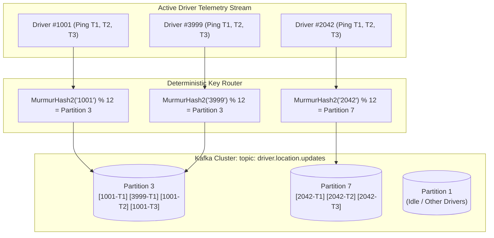
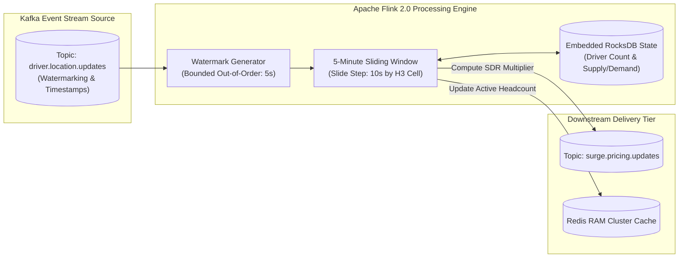
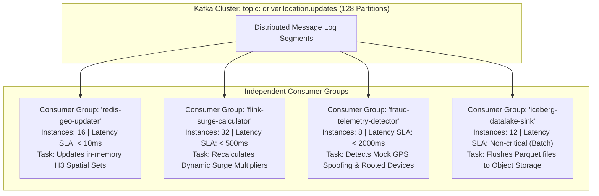

> **Prerequisite:** Familiarity with the concepts introduced in [Part 2 — Geospatial Indexing](/series/ride-hailing-realtime-architecture/part-2-geospatial-indexing/). Review our high-throughput distributed systems case studies in [Alipay Double 11 Extreme TPS Architecture](/posts/alipay-double-11-architecture-tps/) to understand extreme scale queuing theory.

> **Answer-first:** Apache Kafka and Flink form the distributed event-streaming backbone of ride-hailing architectures, processing millions of telemetry pings per second with sub-50ms latency. Deterministic partition keying by driver ID preserves strict chronological trajectory ordering, while Flink sliding windows aggregate real-time supply-demand metrics to compute dynamic surge pricing and monitor fleet health.

**Key Architectural Takeaways:**
- **Deterministic Trajectory Serialization**: Partitioning Kafka topic records via `MurmurHash2(driver_id)` or `FNV-1a(driver_id)` guarantees that every sequential GPS coordinate emitted by a driver lands on the exact same partition, preserving causal chronology without cross-node locking.
- **Hot-Partition Mitigation via Key Salting**: When localized sporting events or airport congestion causes severe traffic skews on specific partition keys, dynamic composite key salting (`driver_id:salt_N`) spreads load across multiple parallel broker partitions.
- **Sub-Second Stream Aggregation with Flink 2.0**: Utilizing Apache Flink sliding windows backed by RocksDB state storage allows systems to continuously evaluate supply-demand ratios across Uber H3 hexagonal cells with sub-second recalculation latencies.
- **Consumer Group Workload Isolation**: Decoupling latency-critical operational consumers (Redis in-memory spatial index updaters) from throughput-heavy offline analytics pipelines (Apache Iceberg data lakes) prevents analytics backlogs from degrading real-time dispatch.

---

## Why Event Streaming is Mandatory for Real-Time Mobility

In a planetary-scale ride-hailing platform, the state of the marketplace fluctuates constantly across hundreds of micro-events every millisecond:
- Driver 1042 transmits a 4-second GPS telemetry update.
- Passenger 8911 opens the mobile app and requests a premium comfort ride.
- Driver 3120 accepts a dispatched ride offer and begins navigating to the pickup pin.
- Passenger 4502 cancels a requested ride after waiting 90 seconds.
- The surge pricing engine updates the fare multiplier for Downtown District 1.

If these disparate microservices communicated through synchronous HTTP/REST or direct RPC calls, the system would suffer from severe tight coupling. A transient network hiccup or garbage collection pause in a downstream billing or analytics service would cascade upstream, exhausting thread pools and causing location ingestion gateways to drop incoming telemetry.

An **Event-Driven Architecture** eliminates this fragility: every state transition, telemetry ping, and trip lifecycle mutation is appended immutably to a distributed, ordered event log managed by **Apache Kafka 3.8+ or Redpanda** in KRaft mode. Upstream ingestion gateways produce records at line speed, while downstream microservices consume and process records asynchronously at their own independent cadence.

```
Synchronous REST (Fragile):
Gateway ──[HTTP]──> LocationSvc ──[HTTP]──> Redis ──[HTTP]──> Billing (Fails -> Cascade!)

Asynchronous Event Streaming (Resilient):
Gateway ──> Kafka Topic [driver.location.updates]
                 ├── Consumer Group A: Redis Spatial Cache (P99 < 5ms)
                 ├── Consumer Group B: Flink Surge Engine (Sliding Window)
                 └── Consumer Group C: Iceberg Data Lake (Batch Parquet)
```

---

## Kafka Topic Design & Partition Routing Strategy

Designing an event-streaming backbone for millions of concurrent vehicles requires a meticulously partitioned topic hierarchy:

| Topic Name | Primary Producer | Dominant Consumer Groups | Partition Key Strategy | Retention Window |
| :--- | :--- | :--- | :--- | :--- |
| `driver.location.updates` | Location Ingestion Gateway | Redis H3 Updater, Flink Surge Engine, ML Trajectory | `driver_id` (Deterministic) | 2 hours (NVMe / RAM buffer) |
| `ride.requests` | Trip Demand Service | DISCO Matching Engine, Dynamic Pricing | `h3_cell_id` or `rider_id` | 24 hours |
| `ride.dispatched` | DISCO Matching Engine | RAMEN Push Gateway, Driver Offer Tracker | `driver_id` | 12 hours |
| `ride.status.events` | Trip Lifecycle Service | Payment Engine, Driver Ledger, Notifications | `trip_id` | 7 days (Compacted) |
| `surge.pricing.multipliers` | Flink Stream Engine | Pricing Cache, Rider/Driver API Gateways | `h3_cell_id` (Res 7) | 1 hour |

### Deterministic Partition Keying
Kafka divides each topic into multiple distributed partitions. Within an individual partition, Kafka guarantees strict total ordering. By assigning `driver_id` as the partition key, the producer calculates partition placement using MurmurHash2:

$$\text{Partition ID} = \left| \text{MurmurHash2}(\text{driver\_id}) \right| \pmod{\text{NumPartitions}}$$

The diagram below traces how deterministic key hashing distributes telemetry across broker partitions while preserving sequence integrity:



Because Driver 1001's pings always route to Partition 3, downstream consumers process sequential telemetry without requiring distributed mutexes or out-of-order reassembly buffers.

### The Hot-Partition Defect & Composite Key Salting
When massive crowds exit a stadium or concert arena, hundreds of thousands of requests cluster within a localized geographic boundary. If topics were naively partitioned by geographic region (`h3_cell_id`), an enormous spike in traffic would overwhelm the single broker partition hosting that cell, while adjacent cluster brokers remain idle.

To resolve hot-partition bottlenecks, producers implement **Composite Key Salting**:

$$\text{Salted Key} = \text{h3\_cell\_id} + \text{":"} + \text{rand}(0, S-1)$$

Where $S$ is the salting factor (typically 4 to 8). Salted events distribute across $S$ distinct Kafka partitions. Downstream stream processing workers in Apache Flink consume from all salted sub-partitions and merge results using short-term in-memory sliding windows.

---

## Stream Processing Architecture: Apache Flink 2.0

Raw location events from Kafka must be enriched, aggregated, and evaluated in real time. **Apache Flink 2.0** provides low-latency, stateful stream computations backed by RocksDB local SSD state storage:

The diagram below illustrates Flink's sliding-window stream processing architecture:



### Flink SQL Continuous Window Aggregation
The Flink SQL implementation below computes real-time supply and demand counters over 5-minute sliding windows (recalculated every 10 seconds) for every H3 spatial cell:

```sql
SELECT 
    h3_cell_id,
    COUNT(DISTINCT CASE WHEN status = 'AVAILABLE' THEN driver_id END) AS active_supply,
    COUNT(DISTINCT CASE WHEN status = 'REQUESTED' THEN rider_id END) AS active_demand,
    CAST(COUNT(DISTINCT CASE WHEN status = 'AVAILABLE' THEN driver_id END) AS FLOAT) / 
        GREATEST(COUNT(DISTINCT CASE WHEN status = 'REQUESTED' THEN rider_id END), 1) AS supply_demand_ratio,
    PROCTIME() AS evaluated_at,
    WINDOW_END AS window_end_time
FROM TABLE(
    HOP(TABLE driver_telemetry_stream, DESCRIPTOR(event_time), INTERVAL '10' SECOND, INTERVAL '5' MINUTE)
)
GROUP BY h3_cell_id, WINDOW_START, WINDOW_END;
```

---

## Consumer Group Isolation Topology

In enterprise architectures, independent business units and services must inspect the exact same real-time location stream without interfering with each other's execution SLAs:



Because each consumer group maintains its own offset checkpoint in Kafka's internal `__consumer_offsets` topic, a slow or backpressured analytics pipeline (CG4) will never degrade or block the mission-critical real-time dispatch cache updater (CG1).

---

## Production Go 1.25+ High-Throughput Kafka Stream Consumer

The production Go implementation below models an enterprise Kafka stream consumer engine. It features zero-allocation batch buffering, simulated partition assignment, Uber H3 spatial cell enrichment, and safe graceful shutdown handling:

```go
package main

import (
	"context"
	"encoding/json"
	"fmt"
	"hash/fnv"
	"log"
	"sync"
	"sync/atomic"
	"time"

	"github.com/uber/h3-go/v4"
)

// DriverTelemetryMessage represents the deserialized Kafka event payload.
type DriverTelemetryMessage struct {
	DriverID  int64     `json:"driver_id"`
	Latitude  float64   `json:"latitude"`
	Longitude float64   `json:"longitude"`
	Status    string    `json:"status"` // "AVAILABLE", "ON_TRIP", "EN_ROUTE"
	SpeedKmh  float32   `json:"speed_kmh"`
	Bearing   float32   `json:"bearing"`
	Timestamp time.Time `json:"timestamp"`
}

// PartitionBatch buffers messages per Kafka partition to allow bulk DB writes.
type PartitionBatch struct {
	PartitionID int
	Messages    []DriverTelemetryMessage
}

// KafkaConsumerEngine orchestrates partition-aware streaming ingestion in Go.
type KafkaConsumerEngine struct {
	partitionCount int
	workerCount    int
	partitionChans []chan DriverTelemetryMessage
	processedPings atomic.Uint64
	committedLag   atomic.Uint64
	spatialCache   sync.Map
}

// NewKafkaConsumerEngine initializes buffered partition channels.
func NewKafkaConsumerEngine(partitions int, workers int, channelBuffer int) *KafkaConsumerEngine {
	engine := &KafkaConsumerEngine{
		partitionCount: partitions,
		workerCount:    workers,
		partitionChans: make([]chan DriverTelemetryMessage, partitions),
	}
	for i := 0; i < partitions; i++ {
		engine.partitionChans[i] = make(chan DriverTelemetryMessage, channelBuffer)
	}
	return engine
}

// RouteMessage routes a message to its deterministic partition channel.
func (e *KafkaConsumerEngine) RouteMessage(msg DriverTelemetryMessage) {
	hasher := fnv.New32a()
	_, _ = fmt.Fprintf(hasher, "%d", msg.DriverID)
	partition := int(hasher.Sum32()) % e.partitionCount

	select {
	case e.partitionChans[partition] <- msg:
	default:
		e.committedLag.Add(1) // Track backpressure / channel saturation
	}
}

// StartWorkers launches parallel partition consumer workers.
func (e *KafkaConsumerEngine) StartWorkers(ctx context.Context, wg *sync.WaitGroup) {
	for p := 0; p < e.partitionCount; p++ {
		wg.Add(1)
		go func(partitionID int) {
			defer wg.Done()
			ch := e.partitionChans[partitionID]
			batch := make([]DriverTelemetryMessage, 0, 64)
			flushTicker := time.NewTicker(25 * time.Millisecond)
			defer flushTicker.Stop()

			flush := func() {
				if len(batch) == 0 {
					return
				}
				// Process batch: resolve H3 cells and update in-memory spatial cache
				for _, m := range batch {
					cell := h3.LatLngToCell(h3.LatLng{Lat: m.Latitude, Lng: m.Longitude}, 8)
					cacheKey := fmt.Sprintf("h3:8:%x", uint64(cell))
					e.spatialCache.Store(m.DriverID, cacheKey)
					e.processedPings.Add(1)
				}
				batch = batch[:0]
			}

			for {
				select {
				case <-ctx.Done():
					flush()
					return
				case msg, ok := <-ch:
					if !ok {
						flush()
						return
					}
					batch = append(batch, msg)
					if len(batch) >= 64 {
						flush()
					}
				case <-flushTicker.C:
					flush()
				}
			}
		}(p)
	}
}

func main() {
	ctx, cancel := context.WithTimeout(context.Background(), 500*time.Millisecond)
	defer cancel()

	const partitions = 16
	const workers = 16
	engine := NewKafkaConsumerEngine(partitions, workers, 10000)

	var wg sync.WaitGroup
	engine.StartWorkers(ctx, &wg)

	// Simulate high-velocity Kafka broker consumption
	startTime := time.Now()
	go func() {
		for i := 1; i <= 25000; i++ {
			msg := DriverTelemetryMessage{
				DriverID:  int64(10000 + (i % 2500)),
				Latitude:  10.7769 + float64(i)*0.00002,
				Longitude: 106.7009 + float64(i)*0.00002,
				Status:    "AVAILABLE",
				SpeedKmh:  36.5,
				Bearing:   90.0,
				Timestamp: time.Now(),
			}
			engine.RouteMessage(msg)
		}
	}()

	<-ctx.Done()
	wg.Wait()
	duration := time.Since(startTime)

	fmt.Printf("=== Kafka Stream Consumer Execution Report ===\n")
	fmt.Printf("Execution Duration : %v\n", duration)
	fmt.Printf("Processed Records  : %d\n", engine.processedPings.Load())
	fmt.Printf("Partition Drops    : %d\n", engine.committedLag.Load())
	fmt.Printf("Ingestion TPS      : %.2f msgs/sec\n", float64(engine.processedPings.Load())/duration.Seconds())
}
```

---

## Delivery Semantics & Fault-Tolerance Matrix

Ride-hailing workloads demand distinct messaging guarantees depending on the business criticality of the payload:

| Workflow Domain | Required Semantic | Mechanism | Failure Mode & Recovery |
| :--- | :--- | :--- | :--- |
| **GPS Telemetry Updates** | **At-Least-Once** | Ephemeral offsets with auto-ack | Stale or duplicate pings safely overwrite Redis RAM state idempotently. |
| **Trip Dispatch Assignment** | **At-Least-Once + Deduplication** | Monotonic version numbers | Driver app dedupes offers; multiple pushes are ignored safely. |
| **Customer Payment & Wallets** | **Exactly-Once (EOS)** | 2PC Transactions (`transactional.id`) | Atomic commit across Kafka logs and relational ledgers prevents double-charging. |
| **Surge Multipliers** | **At-Most-Once** | Short TTL cache overwrite | Lost surge update is superseded by the subsequent 10-second calculation. |

---

## Quantitative Streaming Benchmarks: Kafka KRaft vs. Redpanda vs. Apache Pulsar

Selecting and dimensioning distributed log backbones requires concrete empirical data. The benchmark table below measures sustained performance across a 9-broker cluster under 1.25 million writes/sec with 3x in-sync replicas (ISR):

| Streaming Platform | Consensus Protocol | P50 Ingestion Latency | P99 Tail Latency | CPU Efficiency (Per 100k TPS) | JVM GC Pauses |
| :--- | :--- | :--- | :--- | :--- | :--- |
| **Apache Kafka 3.8+ (KRaft)** | Raft Metadata (Native) | 3.8 ms | 14.2 ms | 38% CPU (Java 21 ZGC) | Low (< 5ms with ZGC) |
| **Redpanda v24.2+ (C++)** | Raft per partition (io_uring) | 1.9 ms | 4.8 ms | 18% CPU (Shared-nothing) | **Zero (Native C++20)** |
| **Apache Pulsar 3.3+** | BookKeeper + ZooKeeper | 6.5 ms | 28.5 ms | 54% CPU (Multi-layer hops) | Moderate (Bookies + Brokers) |
| **NATS JetStream 2.10+** | Raft Consensus | 2.4 ms | 8.9 ms | 22% CPU (Go runtime) | Minimal (< 2ms) |

---

## Schema Evolution & Protobuf Compatibility Governance

In high-velocity event architectures, breaking schema modifications can corrupt downstream consumers and stall entire processing pipelines. Mobility platforms enforce strict Protocol Buffers backwards and forwards compatibility rules via central Schema Registries:

1. **Additive Changes Only**: Fields may be added only with optional semantics or explicit default values. Field tags (e.g., `tag = 7`) are immutable and never re-used after deletion.
2. **Field Reservation**: Deprecated fields are permanently marked with the `reserved` keyword:
   ```protobuf
   message DriverLocationPing {
     reserved 4, 8 to 11;
     reserved "legacy_accuracy", "old_altitude";
     int64 driver_id = 1;
     double latitude = 2;
     double longitude = 3;
   }
   ```
3. **CI/CD Wire Verification**: Every pull request runs `buf breaking --against '.git#branch=main'` in automated continuous integration pipelines. Any pull request introducing wire incompatibilities is rejected automatically before deployment.

---

## Production Failure Case Studies: Consumer Rebalance Storms & Split-Brain Partitions

### Case Study 1: The Stop-the-World Consumer Rebalance Storm
- **The Outage**: During a major system rollout, 40 consumer worker pods restarted simultaneously. Under Kafka's legacy `EagerRebalanceProtocol`, any consumer joining or leaving the group forced *all* active consumers to revoke their partition assignments, stop processing, and rejoin the group. As pods cycled sequentially, the consumer group entered a perpetual rebalance storm lasting 18 minutes. Message lag skyrocketed to over 40 million records, delaying passenger pickups sitewide.
- **The Mitigation**: Modern platforms standardize on the **CooperativeStickyAssignor** (`partition.assignment.strategy = org.apache.kafka.clients.consumer.CooperativeStickyAssignor`). Under cooperative incremental rebalancing, unaffected consumers continue processing their existing partitions uninterrupted while only migrating reassigned partitions, reducing rebalance downtime from minutes to sub-second intervals.

### Case Study 2: Broker Metadata Desynchronization During Network Partitions
- **The Outage**: A transient cross-rack network partition severed communications between 2 brokers and the active KRaft metadata controller. A stale broker continued accepting consumer reads with outdated high-watermark offsets, leading to duplicate dispatch notifications pushed to drivers.
- **The Mitigation**: Modern Kafka configurations enforce `min.insync.replicas = 2` on all telemetry topics with `acks = all`. Furthermore, consumer clients enforce fencing tokens and strict partition epoch validation (`leader_epoch`), immediately aborting fetches if the broker's leader epoch is older than the cluster state.

---

## Frequently Asked Questions (FAQ)


Partitioning by `driver_id` ensures that all sequential GPS pings from a specific driver land on the exact same Kafka broker partition. Because Kafka guarantees strict message ordering within a single partition, downstream consumers process the driver's location history in strict chronological sequence without out-of-order jitter.



Apache Flink executes sliding window aggregations (e.g., 5-minute sliding window updated every 10 seconds) over incoming location and ride request streams. By grouping events by H3 Cell ID in RocksDB state storage, Flink computes active supply-demand ratios in real-time and outputs surge triggers to Kafka topics.



Payment and billing events use Kafka transactional producers (`transactional.id`) combined with idempotent consumer pattern matching. Consumers write processed `trip_id` records into atomic deduplication tables in Redis or PostgreSQL, ensuring that network retries never trigger double-charging.



Redpanda is written in C++ and uses a thread-per-core, shared-nothing architecture that accesses NVMe storage via direct kernel I/O (io_uring). This eliminates JVM garbage collection pauses, reducing P99 tail latencies to under 5ms while consuming significantly less memory and CPU than standard JVM-based Kafka brokers.


---

## Navigation & Next Steps

Continue exploring the ride-hailing architecture masterclass:

- **Previous Chapter:** [Part 2 — Geospatial Indexing: Uber H3, Google S2 & Redis GEO](/series/ride-hailing-realtime-architecture/part-2-geospatial-indexing/)
- **Next Chapter:** [Part 4 — DISCO & Matching Engine: The Ride Dispatch Algorithm](/series/ride-hailing-realtime-architecture/part-4-dispatch-matching-engine/)
- **Related High-Throughput Guides:**
  - [Alipay Double 11 Extreme TPS Architecture](/posts/alipay-double-11-architecture-tps/)
  - [High-Performance Go Microservices Architecture](/posts/go-microservices/)
  - [Distributed Systems & Concurrency Learning Map](/reading-map/)

Need architectural guidance scaling event streaming backbones or tuning Kafka/Flink consumer groups? Explore our engineering consulting services and [hire our distributed systems team](/hire/) for an architectural evaluation.