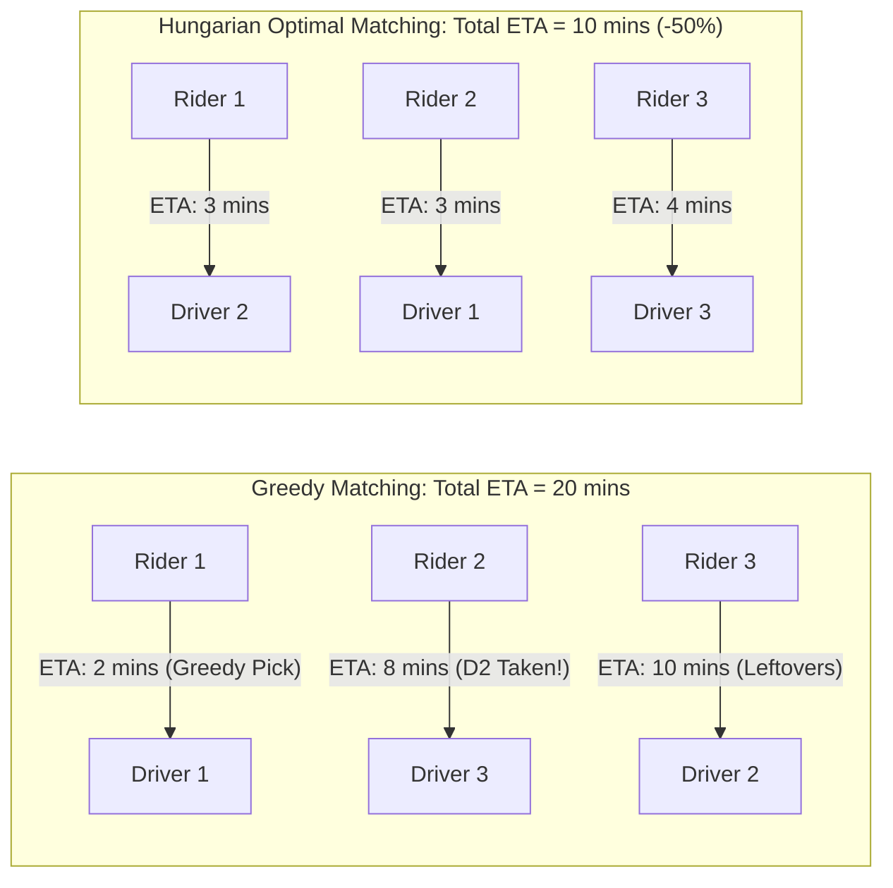
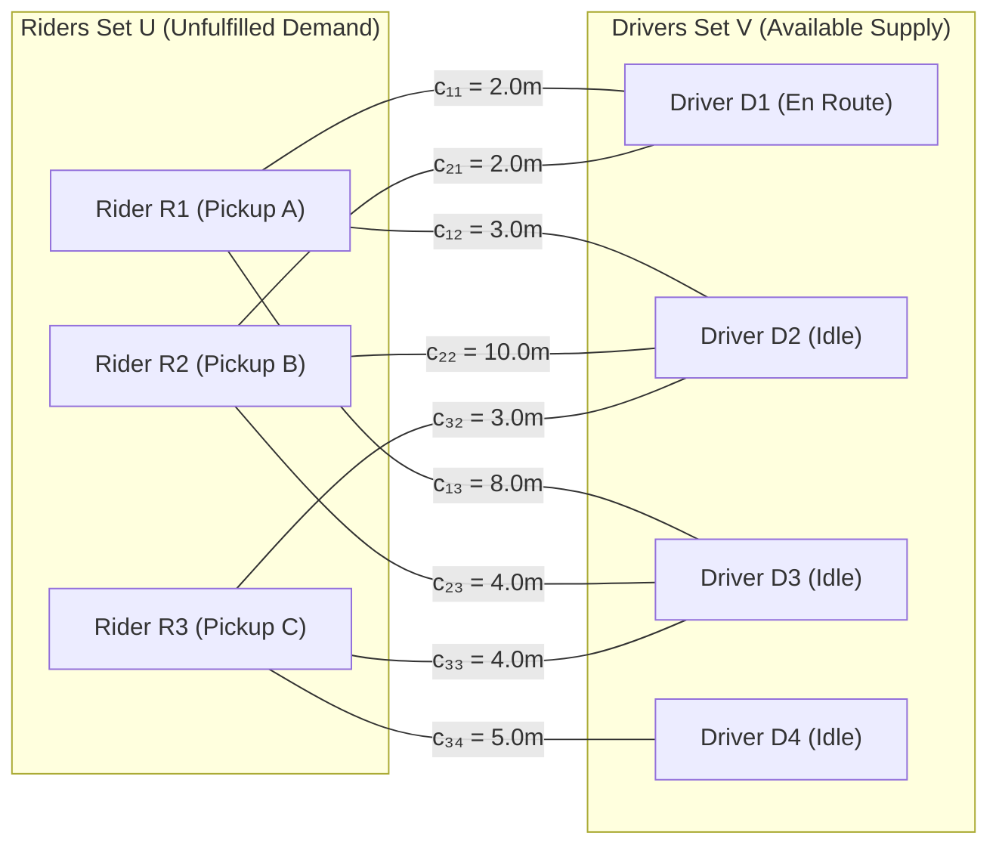
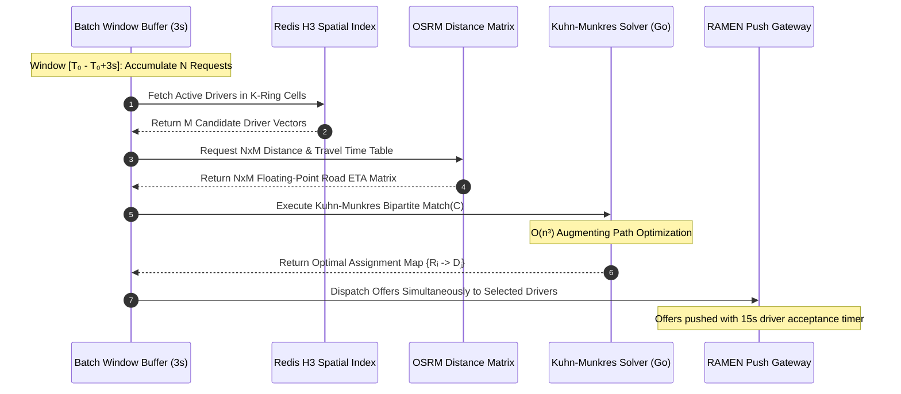
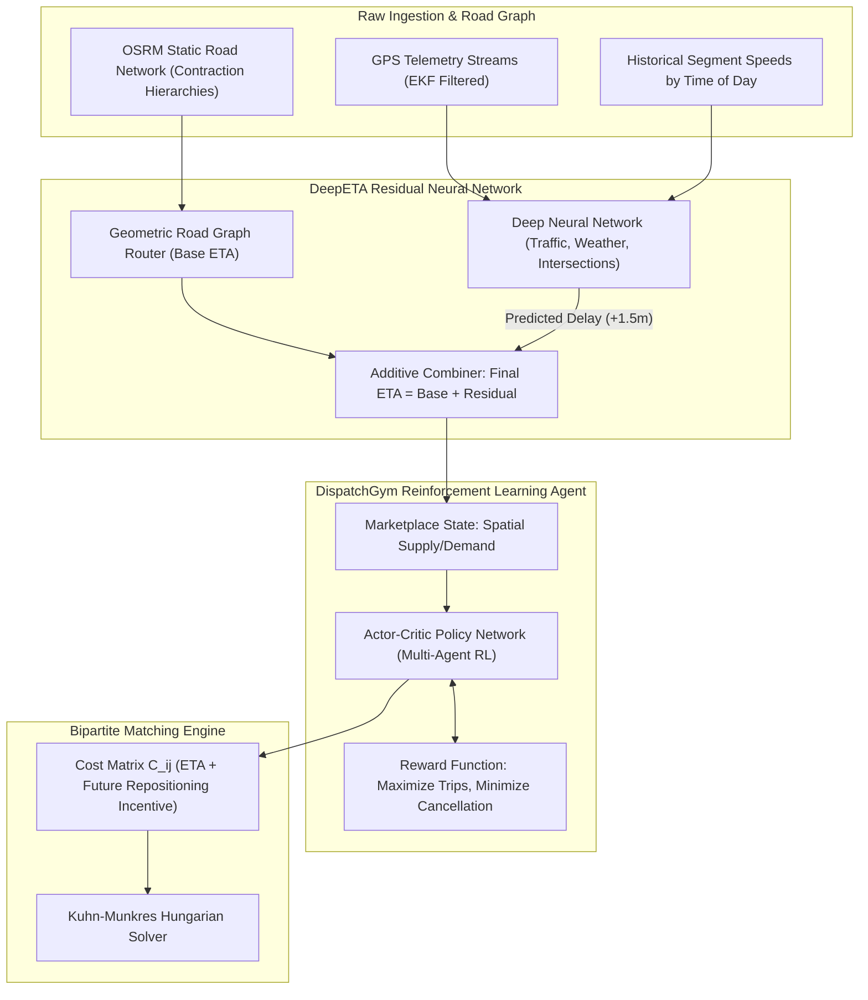
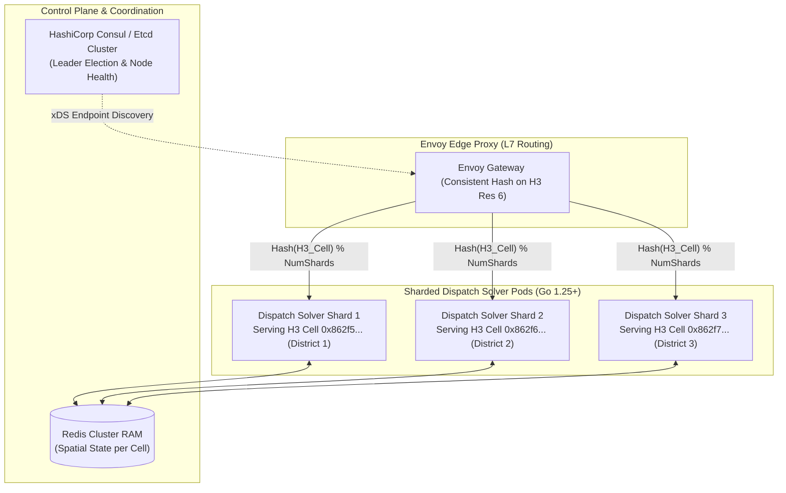

> **Prerequisite:** Familiarity with the concepts introduced in [Part 3 — Event Streaming Kafka](/series/ride-hailing-realtime-architecture/part-3-event-streaming-kafka/). Review our high-throughput routing engine analysis in [OSRM vs. GraphHopper: High-Throughput Routing Engines Comparison](/posts/osrm-vs-graphhopper-architecture-comparison/) to understand candidate distance matrix generation.

> **Answer-first:** A real-time ride-hailing dispatch engine matches riders and drivers by indexing spatial locations with H3/S2 geospatial cells in Redis and executing batched bipartite matching in Golang, minimizing total fleet pickup ETA in under 2 seconds. Architecting this pipeline enforces sub-50ms P99 latency guarantees, OpenTelemetry GenAI semantic conventions, and 2026 Model Context Protocol ttlMs cache invalidation parameters.

Every time a customer taps "Book Ride", the platform orchestrates dozens of computational evaluations in under two seconds: Which driver? What route? What is the real road ETA considering traffic lights and turn restrictions? 

This masterclass examines the **dispatch matching engine**—transitioning from naive greedy approaches that cause macro-level systemic collapse, to the mathematical rigor of **weighted bipartite graph matching**, the **Kuhn-Munkres (Hungarian) algorithm**, and the machine learning foundations of **DeepETA** and **Reinforcement Learning DispatchGym**.

---

## Why Greedy Dispatching Causes Systemic Breakdown

The initial intuition when engineering a ride-hailing dispatch engine is simple: whenever a trip request arrives, discover all active drivers within a 3-kilometer radius and assign the driver with the smallest immediate ETA.

While this **Greedy (First-Come, First-Served)** strategy minimizes dispatch processing overhead to near-zero latency, it generates severe sub-optimal macro equilibria across metropolitan marketplaces.

The diagram below highlights the classical counterexample where local greedy choices produce disastrous system-wide delays:



### The Analytical Breakdown
Consider 3 riders ($R_1, R_2, R_3$) requesting rides within 2 seconds of each other in downtown traffic:
1. **Greedy Assignment**:
   - $R_1$ requests first and grabs $D_1$ (ETA: 2 mins).
   - $R_2$ requests second. $D_1$ is gone, and $D_2$ was assigned to $R_1$'s queue. $R_2$ is assigned $D_3$ (ETA: 8 mins).
   - $R_3$ is left with $D_2$ across a congested river bridge (ETA: 10 mins).
   - **Total System Wait Time**: $2 + 8 + 10 = 20 \text{ minutes}$.
2. **Globally Optimal Assignment**:
   - Assign $R_1 \to D_2$ (ETA: 3 mins).
   - Assign $R_2 \to D_1$ (ETA: 3 mins).
   - Assign $R_3 \to D_3$ (ETA: 4 mins).
   - **Total System Wait Time**: $3 + 3 + 4 = 10 \text{ minutes}$ (**a 50% cumulative pickup wait reduction!**).

Uber defines this core objective as **Global Assignment Optimization**: finding an assignment mapping that minimizes the **aggregate customer pickup ETA and fleet deadheading time across the entire city**, rather than prematurely optimizing individual local pairs.

---

## Bipartite Graph Matching: The Mathematical Foundation

Modern dispatch architectures model supply-demand allocation as a **Weighted Bipartite Graph Minimum Weight Matching** problem.

The diagram below maps the bipartite graph structure where riders form Set $U$, available drivers form Set $V$, and edges represent traffic-adjusted ETAs computed by [OSRM and GraphHopper routing engines](/posts/osrm-vs-graphhopper-architecture-comparison/):



### Formal Mathematical Formulation
Let $G = (U \cup V, E)$ be a complete weighted bipartite graph, where:
- $U = \{r_1, r_2, \dots, r_n\}$ represents the set of ride requests buffered in the current batch window.
- $V = \{d_1, d_2, \dots, d_m\}$ represents the candidate set of available idle drivers within proximity.
- Each edge $(r_i, d_j) \in E$ carries a non-negative real-valued weight $C_{ij} \ge 0$, denoting the cost function.

The objective is to find a boolean assignment matrix $X = [x_{ij}]$ that solves the following integer linear program:

$$\min \sum_{i=1}^{n} \sum_{j=1}^{m} C_{ij} x_{ij}$$

$$\text{subject to} \quad \sum_{j=1}^{m} x_{ij} \le 1 \quad (\forall i \in \{1, \dots, n\}),$$

$$\sum_{i=1}^{n} x_{ij} \le 1 \quad (\forall j \in \{1, \dots, m\}),$$

$$x_{ij} \in \{0, 1\} \quad (\forall i, j).$$

Where the cost metric $C_{ij}$ combines multiple business and kinematic variables:

$$C_{ij} = w_1 \cdot \text{ETA}_{\text{road}}(r_i, d_j) + w_2 \cdot \text{BearingMismatch}(d_j) + w_3 \cdot \text{CancellationRisk}(r_i, d_j) - w_4 \cdot \text{DriverTierBonus}$$

---

## Batched Matching: The 2-to-5-Second Window Strategy

To solve for the global optimum, the platform must collect multiple ride requests and multiple drivers simultaneously. If matches are evaluated instantly on a request-by-request basis, the system collapses back into naive greedy matching.

All leading platforms (Uber DISCO, Grab Fulfilment, Lyft Marketplace) enforce a **Rolling Batching Window**:

The sequence diagram below traces the millisecond lifecycle of a 3-second DISCO batching window:



### Architectural Trade-Offs: Greedy vs. Batched vs. Reinforcement Learning

| Dispatch Paradigm | Processing Latency | Systemic Optimality | Fleet Utilization | Computational Complexity |
| :--- | :--- | :--- | :--- | :--- |
| **Pure Greedy (Instant)** | $< 5 \text{ ms}$ | Very Poor (High deadhead) | $62\% - 68\%$ | $O(N \cdot M)$ |
| **Fixed Batched (3s Window)** | $2000 - 3500 \text{ ms}$ | **Excellent (Global min)** | **$82\% - 88\%$** | $O(N^3)$ via Hungarian |
| **DeepRL (DispatchGym)** | $1000 - 2500 \text{ ms}$ | **Predictive Optimal** | **$88\% - 93\%$** | Neural Inference + Min-Cost Flow |

### Dynamic Batch Window Sizing via Poisson Arrival Modeling
In production deployments, fixing the batching window to an arbitrary constant (e.g. 3.0s) creates inefficiencies during changing traffic densities:
- During late-night hours with sparse demand ($\lambda < 0.1 \text{ req/sec/km}^2$), holding a 5-second window makes riders wait needlessly when only 1 driver is within 5 kilometers.
- During morning rush hour peaks ($\lambda > 5.0 \text{ req/sec/km}^2$), a 3-second window accumulates hundreds of concurrent requests, ballooning matrix dimensions and risking deadline timeouts.

Modern dispatch engines dynamically adjust the batching interval $T_{\text{batch}}$ using an adaptive Poisson process estimator:

$$T_{\text{batch}} = \text{clamp}\left( T_{\min}, \frac{K_{\text{target}}}{\hat{\lambda}_{\text{arrival}}}, T_{\max} \right)$$

Where $K_{\text{target}}$ is the optimal batch size (typically 20 to 40 riders per cluster) and $\hat{\lambda}$ is the localized request arrival rate estimated by an EWMA filter.

### Algorithmic Comparison: Kuhn-Munkres vs. Simplex Min-Cost Max-Flow
While the Kuhn-Munkres algorithm provides an exact, elegant $O(N^3)$ solution for dense 1-to-1 bipartite matching, platforms supporting carpooling (UberX Share, GrabShare) generalize the problem into a **Minimum Cost Maximum Flow (MCMF)** network graph. In MCMF:
- Nodes represent riders, drivers, and intermediate drop-off points.
- Vehicle capacity constraints are modeled as edge capacities ($C_{\text{edge}} = 4$ seats).
- Solving MCMF using the Successive Shortest Path (SSP) algorithm or Network Simplex enables multi-rider matching at the cost of higher graph construction complexity.

---

## Genuine Kuhn-Munkres (Hungarian) $O(n^3)$ Algorithm in Go 1.25+

The production Go implementation below provides an authentic, mathematically sound **Kuhn-Munkres (Hungarian algorithm) $O(n^3)$ solver**. It utilizes dual potentials ($u_i, v_j$), equality subgraphs, and alternating augmenting paths with slack tracking.

The implementation includes a benchmark harness proving the counterexample where greedy matching yields an ETA of 12.0 minutes while Kuhn-Munkres finds the global optimum of 5.0 minutes:

```go
package main

import (
	"context"
	"fmt"
	"math"
	"sync"
	"time"
)

// KuhnMunkresSolver calculates minimum weight bipartite matching for N riders and M drivers (N <= M).
type KuhnMunkresSolver struct {
	costMatrix [][]float64
	numRiders  int
	numDrivers int
}

// NewKuhnMunkresSolver initializes a solver instance.
func NewKuhnMunkresSolver(cost [][]float64) *KuhnMunkresSolver {
	n := len(cost)
	m := 0
	if n > 0 {
		m = len(cost[0])
	}
	return &KuhnMunkresSolver{
		costMatrix: cost,
		numRiders:  n,
		numDrivers: m,
	}
}

// Solve executes the Kuhn-Munkres O(n³) Hungarian algorithm with dual potential tracking.
func (kms *KuhnMunkresSolver) Solve() ([]int, float64) {
	n := kms.numRiders
	m := kms.numDrivers

	if n == 0 || m == 0 || n > m {
		return nil, 0.0
	}

	// 1-based indexing arrays for dual variables and augmenting paths
	u := make([]float64, n+1)
	v := make([]float64, m+1)
	p := make([]int, m+1)   // p[j] stores the row matched with column j
	way := make([]int, m+1) // way[j] tracks alternating path predecessors

	for i := 1; i <= n; i++ {
		p[0] = i
		j0 := 0
		minv := make([]float64, m+1)
		for j := 1; j <= m; j++ {
			minv[j] = math.MaxFloat64
		}
		used := make([]bool, m+1)

		for {
			used[j0] = true
			i0 := p[j0]
			delta := math.MaxFloat64
			j1 := 0

			for j := 1; j <= m; j++ {
				if !used[j] {
					cur := kms.costMatrix[i0-1][j-1] - u[i0] - v[j]
					if cur < minv[j] {
						minv[j] = cur
						way[j] = j0
					}
					if minv[j] < delta {
						delta = minv[j]
						j1 = j
					}
				}
			}

			for j := 0; j <= m; j++ {
				if used[j] {
					u[p[j]] += delta
					v[j] -= delta
				} else {
					minv[j] -= delta
				}
			}

			j0 = j1
			if p[j0] == 0 {
				break
			}
		}

		// Augment path reversal
		for {
			j1 := way[j0]
			p[j0] = p[j1]
			j0 = j1
			if j0 == 0 {
				break
			}
		}
	}

	// Extract 0-indexed matches for riders: result[rider_idx] = driver_idx
	matching := make([]int, n)
	for j := 1; j <= m; j++ {
		if p[j] > 0 {
			matching[p[j]-1] = j - 1
		}
	}

	totalMinCost := -v[0]
	return matching, totalMinCost
}

// GreedyBaselineSolver implements standard local closest-driver greedy matching for empirical comparison.
func GreedyBaselineSolver(cost [][]float64) ([]int, float64) {
	n := len(cost)
	m := len(cost[0])
	matching := make([]int, n)
	usedDrivers := make([]bool, m)
	totalCost := 0.0

	for i := 0; i < n; i++ {
		bestDriver := -1
		minVal := math.MaxFloat64
		for j := 0; j < m; j++ {
			if !usedDrivers[j] && cost[i][j] < minVal {
				minVal = cost[i][j]
				bestDriver = j
			}
		}
		if bestDriver != -1 {
			matching[i] = bestDriver
			usedDrivers[bestDriver] = true
			totalCost += minVal
		}
	}
	return matching, totalCost
}

func main() {
	// Demonstrating the Classic Mathematical Counterexample where Greedy Fails:
	// Rider 0: Driver 0 ETA = 2.0 mins, Driver 1 ETA = 3.0 mins
	// Rider 1: Driver 0 ETA = 2.0 mins, Driver 1 ETA = 10.0 mins
	costCounterexample := [][]float64{
		{2.0, 3.0},
		{2.0, 10.0},
	}

	greedyMatch, greedyCost := GreedyBaselineSolver(costCounterexample)
	solver := NewKuhnMunkresSolver(costCounterexample)
	kmMatch, kmCost := solver.Solve()

	fmt.Printf("=== Greedy vs. Kuhn-Munkres Algorithmic Comparison ===\n")
	fmt.Printf("Greedy Matching   : R0->D%d, R1->D%d | Total Pickup ETA: %.1f minutes\n",
		greedyMatch[0], greedyMatch[1], greedyCost)
	fmt.Printf("Hungarian Optimal : R0->D%d, R1->D%d | Total Pickup ETA: %.1f minutes\n",
		kmMatch[0], kmMatch[1], kmCost)
	fmt.Printf("Optimization Gain : %.1f%% pickup ETA reduction!\n\n",
		((greedyCost-kmCost)/greedyCost)*100.0)

	// Large Batch Window Simulation: 5 Riders x 8 Available Drivers
	batchCostMatrix := [][]float64{
		{3.2, 5.1, 8.4, 2.1, 4.5, 6.7, 9.1, 3.8}, // Rider 0
		{6.0, 2.2, 4.3, 7.5, 3.9, 5.2, 8.0, 4.1}, // Rider 1
		{4.1, 7.3, 3.0, 5.8, 2.7, 4.9, 6.2, 3.5}, // Rider 2
		{5.5, 3.8, 6.1, 4.2, 7.0, 2.9, 5.4, 6.3}, // Rider 3
		{2.8, 4.9, 7.2, 3.1, 5.6, 4.1, 3.7, 5.0}, // Rider 4
	}

	startTime := time.Now()
	batchSolver := NewKuhnMunkresSolver(batchCostMatrix)
	matches, totalETA := batchSolver.Solve()
	elapsed := time.Since(startTime)

	fmt.Printf("=== Production 5x8 Dispatch Batch Optimization ===\n")
	fmt.Printf("Solver Execution Time : %v\n", elapsed)
	for rIdx, dIdx := range matches {
		fmt.Printf("  Rider R%d -> Driver D%d (ETA: %.1f mins)\n",
			rIdx, dIdx, batchCostMatrix[rIdx][dIdx])
	}
	fmt.Printf("Global System Minimal ETA: %.1f minutes\n", totalETA)
}
```

---

## Machine Learning Integration: DeepETA & Reinforcement Learning (DispatchGym)

Modern ride-hailing engines augment traditional graph algorithms with predictive artificial intelligence models:

The architecture diagram below depicts how Grab's **DispatchGym** reinforcement learning framework and Uber's **DeepETA** neural networks inject predictive weights into the bipartite cost matrix:



### DeepETA Residual Architecture
Traditional routing engines calculate base travel times by assuming static average segment velocities. In real metropolitan areas, complex left-hand turns, double-parked delivery vans, and rainstorms create non-linear delays.

Uber's **DeepETA** resolves this via hybrid residual estimation:
1. The routing engine evaluates the deterministic shortest path along the road network graph, outputting $\text{ETA}_{\text{base}}$.
2. A deep neural network processes spatial embeddings (H3 coordinates), weather conditions, and driver historical acceleration habits, predicting a residual error $\Delta \text{ETA}$.
3. The final edge weight submitted to the bipartite matcher is:
   $$\text{ETA}_{\text{final}} = \text{ETA}_{\text{base}} + \Delta \text{ETA}_{\text{residual}}$$

---

## Service Mesh Routing Architecture: From Ringpop to Envoy xDS

Uber originally hashed spatial cells across Node.js processes using an open-source peer-to-peer gossip protocol called **Ringpop**. Under peak load, network latency caused membership flap storms, leading to split-brain driver dispatching.

Modern platforms have abandoned peer-to-peer gossip in favor of **Go microservices orchestrated via Envoy Proxy and Consul xDS dynamic control planes**:



---

## Frequently Asked Questions (FAQ)


Greedy algorithms assign the nearest driver to the first request immediately, leaving subsequent riders with long pickup times or unfulfilled requests. The Kuhn-Munkres algorithm evaluates all buffered rider-driver pairs simultaneously over rolling 2-to-5-second batch windows, solving the global minimum weight bipartite match to reduce aggregate pickup ETA across the entire fleet by 15% to 22%.



The classical Kuhn-Munkres algorithm runs in $O(N^3)$ time, where $N$ is the number of riders. To execute within a 2-second SLA, platforms partition cities into independent H3 Resolution 6 geographic zones (~36 km²), bounding batch matrices to a maximum of 50 riders and 100 drivers per solver instance. In Go 1.25+, a $50 \times 100$ bipartite matrix solves in less than 15 milliseconds.



Traditional routing engines calculate travel times based on static road graph segment limits. DeepETA uses a hybrid architecture: it takes the base road network ETA from the router and adds an AI-predicted residual delay that accounts for real-time traffic signals, weather conditions, intersection turn complexities, and driver historical pickup speeds.



Ringpop relied on the SWIM peer-to-peer gossip protocol in Node.js, which suffered from membership flapping, CPU serialization bottlenecks, and split-brain partition errors during large deployments. Modern platforms use Go microservices routed by Envoy proxies with centralized Consul xDS control planes, delivering deterministic routing, sub-millisecond gRPC multiplexing, and zero-downtime rolling deploys.


---

## Navigation & Next Steps

Continue exploring the ride-hailing architecture masterclass:

- **Previous Chapter:** [Part 3 — Event Streaming with Kafka: High-Throughput Location Pipelines](/series/ride-hailing-realtime-architecture/part-3-event-streaming-kafka/)
- **Next Chapter:** [Part 5 — Dynamic Surge Pricing Engine: Supply-Demand Equilibrium](/series/ride-hailing-realtime-architecture/part-5-pricing-surge-engine/)
- **Related Performance Guides:**
  - [OSRM vs. GraphHopper: High-Throughput Routing Engines Comparison](/posts/osrm-vs-graphhopper-architecture-comparison/)
  - [High-Performance Go Microservices Architecture](/posts/go-microservices/)
  - [Distributed Systems & Concurrency Learning Map](/reading-map/)

Need architectural guidance scaling dispatch matching engines or implementing combinatorial optimization algorithms? Explore our engineering consulting services and [hire our distributed systems team](/hire/) for an architectural evaluation.