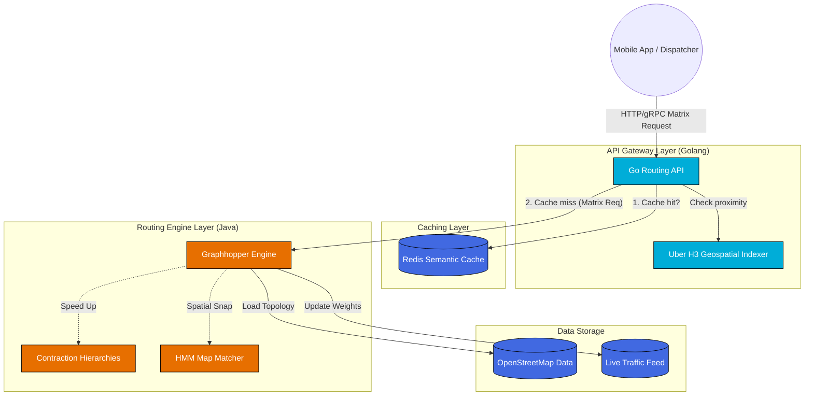

## The Engineering Challenge

Building a modern logistics platform (like food delivery, ride-hailing, or fleet management) requires computing distances and Estimated Times of Arrival (ETA) at an immense scale. 

- **The $N^2$ Problem:** If you have 1,000 drivers and 1,000 orders, calculating the distance between every possible combination requires 1,000,000 individual route calculations.
- **Speed:** These calculations must happen in real-time (under 50ms) to ensure seamless user experiences and prevent dispatching algorithms from timing out.
- **Accuracy:** The system must account for real-world constraints such as one-way streets, "no left turn" rules, and dynamic traffic congestion.

Standard point-to-point APIs (like basic Google Maps API calls) are too slow and too expensive for massive Distance Matrix generation. You need an internal, highly optimized Routing Engine.

## Overall Architecture

Below is the architectural blueprint of the system we will build throughout this series:

## The Four Architectural Pillars

### 1. Map Matching (GPS to Graph)
Raw GPS coordinates are notoriously noisy. Before any routing begins, the system uses **Hidden Markov Models (HMM)** and R-Trees to snap the imprecise latitude/longitude pings to the logical road segments, preventing the vehicle from appearing to drive on water or through buildings.

### 2. Edge-Based Graphs & Turn Penalties
To accurately model reality, the system uses an **Edge-Based Graph** rather than a simple Node-Based Graph. This allows the engine to penalize or forbid specific transitions, accurately reflecting "No U-Turn" or "No Left Turn" traffic rules without modifying the physical map data.

### 3. Contraction Hierarchies (CH) for Speed
Running Dijkstra or A* on a country-sized map takes seconds. **Contraction Hierarchies** pre-processes the map, removing unimportant local roads and building "shortcuts" between major highways. During a query, the engine runs a bidirectional search that only climbs this hierarchy, reducing response times to single-digit milliseconds.

### 4. Golang API Gateway & Semantic Caching
Graphhopper (Java) is an exceptional routing engine, but **Golang** is superior for handling thousands of concurrent I/O requests. We wrap Graphhopper behind a Golang API Gateway. This gateway uses **Uber H3 Indexing** to cluster nearby coordinate requests and caches the Distance Matrix results in **Redis**. If a similar request arrives, Golang serves it directly from Redis, bypassing the heavy routing engine entirely.

## Technology Stack

| Component | Technology | Rationale |
|---|---|---|
| **API Gateway / Concurrency** | Golang | Lightweight goroutines handle thousands of concurrent requests efficiently. |
| **Routing Engine** | Graphhopper (Java) | Industry-leading open-source routing engine with built-in Contraction Hierarchies. |
| **Geospatial Indexing** | Uber H3 | Hexagonal clustering for fast spatial searches and cache-key generation. |
| **Caching Layer** | Redis | In-memory semantic caching to serve duplicate/nearby matrix requests instantly. |
| **Map Data** | OpenStreetMap (OSM) | Free, highly accurate, and customizable map data. |

> *Ready to dive into the technical details? Begin the masterclass with [Part 1: Core Algorithms (A*, Dijkstra) Visualized](/series/routing-geospatial-architecture/part-1-core-algorithms/).*
