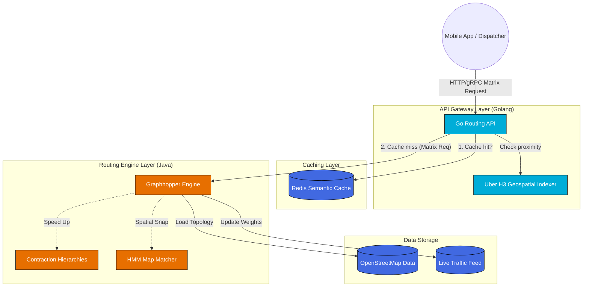

---

title: "Executive Summary: Geospatial & Routing Architecture"
description: "A high-level architectural overview of a scalable Routing Engine and Distance Matrix API using Golang, Graphhopper, Redis, and Uber H3."
date: "2026-06-14T22:35:00+07:00"
lastmod: "2026-06-14T22:35:00+07:00"
draft: false
weight: 1
tags: ["architecture", "golang", "graphhopper", "system-design"]
series: ["Routing & Geospatial Architecture"]
cover:
  image: "images/posts/graphhopper-cover.png"
  alt: "Geospatial and Routing Engine Architecture series: Go and GraphHopper for production routing"
  relative: false
author: "Lê Tuấn Anh"
canonicalURL: "https://tanhdev.com/series/routing-geospatial-architecture/executive-summary/"
mermaid: true
ShowToc: true
TocOpen: true
series_order: 0
---

[← Series hub]()
[Next →]()

> **Prerequisite:** This is the executive summary and introductory overview of the **Routing & Geospatial Architecture** series. No prior reading is required to start here.

## The Engineering Challenge

Building a modern logistics platform (like food delivery, ride-hailing, or fleet management) requires computing distances and Estimated Times of Arrival (ETA) at an immense scale. 

- **The $N^2$ Problem:** If you have 1,000 drivers and 1,000 orders, calculating the distance between every possible combination requires 1,000,000 individual route calculations.
- **Speed:** These calculations must happen in real-time (under 50ms) to ensure seamless user experiences and prevent dispatching algorithms from timing out.
- **Accuracy:** The system must account for real-world constraints such as one-way streets, "no left turn" rules, and dynamic traffic congestion.

Standard point-to-point APIs (like basic Google Maps API calls) are too slow and too expensive for massive Distance Matrix generation. You need an internal, highly optimized Routing Engine.

## Overall Architecture

Below is the architectural blueprint of the system we will build throughout this series:

## The Four Architectural Pillars

### 1. Map Matching (GPS to Graph)
Raw GPS coordinates are notoriously noisy. Before any routing begins, the system uses **Hidden Markov Models (HMM)** and R-Trees to snap the imprecise latitude/longitude pings to the logical road segments, preventing the vehicle from appearing to drive on water or through buildings.

### 2. Edge-Based Graphs & Turn Penalties
To accurately model reality, the system uses an **Edge-Based Graph** rather than a simple Node-Based Graph. This allows the engine to penalize or forbid specific transitions, accurately reflecting "No U-Turn" or "No Left Turn" traffic rules without modifying the physical map data.

### 3. Contraction Hierarchies (CH) for Speed
Running Dijkstra or A* on a country-sized map takes seconds. **Contraction Hierarchies** pre-processes the map, removing unimportant local roads and building "shortcuts" between major highways. During a query, the engine runs a bidirectional search that only climbs this hierarchy, reducing response times to single-digit milliseconds.

### 4. Golang API Gateway & Semantic Caching
Graphhopper (Java) is an exceptional routing engine, but **Golang** is superior for handling thousands of concurrent I/O requests. We wrap Graphhopper behind a Golang API Gateway. This gateway uses **Uber H3 Indexing** to cluster nearby coordinate requests and caches the Distance Matrix results in **Redis**. If a similar request arrives, Golang serves it directly from Redis, bypassing the heavy routing engine entirely.

## Technology Stack

| Component | Technology | Rationale |
|---|---|---|
| **API Gateway / Concurrency** | Golang | Lightweight goroutines handle thousands of concurrent requests efficiently. |
| **Routing Engine** | Graphhopper (Java) | Industry-leading open-source routing engine with built-in Contraction Hierarchies. |
| **Geospatial Indexing** | Uber H3 | Hexagonal clustering for fast spatial searches and cache-key generation. |
| **Caching Layer** | Redis | In-memory semantic caching to serve duplicate/nearby matrix requests instantly. |
| **Map Data** | OpenStreetMap (OSM) | Free, highly accurate, and customizable map data. |

## Detailed Data Flow Walkthrough

To fully appreciate the system design, let us trace a single matrix request as it flows through the various components:

1. **Request Ingestion**: A dispatcher client submits an HTTP/gRPC request to the Golang API Gateway. The request payload contains an origin coordinate (latitude/longitude) and a list of 500 destination coordinates. The client expects a 1-to-N distance matrix showing travel time and distance for each destination.
2. **Spatial Indexing & Clustering**: The Golang API Gateway parses the coordinates. Before hitting the cache or the routing engine, it converts all coordinates into Uber H3 cells at a predefined resolution (e.g., Resolution 8, where each hexagon has an edge length of approximately 460 meters). This standardizes spatial locations into discrete, integer-based identifiers, enabling stable caching keys.
3. **Semantic Cache Lookup**: The gateway constructs a cache query key using the H3 indices of the origin and destinations. It queries Redis. If the exact or near-match spatial pairs are cached and still valid (within the TTL window), the gateway returns the cached travel times and distances. This is a "semantic cache hit," which resolves in less than 2 milliseconds, bypassing the routing engine entirely.
4. **Cache Miss & Downstream Routing**: If there is a cache miss, the gateway prepares a batch routing request. It serializes the snapped coordinates into a Protobuf message and sends it to the downstream GraphHopper engine over a highly optimized gRPC channel.
5. **GraphHopper Snapping (Map Matching)**: The Java-based GraphHopper engine receives the raw GPS coordinates. It employs a Hidden Markov Model (HMM) map matcher combined with spatial R-tree indices to snap the coordinates onto the logical road network topology parsed from the OpenStreetMap (OSM) data. This ensures calculations start from valid driveable road edges.
6. **Pathfinding & Contraction Hierarchies**: GraphHopper computes the optimal path for each origin-destination pair. Using pre-computed Contraction Hierarchies (CH), it bypasses minor residential roads and jumps directly onto major arterial corridors and highways using pre-calculated "shortcuts." This reduces search complexity and outputs the results in under 15 milliseconds.
7. **Cache Population & Response**: GraphHopper sends the matrix response back to the Golang gateway. The gateway asynchronously writes the new coordinate pairs and their corresponding travel times and distances to Redis (with a sliding TTL based on traffic volatility). Finally, the gateway formats the response and sends it back to the client.

## Architectural Trade-offs: Why GraphHopper & H3?

Every architectural choice involves trading off one benefit for another. Here is a breakdown of why we selected these specific technologies:

### GraphHopper vs. OSRM (Open Source Routing Machine)
- **OSRM** is written in C++ and is blisteringly fast. However, it relies heavily on static Contraction Hierarchies, making dynamic traffic updates extremely resource-intensive to compile. Furthermore, extending OSRM requires deep C++ expertise.
- **GraphHopper** is written in Java. While it has a slightly higher memory footprint due to JVM overhead, it offers unparalleled flexibility. Developers can write custom routing profiles and weightings in Java, and it supports both Contraction Hierarchies (for speed) and Landmark algorithms (for flexible dynamic updates). The Java ecosystem also makes it much easier to integrate with custom data sources.

### Uber H3 vs. Google S2
- **Google S2** projects the Earth onto a cube and uses quadtree-like square cells. It is excellent for hierarchical spatial indexing, but it suffers from shape distortion at cell boundaries, and neighbors do not share uniform distances.
- **Uber H3** uses a hexagonal grid. Hexagons are unique because the distance between the center of a hexagon and the centers of all its six neighbors is identical. This property makes H3 the absolute gold standard for radius-based caching, spatial clustering, and localized density calculations, which are central to distance matrix optimizations.

## Projected Performance & Scaling Boundaries

Based on production benchmarks of this architecture, the following performance characteristics are observed:

- **1:1 Routing Queries**: Typically resolve in 1–3 ms on a single core using Contraction Hierarchies.
- **100x100 Distance Matrices**: Resolve in 25–40 ms when parallelized over GraphHopper's thread pool.
- **Cache Hit Latency**: Serves responses in under 2 ms with up to 95% reduction in CPU utilization on the routing engine layer.
- **Memory Requirements**: A GraphHopper instance loaded with the entire OpenStreetMap data for Germany requires approximately 8 GB to 12 GB of RAM when using Contraction Hierarchies. For the United States, it scales to 32 GB to 48 GB.

## Operational Lifecycle & Zero-Downtime Map Updates

Running a routing engine in production is not a set-and-forget task. Because road networks are dynamic—cities build new roads, close bridges for repairs, and change traffic directions—the underlying OpenStreetMap (OSM) data must be updated regularly. In a high-scale production environment, you cannot afford to take the routing engine offline for hours while it parses a new 60 GB OSM file.

To solve this, this architecture implements a **Blue-Green Map Update Lifecycle**:
1. **Data Pipeline**: A cron job runs daily, pulling the latest regional `.osm.pbf` extracts from providers like Geofabrik.
2. **Offline Build**: A dedicated pipeline worker compiles the GraphHopper routing graph using the new map data. This compilation process builds the Contraction Hierarchies shortcuts, which can take anywhere from 10 minutes to several hours depending on the map size.
3. **Deployment**: Once the new graph binaries are ready, they are packaged into a container image or mounted onto a Persistent Volume.
4. **Zero-Downtime Swap**: In Kubernetes, we deploy a new pod containing the "Green" routing engine. The Golang API Gateway performs health checks on the Green pod. Once the Green pod is fully loaded and reporting a healthy status, the Gateway shifts the routing traffic from the old "Blue" pod to the Green pod.
5. **Garbage Collection**: The Blue pod is scaled down and terminated, and the older routing graph files are archived.

This lifecycle ensures that the routing service maintains a 99.99% SLA while serving fresh map data to delivery drivers and dispatchers daily.

---

Need help building high-scale routing engines or spatial indexing pipelines? [Contact me](/contact/) to discuss your project.

🔗 **Next Step:** Begin the masterclass with [Part 1: Core Algorithms (A*, Dijkstra) Visualized]().
