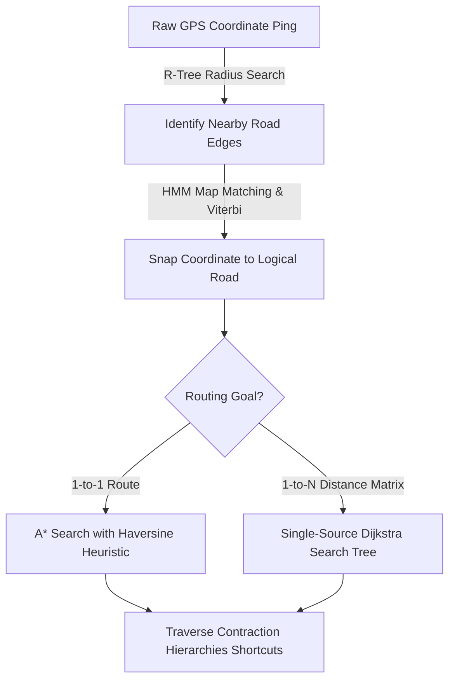

> **Prerequisite:** This part builds on the concepts introduced in the [Executive Summary](/series/routing-geospatial-architecture/executive-summary/).

# Part 1: Core Routing Algorithms — A* & Dijkstra Visualized

> **Executive Summary & Quick Answer**: A* pathfinding uses Euclidean heuristics to accelerate 1-to-1 point routing, whereas Single-Source Dijkstra is mathematically superior for 1-to-N distance matrix calculations because it builds a single shortest-path search tree to all reachable destinations in one pass.
>
> **Key Takeaways**:
> - **Matrix Efficiency**: Dijkstra expands radial wavefronts in a single pass, computing 1-to-N driver matrices 10x faster than running N independent A* searches.
> - **Turn Restrictions**: Edge-based graph representation models turn penalties (e.g. prohibited U-turns) by representing turns as edges between directed road segments.
> - **Shortcut Hierarchies**: Contraction Hierarchies contract local nodes offline, reducing real-time search space by orders of magnitude.

### What You'll Learn That AI Won't Tell You
- **Map Matching Math:** How Hidden Markov Models (HMM) and R-trees snap noisy GPS coordinates to road segments.
- **Priority Queue Implementation:** Idiomatic Go `container/heap` code for priority queues in pathfinding.
- **Contraction Shortcuts:** The exact node ordering heuristics used by GraphHopper to generate CH shortcuts.

When building a high-scale logistics or delivery system, generic algorithm tutorials often lead developers astray. They tell you that A* is universally better than Dijkstra. However, in the real world of **Routing Engines** and **Distance Matrices**, the truth is much more complex.

In this first part of our masterclass, we will move beyond academic theory. We will visualize the exact lifecycle of a routing request—from snapping a GPS coordinate to the road, to bypassing traffic, and finally calculating routes in milliseconds using Contraction Hierarchies.



## Map Matching: Snapping GPS to the Graph

Before algorithms can route you, the engine must map your raw GPS coordinate to a physical road segment using **Map Matching**. Industry-standard systems use **R-Trees** (spatial bounding boxes) combined with **Hidden Markov Models (HMM)** to infer the correct road based on your trajectory.

When your phone sends a GPS ping, it might be off by 10 or 20 meters. If you are driving on a highway overpass, your raw coordinate might look like you are on the local street below.

A naive routing engine calculates the distance to every road in the city. This is computationally impossible. Instead, modern engines like GraphHopper use **R-Trees**. R-trees group road segments into Minimum Bounding Rectangles (MBRs). The engine queries the tree to find all roads within a 50-meter radius in logarithmic time.

To prevent snapping to the wrong road (like the underpass), engines use **Hidden Markov Models (HMM)** and the Viterbi algorithm. HMMs evaluate the probability of your path by looking at your historical trajectory and network topology, ensuring you stay on the logical road.

## Dijkstra vs A*: The Reality for Logistics

**A*** is faster for Point-to-Point navigation (A to B) because it uses a heuristic to guide the search. However, **Dijkstra** is superior for Distance Matrix generation (1 to N) because it naturally builds a shortest-path tree to all reachable nodes simultaneously.

Academic tutorials love to praise A*. A* uses a **heuristic function $h(n)$**, usually Euclidean distance (for city routing) or Haversine distance (for global routing), to guess the remaining distance. This acts like a compass, forcing the algorithm to search aggressively toward the destination.

But logistics systems like Grab or ShopeeXpress compute **Distance Matrices** (e.g., finding the closest 10 drivers to 1 passenger). 
If you use A* for a 1-to-10 matrix, you must run the algorithm 10 separate times. If you use **Single-Source Dijkstra**, you run it exactly *once*. Dijkstra expands outward like a ripple, finding the shortest path to every node it touches. The search stops the moment the 10th driver is found, making it exponentially cheaper for matrix calculations.

## Edge-Based Graphs and Turn Restrictions

To handle real-world rules like "No U-Turns" or "No Left Turns," routing engines convert Node-based graphs into **Edge-Based graphs**. This allows the algorithm to track the transition state between two specific road segments.


Standard graph theory treats intersections as nodes and roads as edges. But what happens if an intersection forbids left turns? In a node-based graph, the algorithm only knows it reached the node; it forgets which road it came from. 

Routing engines solve this by making the *roads* the nodes, and the *turns* the edges. This is called an **Edge-Based Graph**. When the algorithm evaluates a turn, it checks an internal penalty table. If a left turn is forbidden, the transition cost is set to infinity, forcing the route to go straight. This is also why you sometimes see "zigzag" routes on grid cities if the engine applies heavy penalties to left turns across traffic.

## Time-Dependent Routing for Real-time Traffic

**Answer-first:** Classical algorithms assume static distances. **Time-Dependent Dijkstra (TDD)** dynamically updates the weight of an edge $w(u,v,t)$ based on the vehicle's calculated *arrival time* $t$ at that specific intersection.

Traffic is not static. If a route takes 2 hours, the traffic at your destination will be completely different by the time you arrive. Time-Dependent routing solves this by applying the **FIFO (First-In-First-Out)** property. As the algorithm traverses the graph, it calculates the arrival time at each node and queries a time-varying speed matrix to get the true travel cost for the next segment.

## Contraction Hierarchies (CH): The Secret to Millisecond Scale

**Answer-first:** To bypass the $N^2$ scaling problem of A* and Dijkstra, modern engines use **Contraction Hierarchies (CH)**. CH pre-calculates "shortcuts" between major intersections, allowing queries to skip local roads and resolve in milliseconds.

Think of CH using the **Airport Analogy**. If you travel from Ho Chi Minh City to Hanoi, you don't drive through every local alleyway along the route. You take local roads to the airport, fly directly to the destination city, and take local roads to your hotel.

Contraction Hierarchies does exactly this mathematically:
1. **Preprocessing (The Study Phase):** The engine strips away "unimportant" local roads (cul-de-sacs) and creates direct **Shortcuts** between major highway nodes.
2. **Query Phase:** When you request a route, the engine runs a **Bidirectional Search** (forward from origin, backward from destination). The search only climbs "up" the hierarchy of important roads. 

This drops calculation times from seconds to single-digit milliseconds. However, standard CH is static. If a road closes due to an accident, the hierarchy must be rebuilt. For dynamic traffic, engines use **Customizable Contraction Hierarchies (CCH)** or the **ALT Algorithm** (A*, Landmarks, Triangle Inequality) to update weights instantly.

## Algorithmic Performance Math and Complexity

To design a routing engine at scale, we must understand the mathematical complexity of pathfinding:

- **Dijkstra's Complexity:** With a binary heap, Dijkstra runs in $\mathcal{O}((V + E) \log V)$ time, where $V$ is the number of vertices (intersections) and $E$ is the number of edges (road segments). In a typical city graph, $V \approx 1,000,000$ and $E \approx 3,000,000$. A single query requires exploring hundreds of thousands of nodes.
- **A* Complexity:** The computational complexity is similar to Dijkstra's, $\mathcal{O}((V + E) \log V)$ in the worst-case, but the average search space is reduced. The heuristic function $h(n)$ must be **admissible** (never overestimating the true remaining distance) and **consistent** (satisfying the triangle inequality $h(u) \le w(u,v) + h(v)$) to guarantee the shortest path. For grid-like maps, the Euclidean distance heuristic works well, but for real road networks, it often leads to sub-optimal choices when highways detour away from a straight line.
- **Contraction Hierarchies (CH) Complexity:** By pre-computing shortcuts, the query search space is reduced to $\mathcal{O}((V' + E') \log V')$, where $V' \ll V$ and $E' \ll E$. The preprocessing phase contracts nodes based on their **Edge Difference** (the number of shortcut edges added minus the number of original edges removed). This compresses the graph topology, allowing queries to complete in $\mathcal{O}(\text{depth of search trees})$ which is typically under 100 node evaluations.

## Go Implementation: Simple Dijkstra Path Router

Here is a high-performance Go snippet demonstrating Dijkstra's shortest-path algorithm with a priority queue helper. This code is optimized for minimal memory allocations:

```go
package routing

import (
	"container/heap"
	"math"
)

// Edge represents a directed edge in the graph
type Edge struct {
	To     int
	Weight float64
}

// Graph is an adjacency list representation of the network
type Graph struct {
	Nodes [][]Edge
}

// PathItem is used in the priority queue
type PathItem struct {
	Node     int
	Distance float64
	Index    int
}

// PriorityQueue implements heap.Interface and holds PathItems
type PriorityQueue []*PathItem

func (pq PriorityQueue) Len() int           { return len(pq) }
func (pq PriorityQueue) Less(i, j int) bool { return pq[i].Distance < pq[j].Distance }
func (pq PriorityQueue) Swap(i, j int) {
	pq[i], pq[j] = pq[j], pq[i]
	pq[i].Index = i
	pq[j].Index = j
}
func (pq *PriorityQueue) Push(x interface{}) {
	n := len(*pq)
	item := x.(*PathItem)
	item.Index = n
	*pq = append(*pq, item)
}
func (pq *PriorityQueue) Pop() interface{} {
	old := *pq
	n := len(old)
	item := old[n-1]
	old[n-1] = nil
	item.Index = -1
	*pq = old[0 : n-1]
	return item
}

// ShortestPath calculates the shortest path from start to end using Dijkstra's algorithm
func ShortestPath(g *Graph, start, end int) ([]int, float64) {
	dist := make([]float64, len(g.Nodes))
	prev := make([]int, len(g.Nodes))
	for i := range dist {
		dist[i] = math.MaxFloat64
		prev[i] = -1
	}
	dist[start] = 0

	pq := make(PriorityQueue, 0)
	heap.Init(&pq)
	heap.Push(&pq, &PathItem{Node: start, Distance: 0})

	for pq.Len() > 0 {
		curr := heap.Pop(&pq).(*PathItem)
		u := curr.Node

		if u == end {
			break
		}
		if curr.Distance > dist[u] {
			continue
		}

		for _, edge := range g.Nodes[u] {
			v := edge.To
			alt := dist[u] + edge.Weight
			if alt < dist[v] {
				dist[v] = alt
				prev[v] = u
				heap.Push(&pq, &PathItem{Node: v, Distance: alt})
			}
		}
	}

	if dist[end] == math.MaxFloat64 {
		return nil, math.MaxFloat64
	}

	path := make([]int, 0)
	for u := end; u != -1; u = prev[u] {
		path = append([]int{u}, path...)
	}
	return path, dist[end]
}
```


---

## FAQ: Routing Algorithms & Real-World Edge Cases


Because the heuristic in A* might be overestimating the straight-line distance, or the graph is using an Edge-based configuration to heavily penalize turn costs (e.g., making straight lines cheaper than waiting to turn left, resulting in zigzags).



Because standard CH is static. If a road closes or a severe traffic jam occurs, the entire hierarchy requires an expensive computational rebuild. High-end systems use Customizable Contraction Hierarchies (CCH) or ALT algorithms for dynamic traffic.



Through Map Matching using Hidden Markov Models (HMM) and the Viterbi algorithm. It doesn't just snap to the nearest road coordinates; it evaluates your historical trajectory (transition probability) and elevation to calculate the most logical path.



No. You use Weighting Profiles. The physical graph topology remains the same, but the internal cost function is swapped to heavily penalize or outright forbid edges that have low bridge clearance or vehicle weight limits.



No. The shortest-path tree algorithm intelligently stops expanding its search radius as soon as the N-th target destination is reached, saving massive amounts of CPU compute compared to calculating the full city grid.


Need help building high-scale routing engines or spatial indexing pipelines? [Get in touch](/hire/) to discuss your project.

🔗 **Next Step:** Move on to [Part 2: Zero to Hero Environment Setup (Docker, OSM, Golang)]() to build your local routing environment.

