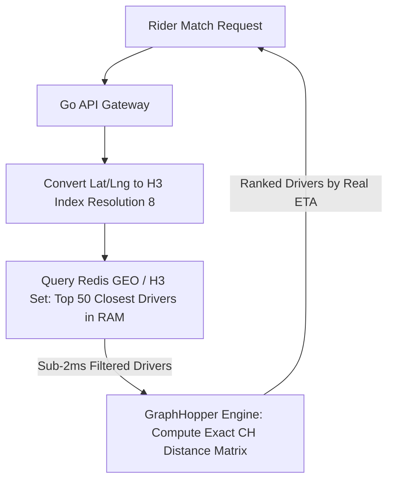

> **Prerequisite:** Before reading this part, review [Part 2: Zero to Hero Environment Setup](/series/routing-geospatial-architecture/part-2-environment-setup/).

# Part 3: Spatial Indexing — Uber H3, PostGIS & Redis GEO

> **Executive Summary & Quick Answer**: Spatial indexing serves as a high-performance pre-filtering layer that prevents heavy routing engines from collapsing under load. By using Uber H3 hexagonal cells and Redis GEO to narrow down 10,000 active drivers to the 50 closest candidates in RAM (<2ms), systems reduce routing engine CPU overhead by up to 95%.
>
> **Key Takeaways**:
> - **Equidistant Neighboring**: Uber H3 hexagons eliminate directional bias present in square grids because all 6 neighbor centroids are equidistant from the center.
> - **Multi-Resolution Hierarchies**: Use Resolution 8/9 (~0.1km²) for driver matching and Resolution 6 (~250km²) for macro-level surge pricing.
> - **Index-Aware PostGIS Queries**: Use `ST_DWithin` with GiST spatial bounding box indices instead of `ST_Distance` full-table scans.

### What You'll Learn That AI Won't Tell You
- **H3 Icosahedron Projection:** Why hexagonal cells preserve true area across polar and equatorial latitudes.
- **SRID 4326 vs 3857 Traps:** Casting PostGIS `geometry` (degrees) to `geography` (meters) to avoid global query errors.
- **K-Ring Radius Traversal:** Smooth spatial convolution algorithms for dynamic surge pricing.

A fatal mistake made by junior engineers building ride-hailing apps is connecting their API Gateway directly to the Routing Engine. GraphHopper is CPU-intensive. If you ask it to calculate the ETA to all 10,000 drivers currently online in a city, your servers will melt. You must introduce **Spatial Indexing** (like Uber H3 or Redis GEO) as a high-speed pre-filter.



## 1. Uber H3 vs Google S2 (The Equidistant Neighbor)

When dividing the world into a grid, most systems historically used squares (like Google's S2). Uber fundamentally changed the game by releasing **H3**, which uses Hexagons. Why?

In a square grid, the diagonal neighbor is mathematically further away than the neighbor sharing an edge. This creates "directional bias" when performing radius searches. Hexagons solve this because all 6 neighbors share an edge and are perfectly **equidistant from the center**.

When you dispatch a driver, you search in expanding concentric circles (called `k-rings`). H3's equidistant hexagons ensure this radius expands uniformly in all directions, making dispatching fair and mathematically sound.

## 2. Area Distortion: Icosahedron vs Web Mercator

Why not just use a square grid overlayed on Google Maps (Web Mercator)? 

Web Mercator is a planar projection that severely distorts physical areas near the poles. If you calculate "Drivers per square kilometer" on a Mercator grid, your math completely breaks in high-latitude cities.

H3 avoids this by projecting the Earth onto an **Icosahedron (a 20-sided 3D shape)**. This guarantees that an H3 hexagon at the equator has nearly the exact same physical area as an H3 hexagon in Iceland, preserving statistical integrity worldwide. Compare this with our [Ride-Hailing Geospatial Indexing Deep Dive](/series/ride-hailing-realtime-architecture/part-2-geospatial-indexing/).

## 3. PostGIS vs Redis GEO vs H3 Performance Comparison

| Technology | Storage Model | Query Speed | Primary Use Case |
|---|---|---|---|
| **PostGIS (`ST_DWithin`)** | R-Tree / GiST on Disk/RAM | 5–15 ms | Complex spatial polygon joins and historical telemetry auditing. |
| **Redis GEO (`GEORADIUS`)** | Sorted Sets (ZSET) in RAM | < 1 ms | High-throughput realtime driver position tracking (< 4s pings). |
| **Uber H3** | 64-bit Integer Cell ID | < 0.1 ms | Spatial hashing, semantic caching keys, and surge pricing grids. |
ty worldwide.

## 3. Storage Patterns: Redis GEO vs PostGIS

The classic debate: Should you use a relational spatial database or an in-memory cache? 

**Answer-first:** Production systems use **both**. 
1. Use **Redis GEO** for live, transient driver locations. It stores Geohashes entirely in RAM, offering sub-millisecond latencies for "find nearest driver" queries.
2. Use **PostGIS** (`ST_DWithin`) for permanent, complex geometries like warehouse boundaries, service zones, and historical analytics. 

**The Redis Sharding Bottleneck:** Redis executes GEO commands on a single thread. If you pump 1 million live drivers into a single `global_drivers` key, one CPU core will handle all the geometry math and instantly max out at 100%. You must implement **Sharding** using geographic hash tags (e.g., `drivers:{hcmc}:geo` and `drivers:{hanoi}:geo`).

---

## 4. Advanced System Design: Kafka & Spatial Compaction

How do massive platforms match riders and drivers instantly without database locking?

**Kafka Spatial Partitioning:** By using the H3 Cell ID as the **Kafka Message Key**, all GPS pings from drivers and riders in the same neighborhood are guaranteed to land on the exact same Kafka partition (and thus, the same Consumer node). This allows the system to match drivers in local RAM (using RocksDB) with zero cross-network hops.

**Spatial Compaction:** To store massive, complex service zones (Geofences) without consuming gigabytes of memory, Uber uses the `h3.compact()` function. This algorithm recursively collapses 7 smaller child hexagons into 1 large parent hexagon, compressing the spatial data by up to 80%.

## Geohash vs Uber H3 vs Google S2 Geometry

Geospatial indexing systems partition the Earth's surface differently:

- **Geohash (Base32):** Divides the world into a quadtree grid of bounding boxes. String prefix matching represents proximity (e.g. `w3gv7` is inside `w3gv`). However, because it uses rectangular blocks, it suffers from severe shape distortion near the poles. Furthermore, cells at boundary edges do not share equidistant centers, leading to directional search bias.
- **Google S2 (Hilbert Curve):** Projects the Earth onto a cube, and uses a 1D Hilbert space-filling curve to index cells. It supports hierarchical representation from Level 0 (face of the cube) to Level 30 (sub-centimeter resolution). S2 cells are quadrilateral (four-sided), which still introduces edge-distance distortion between diagonal and orthogonal neighbors.
- **Uber H3 (Hexagonal):** Employs an icosahedral projection mapped with hexagons. H3 hexagons guarantee that every neighboring cell's centroid is exactly the same distance away. This equidistant property makes H3 the gold standard for radius-based search, dynamic dispatch, and smoothing algorithms (convolution kernels) that prevent price cliffs in surge calculations.

## Go Implementation: H3 Index Conversion Helper

Here is a high-performance Go helper snippet demonstrating coordinates to H3 conversion and neighbor queries:

```go
package indexing

import (
	"fmt"
	"github.com/uber/h3-go/v3"
)

// H3Helper wraps spatial indexing operations
type H3Helper struct {
	Resolution int
}

// NewH3Helper creates a helper with a default resolution
func NewH3Helper(res int) *H3Helper {
	return &H3Helper{Resolution: res}
}

// LatLngToH3 converts coordinates to an H3 Index string
func (h *H3Helper) LatLngToH3(lat, lng float64) string {
	coordinate := h3.GeoCoord{Latitude: lat, Longitude: lng}
	index := h3.FromGeo(coordinate, h.Resolution)
	return fmt.Sprintf("%x", index)
}

// GetKRing returns the neighboring H3 indexes within a given step radius
func (h *H3Helper) GetKRing(h3IndexStr string, k int) ([]string, error) {
	var index h3.H3Index
	_, err := fmt.Sscanf(h3IndexStr, "%x", &index)
	if err != nil {
		return nil, fmt.Errorf("invalid H3 index string: %w", err)
	}

	ring := h3.KRing(index, k)
	result := make([]string, len(ring))
	for i, idx := range ring {
		result[i] = fmt.Sprintf("%x", idx)
	}
	return result, nil
}

// AreNeighbors checks if two cell indexes share an edge
func (h *H3Helper) AreNeighbors(originStr, destStr string) (bool, error) {
	var origin, dest h3.H3Index
	if _, err := fmt.Sscanf(originStr, "%x", &origin); err != nil {
		return false, fmt.Errorf("invalid origin H3 index: %w", err)
	}
	if _, err := fmt.Sscanf(destStr, "%x", &dest); err != nil {
		return false, fmt.Errorf("invalid destination H3 index: %w", err)
	}
	return h3.AreNeighbors(origin, dest), nil
}
```


---

## FAQ: Production Edge Cases & Gotchas


Zip codes and square grids create sharp 'Price Cliffs' at their borders. Uber H3 uses the `k-ring` traversal to calculate a Moving Average (Convolutional Smoothing) across neighboring cells. This creates a gentle price gradient, eliminating the flickering effect if a user stands exactly on a border.



This is the **Centroid Rule**. The H3 `polyfill` algorithm only includes a cell if its exact center point (centroid) falls inside the polygon. To fix the jagged edges, use a higher resolution for the initial fill, or apply a `kRing` buffer to the boundary cells to ensure full coverage.



Welcome to the **SRID 4326 Trap**. If your column type is `geometry` in WGS84, the units are in DEGREES. You just asked PostGIS to search a radius of 1000 degrees (wrapping the Earth three times). You must cast your column to `geography` so the unit is evaluated in meters.



Another classic trap: using `ST_Distance < 5000`. The `ST_Distance` function is NOT index-aware and forces a full table scan. You MUST use `ST_DWithin` in your `WHERE` clause (which leverages the GiST spatial bounding box index), and only use `ST_Distance` in the `ORDER BY` clause.



This is the **Antimeridian Problem** (Longitude 180). When a bounding box crosses the Date Line, naive spatial algorithms wrap the polygon the "long way" around the Earth (spanning 358 degrees). You must explicitly detect and split trans-Pacific bounding boxes into a MultiPolygon before querying.


Need help building high-scale routing engines or spatial indexing pipelines? [Get in touch](/hire/) to discuss your project.

🔗 **Next Step:** Package these components in [Part 4: Golang API & Microservices Integration (Kratos & Dapr)]().

