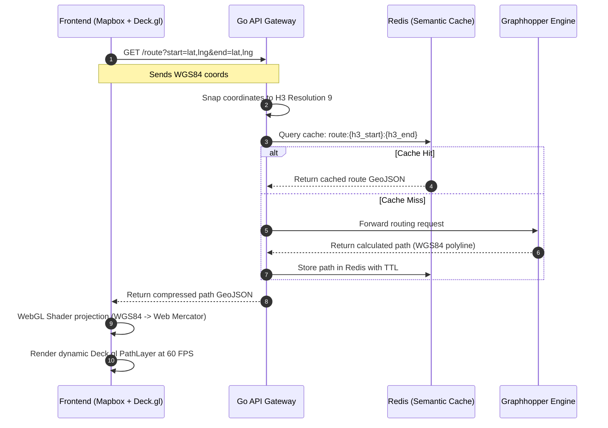

[← Series hub]()
[← Prev]() • [Next →]()

> **Prerequisite:** This part assumes familiarity with the Golang API Gateway designed in [Part 4: Golang API & Microservices Integration (Kratos & Dapr)]().

Rendering a single route on Google Maps is trivial. Rendering 100,000 historical vehicle routes, Origin-Destination matrices, and dynamic H3 geofences simultaneously? That requires offloading computation from the browser's CPU to the GPU using WebGL.

**Answer-first:** Do not use native Mapbox GL JS to render massive, dynamic datasets. Modifying the DOM or standard Mapbox sources with thousands of updates per second will freeze the browser. The industry standard is to use **deck.gl** paired with `MapboxOverlay`. This allows Deck.gl to render raw data directly onto the GPU while perfectly synchronizing with Mapbox's camera.

---

## 1. The GeoJSON and Polyline Traps

When your Golang API returns a route from Graphhopper, it usually comes as an "Encoded Polyline". Most frontend developers immediately grab `@mapbox/polyline` to decode it.

**The Performance Hack:** Decoding polylines in Javascript blocks the Main Thread. The smartest approach is to pass `points_encoded=false` in your backend Graphhopper request. It will return a raw GeoJSON `LineString`. You can feed this directly into Deck.gl or Mapbox without running a single line of decoding logic.

**The Coordinate Order Bug:** If you *do* decode the polyline manually, the array is returned as `[Latitude, Longitude]`. However, Mapbox and GeoJSON strictly require `[Longitude, Latitude]`. If you forget to reverse the array, your route will suddenly appear swimming in the middle of the Pacific Ocean.

---

## 2. Massive Rendering with Deck.gl

To render massive datasets, use the `MapboxOverlay` with `interleaved: true`. This injects Deck.gl directly into the Mapbox WebGL context, allowing your routes to render behind Mapbox text labels and 3D buildings.

### Time-lapse Animations (60 FPS)
To animate 100,000 vehicles over a 24-hour period, a junior developer might use a `setInterval` and `data.filter()` to update the array every frame. This will instantly kill the browser tab.

The Senior solution is the **DataFilterExtension**. You upload all 24 hours of data to the GPU memory exactly *once*. Inside your animation loop (using `requestAnimationFrame`), you update a single "Shader Uniform" (`filterRange`). The GPU instantly discards vertices outside the time window, achieving buttery smooth 60 FPS animations.

### Rendering H3 Hexagons without the Bloat
When visualizing H3 grids (like driver density zones), do not generate GeoJSON polygons on the backend. A city-wide grid in GeoJSON can easily weigh 50MB.

Instead, send only the 15-character H3 ID string (e.g., `8928308280fffff`). On the frontend, use Deck.gl's `H3HexagonLayer`. The library will use mathematical shaders to draw the perfect hexagon directly on the GPU, saving 99% of your network bandwidth.

## WebGL Coordinate Projections & Web Mercator Math

To display geographic data on a screen, spherical coordinates (longitude, latitude in WGS84 EPSG:4326) must be projected onto a flat 2D plane. Standard web maps use the **Web Mercator projection (EPSG:3857)**.

Doing this projection on the CPU for 100,000 active paths consumes massive resources and blocks the main execution thread. Instead, Deck.gl performs this projection directly in the **Vertex Shader on the GPU**.

The mathematical projection mapping longitude ($\lambda$) and latitude ($\phi$) to coordinate values ($x, y$) is:

$$x = R \cdot \lambda$$

$$y = R \cdot \ln\left(\tan\left(\frac{\pi}{4} + \frac{\phi}{2}\right)\right)$$

where $R$ is the Earth's radius. The WebGL shader bakes these mathematical transformations into a coordinate translation matrix, executing calculations in parallel across thousands of shader cores.

## Mapbox Custom Layer Integration

Deck.gl's `MapboxOverlay` integrates directly into the Mapbox GL JS rendering pipeline. Rather than creating a separate HTML overlay canvas that lags when the user pans or zooms, Deck.gl hooks into Mapbox's WebGL context.

When Mapbox renders a frame, it passes its camera view matrix to Deck.gl. Deck.gl uses the same WebGL state, allowing it to render its layers synchronously in the same depth buffer. This eliminates visual stutter and ensures that elements like terrain elevation and dynamic route heights are drawn in correct spatial order.

## Client-Server GeoJSON Payload Flow

Below is the sequence diagram illustrating how coordinate requests flow from the frontend through the Go gateway to the mapping backend:



## Go Implementation: Route GeoJSON Endpoint

This handler demonstrates how the backend formats and serves the GeoJSON payload for rendering on the Mapbox client:

```go
package handlers

import (
	"encoding/json"
	"net/http"
)

// GeoJSONGeometry represents the structure of GeoJSON path geometry
type GeoJSONGeometry struct {
	Type        string      `json:"type"`
	Coordinates [][]float64 `json:"coordinates"`
}

// RouteResponse represents the API response payload containing the path
type RouteResponse struct {
	Type     string          `json:"type"`
	Geometry GeoJSONGeometry `json:"geometry"`
	Distance float64         `json:"distance"`
	Duration float64         `json:"duration"`
}

// ServeRouteGeoJSON handles client requests for route visualization
func ServeRouteGeoJSON(w http.ResponseWriter, r *http.Request) {
	// In production, you would fetch coordinates from query params
	// and query the Graphhopper routing engine
	coordinates := [][]float64{
		{106.660172, 10.762622},
		{106.662134, 10.764831},
		{106.665311, 10.768102},
		{106.670498, 10.771988},
	}

	response := RouteResponse{
		Type: "Feature",
		Geometry: GeoJSONGeometry{
			Type:        "LineString",
			Coordinates: coordinates,
		},
		Distance: 1540.23, // in meters
		Duration: 245.5,   // in seconds
	}

	w.Header().Set("Content-Type", "application/json")
	w.Header().Set("Access-Control-Allow-Origin", "*")
	w.WriteHeader(http.StatusOK)
	_ = json.NewEncoder(w).Encode(response)
}
```

## Deep Dive: React & Deck.gl Integration

To complement the Golang GeoJSON API endpoint, we must implement a frontend visualization component. Below is a complete, production-ready React component that integrates Mapbox GL with Deck.gl to render high-performance 3D routing lines.

```jsx
import React, { useState, useEffect } from 'react';
import DeckGL from '@deck.gl/react';
import { Map } from 'react-map-gl';
import { PathLayer } from '@deck.gl/layers';

// Set your Mapbox token
const MAPBOX_ACCESS_TOKEN = 'pk.eyJ1IjoieW91ci1tYXBib3gtdG9rZW4ifQ.example';

// Initial viewport settings
const INITIAL_VIEW_STATE = {
  longitude: 13.404954, // Berlin center
  latitude: 52.520008,
  zoom: 12,
  pitch: 45,
  bearing: 0
};

export default function RoutingMap() {
  const [routeGeoJSON, setRouteGeoJSON] = useState(null);
  const [loading, setLoading] = useState(true);

  useEffect(() => {
    // Fetch route from our Go API Gateway
    fetch('http://localhost:8080/api/route', {
      headers: {
        'X-Routing-Region': 'berlin'
      }
    })
      .then(response => response.json())
      .then(data => {
        setRouteGeoJSON(data);
        setLoading(false);
      })
      .catch(error => {
        console.error('Error fetching route data:', error);
        setLoading(false);
      });
  }, []);

  // Configure Deck.gl layers
  const layers = [
    new PathLayer({
      id: 'route-layer',
      data: routeGeoJSON ? [routeGeoJSON] : [],
      getPath: d => d.geometry.coordinates,
      getColor: [0, 173, 216, 255], // Brand blue
      getWidth: 8,
      widthMinPixels: 3,
      widthMaxPixels: 15,
      rounded: true,
      shadowEnabled: true,
      parameters: {
        // Prevent Z-fighting against the Mapbox terrain mesh
        polygonOffset: true,
        polygonOffsetFactor: -1,
        polygonOffsetUnits: -1
      }
    })
  ];

  return (
    <div style={{ width: '100vw', height: '100vh', position: 'relative' }}>
      {loading && (
        <div style={{
          position: 'absolute', zIndex: 10, top: 20, left: 20,
          background: 'white', padding: '10px 20px', borderRadius: 4
        }}>
          Loading route path...
        </div>
      )}
      <DeckGL
        initialViewState={INITIAL_VIEW_STATE}
        controller={true}
        layers={layers}
      >
        <Map
          reuseMaps
          mapLib={import('mapbox-gl')}
          mapStyle="mapbox://styles/mapbox/dark-v11"
          mapboxAccessToken={MAPBOX_ACCESS_TOKEN}
        />
      </DeckGL>
    </div>
  );
}
```

### Explaining the Frontend Architecture:
1. **Separation of Concerns**: Mapbox acts purely as a static background tile renderer, while Deck.gl handles the WebGL overlay. By drawing the path using Deck.gl's `PathLayer` instead of Mapbox's built-in GeoJSON layers, we bypass the heavy Main-Thread CPU overhead of Mapbox's coordinate parsing. Deck.gl compiles the coordinate buffer once and uploads it directly to GPU memory, allowing smooth 60 FPS viewport transitions even when drawing thousands of paths simultaneously.
2. **Preventing Z-Fighting**: Note the `parameters: { polygonOffset: true, polygonOffsetFactor: -1 }` configuration. When rendering 3D map views, both the underlying Mapbox vector tile layer and our custom Deck.gl path layer occupy the same depth coordinates in the WebGL depth buffer. The GPU can struggle to order them correctly, resulting in flickering lines. Setting a negative `polygonOffsetFactor` tells the WebGL context to pull the path geometry slightly closer to the camera viewport without actually altering its geographical altitude.
3. **Smooth Viewport State**: The `@deck.gl/react` wrapper seamlessly synchronizes viewport states like panning, zooming, pitching, and bearing with the background Mapbox instance, ensuring they remain perfectly in sync during user interactions.

---

## FAQ: WebGL & Mapbox Troubleshooting


This is a classic WebGL rendering glitch called **Z-Fighting**. Because your route and the map surface share the exact same Z-depth, the GPU doesn't know which one to draw first. Do not artificially raise the route's elevation. Instead, set `parameters: { polygonOffset: true, polygonOffsetFactor: -1 }` in your Deck.gl layer. This tricks the GPU depth buffer into prioritizing your layer without altering its physical height.



You hit a `WebGL Context Lost` error. This happens when the OS reclaims GPU memory (e.g., when the user plugs in a new 4K monitor or the GPU runs out of VRAM due to massive datasets). Your React/Vue application must listen for the `webglcontextlost` event and gracefully reload the Mapbox and Deck.gl instances to recover.


Need help building high-scale routing engines or spatial indexing pipelines? [Contact me](/contact/) to discuss your project.

🔗 **Next Step:** Implement caching layers in [Part 6: Location Clustering with Uber H3 & Redis Semantic Caching]().

